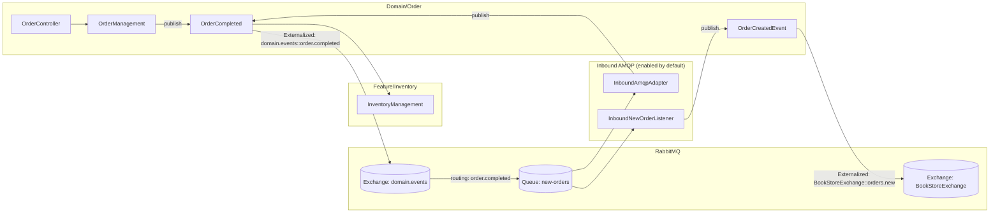
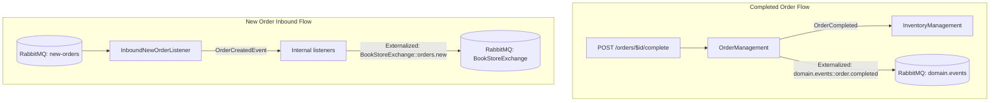

# Spring Modulith Demo（Order + AMQP/RabbitMQ）

一個以 Spring Boot 3.5 + Spring Modulith 構建的模組化示範專案，
以「領域事件」作為跨模組整合方式，並示範：
- 內部事件：`OrderCompleted` 由 `OrderManagement` 發佈，`InventoryManagement` 以 `@ApplicationModuleListener` 非同步處理。
- 事件外部化（AMQP）：`OrderCompleted` 透過 Modulith 外部化到 RabbitMQ（Exchange `domain.events`、Routing Key `order.completed`）。
- AMQP 入站：從 Queue `new-orders` 接收「新訂單」JSON，轉為內部 `OrderCreatedEvent`，再由 Listener 處理（預設啟用）。

> 深入說明可參考：`Application_Events_and_AMQP_Integration.md`、`Event-design.md`。


## 快速開始

- 需求：
  - Java 21
  - RabbitMQ（可選，用於 AMQP 整合）
- 建置與測試：
  - `./mvnw clean verify`
  - 僅跑測試：`./mvnw test`
- 啟動：
  - 本機：`./mvnw spring-boot:run`（預設埠：`http://localhost:8081`）
  - 可執行 JAR：
    - 先打包：`./mvnw clean package`
    - 執行：`java -jar target/modulithdemo-0.0.1-SNAPSHOT.jar`

> 無 RabbitMQ 環境亦可啟動與測試內部事件流程，但若要避免 AMQP 連線，可在啟動時關閉外部化與 Listener：
>
> - 關閉事件外部化：`--spring.modulith.events.externalization.enabled=false`
> - 關閉 Rabbit Listener 啟動：`--spring.rabbitmq.listener.simple.auto-startup=false`


## 專案結構（重點模組）

- `domain/order`：核心領域與 REST 端點
  - `OrderController`：`POST /orders/{id}/complete` 觸發完成訂單
  - `OrderManagement`：發佈 `OrderCompleted`（並由 Modulith 外部化到 AMQP）
  - `OrderCreatedEvent`：示範另一種領域事件（外部化目標：`BookStoreExchange::orders.new`）
- `feature/inventory`：對領域事件做出反應
  - `InventoryManagement`：以 `@ApplicationModuleListener` 處理 `OrderCompleted`
- `inbound/amqp`：AMQP 介面（拓樸 + Listener）
  - `RabbitTopologyConfig`：`domain.events` Exchange、Queue `new-orders`、Routing `order.completed`
  - `InboundAmqpAdapter`：示範從 Queue 讀取 UUID 並發佈 `OrderCompleted` 事件
  - `NewOrderTopologyConfig`：Queue `new-orders` 與 `BookStoreExchange` 綁定（由 `app.amqp.new-orders.bind` 控制）
  - `InboundNewOrderListener`：從 `new-orders` 讀 JSON，轉為 `OrderCreatedEvent`

## 架構圖



### 精簡流程圖（兩條流）




## 設定與環境

主要設定於 `src/main/resources/application.yml`：
- 伺服器：`server.port=8081`
- H2（記憶體）：JDBC + JPA（便於 Modulith 事件登錄表）
- RabbitMQ：`localhost:5672`（帳密 `guest/guest`）
- Modulith 事件外部化：預設啟用

可用環境變數或 CLI 覆寫：
- RabbitMQ：`SPRING_RABBITMQ_HOST`、`SPRING_RABBITMQ_PORT`、`SPRING_RABBITMQ_USERNAME`、`SPRING_RABBITMQ_PASSWORD`
- 關閉事件外部化：`--spring.modulith.events.externalization.enabled=false`
- 綁定 `new-orders` 與 `BookStoreExchange`：`--app.amqp.new-orders.bind=true`

> 預設 `app.amqp.new-orders.bind=false`，避免與 `OrderCreatedEvent` 的外部化造成回送迴圈。


## 使用方式

- 完成訂單並發佈事件（HTTP → 內部事件 → 外部化到 AMQP、同時被 Inventory 模組接收）：
  - `curl -X POST http://localhost:8081/orders/<UUID>/complete`
  - 期待：
    - HTTP 202 Accepted
    - 日誌包含 `[Inventory] received OrderCompleted: ...`
    - 若已連上 RabbitMQ，訊息亦會外部化到 Exchange `domain.events`，Routing Key `order.completed`

- 由 RabbitMQ 注入新訂單：
  1) 啟動：
     - `./mvnw spring-boot:run`
  2) 發佈 JSON 至 Queue `new-orders`（可用任何 Rabbit 工具；範例 payload）：
     ```json
     {
       "orderNumber": "A123",
       "productCode": "BOOK-001",
       "quantity": 2,
       "customer": {"name": "Alice", "email": "alice@example.com", "phone": "123"}
     }
     ```
  3) 期待：
     - 轉為內部 `OrderCreatedEvent` 發佈
     - `OrderCreatedEventListener`/測試 Listener 會接收到事件
     - 若外部化啟用，事件將被送往 `BookStoreExchange`、Routing `orders.new`


## 測試

- 執行：`./mvnw test`
- 測試類別（部分）：
  - `feature/inventory/OrderCreatedFlowTests`：驗證 `OrderCreatedEvent` 的發佈與接收
  - `inbound/amqp/InboundNewOrderListenerTests`：驗證入站 JSON → 事件的轉換
  - `DemoApplicationTests`：基本啟動測試
- 新增功能時，請依模組放置測試，類名以 `*Tests.java` 結尾，並視情境選擇 `@ModulithTest` 或 `@SpringBootTest`。


## 開發與建置指令速覽

- 建置 + 測試：`./mvnw clean verify`
- 執行應用：`./mvnw spring-boot:run`
- 執行 JAR：`java -jar target/modulithdemo-0.0.1-SNAPSHOT.jar`
- 範例 API 呼叫：`curl -X POST http://localhost:8081/orders/<UUID>/complete`


## 注意事項（安全與設定）

- 請勿提交敏感資訊；以環境變數或外部化設定覆寫。
- 無 RabbitMQ 時，建議：
  - 關閉事件外部化：`--spring.modulith.events.externalization.enabled=false`
  - 或關閉 Listener 啟動：`--spring.rabbitmq.listener.simple.auto-startup=false`
- 模組邊界請以事件互動，避免跨模組直接呼叫；新增功能請優先考量事件流設計。


## 授權

此專案僅作為示範用途。
