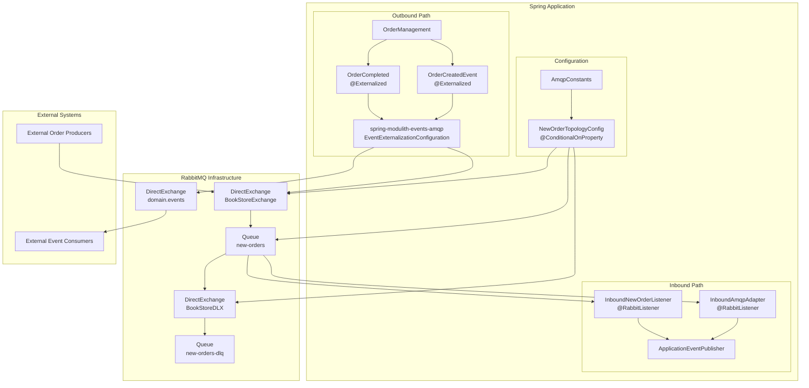
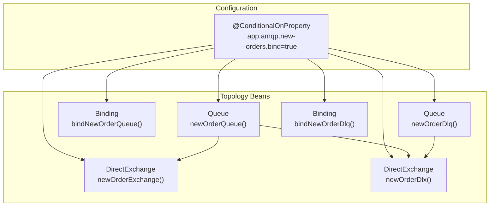
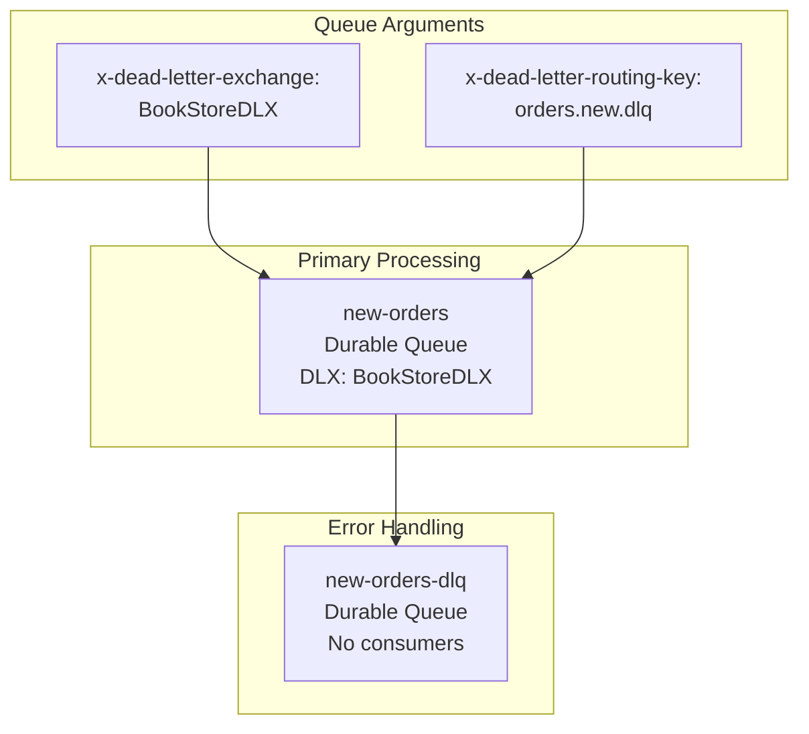

# AMQP Integration Details

> **Relevant source files**
> * [src/main/java/com/example/modulithdemo/messaging/inbound/amqp/AmqpConstants.java](https://github.com/philipz/spring-monolith-amqp-poc/blob/c93f55b5/src/main/java/com/example/modulithdemo/messaging/inbound/amqp/AmqpConstants.java)
> * [src/main/java/com/example/modulithdemo/messaging/inbound/amqp/NewOrderTopologyConfig.java](https://github.com/philipz/spring-monolith-amqp-poc/blob/c93f55b5/src/main/java/com/example/modulithdemo/messaging/inbound/amqp/NewOrderTopologyConfig.java)

## Purpose and Scope

This document provides comprehensive technical details about the RabbitMQ AMQP integration in the spring-monolith-amqp-poc application. It covers both **inbound message consumption** (external systems publishing to the application) and **outbound event externalization** (application publishing domain events to external systems).

For a high-level conceptual overview of how AMQP fits into the overall architecture, see [AMQP Integration Overview](/philipz/spring-monolith-amqp-poc/3.3-amqp-integration-overview). For Spring Modulith event system details, see [Event System](/philipz/spring-monolith-amqp-poc/6-event-system). This page focuses on the technical implementation details, configuration, and operational patterns specific to the AMQP integration layer.

## Integration Architecture

The AMQP integration serves as a bidirectional bridge between the application's internal event-driven architecture and external systems via RabbitMQ:

**Outbound Direction**: Internal domain events marked with `@Externalized` are automatically published to RabbitMQ exchanges via the `spring-modulith-events-amqp` module, enabling external systems to react to application state changes.

**Inbound Direction**: External systems publish messages to RabbitMQ queues, which are consumed by `@RabbitListener` components in the `inbound/amqp` module and converted to internal domain events.

### AMQP Integration Architecture



**Sources:** [src/main/java/com/example/modulithdemo/messaging/inbound/amqp/AmqpConstants.java L1-L24](https://github.com/philipz/spring-monolith-amqp-poc/blob/c93f55b5/src/main/java/com/example/modulithdemo/messaging/inbound/amqp/AmqpConstants.java#L1-L24)

 [src/main/java/com/example/modulithdemo/messaging/inbound/amqp/NewOrderTopologyConfig.java L1-L56](https://github.com/philipz/spring-monolith-amqp-poc/blob/c93f55b5/src/main/java/com/example/modulithdemo/messaging/inbound/amqp/NewOrderTopologyConfig.java#L1-L56)

 High-Level Diagram 4

## Key Components

### AmqpConstants

The `AmqpConstants` class centralizes all AMQP configuration constants to ensure consistency across the application.

| Constant | Value | Purpose |
| --- | --- | --- |
| `BOOKSTORE_EXCHANGE` | `"BookStoreExchange"` | Primary exchange for new order messages from external systems |
| `BOOKSTORE_DLX` | `"BookStoreDLX"` | Dead-letter exchange for failed message handling |
| `NEW_ORDERS_QUEUE` | `"new-orders"` | Queue consumed by the application for incoming orders |
| `NEW_ORDERS_DLQ` | `"new-orders-dlq"` | Dead-letter queue for poison messages |
| `ORDERS_NEW_ROUTING` | `"orders.new"` | Routing key for new order messages |
| `ORDERS_NEW_DLQ_ROUTING` | `"orders.new.dlq"` | Routing key for dead-lettered messages |

The constants are defined as `public static final` fields and the class uses a private constructor to prevent instantiation [src/main/java/com/example/modulithdemo/messaging/inbound/amqp/AmqpConstants.java L7-L24](https://github.com/philipz/spring-monolith-amqp-poc/blob/c93f55b5/src/main/java/com/example/modulithdemo/messaging/inbound/amqp/AmqpConstants.java#L7-L24)

**Sources:** [src/main/java/com/example/modulithdemo/messaging/inbound/amqp/AmqpConstants.java L1-L24](https://github.com/philipz/spring-monolith-amqp-poc/blob/c93f55b5/src/main/java/com/example/modulithdemo/messaging/inbound/amqp/AmqpConstants.java#L1-L24)

### NewOrderTopologyConfig

The `NewOrderTopologyConfig` class manages RabbitMQ topology creation for inbound message handling. All beans are conditionally created based on the `app.amqp.new-orders.bind` property.



**Key Configuration Details:**

1. **Conditional Binding**: All topology beans use `@ConditionalOnProperty(name = "app.amqp.new-orders.bind", havingValue = "true")` [src/main/java/com/example/modulithdemo/messaging/inbound/amqp/NewOrderTopologyConfig.java L18](https://github.com/philipz/spring-monolith-amqp-poc/blob/c93f55b5/src/main/java/com/example/modulithdemo/messaging/inbound/amqp/NewOrderTopologyConfig.java#L18-L18)  [src/main/java/com/example/modulithdemo/messaging/inbound/amqp/NewOrderTopologyConfig.java L27](https://github.com/philipz/spring-monolith-amqp-poc/blob/c93f55b5/src/main/java/com/example/modulithdemo/messaging/inbound/amqp/NewOrderTopologyConfig.java#L27-L27)  [src/main/java/com/example/modulithdemo/messaging/inbound/amqp/NewOrderTopologyConfig.java L33](https://github.com/philipz/spring-monolith-amqp-poc/blob/c93f55b5/src/main/java/com/example/modulithdemo/messaging/inbound/amqp/NewOrderTopologyConfig.java#L33-L33)  [src/main/java/com/example/modulithdemo/messaging/inbound/amqp/NewOrderTopologyConfig.java L40](https://github.com/philipz/spring-monolith-amqp-poc/blob/c93f55b5/src/main/java/com/example/modulithdemo/messaging/inbound/amqp/NewOrderTopologyConfig.java#L40-L40)  [src/main/java/com/example/modulithdemo/messaging/inbound/amqp/NewOrderTopologyConfig.java L46](https://github.com/philipz/spring-monolith-amqp-poc/blob/c93f55b5/src/main/java/com/example/modulithdemo/messaging/inbound/amqp/NewOrderTopologyConfig.java#L46-L46)  [src/main/java/com/example/modulithdemo/messaging/inbound/amqp/NewOrderTopologyConfig.java L52](https://github.com/philipz/spring-monolith-amqp-poc/blob/c93f55b5/src/main/java/com/example/modulithdemo/messaging/inbound/amqp/NewOrderTopologyConfig.java#L52-L52)
2. **Queue Configuration**: The `newOrderQueue()` bean creates a durable queue with dead-letter exchange arguments [src/main/java/com/example/modulithdemo/messaging/inbound/amqp/NewOrderTopologyConfig.java L19-L23](https://github.com/philipz/spring-monolith-amqp-poc/blob/c93f55b5/src/main/java/com/example/modulithdemo/messaging/inbound/amqp/NewOrderTopologyConfig.java#L19-L23) : * `x-dead-letter-exchange`: `"BookStoreDLX"` * `x-dead-letter-routing-key`: `"orders.new.dlq"`
3. **Exchange Types**: Both `BookStoreExchange` and `BookStoreDLX` are `DirectExchange` instances with durable=true and auto-delete=false [src/main/java/com/example/modulithdemo/messaging/inbound/amqp/NewOrderTopologyConfig.java L29](https://github.com/philipz/spring-monolith-amqp-poc/blob/c93f55b5/src/main/java/com/example/modulithdemo/messaging/inbound/amqp/NewOrderTopologyConfig.java#L29-L29)  [src/main/java/com/example/modulithdemo/messaging/inbound/amqp/NewOrderTopologyConfig.java L42](https://github.com/philipz/spring-monolith-amqp-poc/blob/c93f55b5/src/main/java/com/example/modulithdemo/messaging/inbound/amqp/NewOrderTopologyConfig.java#L42-L42)
4. **Binding Strategy**: The primary binding connects `new-orders` queue to `BookStoreExchange` with routing key `"orders.new"` [src/main/java/com/example/modulithdemo/messaging/inbound/amqp/NewOrderTopologyConfig.java L35](https://github.com/philipz/spring-monolith-amqp-poc/blob/c93f55b5/src/main/java/com/example/modulithdemo/messaging/inbound/amqp/NewOrderTopologyConfig.java#L35-L35)

**Sources:** [src/main/java/com/example/modulithdemo/messaging/inbound/amqp/NewOrderTopologyConfig.java L1-L56](https://github.com/philipz/spring-monolith-amqp-poc/blob/c93f55b5/src/main/java/com/example/modulithdemo/messaging/inbound/amqp/NewOrderTopologyConfig.java#L1-L56)

## Configuration Patterns

### Conditional Topology Management

The `app.amqp.new-orders.bind` property controls whether the application manages RabbitMQ topology. This pattern prevents feedback loops and supports different deployment scenarios:

| Configuration Value | Behavior | Use Case |
| --- | --- | --- |
| `true` | Application declares exchanges, queues, and bindings | Development, single-instance deployments |
| `false` (default) | Application only connects to pre-existing topology | Production, multi-instance deployments, external topology management |

When `app.amqp.new-orders.bind=false`, the topology beans are not created, preventing the application from:

* Re-declaring topology managed by infrastructure teams
* Consuming its own externalized events (avoiding circular message flow)
* Creating conflicts in multi-instance deployments

**Sources:** [src/main/java/com/example/modulithdemo/messaging/inbound/amqp/NewOrderTopologyConfig.java L18-L55](https://github.com/philipz/spring-monolith-amqp-poc/blob/c93f55b5/src/main/java/com/example/modulithdemo/messaging/inbound/amqp/NewOrderTopologyConfig.java#L18-L55)

 High-Level Diagram 4

### Dead-Letter Queue Pattern

The integration implements a standard dead-letter queue pattern for handling poison messages:

```mermaid
sequenceDiagram
  participant External Publisher
  participant BookStoreExchange
  participant new-orders Queue
  participant @RabbitListener
  participant BookStoreDLX
  participant new-orders-dlq

  External Publisher->>BookStoreExchange: "Publish message
  BookStoreExchange->>new-orders Queue: routing: orders.new"
  note over new-orders Queue,@RabbitListener: Processing Attempts
  new-orders Queue->>@RabbitListener: "Route to queue"
  @RabbitListener-->>new-orders Queue: "Attempt 1: Deliver"
  new-orders Queue->>@RabbitListener: "NACK/Reject"
  @RabbitListener-->>new-orders Queue: "Attempt 2: Redeliver"
  new-orders Queue->>@RabbitListener: "NACK/Reject"
  @RabbitListener-->>new-orders Queue: "Attempt 3: Redeliver"
  note over new-orders Queue,new-orders-dlq: Dead-Letter Processing
  new-orders Queue->>BookStoreDLX: "NACK/Reject"
  BookStoreDLX->>new-orders-dlq: "x-dead-letter-exchange
  note over new-orders-dlq: "Message stored for
```

The dead-letter exchange is configured via queue arguments rather than explicit consumer configuration, ensuring messages are automatically routed to the DLQ after exhausting retry attempts [src/main/java/com/example/modulithdemo/messaging/inbound/amqp/NewOrderTopologyConfig.java L21-L22](https://github.com/philipz/spring-monolith-amqp-poc/blob/c93f55b5/src/main/java/com/example/modulithdemo/messaging/inbound/amqp/NewOrderTopologyConfig.java#L21-L22)

**Sources:** [src/main/java/com/example/modulithdemo/messaging/inbound/amqp/NewOrderTopologyConfig.java L19-L23](https://github.com/philipz/spring-monolith-amqp-poc/blob/c93f55b5/src/main/java/com/example/modulithdemo/messaging/inbound/amqp/NewOrderTopologyConfig.java#L19-L23)

 [src/main/java/com/example/modulithdemo/messaging/inbound/amqp/NewOrderTopologyConfig.java L41-L54](https://github.com/philipz/spring-monolith-amqp-poc/blob/c93f55b5/src/main/java/com/example/modulithdemo/messaging/inbound/amqp/NewOrderTopologyConfig.java#L41-L54)

## Exchange and Queue Overview

### Exchange Architecture

The application interacts with three primary exchanges:

| Exchange | Type | Durable | Purpose |
| --- | --- | --- | --- |
| `BookStoreExchange` | Direct | Yes | Receives new order messages from external systems |
| `domain.events` | Direct | Yes | Publishes externalized domain events (managed by Spring Modulith) |
| `BookStoreDLX` | Direct | Yes | Dead-letter exchange for failed message handling |

The `domain.events` exchange is managed by the `spring-modulith-events-amqp` module and is not explicitly declared in `NewOrderTopologyConfig`. It is used for event externalization based on `@Externalized` annotations on domain events.

**Sources:** [src/main/java/com/example/modulithdemo/messaging/inbound/amqp/NewOrderTopologyConfig.java L28-L42](https://github.com/philipz/spring-monolith-amqp-poc/blob/c93f55b5/src/main/java/com/example/modulithdemo/messaging/inbound/amqp/NewOrderTopologyConfig.java#L28-L42)

 High-Level Diagram 4

### Queue Architecture



The `new-orders` queue is the primary inbound queue consumed by the application. It includes dead-letter configuration to handle poison messages that cannot be processed after multiple retry attempts [src/main/java/com/example/modulithdemo/messaging/inbound/amqp/NewOrderTopologyConfig.java L19-L23](https://github.com/philipz/spring-monolith-amqp-poc/blob/c93f55b5/src/main/java/com/example/modulithdemo/messaging/inbound/amqp/NewOrderTopologyConfig.java#L19-L23)

The `new-orders-dlq` queue stores messages that have been dead-lettered. These messages are not automatically consumed and require manual inspection and intervention [src/main/java/com/example/modulithdemo/messaging/inbound/amqp/NewOrderTopologyConfig.java L47-L48](https://github.com/philipz/spring-monolith-amqp-poc/blob/c93f55b5/src/main/java/com/example/modulithdemo/messaging/inbound/amqp/NewOrderTopologyConfig.java#L47-L48)

**Sources:** [src/main/java/com/example/modulithdemo/messaging/inbound/amqp/NewOrderTopologyConfig.java L19-L48](https://github.com/philipz/spring-monolith-amqp-poc/blob/c93f55b5/src/main/java/com/example/modulithdemo/messaging/inbound/amqp/NewOrderTopologyConfig.java#L19-L48)

## Routing Key Strategy

The application uses a structured routing key convention based on entity and action:

| Routing Key | Direction | Purpose |
| --- | --- | --- |
| `orders.new` | Inbound | External systems publish new order messages |
| `order.completed` | Outbound | Application publishes order completion events |
| `orders.new.dlq` | Internal | Dead-lettered messages from `new-orders` queue |

This naming convention follows the pattern `{entity}.{action}` for clarity and consistency. The routing keys are defined in `AmqpConstants` to ensure consistency across configuration and listener components [src/main/java/com/example/modulithdemo/messaging/inbound/amqp/AmqpConstants.java L21-L23](https://github.com/philipz/spring-monolith-amqp-poc/blob/c93f55b5/src/main/java/com/example/modulithdemo/messaging/inbound/amqp/AmqpConstants.java#L21-L23)

**Sources:** [src/main/java/com/example/modulithdemo/messaging/inbound/amqp/AmqpConstants.java L21-L23](https://github.com/philipz/spring-monolith-amqp-poc/blob/c93f55b5/src/main/java/com/example/modulithdemo/messaging/inbound/amqp/AmqpConstants.java#L21-L23)

 High-Level Diagram 4

## Integration with Spring Modulith

The AMQP integration works in concert with Spring Modulith's event externalization features:

1. **Event Publication Registry**: Domain events are persisted to the Event Publication Registry within the same transaction as business logic (see [Event Publication Registry](/philipz/spring-monolith-amqp-poc/6.1-event-publication-registry))
2. **Event Externalization**: The `spring-modulith-events-amqp` module automatically publishes events marked with `@Externalized` to RabbitMQ
3. **Inbound Conversion**: The `inbound/amqp` module consumes RabbitMQ messages and republishes them as internal domain events via `ApplicationEventPublisher`

This architecture ensures reliable, transactional event handling with clear separation between internal event-driven patterns and external system integration.

**Sources:** High-Level Diagrams 2, 3, and 4

## Related Documentation

For detailed information about specific aspects of AMQP integration:

* **[Topology Configuration](/philipz/spring-monolith-amqp-poc/7.1-topology-configuration)**: Detailed coverage of exchange, queue, and binding configuration
* **[Message Routing and Patterns](/philipz/spring-monolith-amqp-poc/7.2-message-routing-and-patterns)**: Message routing strategies and anti-patterns like feedback loop prevention
* **[Error Handling and Retries](/philipz/spring-monolith-amqp-poc/7.3-error-handling-and-retries)**: Retry mechanisms, acknowledgment modes, and failure recovery
* **[Inbound Message Processing](/philipz/spring-monolith-amqp-poc/7.4-inbound-message-processing)**: Message consumption, deserialization, and event conversion patterns
* **[RabbitMQ Configuration](/philipz/spring-monolith-amqp-poc/4.3-rabbitmq-configuration)**: Connection settings, channel pooling, and operational parameters
* **[Event Externalization](/philipz/spring-monolith-amqp-poc/6.2-event-externalization)**: How internal events are published to RabbitMQ