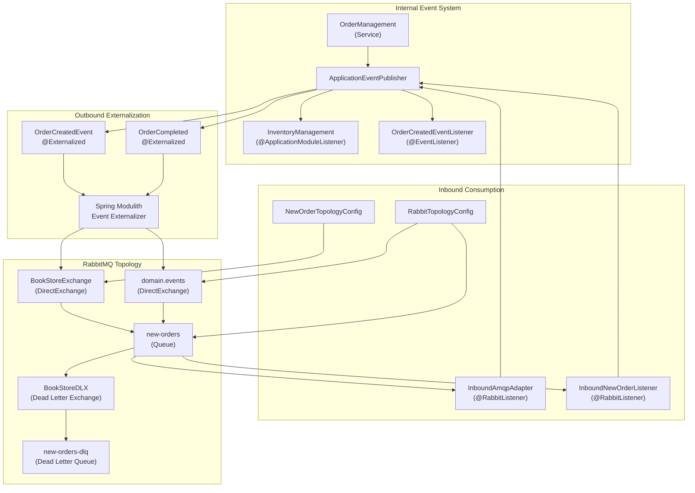
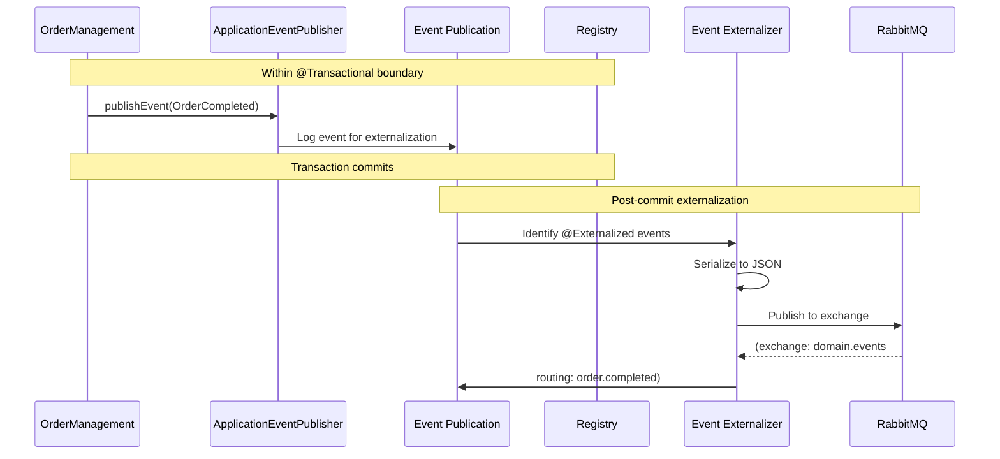
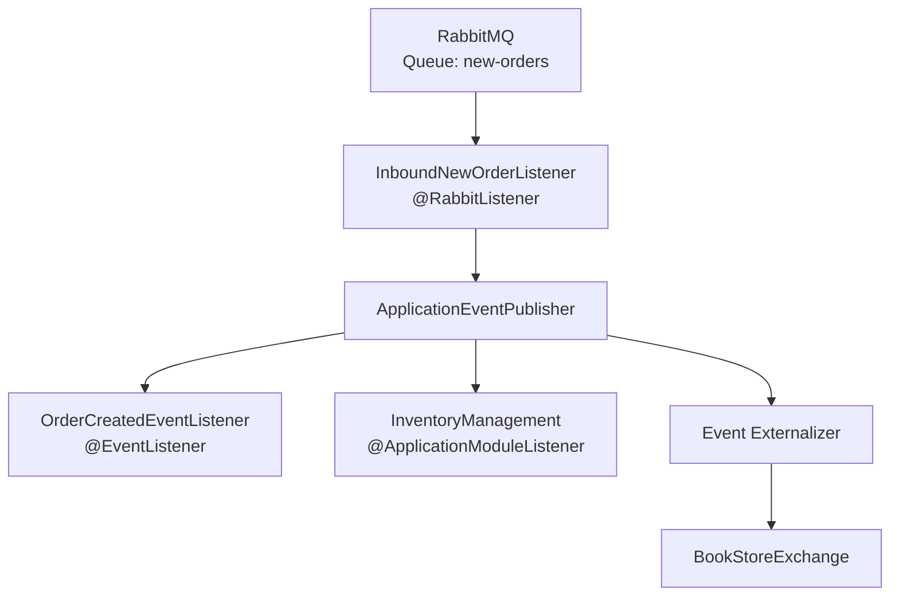
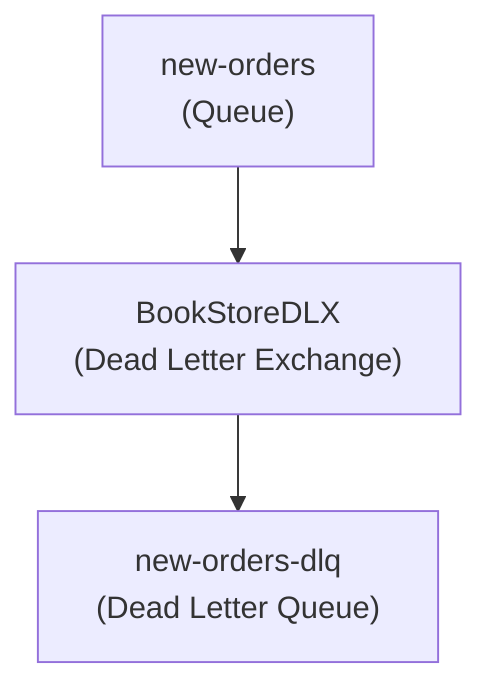
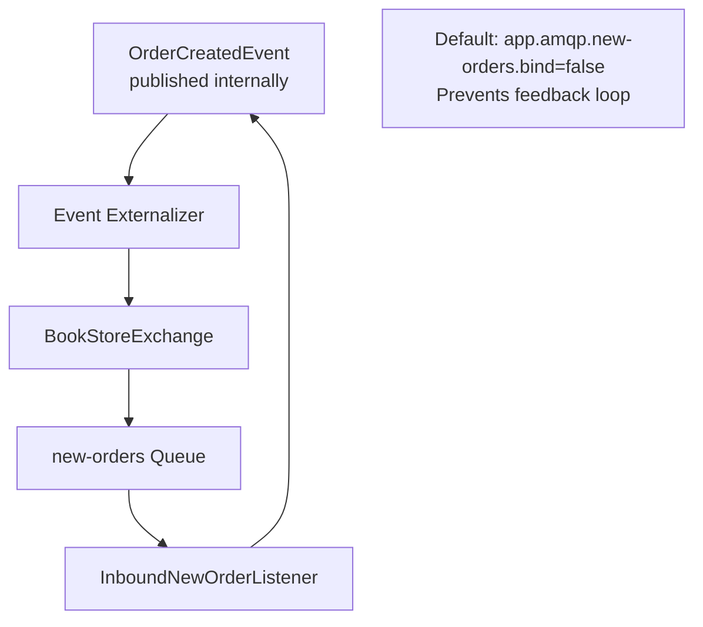
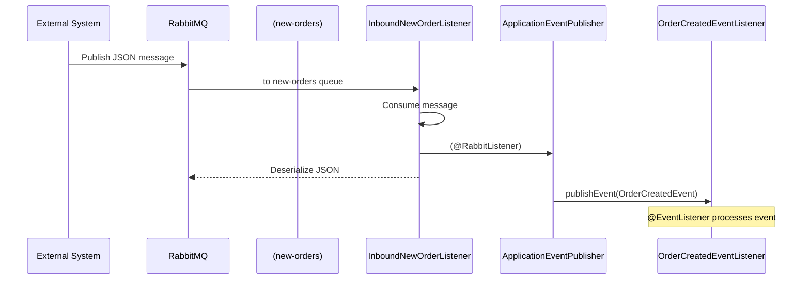

# AMQP Integration Overview

> **Relevant source files**
> * [Application_Events_and_AMQP_Integration.md](https://github.com/philipz/spring-monolith-amqp-poc/blob/c93f55b5/Application_Events_and_AMQP_Integration.md)
> * [Event-design.md](https://github.com/philipz/spring-monolith-amqp-poc/blob/c93f55b5/Event-design.md)
> * [README.md](https://github.com/philipz/spring-monolith-amqp-poc/blob/c93f55b5/README.md)
> * [src/main/java/com/example/modulithdemo/inventory/app/InventoryManagement.java](https://github.com/philipz/spring-monolith-amqp-poc/blob/c93f55b5/src/main/java/com/example/modulithdemo/inventory/app/InventoryManagement.java)
> * [src/main/java/com/example/modulithdemo/inventory/app/OrderCreatedEventListener.java](https://github.com/philipz/spring-monolith-amqp-poc/blob/c93f55b5/src/main/java/com/example/modulithdemo/inventory/app/OrderCreatedEventListener.java)
> * [src/main/resources/application.yml](https://github.com/philipz/spring-monolith-amqp-poc/blob/c93f55b5/src/main/resources/application.yml)

## Purpose and Scope

This document explains how the application integrates with RabbitMQ for bidirectional message exchange. It covers both **outbound event externalization** (publishing internal domain events to RabbitMQ exchanges) and **inbound message consumption** (receiving messages from RabbitMQ queues and converting them to internal events).

For details about Spring Modulith's event system foundations, see [Event-Driven Architecture](/philipz/spring-monolith-amqp-poc/3.2-event-driven-architecture). For RabbitMQ configuration specifics, see [RabbitMQ Configuration](/philipz/spring-monolith-amqp-poc/4.3-rabbitmq-configuration). For in-depth topology and routing patterns, see [AMQP Integration Details](/philipz/spring-monolith-amqp-poc/7-amqp-integration-details).

---

## Integration Architecture

The application implements a **dual-mode AMQP integration** where internal domain events can be externalized to RabbitMQ, and external AMQP messages can be consumed and converted back into internal events. This bidirectional integration enables both event-driven communication within the application and integration with external systems.

### AMQP Integration Components



**Sources:**

* [README.md L32-L44](https://github.com/philipz/spring-monolith-amqp-poc/blob/c93f55b5/README.md#L32-L44)
* [README.md L46-L81](https://github.com/philipz/spring-monolith-amqp-poc/blob/c93f55b5/README.md#L46-L81)
* [application.yml L7-L14](https://github.com/philipz/spring-monolith-amqp-poc/blob/c93f55b5/application.yml#L7-L14)
* Diagram 1 and Diagram 4 from high-level architecture

---

## Outbound Event Externalization

### Event Externalization Mechanism

The application uses **`spring-modulith-events-amqp`** to automatically externalize domain events to RabbitMQ. Events marked with `@Externalized` annotation are intercepted by Spring Modulith's event externalizer and published to configured AMQP exchanges after the originating transaction commits.

The externalization process follows this sequence:



**Sources:**

* [Application_Events_and_AMQP_Integration.md L122-L139](https://github.com/philipz/spring-monolith-amqp-poc/blob/c93f55b5/Application_Events_and_AMQP_Integration.md#L122-L139)
* [Event-design.md L45-L91](https://github.com/philipz/spring-monolith-amqp-poc/blob/c93f55b5/Event-design.md#L45-L91)
* Diagram 3 from high-level architecture

### Externalized Event Examples

The application externalizes two domain events:

**OrderCompleted Event:**

The `OrderCompleted` event is externalized to the `domain.events` exchange with routing key `order.completed`. This event is published by `OrderManagement` when an order is marked as complete.

* **Exchange:** `domain.events`
* **Routing Key:** `order.completed`
* **Binding:** Queue `new-orders` is bound to receive these events

**OrderCreatedEvent:**

The `OrderCreatedEvent` is externalized to the `BookStoreExchange` with routing key `orders.new`. This event represents new orders being created and can be consumed by external systems.

* **Exchange:** `BookStoreExchange`
* **Routing Key:** `orders.new`
* **Configuration:** Binding controlled by `app.amqp.new-orders.bind` property (default: `false` to prevent feedback loops)

**Sources:**

* [README.md L5-L7](https://github.com/philipz/spring-monolith-amqp-poc/blob/c93f55b5/README.md#L5-L7)
* [README.md L36-L37](https://github.com/philipz/spring-monolith-amqp-poc/blob/c93f55b5/README.md#L36-L37)
* [application.yml L58-L66](https://github.com/philipz/spring-monolith-amqp-poc/blob/c93f55b5/application.yml#L58-L66)

### Externalization Configuration

Event externalization is controlled through configuration properties in [application.yml L28-L41](https://github.com/philipz/spring-monolith-amqp-poc/blob/c93f55b5/application.yml#L28-L41)

:

| Property | Value | Description |
| --- | --- | --- |
| `spring.modulith.events.externalization.enabled` | `true` (default) | Enables/disables event externalization |
| `spring.modulith.events.republish-outstanding-events-on-restart` | `true` | Re-publishes incomplete events on application restart |
| `spring.modulith.events.completion-mode` | `UPDATE` | Keeps event history in EPR (vs. `DELETE`) |
| `spring.modulith.events.time-to-live` | `7d` | Retention period for completed events |

**Sources:**

* [application.yml L28-L41](https://github.com/philipz/spring-monolith-amqp-poc/blob/c93f55b5/application.yml#L28-L41)
* [Application_Events_and_AMQP_Integration.md L176-L188](https://github.com/philipz/spring-monolith-amqp-poc/blob/c93f55b5/Application_Events_and_AMQP_Integration.md#L176-L188)

---

## Inbound Message Consumption

### Message Listeners

The application consumes messages from RabbitMQ queues using Spring AMQP's `@RabbitListener` annotation. Two listener components handle different message types:

**InboundAmqpAdapter:**

Located at [src/main/java/com/example/modulithdemo/inbound/amqp/InboundAmqpAdapter.java](https://github.com/philipz/spring-monolith-amqp-poc/blob/c93f55b5/src/main/java/com/example/modulithdemo/inbound/amqp/InboundAmqpAdapter.java)

 this component demonstrates consuming `OrderCompleted` events that were externalized to RabbitMQ and republishing them as internal events.

* **Queue:** `new-orders`
* **Message Type:** UUID (orderId)
* **Action:** Converts message to `OrderCompleted` event and publishes internally

**InboundNewOrderListener:**

Located at [src/main/java/com/example/modulithdemo/inbound/amqp/InboundNewOrderListener.java](https://github.com/philipz/spring-monolith-amqp-poc/blob/c93f55b5/src/main/java/com/example/modulithdemo/inbound/amqp/InboundNewOrderListener.java)

 this component consumes JSON-formatted new order messages and converts them to `OrderCreatedEvent` objects.

* **Queue:** `new-orders`
* **Message Type:** JSON with fields `orderNumber`, `productCode`, `quantity`, `customer`
* **Action:** Deserializes JSON to `OrderCreatedEvent` and publishes internally
* **Retry:** Configured for 3 attempts before rejection to DLQ

**Sources:**

* [README.md L40-L44](https://github.com/philipz/spring-monolith-amqp-poc/blob/c93f55b5/README.md#L40-L44)
* [application.yml L64-L66](https://github.com/philipz/spring-monolith-amqp-poc/blob/c93f55b5/application.yml#L64-L66)

### Message-to-Event Conversion Flow



**Sources:**

* [README.md L78-L80](https://github.com/philipz/spring-monolith-amqp-poc/blob/c93f55b5/README.md#L78-L80)
* [src/main/java/com/example/modulithdemo/inventory/app/OrderCreatedEventListener.java L10-L21](https://github.com/philipz/spring-monolith-amqp-poc/blob/c93f55b5/src/main/java/com/example/modulithdemo/inventory/app/OrderCreatedEventListener.java#L10-L21)
* [src/main/java/com/example/modulithdemo/inventory/app/InventoryManagement.java L10-L18](https://github.com/philipz/spring-monolith-amqp-poc/blob/c93f55b5/src/main/java/com/example/modulithdemo/inventory/app/InventoryManagement.java#L10-L18)

### Retry and Error Handling

The application implements retry mechanisms for inbound message processing:

* **Max Attempts:** Configurable via `app.amqp.new-orders.retry-max-attempts` (default: 3)
* **Dead Letter Queue:** Failed messages are routed to `new-orders-dlq` after max attempts
* **Manual Acknowledgment:** Listeners control message acknowledgment to ensure proper retry behavior

**Sources:**

* [application.yml L64-L66](https://github.com/philipz/spring-monolith-amqp-poc/blob/c93f55b5/application.yml#L64-L66)
* [README.md L42-L44](https://github.com/philipz/spring-monolith-amqp-poc/blob/c93f55b5/README.md#L42-L44)

---

## RabbitMQ Topology Configuration

### Topology Components

The application defines RabbitMQ topology using Spring AMQP declarative configuration classes:

**RabbitTopologyConfig:**

Configures the `domain.events` exchange and `new-orders` queue for order completion events.

* **Exchange:** `domain.events` (DirectExchange)
* **Queue:** `new-orders` (durable)
* **Binding:** Routes messages with key `order.completed` from exchange to queue

**NewOrderTopologyConfig:**

Configures the `BookStoreExchange` and conditional binding for new order events.

* **Exchange:** `BookStoreExchange` (DirectExchange)
* **Dead Letter Exchange:** `BookStoreDLX` for failed messages
* **Dead Letter Queue:** `new-orders-dlq`
* **Conditional Binding:** Only binds if `app.amqp.new-orders.bind=true` to prevent feedback loops

**Sources:**

* [README.md L40-L44](https://github.com/philipz/spring-monolith-amqp-poc/blob/c93f55b5/README.md#L40-L44)

### Exchange and Routing Key Mapping

| Event Type | Exchange | Routing Key | Queue | Conditional |
| --- | --- | --- | --- | --- |
| `OrderCompleted` | `domain.events` | `order.completed` | `new-orders` | Always bound |
| `OrderCreatedEvent` | `BookStoreExchange` | `orders.new` | `new-orders` | Controlled by `app.amqp.new-orders.bind` |

### Dead Letter Configuration

Failed messages are routed through a dead letter exchange pattern:



**Sources:**

* Diagram 4 from high-level architecture
* [application.yml L64-L66](https://github.com/philipz/spring-monolith-amqp-poc/blob/c93f55b5/application.yml#L64-L66)

---

## Connection Configuration

### RabbitMQ Connection Settings

RabbitMQ connection parameters are configured in [application.yml L7-L14](https://github.com/philipz/spring-monolith-amqp-poc/blob/c93f55b5/application.yml#L7-L14)

:

| Property | Default | Environment Variable | Description |
| --- | --- | --- | --- |
| `spring.rabbitmq.host` | `localhost` | `SPRING_RABBITMQ_HOST` | RabbitMQ server host |
| `spring.rabbitmq.port` | `5672` | `SPRING_RABBITMQ_PORT` | AMQP port |
| `spring.rabbitmq.username` | `guest` | `SPRING_RABBITMQ_USERNAME` | Authentication username |
| `spring.rabbitmq.password` | `guest` | `SPRING_RABBITMQ_PASSWORD` | Authentication password |
| `spring.rabbitmq.cache.channel.size` | `50` | - | Channel cache size for throughput |

### Channel Pooling

The application uses a **channel cache of 50** to optimize AMQP connection management for high-throughput scenarios. This reduces the overhead of creating new channels for each message operation.

**Sources:**

* [application.yml L7-L14](https://github.com/philipz/spring-monolith-amqp-poc/blob/c93f55b5/application.yml#L7-L14)
* [README.md L107-L114](https://github.com/philipz/spring-monolith-amqp-poc/blob/c93f55b5/README.md#L107-L114)
* Diagram 5 from high-level architecture

---

## Feedback Loop Prevention

### The Feedback Loop Problem

A potential issue arises when:

1. Application publishes `OrderCreatedEvent` internally
2. Event is externalized to `BookStoreExchange` with routing key `orders.new`
3. Queue `new-orders` is bound to `BookStoreExchange::orders.new`
4. Application consumes its own externalized message from `new-orders`
5. Message is converted back to `OrderCreatedEvent`, creating an infinite loop

### Binding Control Mechanism

The application prevents this feedback loop using the **`app.amqp.new-orders.bind`** configuration property:



**Configuration:**

* **Default:** `false` - Queue is NOT bound to `BookStoreExchange`
* **Override:** Set to `true` only when consuming external messages from `BookStoreExchange`

**Sources:**

* [application.yml L58-L66](https://github.com/philipz/spring-monolith-amqp-poc/blob/c93f55b5/application.yml#L58-L66)
* [README.md L114-L116](https://github.com/philipz/spring-monolith-amqp-poc/blob/c93f55b5/README.md#L114-L116)

---

## Message Flow Patterns

### Complete Order Flow (Outbound)

```mermaid
sequenceDiagram
  participant Client
  participant OrderController
  participant OrderManagement
  participant Event Publication
  participant Registry
  participant InventoryManagement
  participant RabbitMQ
  participant (domain.events)

  Client->>OrderController: POST /orders/{id}/complete
  OrderController->>OrderManagement: complete(orderId)
  OrderManagement->>Event Publication: publishEvent(OrderCompleted)
  note over OrderManagement,Registry: Within transaction
  OrderManagement-->>OrderController: Success
  OrderController-->>Client: 202 Accepted
  Event Publication->>InventoryManagement: Dispatch event (async)
  note over Event Publication,InventoryManagement: @ApplicationModuleListener
  Event Publication->>RabbitMQ: Externalize to exchange
  note over Event Publication,(domain.events): Post-commit, async
```

**Sources:**

* [README.md L119-L126](https://github.com/philipz/spring-monolith-amqp-poc/blob/c93f55b5/README.md#L119-L126)
* Diagram 3 from high-level architecture

### New Order Inbound Flow



**Sources:**

* [README.md L128-L143](https://github.com/philipz/spring-monolith-amqp-poc/blob/c93f55b5/README.md#L128-L143)
* [src/main/java/com/example/modulithdemo/inventory/app/OrderCreatedEventListener.java L15-L20](https://github.com/philipz/spring-monolith-amqp-poc/blob/c93f55b5/src/main/java/com/example/modulithdemo/inventory/app/OrderCreatedEventListener.java#L15-L20)

---

## Integration Patterns Summary

The AMQP integration implements several key patterns:

| Pattern | Implementation | Purpose |
| --- | --- | --- |
| **Transactional Outbox** | Event Publication Registry + Externalization | Ensures events are never lost, even on failure |
| **Message Adapter** | `@RabbitListener` components | Converts external messages to internal events |
| **Dead Letter Queue** | `BookStoreDLX` → `new-orders-dlq` | Handles poison messages and permanent failures |
| **Feedback Prevention** | `app.amqp.new-orders.bind` flag | Prevents consuming self-published events |
| **Channel Pooling** | Cache size: 50 | Optimizes connection reuse for throughput |
| **Retry on Failure** | Max attempts: 3 | Handles transient failures before DLQ |

**Sources:**

* [application.yml L7-L66](https://github.com/philipz/spring-monolith-amqp-poc/blob/c93f55b5/application.yml#L7-L66)
* [README.md L1-L176](https://github.com/philipz/spring-monolith-amqp-poc/blob/c93f55b5/README.md#L1-L176)
* All high-level architecture diagrams