# Application Configuration

> **Relevant source files**
> * [docker-compose.yml](https://github.com/philipz/spring-monolith-amqp-poc/blob/c93f55b5/docker-compose.yml)
> * [src/main/resources/application.yml](https://github.com/philipz/spring-monolith-amqp-poc/blob/c93f55b5/src/main/resources/application.yml)
> * [src/test/resources/application.yml](https://github.com/philipz/spring-monolith-amqp-poc/blob/c93f55b5/src/test/resources/application.yml)

## Purpose and Scope

This document describes the application-level configuration defined in [src/main/resources/application.yml L1-L67](https://github.com/philipz/spring-monolith-amqp-poc/blob/c93f55b5/src/main/resources/application.yml#L1-L67)

 and its test counterpart [src/test/resources/application.yml L1-L58](https://github.com/philipz/spring-monolith-amqp-poc/blob/c93f55b5/src/test/resources/application.yml#L1-L58)

 It covers server settings, Spring Boot properties, database connection pooling, RabbitMQ connection parameters, Spring Modulith event system configuration, and custom application properties.

For database-specific configuration details including HikariCP pooling and Event Publication Registry schema, see [Database Configuration](/philipz/spring-monolith-amqp-poc/4.2-database-configuration). For RabbitMQ topology setup (exchanges, queues, bindings), see [RabbitMQ Configuration](/philipz/spring-monolith-amqp-poc/4.3-rabbitmq-configuration).

---

## Configuration File Structure

The `application.yml` file is organized into several top-level sections that configure different subsystems of the application:


**Sources:** [src/main/resources/application.yml L1-L67](https://github.com/philipz/spring-monolith-amqp-poc/blob/c93f55b5/src/main/resources/application.yml#L1-L67)

---

## Server Configuration

The application runs as a Spring Boot embedded web server on a fixed port:

| Property | Value | Description |
| --- | --- | --- |
| `server.port` | `8082` | HTTP port for REST API endpoints (OrderController) |

The port is statically defined in [src/main/resources/application.yml L2](https://github.com/philipz/spring-monolith-amqp-poc/blob/c93f55b5/src/main/resources/application.yml#L2-L2)

 In test configurations, this is set to `0` to use a random available port [src/test/resources/application.yml L3](https://github.com/philipz/spring-monolith-amqp-poc/blob/c93f55b5/src/test/resources/application.yml#L3-L3)

**Sources:** [src/main/resources/application.yml L1-L2](https://github.com/philipz/spring-monolith-amqp-poc/blob/c93f55b5/src/main/resources/application.yml#L1-L2)

 [src/test/resources/application.yml L2-L3](https://github.com/philipz/spring-monolith-amqp-poc/blob/c93f55b5/src/test/resources/application.yml#L2-L3)

---

## Spring Application Properties

### Application Identity

```yaml
spring:
  application:
    name: demo
```

The application is identified as `demo` in production [src/main/resources/application.yml L6](https://github.com/philipz/spring-monolith-amqp-poc/blob/c93f55b5/src/main/resources/application.yml#L6-L6)

 and `demo-test` in test environments [src/test/resources/application.yml L7](https://github.com/philipz/spring-monolith-amqp-poc/blob/c93f55b5/src/test/resources/application.yml#L7-L7)

 This name appears in logging, metrics, and Spring Boot Admin dashboards.

**Sources:** [src/main/resources/application.yml L4-L6](https://github.com/philipz/spring-monolith-amqp-poc/blob/c93f55b5/src/main/resources/application.yml#L4-L6)

 [src/test/resources/application.yml L5-L7](https://github.com/philipz/spring-monolith-amqp-poc/blob/c93f55b5/src/test/resources/application.yml#L5-L7)

---

## RabbitMQ Connection Configuration

The application connects to RabbitMQ using connection parameters with environment variable overrides:


### RabbitMQ Properties

| Property | Default | Environment Variable | Description |
| --- | --- | --- | --- |
| `spring.rabbitmq.host` | `localhost` | `SPRING_RABBITMQ_HOST` | RabbitMQ broker hostname |
| `spring.rabbitmq.port` | `5672` | `SPRING_RABBITMQ_PORT` | AMQP protocol port |
| `spring.rabbitmq.username` | `guest` | `SPRING_RABBITMQ_USERNAME` | Authentication username |
| `spring.rabbitmq.password` | `guest` | `SPRING_RABBITMQ_PASSWORD` | Authentication password |
| `spring.rabbitmq.cache.channel.size` | `50` | N/A | Channel cache size for connection pooling |

The channel cache size of `50` [src/main/resources/application.yml L14](https://github.com/philipz/spring-monolith-amqp-poc/blob/c93f55b5/src/main/resources/application.yml#L14-L14)

 increases throughput by reusing channels across multiple message operations. This is particularly important for event externalization where the `spring-modulith-events-amqp` module publishes events to RabbitMQ.

**Sources:** [src/main/resources/application.yml L7-L14](https://github.com/philipz/spring-monolith-amqp-poc/blob/c93f55b5/src/main/resources/application.yml#L7-L14)

 [src/test/resources/application.yml L16-L24](https://github.com/philipz/spring-monolith-amqp-poc/blob/c93f55b5/src/test/resources/application.yml#L16-L24)

---

## Database Configuration

The application uses PostgreSQL in production with HikariCP connection pooling:


### DataSource Properties

| Property | Default | Environment Variable | Description |
| --- | --- | --- | --- |
| `spring.datasource.url` | `jdbc:postgresql://localhost:5432/postgres` | `SPRING_DATASOURCE_URL` | JDBC connection URL |
| `spring.datasource.driver-class-name` | `org.postgresql.Driver` | N/A | JDBC driver class |
| `spring.datasource.username` | `postgres` | `SPRING_DATASOURCE_USERNAME` | Database username |
| `spring.datasource.password` | `postgres` | `SPRING_DATASOURCE_PASSWORD` | Database password |

### HikariCP Connection Pool Settings

| Property | Default | Environment Variable | Description |
| --- | --- | --- | --- |
| `spring.datasource.hikari.maximum-pool-size` | `10` | `SPRING_DATASOURCE_HIKARI_MAXIMUM_POOL_SIZE` | Maximum number of connections in pool |
| `spring.datasource.hikari.minimum-idle` | `2` | `SPRING_DATASOURCE_HIKARI_MINIMUM_IDLE` | Minimum idle connections maintained |
| `spring.datasource.hikari.connection-timeout` | `30000` (30s) | `SPRING_DATASOURCE_HIKARI_CONNECTION_TIMEOUT` | Max wait time for connection (milliseconds) |
| `spring.datasource.hikari.idle-timeout` | `600000` (10m) | `SPRING_DATASOURCE_HIKARI_IDLE_TIMEOUT` | Max idle time before connection eviction |
| `spring.datasource.hikari.max-lifetime` | `1800000` (30m) | `SPRING_DATASOURCE_HIKARI_MAX_LIFETIME` | Max connection lifetime |

The pool configuration balances resource usage (2-10 connections) with responsiveness. The 10-minute idle timeout prevents stale connections while the 30-minute max lifetime ensures periodic connection refresh. These settings are appropriate for the Event Publication Registry's transactional outbox pattern, which requires reliable database access for event persistence.

**Sources:** [src/main/resources/application.yml L16-L26](https://github.com/philipz/spring-monolith-amqp-poc/blob/c93f55b5/src/main/resources/application.yml#L16-L26)

---

## Spring Modulith Events Configuration

The Spring Modulith event system is configured to provide reliable event processing with event externalization support:


### Event System Properties

| Property | Value | Description |
| --- | --- | --- |
| `spring.modulith.events.externalization.enabled` | `true` (prod) / `false` (test) | Controls whether `@Externalized` events are published to RabbitMQ |
| `spring.modulith.events.jdbc.schema-initialization.enabled` | `true` | Auto-creates `event_publication` table in database |
| `spring.modulith.events.republish-outstanding-events-on-restart` | `true` (prod) / `false` (test) | Republishes incomplete events after restart for reliability |
| `spring.modulith.events.completion-mode` | `UPDATE` (prod) / `DELETE` (test) | Controls how completed events are handled |
| `spring.modulith.events.time-to-live` | `7d` (prod only) | Retention period for completed events |

### Event Externalization

When `externalization.enabled` is `true` [src/main/resources/application.yml L31](https://github.com/philipz/spring-monolith-amqp-poc/blob/c93f55b5/src/main/resources/application.yml#L31-L31)

 the `spring-modulith-events-amqp` module automatically publishes events annotated with `@Externalized` to RabbitMQ. This is disabled in tests [src/test/resources/application.yml L29](https://github.com/philipz/spring-monolith-amqp-poc/blob/c93f55b5/src/test/resources/application.yml#L29-L29)

 to avoid requiring a running RabbitMQ instance unless specifically testing externalization behavior.

The environment variable `SPRING_MODULITH_EVENTS_EXTERNALIZATION_ENABLED` can override this setting at runtime.

### Completion Modes

The application uses different completion modes for production vs. test:

* **UPDATE mode (production)**: Completed events are marked with a `completion_date` timestamp but remain in the `event_publication` table [src/main/resources/application.yml L38](https://github.com/philipz/spring-monolith-amqp-poc/blob/c93f55b5/src/main/resources/application.yml#L38-L38)  This provides a 7-day audit trail [src/main/resources/application.yml L41](https://github.com/philipz/spring-monolith-amqp-poc/blob/c93f55b5/src/main/resources/application.yml#L41-L41)
* **DELETE mode (test)**: Completed events are immediately deleted from the table [src/test/resources/application.yml L36](https://github.com/philipz/spring-monolith-amqp-poc/blob/c93f55b5/src/test/resources/application.yml#L36-L36)  This keeps the test database clean and speeds up test execution.

### Republish on Restart

Setting `republish-outstanding-events-on-restart: true` [src/main/resources/application.yml L36](https://github.com/philipz/spring-monolith-amqp-poc/blob/c93f55b5/src/main/resources/application.yml#L36-L36)

 ensures that if the application crashes before completing event externalization, those events will be republished when the application restarts. This is critical for reliability but disabled in tests [src/test/resources/application.yml L34](https://github.com/philipz/spring-monolith-amqp-poc/blob/c93f55b5/src/test/resources/application.yml#L34-L34)

 where ephemeral state is acceptable.

**Sources:** [src/main/resources/application.yml L28-L41](https://github.com/philipz/spring-monolith-amqp-poc/blob/c93f55b5/src/main/resources/application.yml#L28-L41)

 [src/test/resources/application.yml L26-L36](https://github.com/philipz/spring-monolith-amqp-poc/blob/c93f55b5/src/test/resources/application.yml#L26-L36)

---

## Logging Configuration

Logging levels are configured for Spring Modulith and AMQP components:

| Logger | Level | Purpose |
| --- | --- | --- |
| `org.springframework.modulith` | `INFO` | Spring Modulith event processing and module verification |
| `org.springframework.amqp` | `INFO` | RabbitMQ message operations and connection management |

These settings [src/main/resources/application.yml L43-L46](https://github.com/philipz/spring-monolith-amqp-poc/blob/c93f55b5/src/main/resources/application.yml#L43-L46)

 provide sufficient visibility into event processing and message handling without overwhelming logs with debug output.

**Sources:** [src/main/resources/application.yml L43-L46](https://github.com/philipz/spring-monolith-amqp-poc/blob/c93f55b5/src/main/resources/application.yml#L43-L46)

 [src/test/resources/application.yml L38-L41](https://github.com/philipz/spring-monolith-amqp-poc/blob/c93f55b5/src/test/resources/application.yml#L38-L41)

---

## Management and Actuator Endpoints

Spring Boot Actuator endpoints are configured for operational monitoring:

```yaml
management:
  endpoint:
    health:
      show-details: always
      show-components: always
  endpoints:
    web:
      exposure:
        include: health,info
```

The `health` endpoint exposes detailed health information including:

* Database connection status (HikariCP)
* RabbitMQ connection status
* Disk space
* Application components

The configuration makes health details visible [src/main/resources/application.yml L51-L52](https://github.com/philipz/spring-monolith-amqp-poc/blob/c93f55b5/src/main/resources/application.yml#L51-L52)

 and exposes both `health` and `info` endpoints via HTTP [src/main/resources/application.yml L56](https://github.com/philipz/spring-monolith-amqp-poc/blob/c93f55b5/src/main/resources/application.yml#L56-L56)

 These endpoints are accessible at:

* `http://localhost:8082/actuator/health`
* `http://localhost:8082/actuator/info`

**Sources:** [src/main/resources/application.yml L48-L56](https://github.com/philipz/spring-monolith-amqp-poc/blob/c93f55b5/src/main/resources/application.yml#L48-L56)

 [src/test/resources/application.yml L43-L51](https://github.com/philipz/spring-monolith-amqp-poc/blob/c93f55b5/src/test/resources/application.yml#L43-L51)

---

## Custom Application Properties

The application defines custom properties under the `app` namespace for domain-specific configuration:

```mermaid
flowchart TD

BIND["bind: true"]
RETRY["retry-max-attempts: 3"]
BIND_EFFECT["NewOrderTopologyConfig<br>conditionally creates binding<br>BookStoreExchange → new-orders"]
RETRY_EFFECT["InboundNewOrderListener<br>retries failed messages<br>3 times before DLQ"]

BIND --> BIND_EFFECT
RETRY --> RETRY_EFFECT

subgraph subGraph2 ["Effects on Processing"]
    RETRY_EFFECT
end

subgraph subGraph1 ["Effects on Topology"]
    BIND_EFFECT
end

subgraph app.amqp.new-orders ["app.amqp.new-orders"]
    BIND
    RETRY
end
```



### AMQP New Orders Configuration

| Property | Default | Description |
| --- | --- | --- |
| `app.amqp.new-orders.bind` | `true` | Controls whether `new-orders` queue binds to `BookStoreExchange` with routing key `orders.new` |
| `app.amqp.new-orders.retry-max-attempts` | `3` | Maximum processing attempts before message is rejected to dead-letter queue |

The `bind` property [src/main/resources/application.yml L63](https://github.com/philipz/spring-monolith-amqp-poc/blob/c93f55b5/src/main/resources/application.yml#L63-L63)

 is documented with an inline comment explaining its purpose: preventing unintended feedback loops when `OrderCreatedEvent` is externalized with `@Externalized` annotation. When set to `false`, the application will not consume its own externalized events.

The `retry-max-attempts` property [src/main/resources/application.yml L66](https://github.com/philipz/spring-monolith-amqp-poc/blob/c93f55b5/src/main/resources/application.yml#L66-L66)

 can be overridden via environment variables or command-line arguments:

```
--app.amqp.new-orders.retry-max-attempts=5
```

These properties are used by `NewOrderTopologyConfig` and `InboundNewOrderListener` classes in the `inbound/amqp` module.

**Sources:** [src/main/resources/application.yml L58-L66](https://github.com/philipz/spring-monolith-amqp-poc/blob/c93f55b5/src/main/resources/application.yml#L58-L66)

 [src/test/resources/application.yml L53-L57](https://github.com/philipz/spring-monolith-amqp-poc/blob/c93f55b5/src/test/resources/application.yml#L53-L57)

---

## Environment Variable Override Pattern

The configuration extensively uses Spring Boot's `${VAR:default}` syntax for environment variable substitution:


### Override Examples

| Configuration Property | Environment Variable | Default Value |
| --- | --- | --- |
| `spring.rabbitmq.host` | `SPRING_RABBITMQ_HOST` | `localhost` |
| `spring.datasource.url` | `SPRING_DATASOURCE_URL` | `jdbc:postgresql://localhost:5432/postgres` |
| `spring.datasource.hikari.maximum-pool-size` | `SPRING_DATASOURCE_HIKARI_MAXIMUM_POOL_SIZE` | `10` |
| `spring.modulith.events.externalization.enabled` | `SPRING_MODULITH_EVENTS_EXTERNALIZATION_ENABLED` | `true` |
| `spring.modulith.events.time-to-live` | `SPRING_MODULITH_EVENTS_TIME_TO_LIVE` | `7d` |

This pattern allows production deployments to inject configuration via environment variables (e.g., Kubernetes ConfigMaps or Docker environment) while maintaining sensible defaults for local development.

**Sources:** [src/main/resources/application.yml L8-L41](https://github.com/philipz/spring-monolith-amqp-poc/blob/c93f55b5/src/main/resources/application.yml#L8-L41)

---

## Test Configuration Differences

The test configuration [src/test/resources/application.yml L1-L58](https://github.com/philipz/spring-monolith-amqp-poc/blob/c93f55b5/src/test/resources/application.yml#L1-L58)

 differs from production in several key areas:

| Aspect | Production | Test |
| --- | --- | --- |
| Server Port | `8082` (fixed) | `0` (random) |
| Application Name | `demo` | `demo-test` |
| Database | PostgreSQL | H2 in-memory |
| JDBC URL | `jdbc:postgresql://...` | `jdbc:h2:mem:modulith;MODE=PostgreSQL` |
| Event Externalization | Enabled | Disabled |
| Event Republish | Enabled | Disabled |
| Event Completion Mode | `UPDATE` (retain 7 days) | `DELETE` (immediate cleanup) |

### H2 Test Database Configuration

Tests use an H2 in-memory database configured to emulate PostgreSQL behavior:

```yaml
spring:
  datasource:
    url: jdbc:h2:mem:modulith;MODE=PostgreSQL;DB_CLOSE_DELAY=-1;DATABASE_TO_UPPER=false
    driver-class-name: org.h2.Driver
    username: sa
    password:
```

The connection string [src/test/resources/application.yml L11](https://github.com/philipz/spring-monolith-amqp-poc/blob/c93f55b5/src/test/resources/application.yml#L11-L11)

 specifies:

* `MODE=PostgreSQL`: Emulates PostgreSQL SQL dialect
* `DB_CLOSE_DELAY=-1`: Keeps database open for entire test suite
* `DATABASE_TO_UPPER=false`: Preserves case sensitivity of table/column names

This allows the same `event_publication` table schema to work in both environments without modification.

**Sources:** [src/test/resources/application.yml L1-L58](https://github.com/philipz/spring-monolith-amqp-poc/blob/c93f55b5/src/test/resources/application.yml#L1-L58)