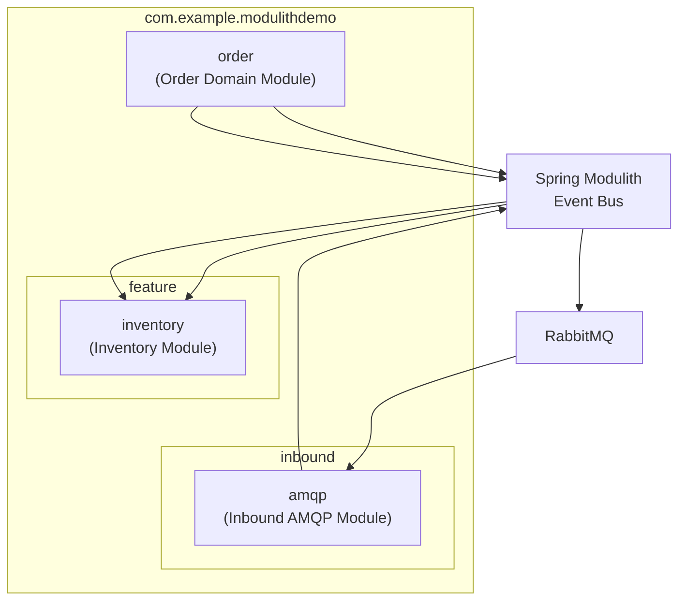
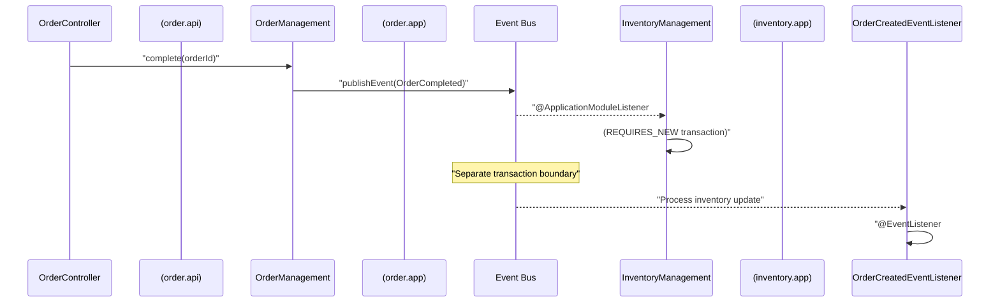
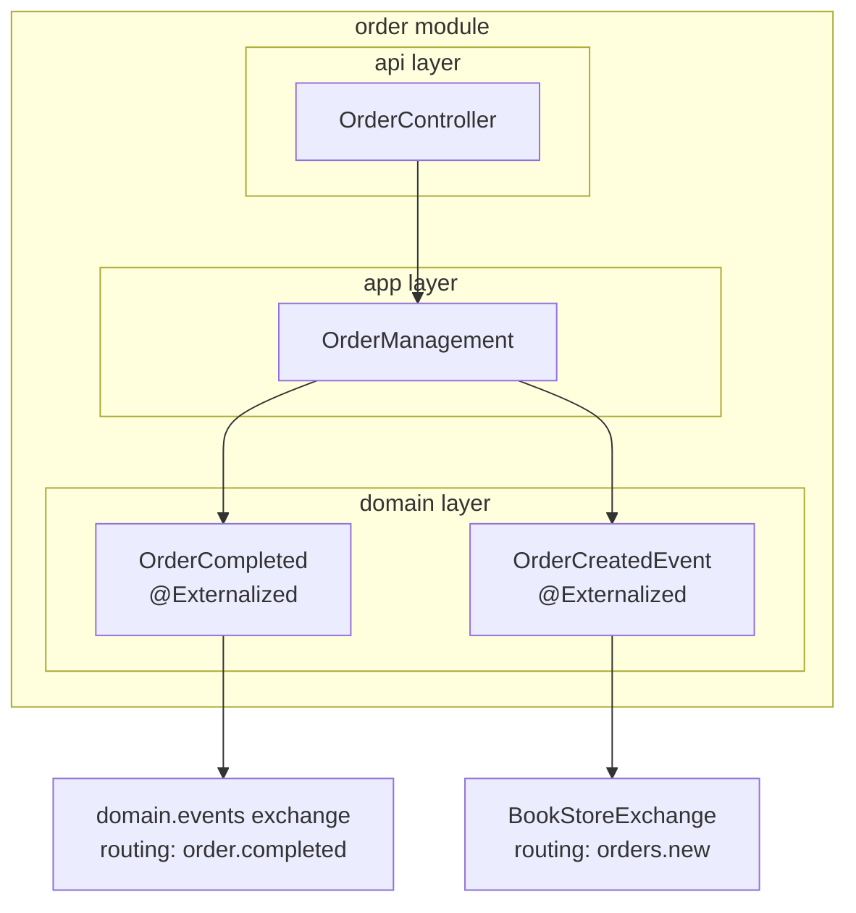
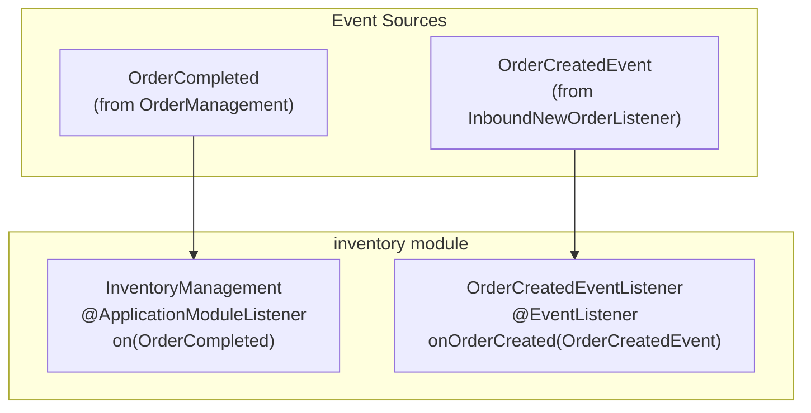
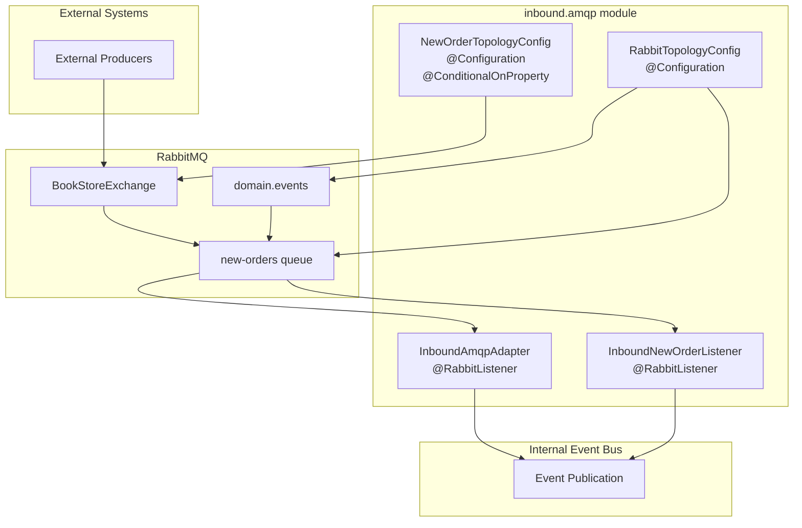
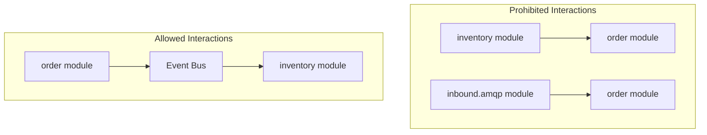

# Application Modules

> **Relevant source files**
> * [CLAUDE.md](https://github.com/philipz/spring-monolith-amqp-poc/blob/c93f55b5/CLAUDE.md)
> * [README.md](https://github.com/philipz/spring-monolith-amqp-poc/blob/c93f55b5/README.md)
> * [src/main/java/com/example/modulithdemo/inventory/app/InventoryManagement.java](https://github.com/philipz/spring-monolith-amqp-poc/blob/c93f55b5/src/main/java/com/example/modulithdemo/inventory/app/InventoryManagement.java)
> * [src/main/java/com/example/modulithdemo/inventory/app/OrderCreatedEventListener.java](https://github.com/philipz/spring-monolith-amqp-poc/blob/c93f55b5/src/main/java/com/example/modulithdemo/inventory/app/OrderCreatedEventListener.java)

This page provides an overview of the modular structure of the spring-monolith-amqp-poc application. It introduces the three primary application modules (`domain/order`, `feature/inventory`, and `inbound/amqp`), their package organization, and high-level responsibilities. For detailed documentation of individual modules, see [Order Domain Module](/philipz/spring-monolith-amqp-poc/5.1-order-domain-module), [Inventory Module](/philipz/spring-monolith-amqp-poc/5.2-inventory-module), and [Inbound AMQP Module](/philipz/spring-monolith-amqp-poc/5.3-inbound-amqp-module). For information on how Spring Modulith enforces module boundaries, see [Spring Modulith Design](/philipz/spring-monolith-amqp-poc/3.1-spring-modulith-design). For event publication and consumption details, see [Event System](/philipz/spring-monolith-amqp-poc/6-event-system).

## Module Structure Overview

The application follows Spring Modulith conventions where module boundaries are defined by package structure. Each module is a top-level package under `com.example.modulithdemo` and represents a cohesive unit of functionality that communicates with other modules exclusively through domain events.

### Module Hierarchy



**Sources:** [CLAUDE.md L61-L78](https://github.com/philipz/spring-monolith-amqp-poc/blob/c93f55b5/CLAUDE.md#L61-L78)

 [README.md L32-L44](https://github.com/philipz/spring-monolith-amqp-poc/blob/c93f55b5/README.md#L32-L44)

### Module Responsibilities

| Module | Package | Primary Responsibility | Key Components |
| --- | --- | --- | --- |
| **Order Domain** | `com.example.modulithdemo.order` | Core business logic for order management and REST API | `OrderController`, `OrderManagement`, `OrderCompleted`, `OrderCreatedEvent` |
| **Inventory** | `com.example.modulithdemo.inventory` | Reacts to order events to manage inventory state | `InventoryManagement`, `OrderCreatedEventListener` |
| **Inbound AMQP** | `com.example.modulithdemo.inbound.amqp` | Bridges external AMQP messages to internal domain events | `InboundAmqpAdapter`, `InboundNewOrderListener`, `RabbitTopologyConfig`, `NewOrderTopologyConfig` |

**Sources:** [CLAUDE.md L61-L78](https://github.com/philipz/spring-monolith-amqp-poc/blob/c93f55b5/CLAUDE.md#L61-L78)

 [README.md L32-L44](https://github.com/philipz/spring-monolith-amqp-poc/blob/c93f55b5/README.md#L32-L44)

## Package Organization

Spring Modulith recognizes modules by their package structure. The base package `com.example.modulithdemo` contains three module packages:

### Module Package Structure

```
com.example.modulithdemo
├── order/                          (domain module)
│   ├── domain/                     (domain entities and events)
│   │   ├── OrderCompleted.java
│   │   └── OrderCreatedEvent.java
│   ├── app/                        (application services)
│   │   └── OrderManagement.java
│   └── api/                        (API controllers)
│       └── OrderController.java
│
├── inventory/                      (feature module)
│   └── app/                        (application logic)
│       ├── InventoryManagement.java
│       └── OrderCreatedEventListener.java
│
└── inbound/
    └── amqp/                       (inbound AMQP module)
        ├── RabbitTopologyConfig.java
        ├── NewOrderTopologyConfig.java
        ├── InboundAmqpAdapter.java
        ├── InboundNewOrderListener.java
        └── AmqpConstants.java
```

Each module follows internal layering conventions:

* **`domain/`**: Domain entities and domain events
* **`app/`**: Application services and event listeners
* **`api/`**: External interfaces (REST controllers)

**Sources:** [CLAUDE.md L61-L78](https://github.com/philipz/spring-monolith-amqp-poc/blob/c93f55b5/CLAUDE.md#L61-L78)

 [README.md L32-L44](https://github.com/philipz/spring-monolith-amqp-poc/blob/c93f55b5/README.md#L32-L44)

## Module Communication Patterns

Modules communicate exclusively through domain events published to the Spring Modulith event bus. Direct bean dependencies across module boundaries are prohibited by Spring Modulith's architectural verification.

### Event Flow Between Modules



**Sources:** [CLAUDE.md L86-L91](https://github.com/philipz/spring-monolith-amqp-poc/blob/c93f55b5/CLAUDE.md#L86-L91)

 [README.md L4-L8](https://github.com/philipz/spring-monolith-amqp-poc/blob/c93f55b5/README.md#L4-L8)

### Communication Rules

1. **Event-Only Communication**: Modules never directly inject beans from other modules
2. **Transaction Isolation**: `@ApplicationModuleListener` methods run in new transactions (`REQUIRES_NEW`)
3. **Asynchronous Processing**: Module listeners execute after the publishing transaction commits
4. **Event Externalization**: Events annotated with `@Externalized` are automatically published to RabbitMQ

For detailed information on event publication mechanisms, see [Event Publication Registry](/philipz/spring-monolith-amqp-poc/6.1-event-publication-registry). For externalization configuration, see [Event Externalization](/philipz/spring-monolith-amqp-poc/6.2-event-externalization).

**Sources:** [CLAUDE.md L86-L91](https://github.com/philipz/spring-monolith-amqp-poc/blob/c93f55b5/CLAUDE.md#L86-L91)

## Order Domain Module

The `order` module contains core business logic for order management and serves as the primary entry point for HTTP requests. It publishes two domain events:

### Key Components

| Class | Location | Purpose |
| --- | --- | --- |
| `OrderController` | `order.api` | REST endpoints for order operations (`POST /orders/{id}/complete`) |
| `OrderManagement` | `order.app` | Service that orchestrates order processing and publishes events |
| `OrderCompleted` | `order.domain` | Domain event published when an order is completed (externalized to `domain.events::order.completed`) |
| `OrderCreatedEvent` | `order.domain` | Domain event for newly created orders (externalized to `BookStoreExchange::orders.new`) |

### Module Component Mapping



The order module is responsible for publishing events that other modules consume. It does not directly depend on any other application module. For complete details, see [Order Domain Module](/philipz/spring-monolith-amqp-poc/5.1-order-domain-module).

**Sources:** [CLAUDE.md L65-L69](https://github.com/philipz/spring-monolith-amqp-poc/blob/c93f55b5/CLAUDE.md#L65-L69)

 [README.md L34-L37](https://github.com/philipz/spring-monolith-amqp-poc/blob/c93f55b5/README.md#L34-L37)

## Inventory Module

The `inventory` module reacts to order-related events to manage inventory state. It demonstrates two event listening patterns:

### Key Components

| Class | Location | Purpose |
| --- | --- | --- |
| `InventoryManagement` | `inventory.app` | Listens to `OrderCompleted` events using `@ApplicationModuleListener` |
| `OrderCreatedEventListener` | `inventory.app` | Listens to `OrderCreatedEvent` using `@EventListener` |

### Event Listener Patterns



The `@ApplicationModuleListener` annotation indicates cross-module event consumption with guaranteed transaction isolation. The `@EventListener` annotation is used for same-module or non-critical event handling. For transaction boundary details, see [Event Listeners](/philipz/spring-monolith-amqp-poc/6.3-event-listeners).

**Sources:** [src/main/java/com/example/modulithdemo/inventory/app/InventoryManagement.java L1-L19](https://github.com/philipz/spring-monolith-amqp-poc/blob/c93f55b5/src/main/java/com/example/modulithdemo/inventory/app/InventoryManagement.java#L1-L19)

 [src/main/java/com/example/modulithdemo/inventory/app/OrderCreatedEventListener.java L1-L22](https://github.com/philipz/spring-monolith-amqp-poc/blob/c93f55b5/src/main/java/com/example/modulithdemo/inventory/app/OrderCreatedEventListener.java#L1-L22)

 [CLAUDE.md L71-L72](https://github.com/philipz/spring-monolith-amqp-poc/blob/c93f55b5/CLAUDE.md#L71-L72)

 [README.md L38-L39](https://github.com/philipz/spring-monolith-amqp-poc/blob/c93f55b5/README.md#L38-L39)

## Inbound AMQP Module

The `inbound.amqp` module bridges external AMQP messages to internal domain events. It configures RabbitMQ topology and implements message listeners that convert incoming messages to domain events.

### Key Components

| Class | Location | Purpose |
| --- | --- | --- |
| `RabbitTopologyConfig` | `inbound.amqp` | Declares `domain.events` exchange and `new-orders` queue |
| `NewOrderTopologyConfig` | `inbound.amqp` | Configures bindings for `BookStoreExchange` (controlled by `app.amqp.new-orders.bind`) |
| `InboundAmqpAdapter` | `inbound.amqp` | Listens to `new-orders` queue and republishes `OrderCompleted` events |
| `InboundNewOrderListener` | `inbound.amqp` | Converts JSON messages from `new-orders` to `OrderCreatedEvent` |
| `AmqpConstants` | `inbound.amqp` | Defines exchange, queue, and routing key constants |

### AMQP Message Flow



The `app.amqp.new-orders.bind` property controls whether the `new-orders` queue binds to `BookStoreExchange`. This prevents feedback loops where externalized `OrderCreatedEvent` messages are consumed by the same application instance. Default is `false`. For topology details, see [Topology Configuration](/philipz/spring-monolith-amqp-poc/7.1-topology-configuration).

**Sources:** [CLAUDE.md L74-L77](https://github.com/philipz/spring-monolith-amqp-poc/blob/c93f55b5/CLAUDE.md#L74-L77)

 [README.md L40-L44](https://github.com/philipz/spring-monolith-amqp-poc/blob/c93f55b5/README.md#L40-L44)

 [README.md L114-L116](https://github.com/philipz/spring-monolith-amqp-poc/blob/c93f55b5/README.md#L114-L116)

## Module Boundary Enforcement

Spring Modulith enforces module boundaries at compile time and runtime through architectural verification. The framework analyzes package dependencies and validates that modules only communicate through published events.

### Boundary Verification



Spring Modulith's `@ApplicationModuleTest` annotation can verify module structure in tests. Attempting to inject beans across module boundaries results in architectural violations. For design principles, see [Spring Modulith Design](/philipz/spring-monolith-amqp-poc/3.1-spring-modulith-design).

**Sources:** [CLAUDE.md L86-L91](https://github.com/philipz/spring-monolith-amqp-poc/blob/c93f55b5/CLAUDE.md#L86-L91)

 [README.md L170](https://github.com/philipz/spring-monolith-amqp-poc/blob/c93f55b5/README.md#L170-L170)

## Configuration Properties

Module behavior is controlled through application properties:

| Property | Default | Purpose |
| --- | --- | --- |
| `spring.modulith.events.externalization.enabled` | `true` | Enable/disable event externalization to RabbitMQ |
| `app.amqp.new-orders.bind` | `false` | Control whether `new-orders` queue binds to `BookStoreExchange` |
| `spring.rabbitmq.listener.simple.auto-startup` | `true` | Enable/disable automatic startup of AMQP listeners |

**Example: Disable AMQP Integration**

```
java -jar target/amqp-modulith-0.0.1-SNAPSHOT.jar \
  --spring.modulith.events.externalization.enabled=false \
  --spring.rabbitmq.listener.simple.auto-startup=false
```

This allows running the application without RabbitMQ connectivity while maintaining internal event-driven communication. For complete configuration details, see [Application Configuration](/philipz/spring-monolith-amqp-poc/4.1-application-configuration).

**Sources:** [CLAUDE.md L101-L116](https://github.com/philipz/spring-monolith-amqp-poc/blob/c93f55b5/CLAUDE.md#L101-L116)

 [README.md L103-L116](https://github.com/philipz/spring-monolith-amqp-poc/blob/c93f55b5/README.md#L103-L116)

---

For detailed documentation of each module's implementation, see:

* [Order Domain Module](/philipz/spring-monolith-amqp-poc/5.1-order-domain-module) - REST API, order management service, and domain events
* [Inventory Module](/philipz/spring-monolith-amqp-poc/5.2-inventory-module) - Event listeners and inventory management logic
* [Inbound AMQP Module](/philipz/spring-monolith-amqp-poc/5.3-inbound-amqp-module) - AMQP topology, message listeners, and event conversion