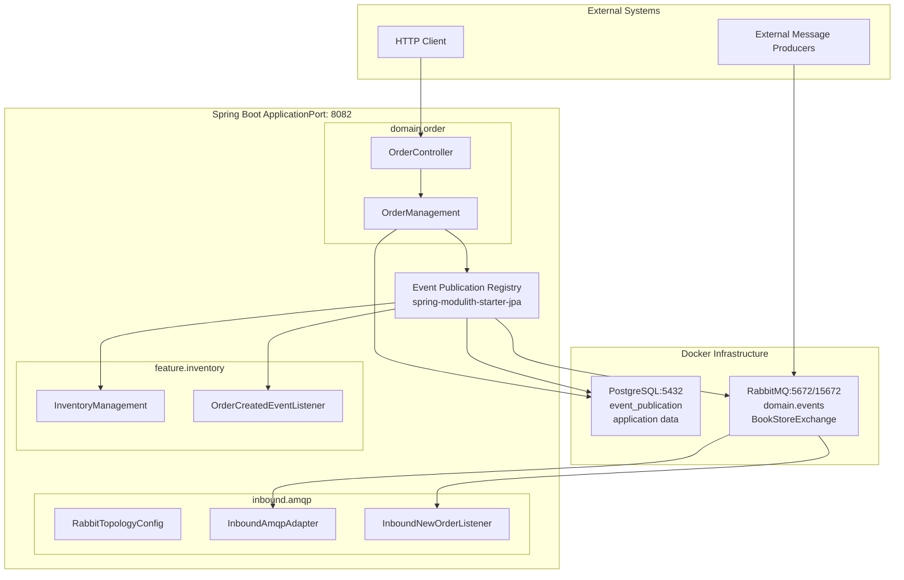
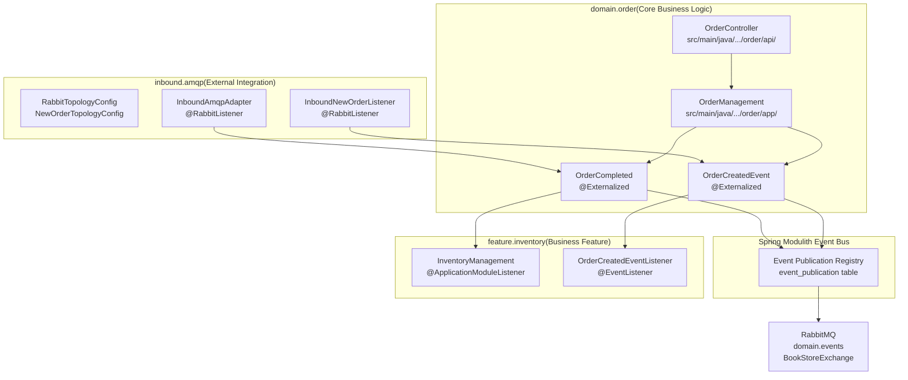
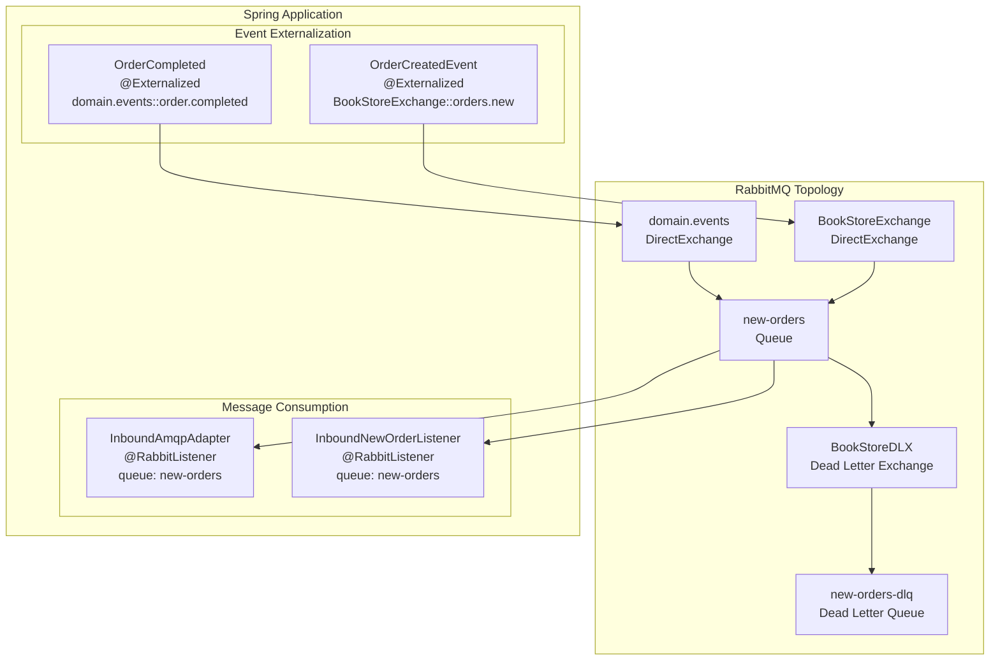

# Architecture

> **Relevant source files**
> * [Application_Events_and_AMQP_Integration.md](https://github.com/philipz/spring-monolith-amqp-poc/blob/c93f55b5/Application_Events_and_AMQP_Integration.md)
> * [CLAUDE.md](https://github.com/philipz/spring-monolith-amqp-poc/blob/c93f55b5/CLAUDE.md)
> * [Event-design.md](https://github.com/philipz/spring-monolith-amqp-poc/blob/c93f55b5/Event-design.md)
> * [README.md](https://github.com/philipz/spring-monolith-amqp-poc/blob/c93f55b5/README.md)
> * [src/main/java/com/example/modulithdemo/inventory/app/InventoryManagement.java](https://github.com/philipz/spring-monolith-amqp-poc/blob/c93f55b5/src/main/java/com/example/modulithdemo/inventory/app/InventoryManagement.java)
> * [src/main/java/com/example/modulithdemo/inventory/app/OrderCreatedEventListener.java](https://github.com/philipz/spring-monolith-amqp-poc/blob/c93f55b5/src/main/java/com/example/modulithdemo/inventory/app/OrderCreatedEventListener.java)

## Purpose and Scope

This document provides a high-level overview of the `spring-monolith-amqp-poc` system architecture, introducing the modular design principles, event-driven communication patterns, and key infrastructure components. It establishes the foundational architectural concepts that underpin the application.

For detailed information about specific architectural aspects, see:

* Spring Modulith module boundaries and conventions: [Spring Modulith Design](/philipz/spring-monolith-amqp-poc/3.1-spring-modulith-design)
* Internal event publication and consumption patterns: [Event-Driven Architecture](/philipz/spring-monolith-amqp-poc/3.2-event-driven-architecture)
* RabbitMQ integration and message routing: [AMQP Integration Overview](/philipz/spring-monolith-amqp-poc/3.3-amqp-integration-overview)
* Configuration details: [Configuration](/philipz/spring-monolith-amqp-poc/4-configuration)

**Sources:** [README.md L1-L176](https://github.com/philipz/spring-monolith-amqp-poc/blob/c93f55b5/README.md#L1-L176)

 [CLAUDE.md L1-L145](https://github.com/philipz/spring-monolith-amqp-poc/blob/c93f55b5/CLAUDE.md#L1-L145)

---

## System Overview

The application is a Spring Boot 3.5 monolith built using Spring Modulith 1.4.3 architectural patterns. It demonstrates modular architecture with event-driven inter-module communication while maintaining the operational simplicity of a single deployable unit.

### Deployment Architecture



**Key Components:**

* **Application Server**: Single Spring Boot process on port 8082
* **PostgreSQL**: Stores both application data and Event Publication Registry (`event_publication` table)
* **RabbitMQ**: Message broker with two exchanges: `domain.events` for event externalization and `BookStoreExchange` for new order ingestion
* **Event Publication Registry**: Transactional outbox implementation ensuring reliable event processing

**Sources:** [README.md L46-L100](https://github.com/philipz/spring-monolith-amqp-poc/blob/c93f55b5/README.md#L46-L100)

 [CLAUDE.md L59-L92](https://github.com/philipz/spring-monolith-amqp-poc/blob/c93f55b5/CLAUDE.md#L59-L92)

 [application.yml](https://github.com/philipz/spring-monolith-amqp-poc/blob/c93f55b5/application.yml)

 (referenced in high-level diagrams)

---

## Module Structure

The application follows Spring Modulith package-based module conventions, with three distinct modules enforcing strict boundaries through event-driven communication.

### Module Boundaries and Responsibilities



**Module Descriptions:**

| Module | Package | Purpose | Key Classes |
| --- | --- | --- | --- |
| **domain/order** | `com.example.modulithdemo.order` | Core order management domain with REST API and domain events | `OrderController`, `OrderManagement`, `OrderCompleted`, `OrderCreatedEvent` |
| **feature/inventory** | `com.example.modulithdemo.inventory` | Cross-module event consumer demonstrating async processing | `InventoryManagement`, `OrderCreatedEventListener` |
| **inbound/amqp** | `com.example.modulithdemo.amqp` | AMQP integration layer bridging external messages to internal events | `RabbitTopologyConfig`, `InboundAmqpAdapter`, `InboundNewOrderListener` |

**Sources:** [README.md L32-L44](https://github.com/philipz/spring-monolith-amqp-poc/blob/c93f55b5/README.md#L32-L44)

 [CLAUDE.md L61-L78](https://github.com/philipz/spring-monolith-amqp-poc/blob/c93f55b5/CLAUDE.md#L61-L78)

 [src/main/java/com/example/modulithdemo/inventory/app/InventoryManagement.java L1-L19](https://github.com/philipz/spring-monolith-amqp-poc/blob/c93f55b5/src/main/java/com/example/modulithdemo/inventory/app/InventoryManagement.java#L1-L19)

 [src/main/java/com/example/modulithdemo/inventory/app/OrderCreatedEventListener.java L1-L22](https://github.com/philipz/spring-monolith-amqp-poc/blob/c93f55b5/src/main/java/com/example/modulithdemo/inventory/app/OrderCreatedEventListener.java#L1-L22)

---

## Event Flow Architecture

The system implements a sophisticated event-driven architecture using Spring Modulith's Event Publication Registry for reliability guarantees.

### Internal Event Processing Flow

```mermaid
sequenceDiagram
  participant HTTP Client
  participant OrderController
  participant OrderManagement
  participant ApplicationEventPublisher
  participant Event Publication
  participant Registry (DB)
  participant InventoryManagement
  participant @ApplicationModuleListener

  HTTP Client->>OrderController: POST /orders/{id}/complete
  OrderController->>OrderManagement: complete(orderId)
  note over OrderManagement,Registry (DB): Transactional Boundary
  OrderManagement->>OrderManagement: Business logic updates
  OrderManagement->>ApplicationEventPublisher: publishEvent(OrderCompleted)
  ApplicationEventPublisher->>Event Publication: Persist event to event_publication
  note over Event Publication,Registry (DB): Transactional Outbox Pattern
  OrderManagement-->>OrderController: Success
  OrderController-->>HTTP Client: 202 Accepted
  note over Event Publication,@ApplicationModuleListener: Asynchronous Processing
  Event Publication->>InventoryManagement: Dispatch OrderCompleted event
  note over InventoryManagement,@ApplicationModuleListener: REQUIRES_NEW transaction
  InventoryManagement->>InventoryManagement: Process inventory update
  InventoryManagement-->>Event Publication: Event completed
```

**Event Processing Guarantees:**

* **Atomicity**: Event publication occurs within the same database transaction as business logic
* **Isolation**: `@ApplicationModuleListener` methods execute in separate transactions (`REQUIRES_NEW`)
* **Reliability**: Events are persisted to `event_publication` table before transaction commit
* **Async Processing**: Event listeners run asynchronously after transaction commit

**Event Types:**

| Event Class | Purpose | Listener Type | Transaction Boundary |
| --- | --- | --- | --- |
| `OrderCompleted` | Signals order completion | `@ApplicationModuleListener` | New transaction (async) |
| `OrderCreatedEvent` | Signals new order creation | `@EventListener` | Same transaction (sync) |

**Sources:** [CLAUDE.md L79-L92](https://github.com/philipz/spring-monolith-amqp-poc/blob/c93f55b5/CLAUDE.md#L79-L92)

 [Event-design.md L9-L41](https://github.com/philipz/spring-monolith-amqp-poc/blob/c93f55b5/Event-design.md#L9-L41)

 [Application_Events_and_AMQP_Integration.md L14-L62](https://github.com/philipz/spring-monolith-amqp-poc/blob/c93f55b5/Application_Events_and_AMQP_Integration.md#L14-L62)

---

## AMQP Integration Architecture

The application integrates with RabbitMQ for both outbound event externalization and inbound message consumption, implementing a bridge pattern between external systems and internal domain events.

### Message Routing Topology



**AMQP Configuration:**

* **Event Externalization**: Configured via `@Externalized` annotation with `target::routingKey` syntax
* **Topology Management**: Exchanges, queues, and bindings declared in `RabbitTopologyConfig` and `NewOrderTopologyConfig`
* **Dead Letter Handling**: Failed messages routed to `new-orders-dlq` after 3 retry attempts
* **Feedback Loop Prevention**: `app.amqp.new-orders.bind=false` by default to prevent consuming own externalized events

**Message Flow Patterns:**

1. **Outbound**: `OrderCompleted` → Event Publication Registry → `domain.events` exchange → `new-orders` queue
2. **Inbound**: External message → `new-orders` queue → `InboundNewOrderListener` → `OrderCreatedEvent` (internal)

**Sources:** [README.md L46-L100](https://github.com/philipz/spring-monolith-amqp-poc/blob/c93f55b5/README.md#L46-L100)

 [CLAUDE.md L74-L84](https://github.com/philipz/spring-monolith-amqp-poc/blob/c93f55b5/CLAUDE.md#L74-L84)

 [Event-design.md L45-L123](https://github.com/philipz/spring-monolith-amqp-poc/blob/c93f55b5/Event-design.md#L45-L123)

---

## Infrastructure Components

### Database Layer

The application uses PostgreSQL in production and H2 for testing, with a unified schema supporting both application data and the Event Publication Registry.

**Key Database Components:**

| Component | Technology | Purpose | Configuration |
| --- | --- | --- | --- |
| Production Database | PostgreSQL 5432 | Application data + Event Publication Registry | `spring.datasource.url` in [application.yml](https://github.com/philipz/spring-monolith-amqp-poc/blob/c93f55b5/application.yml) |
| Test Database | H2 (in-memory) | Testing with PostgreSQL compatibility mode | [src/test/resources/application.yml](https://github.com/philipz/spring-monolith-amqp-poc/blob/c93f55b5/src/test/resources/application.yml) |
| Connection Pool | HikariCP | Connection pooling (min: 2, max: 10) | `spring.datasource.hikari.*` |
| Event Publication Table | `event_publication` | Transactional outbox pattern implementation | Auto-created by Spring Modulith |

**Event Publication Registry Schema:**

The `event_publication` table implements the transactional outbox pattern:

```python
id (UUID)                    - Primary key
listener_id (TEXT)           - Event listener identifier
event_type (TEXT)            - Fully qualified event class name
serialized_event (TEXT)      - JSON-serialized event payload
publication_date (TIMESTAMP) - When event was published
completion_date (TIMESTAMP)  - When event processing completed (nullable)
```

**Completion Modes:**

* Production: `UPDATE` mode - sets `completion_date`, retains records for 7 days
* Test: `DELETE` mode - removes records immediately after completion

**Sources:** [CLAUDE.md L101-L116](https://github.com/philipz/spring-monolith-amqp-poc/blob/c93f55b5/CLAUDE.md#L101-L116)

 [Application_Events_and_AMQP_Integration.md L50-L70](https://github.com/philipz/spring-monolith-amqp-poc/blob/c93f55b5/Application_Events_and_AMQP_Integration.md#L50-L70)

### Message Broker Layer

RabbitMQ serves as the message broker for event externalization and external system integration.

**RabbitMQ Components:**

| Component | Type | Purpose | Declared In |
| --- | --- | --- | --- |
| `domain.events` | DirectExchange | Event externalization target | [RabbitTopologyConfig](https://github.com/philipz/spring-monolith-amqp-poc/blob/c93f55b5/RabbitTopologyConfig) |
| `BookStoreExchange` | DirectExchange | New order ingestion | [NewOrderTopologyConfig](https://github.com/philipz/spring-monolith-amqp-poc/blob/c93f55b5/NewOrderTopologyConfig) |
| `BookStoreDLX` | DirectExchange | Dead letter handling | [NewOrderTopologyConfig](https://github.com/philipz/spring-monolith-amqp-poc/blob/c93f55b5/NewOrderTopologyConfig) |
| `new-orders` | Queue | Primary message queue | [RabbitTopologyConfig](https://github.com/philipz/spring-monolith-amqp-poc/blob/c93f55b5/RabbitTopologyConfig) |
| `new-orders-dlq` | Queue | Dead letter queue | [NewOrderTopologyConfig](https://github.com/philipz/spring-monolith-amqp-poc/blob/c93f55b5/NewOrderTopologyConfig) |

**Connection Configuration:**

* Host: `localhost` (default), overridable via `SPRING_RABBITMQ_HOST`
* Port: 5672 (AMQP), 15672 (Management UI)
* Channel Pool: 50 cached channels for high throughput
* Credentials: `guest/guest` (default)

**Sources:** [README.md L103-L117](https://github.com/philipz/spring-monolith-amqp-poc/blob/c93f55b5/README.md#L103-L117)

 [CLAUDE.md L102-L134](https://github.com/philipz/spring-monolith-amqp-poc/blob/c93f55b5/CLAUDE.md#L102-L134)

---

## Key Architectural Decisions

### Modular Monolith Pattern

The system adopts a modular monolith architecture rather than microservices, providing:

* **Simplified Operations**: Single deployment unit, shared database, no distributed transaction complexity
* **Module Isolation**: Spring Modulith enforces module boundaries at compile time through package structure
* **Event-Driven Communication**: Modules interact exclusively through events, never direct method calls
* **Evolution Path**: Architecture supports gradual extraction to microservices if needed

**Sources:** [README.md L1-L11](https://github.com/philipz/spring-monolith-amqp-poc/blob/c93f55b5/README.md#L1-L11)

 [CLAUDE.md L86-L91](https://github.com/philipz/spring-monolith-amqp-poc/blob/c93f55b5/CLAUDE.md#L86-L91)

### Transactional Outbox Pattern

The Event Publication Registry implements the transactional outbox pattern for reliable event processing:

* **Atomicity**: Events persisted in same transaction as business data
* **Reliability**: `republish-outstanding-events-on-restart: true` ensures no events are lost
* **Observability**: Event publication history retained for auditing (7-day TTL in production)
* **Performance**: Bulk event processing reduces database round trips

**Sources:** [Application_Events_and_AMQP_Integration.md L40-L62](https://github.com/philipz/spring-monolith-amqp-poc/blob/c93f55b5/Application_Events_and_AMQP_Integration.md#L40-L62)

 [CLAUDE.md L86-L91](https://github.com/philipz/spring-monolith-amqp-poc/blob/c93f55b5/CLAUDE.md#L86-L91)

### Transaction Isolation Strategy

The `@ApplicationModuleListener` annotation enforces transaction isolation:

* **Separate Transactions**: Each listener runs in `REQUIRES_NEW` transaction
* **Failure Isolation**: Listener failures don't affect originating transaction
* **Async Processing**: Events processed asynchronously after transaction commit
* **Retry Capability**: Failed events can be retried via Event Publication Registry APIs

**Sources:** [Event-design.md L9-L41](https://github.com/philipz/spring-monolith-amqp-poc/blob/c93f55b5/Event-design.md#L9-L41)

 [Application_Events_and_AMQP_Integration.md L14-L48](https://github.com/philipz/spring-monolith-amqp-poc/blob/c93f55b5/Application_Events_and_AMQP_Integration.md#L14-L48)

### Technology Stack Choices

| Technology | Version | Rationale |
| --- | --- | --- |
| Java | 21 | LTS release with modern language features |
| Spring Boot | 3.5 | Latest stable release with comprehensive ecosystem |
| Spring Modulith | 1.4.3 | Modular architecture patterns with event-driven support |
| PostgreSQL | Latest | Production-grade relational database with JSONB support |
| H2 | Latest | Fast in-memory database for testing with PostgreSQL compatibility |
| RabbitMQ | Latest | Mature message broker with flexible routing capabilities |
| Maven | Latest | Build tool with comprehensive dependency management |

**Sources:** [CLAUDE.md L5-L7](https://github.com/philipz/spring-monolith-amqp-poc/blob/c93f55b5/CLAUDE.md#L5-L7)

 [pom.xml](https://github.com/philipz/spring-monolith-amqp-poc/blob/c93f55b5/pom.xml)

 (referenced in high-level diagrams)

---

## Configuration Strategy

The application uses a layered configuration approach:

1. **Base Configuration**: [src/main/resources/application.yml](https://github.com/philipz/spring-monolith-amqp-poc/blob/c93f55b5/src/main/resources/application.yml)  - production defaults
2. **Test Configuration**: [src/test/resources/application.yml](https://github.com/philipz/spring-monolith-amqp-poc/blob/c93f55b5/src/test/resources/application.yml)  - test-specific overrides
3. **Environment Variables**: Runtime overrides for deployment environments
4. **Docker Compose**: Local development infrastructure setup

Key configuration aspects are documented in detail in the [Configuration](/philipz/spring-monolith-amqp-poc/4-configuration) section and its subsections.

**Sources:** [README.md L103-L117](https://github.com/philipz/spring-monolith-amqp-poc/blob/c93f55b5/README.md#L103-L117)

 [CLAUDE.md L101-L130](https://github.com/philipz/spring-monolith-amqp-poc/blob/c93f55b5/CLAUDE.md#L101-L130)