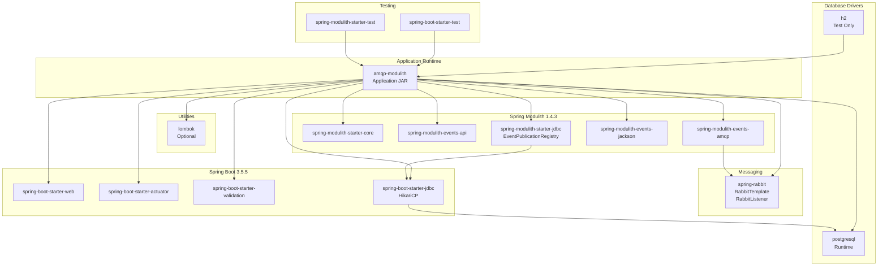
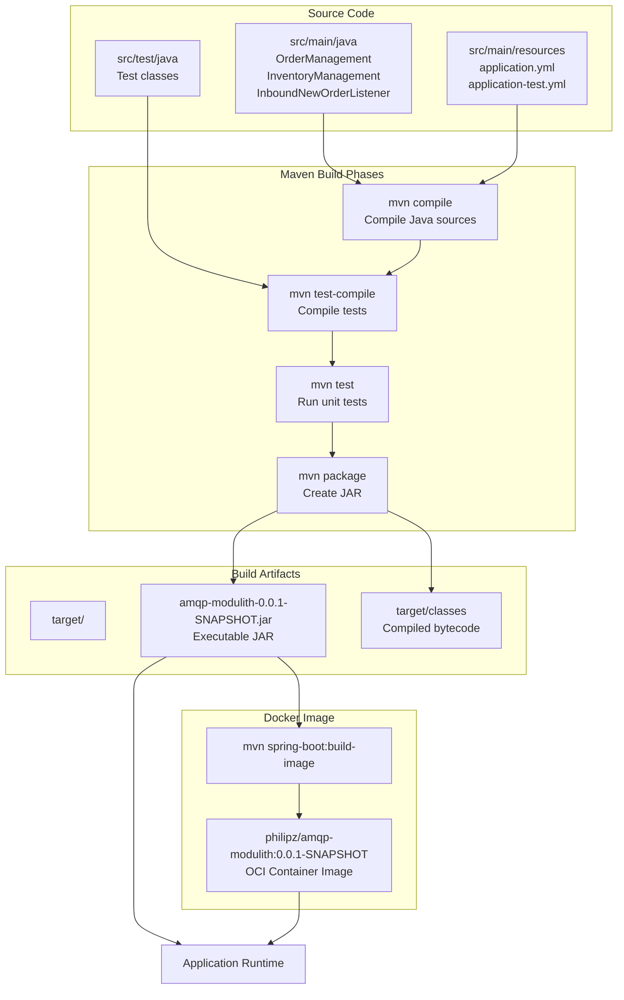
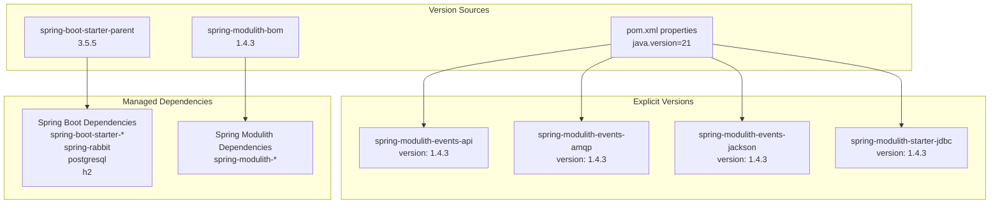

# Build and Dependencies

> **Relevant source files**
> * [mvnw](https://github.com/philipz/spring-monolith-amqp-poc/blob/c93f55b5/mvnw)
> * [mvnw.cmd](https://github.com/philipz/spring-monolith-amqp-poc/blob/c93f55b5/mvnw.cmd)
> * [pom.xml](https://github.com/philipz/spring-monolith-amqp-poc/blob/c93f55b5/pom.xml)

This document details the Maven build configuration, dependency structure, and build artifacts for the spring-monolith-amqp-poc application. It covers the project's dependency tree, version management, Maven wrapper usage, and Docker image creation.

For information about running the application locally, see [Local Development Setup](/philipz/spring-monolith-amqp-poc/8.3-local-development-setup). For details on the testing framework and test execution, see [Testing Strategy](/philipz/spring-monolith-amqp-poc/8.2-testing-strategy).

---

## Maven Build System

The project uses **Maven 3.x** as its build tool with the **Maven Wrapper** (`mvnw`/`mvnw.cmd`) included for consistent builds across environments. The wrapper eliminates the need for Maven installation and ensures all developers use the same Maven version.

### Maven Wrapper Scripts

The repository includes platform-specific Maven wrapper executables:

| File | Purpose | Platform |
| --- | --- | --- |
| `mvnw` | Maven wrapper shell script | Unix/Linux/macOS |
| `mvnw.cmd` | Maven wrapper batch/PowerShell script | Windows |
| `.mvn/wrapper/maven-wrapper.properties` | Maven distribution configuration | All platforms |

The wrapper automatically downloads and caches the specified Maven distribution on first use. Developers can run builds using `./mvnw` (Unix) or `mvnw.cmd` (Windows) without installing Maven globally.

**Sources:** [mvnw L1-L296](https://github.com/philipz/spring-monolith-amqp-poc/blob/c93f55b5/mvnw#L1-L296)

 [mvnw.cmd L1-L190](https://github.com/philipz/spring-monolith-amqp-poc/blob/c93f55b5/mvnw.cmd#L1-L190)

---

## Project Coordinates and Parent POM

The project inherits from `spring-boot-starter-parent` to leverage Spring Boot's dependency management, plugin configuration, and build conventions:

```html
<parent>
    <groupId>org.springframework.boot</groupId>
    <artifactId>spring-boot-starter-parent</artifactId>
    <version>3.5.5</version>
</parent>

<groupId>com.example</groupId>
<artifactId>amqp-modulith</artifactId>
<version>0.0.1-SNAPSHOT</version>
<name>amqp-modulith</name>
```

**Key Properties:**

* **Java Version:** 21
* **Spring Modulith Version:** 1.4.3
* **Docker Image Name:** `philipz/amqp-modulith:0.0.1-SNAPSHOT`

**Sources:** [pom.xml L5-L33](https://github.com/philipz/spring-monolith-amqp-poc/blob/c93f55b5/pom.xml#L5-L33)

---

## Dependency Architecture



**Sources:** [pom.xml L34-L142](https://github.com/philipz/spring-monolith-amqp-poc/blob/c93f55b5/pom.xml#L34-L142)

---

## Core Dependencies

### Spring Boot Starters

The application uses the following Spring Boot starters for core functionality:

| Dependency | Purpose | Key Components |
| --- | --- | --- |
| `spring-boot-starter-web` | REST API support | `DispatcherServlet`, `Jackson`, embedded Tomcat |
| `spring-boot-starter-actuator` | Health checks and monitoring | `/actuator` endpoints |
| `spring-boot-starter-validation` | Bean validation | JSR-380 validation annotations |
| `spring-boot-starter-jdbc` | JDBC and connection pooling | `DataSource`, `JdbcTemplate`, HikariCP |

**Sources:** [pom.xml L41-L52](https://github.com/philipz/spring-monolith-amqp-poc/blob/c93f55b5/pom.xml#L41-L52)

 [pom.xml L94-L97](https://github.com/philipz/spring-monolith-amqp-poc/blob/c93f55b5/pom.xml#L94-L97)

### Spring Modulith Dependencies

Spring Modulith provides the event-driven modular architecture foundation:

| Dependency | Artifact ID | Purpose |
| --- | --- | --- |
| Core | `spring-modulith-starter-core` | Module boundary enforcement, event bus |
| Events API | `spring-modulith-events-api` | `@Externalized`, `ApplicationModuleListener` annotations |
| AMQP Integration | `spring-modulith-events-amqp` | Event externalization to RabbitMQ |
| JSON Serialization | `spring-modulith-events-jackson` | Jackson-based event serialization for AMQP |
| JDBC Registry | `spring-modulith-starter-jdbc` | `event_publication` table, transactional outbox |

The Spring Modulith BOM manages version consistency:

```xml
<dependencyManagement>
    <dependencies>
        <dependency>
            <groupId>org.springframework.modulith</groupId>
            <artifactId>spring-modulith-bom</artifactId>
            <version>1.4.3</version>
            <type>pom</type>
            <scope>import</scope>
        </dependency>
    </dependencies>
</dependencyManagement>
```

**Sources:** [pom.xml L36-L38](https://github.com/philipz/spring-monolith-amqp-poc/blob/c93f55b5/pom.xml#L36-L38)

 [pom.xml L54-L73](https://github.com/philipz/spring-monolith-amqp-poc/blob/c93f55b5/pom.xml#L54-L73)

 [pom.xml L143-L153](https://github.com/philipz/spring-monolith-amqp-poc/blob/c93f55b5/pom.xml#L143-L153)

### AMQP/RabbitMQ Integration

```xml
<dependency>
    <groupId>org.springframework.amqp</groupId>
    <artifactId>spring-rabbit</artifactId>
</dependency>
```

The `spring-rabbit` dependency provides:

* `RabbitTemplate` for message publishing (used by `spring-modulith-events-amqp`)
* `@RabbitListener` for message consumption (used in `InboundNewOrderListener`)
* `RabbitAdmin` for topology configuration (used in `NewOrderTopologyConfig`)
* Connection pooling and channel management

**Sources:** [pom.xml L76-L79](https://github.com/philipz/spring-monolith-amqp-poc/blob/c93f55b5/pom.xml#L76-L79)

### Database Dependencies

The application supports multiple database configurations:

| Dependency | Scope | Purpose |
| --- | --- | --- |
| `postgresql` | Runtime | Production Event Publication Registry and application data |
| `h2` | Test | In-memory database for integration tests |

Both drivers integrate with HikariCP connection pooling provided by `spring-boot-starter-jdbc`.

**Sources:** [pom.xml L82-L92](https://github.com/philipz/spring-monolith-amqp-poc/blob/c93f55b5/pom.xml#L82-L92)

---

## Test Dependencies

The project includes comprehensive testing support with explicit Mockito exclusions:

```xml
<dependency>
    <groupId>org.springframework.boot</groupId>
    <artifactId>spring-boot-starter-test</artifactId>
    <scope>test</scope>
    <exclusions>
        <exclusion>
            <groupId>org.mockito</groupId>
            <artifactId>mockito-core</artifactId>
        </exclusion>
        <!-- Additional Mockito exclusions -->
    </exclusions>
</dependency>

<dependency>
    <groupId>org.springframework.modulith</groupId>
    <artifactId>spring-modulith-starter-test</artifactId>
    <scope>test</scope>
    <exclusions>
        <!-- Same Mockito exclusions -->
    </exclusions>
</dependency>
```

**Test Frameworks Included:**

* JUnit 5 (Jupiter)
* AssertJ for fluent assertions
* Spring Test (`@SpringBootTest`, `@WebMvcTest`)
* Spring Modulith test utilities for module verification

**Note:** Mockito is explicitly excluded from both test starters, suggesting the project may use alternative mocking strategies or prefer integration testing over unit testing with mocks.

**Sources:** [pom.xml L98-L135](https://github.com/philipz/spring-monolith-amqp-poc/blob/c93f55b5/pom.xml#L98-L135)

---

## Build Configuration and Plugins

### Spring Boot Maven Plugin

The `spring-boot-maven-plugin` handles application packaging and Docker image creation:

```html
<plugin>
    <groupId>org.springframework.boot</groupId>
    <artifactId>spring-boot-maven-plugin</artifactId>
    <configuration>
        <image>
            <name>philipz/amqp-modulith:0.0.1-SNAPSHOT</name>
        </image>
    </configuration>
</plugin>
```

**Plugin Capabilities:**

* `mvn spring-boot:run` - Run application locally
* `mvn package` - Create executable JAR with embedded dependencies
* `mvn spring-boot:build-image` - Create OCI container image using Buildpacks

The Docker image name follows the pattern: `philipz/${project.artifactId}:${project.version}`

**Sources:** [pom.xml L155-L167](https://github.com/philipz/spring-monolith-amqp-poc/blob/c93f55b5/pom.xml#L155-L167)

### Lombok Configuration

```xml
<dependency>
    <groupId>org.projectlombok</groupId>
    <artifactId>lombok</artifactId>
    <optional>true</optional>
</dependency>
```

Lombok reduces boilerplate with annotations like `@Data`, `@Slf4j`, and `@RequiredArgsConstructor`. The `optional` flag prevents Lombok from being included in downstream dependencies.

**Sources:** [pom.xml L137-L141](https://github.com/philipz/spring-monolith-amqp-poc/blob/c93f55b5/pom.xml#L137-L141)

---

## Build Artifacts and Lifecycle



**Common Build Commands:**

| Command | Purpose |
| --- | --- |
| `./mvnw clean` | Remove `target/` directory |
| `./mvnw compile` | Compile main sources |
| `./mvnw test` | Run tests with H2 database |
| `./mvnw package` | Create executable JAR |
| `./mvnw spring-boot:run` | Run application with embedded Tomcat |
| `./mvnw spring-boot:build-image` | Create Docker image via Buildpacks |
| `./mvnw dependency:tree` | Display dependency tree |

**Sources:** [pom.xml L155-L167](https://github.com/philipz/spring-monolith-amqp-poc/blob/c93f55b5/pom.xml#L155-L167)

---

## Dependency Version Management



**Version Hierarchy:**

1. **Spring Boot Parent POM** (3.5.5) - Manages most Spring Framework and third-party dependencies
2. **Spring Modulith BOM** (1.4.3) - Manages all Spring Modulith artifacts via `<dependencyManagement>` import
3. **Explicit Versions** - Some Spring Modulith dependencies explicitly declare `${spring-modulith.version}` for clarity

**Key Version Properties:**

| Property | Value | Purpose |
| --- | --- | --- |
| `java.version` | 21 | Target JVM version |
| `spring-modulith.version` | 1.4.3 | Centralized Spring Modulith version |
| `dockerImageName` | `philipz/amqp-modulith:0.0.1-SNAPSHOT` | Container image tag |

**Sources:** [pom.xml L29-L33](https://github.com/philipz/spring-monolith-amqp-poc/blob/c93f55b5/pom.xml#L29-L33)

 [pom.xml L143-L153](https://github.com/philipz/spring-monolith-amqp-poc/blob/c93f55b5/pom.xml#L143-L153)

---

## Dependency Scope Summary

| Scope | Dependencies | Inclusion in Runtime |
| --- | --- | --- |
| `compile` (default) | Spring Boot starters, Spring Modulith, `spring-rabbit`, Lombok (optional) | Included in JAR and classpath |
| `runtime` | `postgresql` | Not needed for compilation, included at runtime |
| `test` | `h2`, `spring-boot-starter-test`, `spring-modulith-starter-test` | Only available during test execution |

The executable JAR produced by `mvn package` includes all `compile` and `runtime` dependencies but excludes `test`-scoped dependencies. The `optional` Lombok dependency is included in compilation but may be excluded from transitive dependency resolution.

**Sources:** [pom.xml L34-L142](https://github.com/philipz/spring-monolith-amqp-poc/blob/c93f55b5/pom.xml#L34-L142)