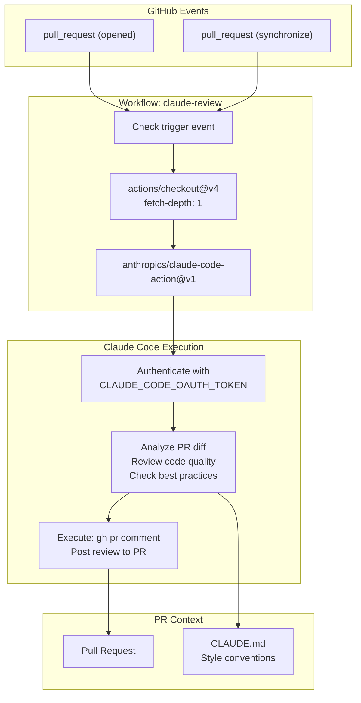
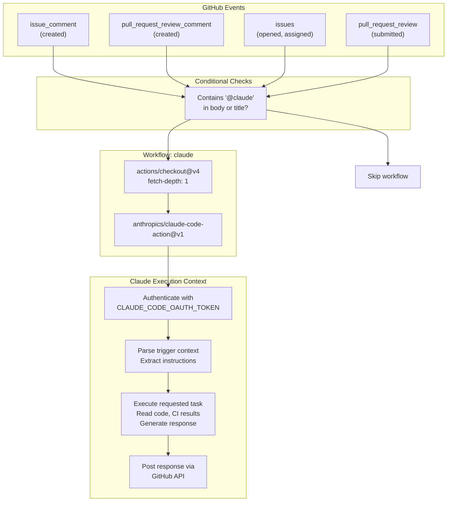
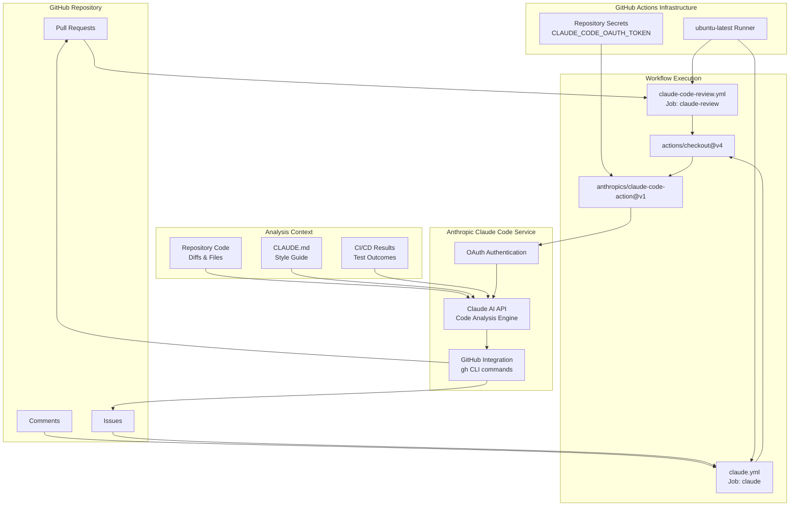

# CI/CD and Automation

> **Relevant source files**
> * [.github/workflows/claude-code-review.yml](https://github.com/philipz/spring-monolith-amqp-poc/blob/c93f55b5/.github/workflows/claude-code-review.yml)
> * [.github/workflows/claude.yml](https://github.com/philipz/spring-monolith-amqp-poc/blob/c93f55b5/.github/workflows/claude.yml)

## Purpose and Scope

This document describes the continuous integration and automation infrastructure for the spring-monolith-amqp-poc repository. The project uses GitHub Actions workflows to automate code review and provide interactive development assistance through Claude AI integration. This page covers workflow configurations, trigger mechanisms, permissions, and usage patterns.

For information about building and testing the application, see [Build and Dependencies](/philipz/spring-monolith-amqp-poc/8.1-build-and-dependencies) and [Testing Strategy](/philipz/spring-monolith-amqp-poc/8.2-testing-strategy). For local development setup, see [Local Development Setup](/philipz/spring-monolith-amqp-poc/8.3-local-development-setup).

---

## Automation Overview

The repository implements two GitHub Actions workflows that leverage Anthropic's Claude Code for automated development assistance:

| Workflow | File | Trigger | Purpose |
| --- | --- | --- | --- |
| Claude Code Review | `.github/workflows/claude-code-review.yml` | Pull request opened/synchronized | Automated code review on PRs |
| Claude Code | `.github/workflows/claude.yml` | `@claude` mention in issues/comments | Interactive development assistance |

Both workflows use the `anthropics/claude-code-action@v1` action and require the `CLAUDE_CODE_OAUTH_TOKEN` secret for authentication.

**Sources:** [.github/workflows/claude-code-review.yml L1-L55](https://github.com/philipz/spring-monolith-amqp-poc/blob/c93f55b5/.github/workflows/claude-code-review.yml#L1-L55)

 [.github/workflows/claude.yml L1-L51](https://github.com/philipz/spring-monolith-amqp-poc/blob/c93f55b5/.github/workflows/claude.yml#L1-L51)

---

## Automated Code Review Workflow

### Workflow Configuration

The `claude-code-review.yml` workflow provides automated code review on pull requests. It triggers on PR events and uses Claude AI to analyze code changes.



**Diagram: Automated Code Review Workflow Execution**

The workflow executes these steps:

1. **Trigger Detection**: Activates on `pull_request` events with types `opened` or `synchronize` [.github/workflows/claude-code-review.yml L4-L5](https://github.com/philipz/spring-monolith-amqp-poc/blob/c93f55b5/.github/workflows/claude-code-review.yml#L4-L5)
2. **Repository Checkout**: Uses `actions/checkout@v4` with shallow fetch [.github/workflows/claude-code-review.yml L29-L32](https://github.com/philipz/spring-monolith-amqp-poc/blob/c93f55b5/.github/workflows/claude-code-review.yml#L29-L32)
3. **Claude Review**: Executes `anthropics/claude-code-action@v1` with code review prompt [.github/workflows/claude-code-review.yml L34-L38](https://github.com/philipz/spring-monolith-amqp-poc/blob/c93f55b5/.github/workflows/claude-code-review.yml#L34-L38)
4. **Comment Generation**: Claude uses `gh pr comment` to post review feedback [.github/workflows/claude-code-review.yml L49](https://github.com/philipz/spring-monolith-amqp-poc/blob/c93f55b5/.github/workflows/claude-code-review.yml#L49-L49)

**Sources:** [.github/workflows/claude-code-review.yml L1-L55](https://github.com/philipz/spring-monolith-amqp-poc/blob/c93f55b5/.github/workflows/claude-code-review.yml#L1-L55)

### Review Criteria and Prompt

The workflow instructs Claude to review code based on specific criteria defined in the prompt:

```yaml
prompt: |
  Please review this pull request and provide feedback on:
  - Code quality and best practices
  - Potential bugs or issues
  - Performance considerations
  - Security concerns
  - Test coverage
  
  Use the repository's CLAUDE.md for guidance on style and conventions.
```

Claude references the repository's `CLAUDE.md` file for project-specific style and conventions [.github/workflows/claude-code-review.yml L47](https://github.com/philipz/spring-monolith-amqp-poc/blob/c93f55b5/.github/workflows/claude-code-review.yml#L47-L47)

 The review is posted directly to the PR as a comment.

**Sources:** [.github/workflows/claude-code-review.yml L39-L47](https://github.com/philipz/spring-monolith-amqp-poc/blob/c93f55b5/.github/workflows/claude-code-review.yml#L39-L47)

### Permissions and Security

The workflow requires specific GitHub permissions to access repository data and post comments:

| Permission | Access Level | Purpose |
| --- | --- | --- |
| `contents` | `read` | Access repository files |
| `pull-requests` | `read` | Read PR metadata and diffs |
| `issues` | `read` | Read issue context |
| `id-token` | `write` | OIDC token for authentication |

These permissions follow the principle of least privilege, granting only what's necessary for code review functionality [.github/workflows/claude-code-review.yml L22-L26](https://github.com/philipz/spring-monolith-amqp-poc/blob/c93f55b5/.github/workflows/claude-code-review.yml#L22-L26)

**Sources:** [.github/workflows/claude-code-review.yml L22-L26](https://github.com/philipz/spring-monolith-amqp-poc/blob/c93f55b5/.github/workflows/claude-code-review.yml#L22-L26)

### Tool Restrictions

The workflow restricts Claude's tool access using the `claude_args` parameter:

```yaml
claude_args: '--allowed-tools "Bash(gh issue view:*),Bash(gh search:*),Bash(gh issue list:*),Bash(gh pr comment:*),Bash(gh pr diff:*),Bash(gh pr view:*),Bash(gh pr list:*)"'
```

This whitelist allows only specific GitHub CLI commands related to viewing issues, PRs, and posting comments. The wildcard patterns permit command variations while preventing unrestricted shell access [.github/workflows/claude-code-review.yml L53](https://github.com/philipz/spring-monolith-amqp-poc/blob/c93f55b5/.github/workflows/claude-code-review.yml#L53-L53)

**Sources:** [.github/workflows/claude-code-review.yml L53](https://github.com/philipz/spring-monolith-amqp-poc/blob/c93f55b5/.github/workflows/claude-code-review.yml#L53-L53)

---

## Interactive Claude Code Workflow

### Workflow Configuration

The `claude.yml` workflow provides on-demand development assistance triggered by mentioning `@claude` in GitHub issues, comments, or PR reviews.



**Diagram: Interactive Claude Code Workflow Trigger Logic**

**Sources:** [.github/workflows/claude.yml L1-L51](https://github.com/philipz/spring-monolith-amqp-poc/blob/c93f55b5/.github/workflows/claude.yml#L1-L51)

### Trigger Conditions

The workflow uses complex conditional logic to determine when to execute:

```yaml
if: |
  (github.event_name == 'issue_comment' && contains(github.event.comment.body, '@claude')) ||
  (github.event_name == 'pull_request_review_comment' && contains(github.event.comment.body, '@claude')) ||
  (github.event_name == 'pull_request_review' && contains(github.event.review.body, '@claude')) ||
  (github.event_name == 'issues' && (contains(github.event.issue.body, '@claude') || contains(github.event.issue.title, '@claude')))
```

The workflow activates only when:

* An issue comment contains `@claude` [.github/workflows/claude.yml L16](https://github.com/philipz/spring-monolith-amqp-poc/blob/c93f55b5/.github/workflows/claude.yml#L16-L16)
* A PR review comment contains `@claude` [.github/workflows/claude.yml L17](https://github.com/philipz/spring-monolith-amqp-poc/blob/c93f55b5/.github/workflows/claude.yml#L17-L17)
* A PR review body contains `@claude` [.github/workflows/claude.yml L18](https://github.com/philipz/spring-monolith-amqp-poc/blob/c93f55b5/.github/workflows/claude.yml#L18-L18)
* An issue body or title contains `@claude` [.github/workflows/claude.yml L19](https://github.com/philipz/spring-monolith-amqp-poc/blob/c93f55b5/.github/workflows/claude.yml#L19-L19)

This selective triggering prevents unnecessary workflow runs and API consumption.

**Sources:** [.github/workflows/claude.yml L14-L19](https://github.com/philipz/spring-monolith-amqp-poc/blob/c93f55b5/.github/workflows/claude.yml#L14-L19)

### Enhanced Permissions

The interactive workflow requires additional permissions beyond the automated review:

| Permission | Access Level | Purpose |
| --- | --- | --- |
| `contents` | `read` | Access repository files |
| `pull-requests` | `read` | Read PR metadata |
| `issues` | `read` | Read issue context |
| `id-token` | `write` | OIDC token authentication |
| `actions` | `read` | **Read CI/CD results on PRs** |

The `actions: read` permission allows Claude to access CI workflow results, enabling it to help debug test failures or CI issues [.github/workflows/claude.yml L26](https://github.com/philipz/spring-monolith-amqp-poc/blob/c93f55b5/.github/workflows/claude.yml#L26-L26)

 [.github/workflows/claude.yml L40-L41](https://github.com/philipz/spring-monolith-amqp-poc/blob/c93f55b5/.github/workflows/claude.yml#L40-L41)

**Sources:** [.github/workflows/claude.yml L21-L26](https://github.com/philipz/spring-monolith-amqp-poc/blob/c93f55b5/.github/workflows/claude.yml#L21-L26)

 [.github/workflows/claude.yml L39-L41](https://github.com/philipz/spring-monolith-amqp-poc/blob/c93f55b5/.github/workflows/claude.yml#L39-L41)

### Custom Prompts and Arguments

The workflow supports optional customization:

**Custom Prompt**: Override Claude's default behavior with a specific task:

```sql
# prompt: 'Update the pull request description to include a summary of changes.'
```

[.github/workflows/claude.yml L44](https://github.com/philipz/spring-monolith-amqp-poc/blob/c93f55b5/.github/workflows/claude.yml#L44-L44)

**Claude Arguments**: Customize model and tool access:

```markdown
# claude_args: '--model claude-opus-4-1-20250805 --allowed-tools Bash(gh pr:*)'
```

[.github/workflows/claude.yml L49](https://github.com/philipz/spring-monolith-amqp-poc/blob/c93f55b5/.github/workflows/claude.yml#L49-L49)

When no custom prompt is provided, Claude executes the instructions specified in the comment that tagged it [.github/workflows/claude.yml L43](https://github.com/philipz/spring-monolith-amqp-poc/blob/c93f55b5/.github/workflows/claude.yml#L43-L43)

**Sources:** [.github/workflows/claude.yml L43-L49](https://github.com/philipz/spring-monolith-amqp-poc/blob/c93f55b5/.github/workflows/claude.yml#L43-L49)

---

## Authentication and Secrets

Both workflows require the `CLAUDE_CODE_OAUTH_TOKEN` secret for authenticating with Anthropic's Claude Code service:

```
claude_code_oauth_token: ${{ secrets.CLAUDE_CODE_OAUTH_TOKEN }}
```

This token must be configured in the repository's GitHub Secrets under **Settings → Secrets and variables → Actions**. The token provides OAuth-based authentication for the `anthropics/claude-code-action@v1` action.

**Token Configuration Steps:**

1. Generate a Claude Code OAuth token from Anthropic's platform
2. Add the token to repository secrets as `CLAUDE_CODE_OAUTH_TOKEN`
3. Verify workflows have access to secrets in their environment

**Sources:** [.github/workflows/claude-code-review.yml L38](https://github.com/philipz/spring-monolith-amqp-poc/blob/c93f55b5/.github/workflows/claude-code-review.yml#L38-L38)

 [.github/workflows/claude.yml L37](https://github.com/philipz/spring-monolith-amqp-poc/blob/c93f55b5/.github/workflows/claude.yml#L37-L37)

---

## Workflow Integration Architecture



**Diagram: CI/CD Integration Architecture and Data Flow**

This architecture shows how the workflows integrate with GitHub's infrastructure and Anthropic's Claude Code service. Key integration points:

* **GitHub Actions Runner**: Ubuntu-based execution environment [.github/workflows/claude-code-review.yml L21](https://github.com/philipz/spring-monolith-amqp-poc/blob/c93f55b5/.github/workflows/claude-code-review.yml#L21-L21)  [.github/workflows/claude.yml L20](https://github.com/philipz/spring-monolith-amqp-poc/blob/c93f55b5/.github/workflows/claude.yml#L20-L20)
* **Repository Checkout**: Shallow clone with depth 1 for performance [.github/workflows/claude-code-review.yml L32](https://github.com/philipz/spring-monolith-amqp-poc/blob/c93f55b5/.github/workflows/claude-code-review.yml#L32-L32)  [.github/workflows/claude.yml L31](https://github.com/philipz/spring-monolith-amqp-poc/blob/c93f55b5/.github/workflows/claude.yml#L31-L31)
* **OAuth Authentication**: Secure token-based authentication via secrets
* **Claude Code Action**: Anthropic's official GitHub Action [.github/workflows/claude-code-review.yml L36](https://github.com/philipz/spring-monolith-amqp-poc/blob/c93f55b5/.github/workflows/claude-code-review.yml#L36-L36)  [.github/workflows/claude.yml L35](https://github.com/philipz/spring-monolith-amqp-poc/blob/c93f55b5/.github/workflows/claude.yml#L35-L35)
* **GitHub CLI Integration**: Uses `gh` commands to interact with PRs and issues [.github/workflows/claude-code-review.yml L53](https://github.com/philipz/spring-monolith-amqp-poc/blob/c93f55b5/.github/workflows/claude-code-review.yml#L53-L53)

**Sources:** [.github/workflows/claude-code-review.yml L21-L55](https://github.com/philipz/spring-monolith-amqp-poc/blob/c93f55b5/.github/workflows/claude-code-review.yml#L21-L55)

 [.github/workflows/claude.yml L20-L51](https://github.com/philipz/spring-monolith-amqp-poc/blob/c93f55b5/.github/workflows/claude.yml#L20-L51)

---

## Usage Patterns

### Automated Code Review

**Trigger**: Automatically runs when a PR is opened or updated.

**Example Flow:**

1. Developer opens PR with changes to `OrderManagement.java`
2. `claude-code-review.yml` workflow triggers
3. Claude analyzes the code diff
4. Review comment posted with feedback on: * Spring best practices * Transaction boundary correctness * Event publication patterns * Test coverage gaps

**No manual intervention required** - reviews appear automatically on every PR.

**Sources:** [.github/workflows/claude-code-review.yml L4-L5](https://github.com/philipz/spring-monolith-amqp-poc/blob/c93f55b5/.github/workflows/claude-code-review.yml#L4-L5)

### Interactive Assistance

**Trigger**: Manually invoke by mentioning `@claude` in issues, comments, or reviews.

**Example Usages:**

| Context | Command | Claude Action |
| --- | --- | --- |
| PR Comment | `@claude review the transaction handling in OrderManagement` | Reviews specific code aspect |
| Issue | `@claude help debug the failing integration test` | Analyzes test failures using CI results |
| PR Review Comment | `@claude explain why this change is needed` | Provides code explanation |
| New Issue | Title: `@claude update documentation for AMQP config` | Generates documentation updates |

**Key Benefit**: Context-aware assistance that understands repository structure, CI results, and project conventions from `CLAUDE.md`.

**Sources:** [.github/workflows/claude.yml L14-L19](https://github.com/philipz/spring-monolith-amqp-poc/blob/c93f55b5/.github/workflows/claude.yml#L14-L19)

---

## Configuration Options

### Optional Path Filtering

The automated review workflow includes commented-out path filtering:

```markdown
# paths:
#   - "src/**/*.ts"
#   - "src/**/*.tsx"
#   - "src/**/*.js"
#   - "src/**/*.jsx"
```

This can be enabled to run reviews only when specific files change, reducing API consumption for documentation-only PRs [.github/workflows/claude-code-review.yml L7-L11](https://github.com/philipz/spring-monolith-amqp-poc/blob/c93f55b5/.github/workflows/claude-code-review.yml#L7-L11)

**Sources:** [.github/workflows/claude-code-review.yml L7-L11](https://github.com/philipz/spring-monolith-amqp-poc/blob/c93f55b5/.github/workflows/claude-code-review.yml#L7-L11)

### Optional Author Filtering

The workflow includes commented-out author filtering:

```markdown
# if: |
#   github.event.pull_request.user.login == 'external-contributor' ||
#   github.event.pull_request.user.login == 'new-developer' ||
#   github.event.pull_request.author_association == 'FIRST_TIME_CONTRIBUTOR'
```

This can restrict reviews to specific authors or first-time contributors, useful for open-source projects with varying trust levels [.github/workflows/claude-code-review.yml L16-L19](https://github.com/philipz/spring-monolith-amqp-poc/blob/c93f55b5/.github/workflows/claude-code-review.yml#L16-L19)

**Sources:** [.github/workflows/claude-code-review.yml L16-L19](https://github.com/philipz/spring-monolith-amqp-poc/blob/c93f55b5/.github/workflows/claude-code-review.yml#L16-L19)

### Model and Tool Customization

Both workflows support the `claude_args` parameter for advanced configuration:

**Model Selection**: Choose specific Claude model versions

```yaml
claude_args: '--model claude-opus-4-1-20250805'
```

**Tool Restrictions**: Define allowed commands and patterns

```yaml
claude_args: '--allowed-tools Bash(gh pr:*)'
```

These options are documented in the [claude-code-action usage documentation](https://github.com/philipz/spring-monolith-amqp-poc/blob/c93f55b5/claude-code-action usage documentation)

 and [Anthropic CLI reference](https://docs.anthropic.com/en/docs/claude-code/sdk#command-line) [.github/workflows/claude-code-review.yml L51-L52](https://github.com/philipz/spring-monolith-amqp-poc/blob/c93f55b5/.github/workflows/claude-code-review.yml#L51-L52)

 [.github/workflows/claude.yml L47-L48](https://github.com/philipz/spring-monolith-amqp-poc/blob/c93f55b5/.github/workflows/claude.yml#L47-L48)

**Sources:** [.github/workflows/claude-code-review.yml L51-L53](https://github.com/philipz/spring-monolith-amqp-poc/blob/c93f55b5/.github/workflows/claude-code-review.yml#L51-L53)

 [.github/workflows/claude.yml L47-L49](https://github.com/philipz/spring-monolith-amqp-poc/blob/c93f55b5/.github/workflows/claude.yml#L47-L49)

---

## Current CI/CD Scope

The repository's CI/CD automation is **currently focused on code review and development assistance** rather than traditional CI/CD pipelines (build, test, deploy). There are no workflows for:

* Automated testing on commit/PR
* Build verification and artifact generation
* Docker image building and pushing
* Deployment to staging/production environments
* Dependency scanning or security checks

**Manual Processes:**

* Build: `mvn clean install` (see [Build and Dependencies](/philipz/spring-monolith-amqp-poc/8.1-build-and-dependencies))
* Testing: `mvn test` (see [Testing Strategy](/philipz/spring-monolith-amqp-poc/8.2-testing-strategy))
* Docker: `docker-compose up` (see [Local Development Setup](/philipz/spring-monolith-amqp-poc/8.3-local-development-setup))
* Deployment: Manual (see [Deployment Configuration](/philipz/spring-monolith-amqp-poc/9.1-deployment-configuration))

The Claude-based workflows complement these manual processes by providing intelligent code review and debugging assistance during development.

---

## Summary

The spring-monolith-amqp-poc repository uses GitHub Actions with Anthropic's Claude Code integration to provide:

1. **Automated Code Review**: Every PR receives AI-powered review for quality, security, and best practices
2. **Interactive Assistance**: Developers can invoke `@claude` for on-demand help with debugging, documentation, and code analysis
3. **Secure Integration**: OAuth-based authentication with minimal GitHub permissions
4. **Configurable Behavior**: Optional filters, custom prompts, and tool restrictions

**Key Configuration:**

* Workflows: `.github/workflows/claude-code-review.yml` and `.github/workflows/claude.yml`
* Secret Required: `CLAUDE_CODE_OAUTH_TOKEN` in repository settings
* Style Reference: `CLAUDE.md` for project conventions
* Action Version: `anthropics/claude-code-action@v1`

**Sources:** [.github/workflows/claude-code-review.yml L1-L55](https://github.com/philipz/spring-monolith-amqp-poc/blob/c93f55b5/.github/workflows/claude-code-review.yml#L1-L55)

 [.github/workflows/claude.yml L1-L51](https://github.com/philipz/spring-monolith-amqp-poc/blob/c93f55b5/.github/workflows/claude.yml#L1-L51)