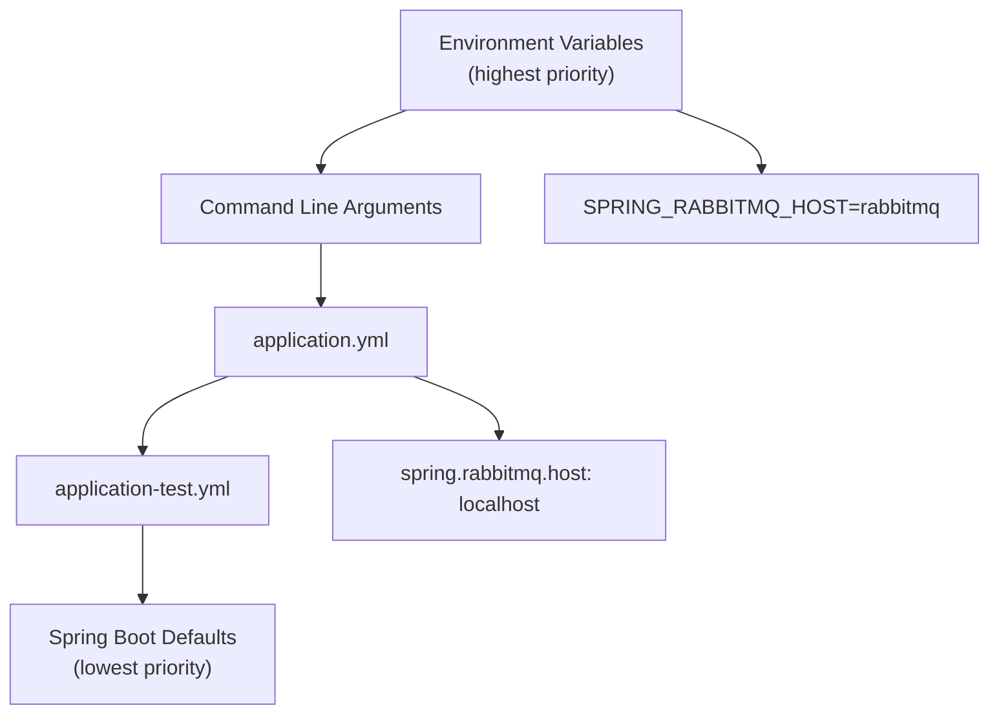
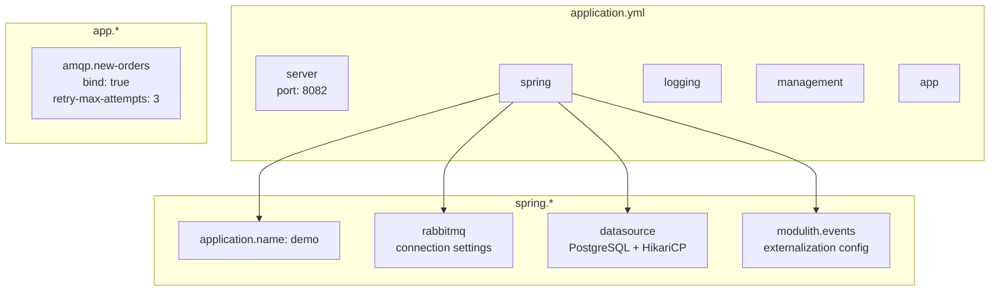
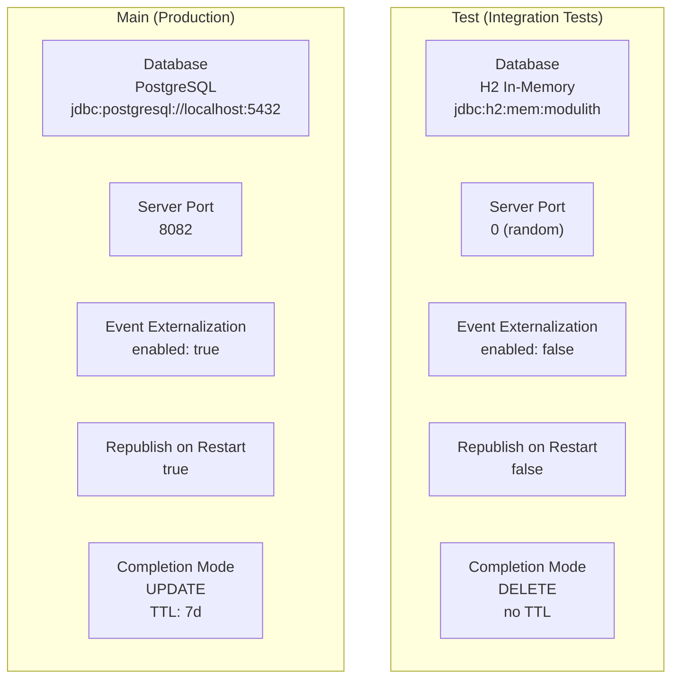

# Configuration

> **Relevant source files**
> * [docker-compose.yml](https://github.com/philipz/spring-monolith-amqp-poc/blob/c93f55b5/docker-compose.yml)
> * [src/main/resources/application.yml](https://github.com/philipz/spring-monolith-amqp-poc/blob/c93f55b5/src/main/resources/application.yml)
> * [src/test/resources/application.yml](https://github.com/philipz/spring-monolith-amqp-poc/blob/c93f55b5/src/test/resources/application.yml)

## Purpose and Scope

This page provides an overview of the configuration strategy used in the spring-monolith-amqp-poc application. It covers the configuration file structure, environment variable overrides, and differences between production and test configurations. For detailed information about specific configuration areas, see:

* [Application Configuration](/philipz/spring-monolith-amqp-poc/4.1-application-configuration) - Server settings, Spring Modulith event configuration, and application-specific properties
* [Database Configuration](/philipz/spring-monolith-amqp-poc/4.2-database-configuration) - PostgreSQL connection settings, HikariCP pooling, and Event Publication Registry schema
* [RabbitMQ Configuration](/philipz/spring-monolith-amqp-poc/4.3-rabbitmq-configuration) - RabbitMQ connection settings, channel pooling, and topology binding configuration

## Configuration Strategy

The application follows Spring Boot's externalized configuration pattern, using YAML files as the base configuration with environment variables for runtime overrides. This approach supports:

* **Default values**: Defined in `application.yml` for local development
* **Environment variable overrides**: All sensitive and environment-specific values can be overridden
* **Profile-specific configuration**: Separate configurations for production and test environments
* **Type-safe binding**: Configuration properties are bound to Spring beans with validation

**Configuration Precedence Hierarchy**



Sources: [src/main/resources/application.yml L1-L67](https://github.com/philipz/spring-monolith-amqp-poc/blob/c93f55b5/src/main/resources/application.yml#L1-L67)

## Configuration Files

The application uses two primary configuration files:

| File | Purpose | Database | Event Externalization |
| --- | --- | --- | --- |
| `src/main/resources/application.yml` | Production/local development | PostgreSQL | Enabled |
| `src/test/resources/application.yml` | Integration tests | H2 in-memory | Disabled |

**Configuration File Structure**



Sources: [src/main/resources/application.yml L1-L67](https://github.com/philipz/spring-monolith-amqp-poc/blob/c93f55b5/src/main/resources/application.yml#L1-L67)

 [src/test/resources/application.yml L1-L58](https://github.com/philipz/spring-monolith-amqp-poc/blob/c93f55b5/src/test/resources/application.yml#L1-L58)

## Environment Variable Override Pattern

All environment-specific and sensitive configuration values use the `${VAR_NAME:default}` pattern, allowing runtime override without modifying configuration files.

**Key Environment Variables**

| Environment Variable | Default Value | Purpose |
| --- | --- | --- |
| `SPRING_RABBITMQ_HOST` | `localhost` | RabbitMQ server hostname |
| `SPRING_RABBITMQ_PORT` | `5672` | RabbitMQ AMQP port |
| `SPRING_RABBITMQ_USERNAME` | `guest` | RabbitMQ authentication username |
| `SPRING_RABBITMQ_PASSWORD` | `guest` | RabbitMQ authentication password |
| `SPRING_DATASOURCE_URL` | `jdbc:postgresql://localhost:5432/postgres` | PostgreSQL JDBC connection URL |
| `SPRING_DATASOURCE_USERNAME` | `postgres` | PostgreSQL username |
| `SPRING_DATASOURCE_PASSWORD` | `postgres` | PostgreSQL password |
| `SPRING_DATASOURCE_HIKARI_MAXIMUM_POOL_SIZE` | `10` | HikariCP maximum connection pool size |
| `SPRING_DATASOURCE_HIKARI_MINIMUM_IDLE` | `2` | HikariCP minimum idle connections |
| `SPRING_DATASOURCE_HIKARI_CONNECTION_TIMEOUT` | `30000` | HikariCP connection timeout (ms) |
| `SPRING_DATASOURCE_HIKARI_IDLE_TIMEOUT` | `600000` | HikariCP idle timeout (ms) |
| `SPRING_DATASOURCE_HIKARI_MAX_LIFETIME` | `1800000` | HikariCP max connection lifetime (ms) |
| `SPRING_MODULITH_EVENTS_EXTERNALIZATION_ENABLED` | `true` | Enable/disable event externalization |
| `SPRING_MODULITH_EVENTS_TIME_TO_LIVE` | `7d` | Completed event retention period |

**Override Examples**

```markdown
# Docker Compose environment
SPRING_RABBITMQ_HOST=rabbitmq
SPRING_DATASOURCE_URL=jdbc:postgresql://postgres:5432/postgres

# Kubernetes environment
SPRING_RABBITMQ_HOST=rabbitmq.messaging.svc.cluster.local
SPRING_DATASOURCE_HIKARI_MAXIMUM_POOL_SIZE=20

# CLI override
java -jar demo.jar --app.amqp.new-orders.retry-max-attempts=5
```

Sources: [src/main/resources/application.yml L8-L26](https://github.com/philipz/spring-monolith-amqp-poc/blob/c93f55b5/src/main/resources/application.yml#L8-L26)

 [docker-compose.yml L1-L50](https://github.com/philipz/spring-monolith-amqp-poc/blob/c93f55b5/docker-compose.yml#L1-L50)

## Configuration Sections

The configuration is organized into logical sections:

```mermaid
flowchart TD

CONFIG["application.yml"]
SERVER["server.port: 8082"]
APPNAME["spring.application.name: demo"]
DS["spring.datasource<br>PostgreSQL configuration"]
HIKARI["datasource.hikari<br>Connection pooling"]
EPR["modulith.events.jdbc<br>Event Publication Registry"]
RMQ["spring.rabbitmq<br>Connection settings"]
CACHE["rabbitmq.cache.channel<br>Channel pooling: 50"]
EXT["modulith.events.externalization<br>enabled: true"]
RESTART["republish-outstanding-events-on-restart: true"]
COMPLETE["completion-mode: UPDATE"]
TTL["time-to-live: 7d"]
BIND["app.amqp.new-orders.bind: true"]
RETRY["app.amqp.new-orders.retry-max-attempts: 3"]
LOG["logging.level.*"]
MGMT["management.endpoints<br>health, info"]

CONFIG --> SERVER
CONFIG --> DS
CONFIG --> RMQ
CONFIG --> RESTART
CONFIG --> BIND
CONFIG --> LOG

subgraph Observability ["Observability"]
    LOG
    MGMT
end

subgraph subGraph4 ["Application Behavior"]
    BIND
    RETRY
end

subgraph subGraph3 ["Event System"]
    RESTART
    COMPLETE
    TTL
end

subgraph subGraph2 ["Messaging Layer"]
    RMQ
    CACHE
    EXT
end

subgraph subGraph1 ["Data Layer"]
    DS
    HIKARI
    EPR
end

subgraph subGraph0 ["Server & Application"]
    SERVER
    APPNAME
end
```



Sources: [src/main/resources/application.yml L1-L67](https://github.com/philipz/spring-monolith-amqp-poc/blob/c93f55b5/src/main/resources/application.yml#L1-L67)

## Main vs Test Configuration Differences

The test configuration overrides several settings to optimize for integration testing:

**Configuration Comparison**



| Configuration | Production | Test | Rationale |
| --- | --- | --- | --- |
| **Database** | PostgreSQL | H2 in-memory | Tests don't require persistent storage |
| **Server Port** | `8082` | `0` (random) | Avoid port conflicts in test execution |
| **Event Externalization** | `true` | `false` | Tests focus on internal behavior unless testing AMQP specifically |
| **Republish on Restart** | `true` | `false` | H2 state is ephemeral, no point in republishing |
| **Completion Mode** | `UPDATE` (7-day TTL) | `DELETE` | Tests don't need event history; keep database clean |
| **Database Mode** | Native PostgreSQL | `MODE=PostgreSQL` | H2 emulates PostgreSQL for compatibility |

Sources: [src/main/resources/application.yml L16-L41](https://github.com/philipz/spring-monolith-amqp-poc/blob/c93f55b5/src/main/resources/application.yml#L16-L41)

 [src/test/resources/application.yml L9-L36](https://github.com/philipz/spring-monolith-amqp-poc/blob/c93f55b5/src/test/resources/application.yml#L9-L36)

## Critical Configuration Settings

### Event Publication Reliability

The application uses three key settings to ensure reliable event processing:

```sql
spring:
  modulith:
    events:
      republish-outstanding-events-on-restart: true
      completion-mode: UPDATE
      time-to-live: 7d
```

* **`republish-outstanding-events-on-restart`**: Ensures events persisted in the Event Publication Registry are republished after application restarts, guaranteeing at-least-once delivery
* **`completion-mode: UPDATE`**: Keeps completed events in the database for audit purposes rather than deleting them
* **`time-to-live: 7d`**: Completed events are retained for 7 days (604800 seconds) before cleanup

Sources: [src/main/resources/application.yml L36-L41](https://github.com/philipz/spring-monolith-amqp-poc/blob/c93f55b5/src/main/resources/application.yml#L36-L41)

### AMQP Feedback Loop Prevention

The `app.amqp.new-orders.bind` property controls whether the application consumes its own externalized events:

```yaml
app:
  amqp:
    new-orders:
      bind: true  # Set to false in production to prevent feedback loops
      retry-max-attempts: 3
```

When `bind: true`, the `new-orders` queue binds to `BookStoreExchange` with routing key `orders.new`, allowing the application to consume externally published orders. When `false`, it only receives events from `domain.events` exchange. See [AMQP Integration Overview](/philipz/spring-monolith-amqp-poc/3.3-amqp-integration-overview) and [Topology Configuration](/philipz/spring-monolith-amqp-poc/7.1-topology-configuration) for details.

Sources: [src/main/resources/application.yml L58-L66](https://github.com/philipz/spring-monolith-amqp-poc/blob/c93f55b5/src/main/resources/application.yml#L58-L66)

## Docker Compose Infrastructure Configuration

The `docker-compose.yml` file defines the infrastructure services with their default configurations:

**Infrastructure Services**

| Service | Image | Ports | Health Check |
| --- | --- | --- | --- |
| PostgreSQL | `postgres:17-alpine` | `5432:5432` | `pg_isready -U postgres` |
| RabbitMQ | `rabbitmq:4.1.3-management-alpine` | `5672:5672` (AMQP)`15672:15672` (Management) | `rabbitmq-diagnostics ping` |

Both services use:

* Named volumes for data persistence (`postgres-data`, `rabbitmq-data`)
* Dedicated network (`amqp-modulith-network`)
* Health checks with 10-second intervals and 5 retries

Sources: [docker-compose.yml L1-L50](https://github.com/philipz/spring-monolith-amqp-poc/blob/c93f55b5/docker-compose.yml#L1-L50)

## Configuration Loading in Code

The application configuration is loaded through Spring Boot's standard mechanism:

1. **Application startup**: `@SpringBootApplication` annotation triggers configuration loading
2. **Property binding**: Spring binds YAML properties to Java objects
3. **Validation**: Bean validation occurs during startup
4. **Override resolution**: Environment variables override YAML defaults

Configuration values are accessed via:

* `@Value` annotations for simple properties
* `@ConfigurationProperties` for grouped properties (e.g., HikariCP settings)
* Spring Environment API for programmatic access

See [Application Configuration](/philipz/spring-monolith-amqp-poc/4.1-application-configuration) for details on how configuration properties are mapped to Spring beans.

Sources: [src/main/resources/application.yml L1-L67](https://github.com/philipz/spring-monolith-amqp-poc/blob/c93f55b5/src/main/resources/application.yml#L1-L67)

 [src/test/resources/application.yml L1-L58](https://github.com/philipz/spring-monolith-amqp-poc/blob/c93f55b5/src/test/resources/application.yml#L1-L58)