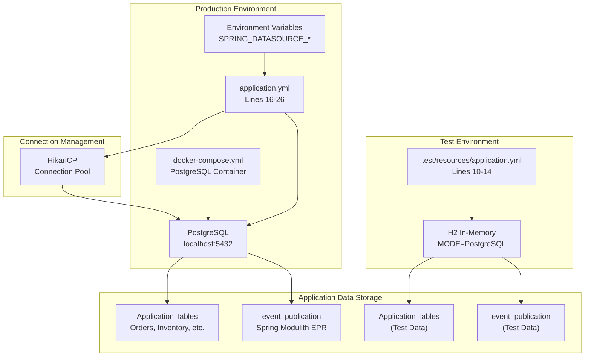
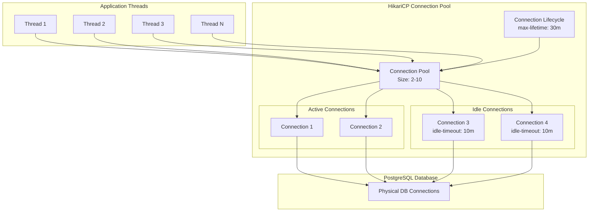
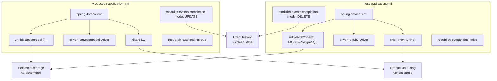
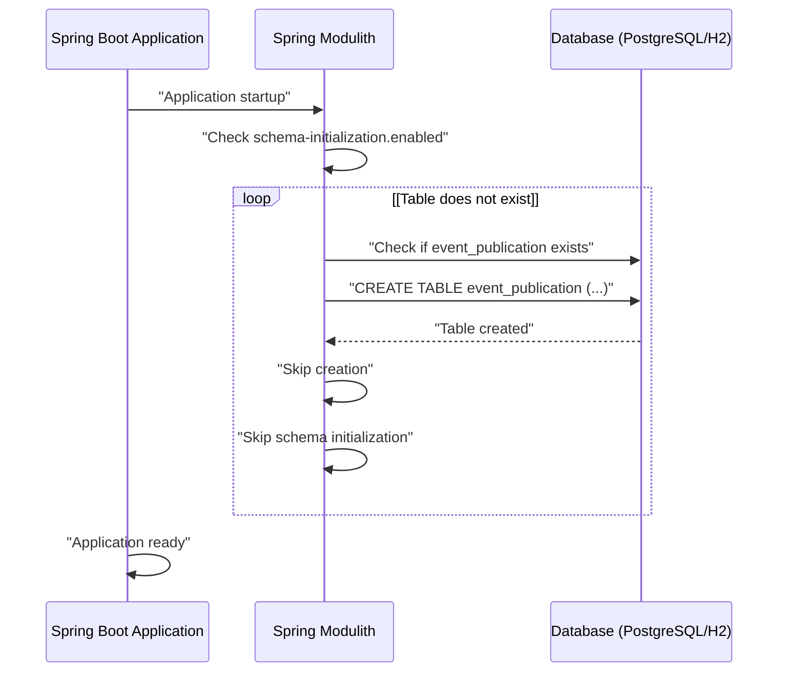
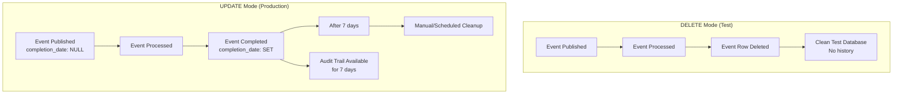
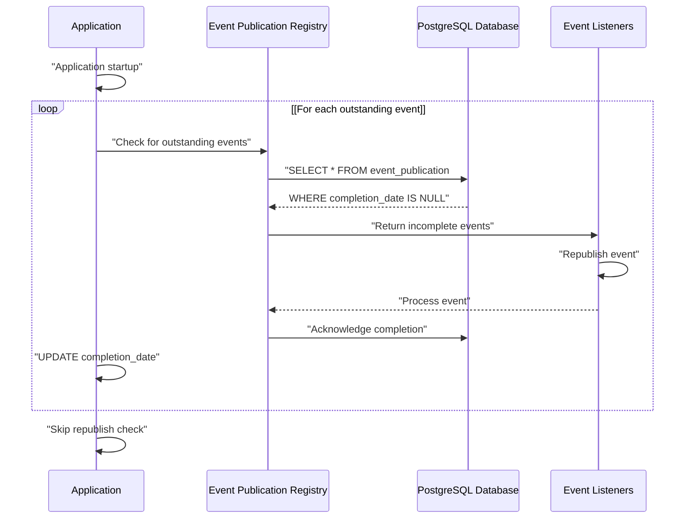
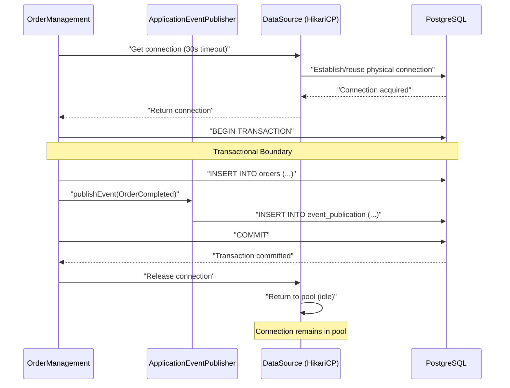

# Database Configuration

> **Relevant source files**
> * [CLAUDE.md](https://github.com/philipz/spring-monolith-amqp-poc/blob/c93f55b5/CLAUDE.md)
> * [docker-compose.yml](https://github.com/philipz/spring-monolith-amqp-poc/blob/c93f55b5/docker-compose.yml)
> * [src/main/resources/application.yml](https://github.com/philipz/spring-monolith-amqp-poc/blob/c93f55b5/src/main/resources/application.yml)
> * [src/test/resources/application.yml](https://github.com/philipz/spring-monolith-amqp-poc/blob/c93f55b5/src/test/resources/application.yml)

## Purpose and Scope

This document details the database configuration for the spring-monolith-amqp-poc application, covering PostgreSQL setup for production, H2 in-memory database for testing, HikariCP connection pooling parameters, and the Event Publication Registry schema used by Spring Modulith.

For information about how events are persisted and processed using the Event Publication Registry, see [Event Publication Registry](/philipz/spring-monolith-amqp-poc/6.1-event-publication-registry). For environment-specific configuration overrides, see [Application Configuration](/philipz/spring-monolith-amqp-poc/4.1-application-configuration).

---

## Database Configuration Overview

The application uses different database configurations depending on the environment:

| Environment | Database | Driver | Primary Use Case |
| --- | --- | --- | --- |
| Production | PostgreSQL 17 | `org.postgresql.Driver` | Application data + Event Publication Registry |
| Test | H2 (in-memory) | `org.h2.Driver` | Fast test execution with PostgreSQL compatibility |

### Configuration Flow Diagram



**Sources:** [src/main/resources/application.yml L16-L26](https://github.com/philipz/spring-monolith-amqp-poc/blob/c93f55b5/src/main/resources/application.yml#L16-L26)

 [src/test/resources/application.yml L10-L14](https://github.com/philipz/spring-monolith-amqp-poc/blob/c93f55b5/src/test/resources/application.yml#L10-L14)

 [docker-compose.yml L2-L20](https://github.com/philipz/spring-monolith-amqp-poc/blob/c93f55b5/docker-compose.yml#L2-L20)

---

## Production Database (PostgreSQL)

### Connection Configuration

The production environment uses PostgreSQL 17 with connection settings defined in `application.yml`. All connection parameters support environment variable overrides for deployment flexibility.

**Configuration Properties:**

```yaml
spring:
  datasource:
    url: ${SPRING_DATASOURCE_URL:jdbc:postgresql://localhost:5432/postgres}
    driver-class-name: org.postgresql.Driver
    username: ${SPRING_DATASOURCE_USERNAME:postgres}
    password: ${SPRING_DATASOURCE_PASSWORD:postgres}
```

| Property | Environment Variable | Default Value | Description |
| --- | --- | --- | --- |
| `spring.datasource.url` | `SPRING_DATASOURCE_URL` | `jdbc:postgresql://localhost:5432/postgres` | JDBC connection URL |
| `spring.datasource.username` | `SPRING_DATASOURCE_USERNAME` | `postgres` | Database username |
| `spring.datasource.password` | `SPRING_DATASOURCE_PASSWORD` | `postgres` | Database password |
| `spring.datasource.driver-class-name` | N/A | `org.postgresql.Driver` | JDBC driver class |

**Sources:** [src/main/resources/application.yml L16-L20](https://github.com/philipz/spring-monolith-amqp-poc/blob/c93f55b5/src/main/resources/application.yml#L16-L20)

 [CLAUDE.md L118-L123](https://github.com/philipz/spring-monolith-amqp-poc/blob/c93f55b5/CLAUDE.md#L118-L123)

### Docker Compose Setup

The provided Docker Compose configuration creates a PostgreSQL 17 container for local development:

```yaml
services:
  postgres:
    image: postgres:17-alpine
    container_name: amqp-modulith-postgres
    environment:
      POSTGRES_DB: postgres
      POSTGRES_USER: postgres
      POSTGRES_PASSWORD: postgres
      POSTGRES_INITDB_ARGS: "--encoding=UTF8"
    ports:
      - "5432:5432"
    volumes:
      - postgres-data:/var/lib/postgresql/data
    healthcheck:
      test: ["CMD-SHELL", "pg_isready -U postgres"]
      interval: 10s
      timeout: 5s
      retries: 5
```

The container includes:

* **UTF-8 encoding** for internationalization support
* **Health checks** using `pg_isready` command (10-second intervals)
* **Persistent storage** via Docker volume `postgres-data`
* **Port mapping** to local port 5432

**Sources:** [docker-compose.yml L2-L20](https://github.com/philipz/spring-monolith-amqp-poc/blob/c93f55b5/docker-compose.yml#L2-L20)

 [CLAUDE.md L126-L133](https://github.com/philipz/spring-monolith-amqp-poc/blob/c93f55b5/CLAUDE.md#L126-L133)

---

## HikariCP Connection Pool Configuration

HikariCP is configured as the connection pool implementation with tuned settings for production workloads.

### Connection Pool Architecture



**Sources:** [src/main/resources/application.yml L21-L26](https://github.com/philipz/spring-monolith-amqp-poc/blob/c93f55b5/src/main/resources/application.yml#L21-L26)

### HikariCP Configuration Parameters

The connection pool is configured with the following tuned parameters:

| Parameter | Value | Environment Variable | Purpose |
| --- | --- | --- | --- |
| `maximum-pool-size` | 10 | `SPRING_DATASOURCE_HIKARI_MAXIMUM_POOL_SIZE` | Maximum number of connections in pool |
| `minimum-idle` | 2 | `SPRING_DATASOURCE_HIKARI_MINIMUM_IDLE` | Minimum number of idle connections maintained |
| `connection-timeout` | 30000 ms (30s) | `SPRING_DATASOURCE_HIKARI_CONNECTION_TIMEOUT` | Maximum wait time for connection acquisition |
| `idle-timeout` | 600000 ms (10m) | `SPRING_DATASOURCE_HIKARI_IDLE_TIMEOUT` | Maximum idle time before connection release |
| `max-lifetime` | 1800000 ms (30m) | `SPRING_DATASOURCE_HIKARI_MAX_LIFETIME` | Maximum lifetime of connection before recycling |

**Configuration in `application.yml`:**

```yaml
hikari:
  maximum-pool-size: ${SPRING_DATASOURCE_HIKARI_MAXIMUM_POOL_SIZE:10}
  minimum-idle: ${SPRING_DATASOURCE_HIKARI_MINIMUM_IDLE:2}
  connection-timeout: ${SPRING_DATASOURCE_HIKARI_CONNECTION_TIMEOUT:30000}
  idle-timeout: ${SPRING_DATASOURCE_HIKARI_IDLE_TIMEOUT:600000}
  max-lifetime: ${SPRING_DATASOURCE_HIKARI_MAX_LIFETIME:1800000}
```

**Sizing Strategy:**

* **Minimum 2 connections** ensures readiness for concurrent requests
* **Maximum 10 connections** balances resource usage with throughput
* **10-minute idle timeout** releases unused connections during low traffic
* **30-minute max lifetime** prevents stale connection issues

**Sources:** [src/main/resources/application.yml L21-L26](https://github.com/philipz/spring-monolith-amqp-poc/blob/c93f55b5/src/main/resources/application.yml#L21-L26)

---

## Test Database (H2)

### H2 Configuration

Tests use an in-memory H2 database configured for PostgreSQL compatibility, enabling fast test execution without external dependencies.

**Configuration Properties:**

```yaml
spring:
  datasource:
    url: jdbc:h2:mem:modulith;MODE=PostgreSQL;DB_CLOSE_DELAY=-1;DATABASE_TO_UPPER=false
    driver-class-name: org.h2.Driver
    username: sa
    password:
```

### H2 Connection URL Parameters

| Parameter | Value | Purpose |
| --- | --- | --- |
| Protocol | `jdbc:h2:mem:modulith` | In-memory database named "modulith" |
| `MODE` | `PostgreSQL` | Enables PostgreSQL SQL dialect compatibility |
| `DB_CLOSE_DELAY` | `-1` | Keep database alive until JVM shutdown |
| `DATABASE_TO_UPPER` | `false` | Preserve case sensitivity matching PostgreSQL |

**PostgreSQL Compatibility Features:**

* SQL syntax compatibility for queries and DDL
* Data type mapping (e.g., `SERIAL`, `TIMESTAMP`, `JSONB` support)
* Function compatibility for common PostgreSQL functions
* Schema behavior matching PostgreSQL conventions

**Sources:** [src/test/resources/application.yml L10-L14](https://github.com/philipz/spring-monolith-amqp-poc/blob/c93f55b5/src/test/resources/application.yml#L10-L14)

 [CLAUDE.md L113-L115](https://github.com/philipz/spring-monolith-amqp-poc/blob/c93f55b5/CLAUDE.md#L113-L115)

### Production vs Test Configuration Differences



**Key Differences:**

| Aspect | Production | Test | Rationale |
| --- | --- | --- | --- |
| Database | PostgreSQL | H2 in-memory | Tests need fast, isolated execution |
| Connection Pool | HikariCP tuned | Default settings | Tests don't need production optimization |
| Event Completion Mode | `UPDATE` | `DELETE` | Production keeps audit trail, tests clean up |
| Republish on Restart | `true` | `false` | H2 state is ephemeral, no need to republish |

**Sources:** [src/main/resources/application.yml L16-L41](https://github.com/philipz/spring-monolith-amqp-poc/blob/c93f55b5/src/main/resources/application.yml#L16-L41)

 [src/test/resources/application.yml L10-L36](https://github.com/philipz/spring-monolith-amqp-poc/blob/c93f55b5/src/test/resources/application.yml#L10-L36)

 [CLAUDE.md L103-L116](https://github.com/philipz/spring-monolith-amqp-poc/blob/c93f55b5/CLAUDE.md#L103-L116)

---

## Event Publication Registry Schema

The Event Publication Registry (EPR) is a Spring Modulith feature that implements the transactional outbox pattern by persisting events in the same database transaction as business data.

### Schema Structure

```python
#mermaid-ocj36ojgl8g{font-family:ui-sans-serif,-apple-system,system-ui,Segoe UI,Helvetica;font-size:16px;fill:#333;}@keyframes edge-animation-frame{from{stroke-dashoffset:0;}}@keyframes dash{to{stroke-dashoffset:0;}}#mermaid-ocj36ojgl8g .edge-animation-slow{stroke-dasharray:9,5!important;stroke-dashoffset:900;animation:dash 50s linear infinite;stroke-linecap:round;}#mermaid-ocj36ojgl8g .edge-animation-fast{stroke-dasharray:9,5!important;stroke-dashoffset:900;animation:dash 20s linear infinite;stroke-linecap:round;}#mermaid-ocj36ojgl8g .error-icon{fill:#dddddd;}#mermaid-ocj36ojgl8g .error-text{fill:#222222;stroke:#222222;}#mermaid-ocj36ojgl8g .edge-thickness-normal{stroke-width:1px;}#mermaid-ocj36ojgl8g .edge-thickness-thick{stroke-width:3.5px;}#mermaid-ocj36ojgl8g .edge-pattern-solid{stroke-dasharray:0;}#mermaid-ocj36ojgl8g .edge-thickness-invisible{stroke-width:0;fill:none;}#mermaid-ocj36ojgl8g .edge-pattern-dashed{stroke-dasharray:3;}#mermaid-ocj36ojgl8g .edge-pattern-dotted{stroke-dasharray:2;}#mermaid-ocj36ojgl8g .marker{fill:#999;stroke:#999;}#mermaid-ocj36ojgl8g .marker.cross{stroke:#999;}#mermaid-ocj36ojgl8g svg{font-family:ui-sans-serif,-apple-system,system-ui,Segoe UI,Helvetica;font-size:16px;}#mermaid-ocj36ojgl8g p{margin:0;}#mermaid-ocj36ojgl8g .entityBox{fill:#ffffff;stroke:#dddddd;}#mermaid-ocj36ojgl8g .relationshipLabelBox{fill:#dddddd;opacity:0.7;background-color:#dddddd;}#mermaid-ocj36ojgl8g .relationshipLabelBox rect{opacity:0.5;}#mermaid-ocj36ojgl8g .labelBkg{background-color:rgba(221, 221, 221, 0.5);}#mermaid-ocj36ojgl8g .edgeLabel .label{fill:#dddddd;font-size:14px;}#mermaid-ocj36ojgl8g .label{font-family:ui-sans-serif,-apple-system,system-ui,Segoe UI,Helvetica;color:#333;}#mermaid-ocj36ojgl8g .edge-pattern-dashed{stroke-dasharray:8,8;}#mermaid-ocj36ojgl8g .node rect,#mermaid-ocj36ojgl8g .node circle,#mermaid-ocj36ojgl8g .node ellipse,#mermaid-ocj36ojgl8g .node polygon{fill:#ffffff;stroke:#dddddd;stroke-width:1px;}#mermaid-ocj36ojgl8g .relationshipLine{stroke:#999;stroke-width:1;fill:none;}#mermaid-ocj36ojgl8g .marker{fill:none!important;stroke:#999!important;stroke-width:1;}#mermaid-ocj36ojgl8g :root{--mermaid-font-family:"trebuchet ms",verdana,arial,sans-serif;}Same Transactionevent_publicationUUIDidPKUnique event identifierTIMESTAMPpublication_dateWhen event was publishedTIMESTAMPcompletion_dateWhen event processing completedVARCHARlistener_idTarget listener identifierVARCHARevent_typeFully qualified event class nameTEXTserialized_eventJSON serialized event payloadapplication_dataBIGINTorder_idPKExample: Order tableVARCHARstatusOrder statusTIMESTAMPcreated_atCreation timestamp
```

**Table: `event_publication`**

| Column | Type | Description |
| --- | --- | --- |
| `id` | UUID (Primary Key) | Unique identifier for each event publication |
| `publication_date` | TIMESTAMP | Timestamp when event was published by application |
| `completion_date` | TIMESTAMP | Timestamp when event processing completed (nullable) |
| `listener_id` | VARCHAR | Identifier of the target listener or "DEFAULT" for broadcasts |
| `event_type` | VARCHAR | Fully qualified class name of the event (e.g., `com.example.OrderCompleted`) |
| `serialized_event` | TEXT | JSON representation of the event payload |

**Sources:** [CLAUDE.md L83-L91](https://github.com/philipz/spring-monolith-amqp-poc/blob/c93f55b5/CLAUDE.md#L83-L91)

### Schema Initialization

Spring Modulith automatically initializes the `event_publication` table schema based on configuration:

**Production Configuration:**

```yaml
spring:
  modulith:
    events:
      jdbc:
        schema-initialization:
          enabled: true
```

**Schema Initialization Process:**



**Configuration Notes:**

* Schema initialization is **enabled by default** in both production and test environments
* The schema is database-agnostic - Spring Modulith adapts DDL for PostgreSQL or H2
* No manual schema migration is required for basic setup
* For production schema migrations, consider using Flyway or Liquibase

**Sources:** [src/main/resources/application.yml L32-L34](https://github.com/philipz/spring-monolith-amqp-poc/blob/c93f55b5/src/main/resources/application.yml#L32-L34)

 [src/test/resources/application.yml L30-L32](https://github.com/philipz/spring-monolith-amqp-poc/blob/c93f55b5/src/test/resources/application.yml#L30-L32)

### Event Completion Modes

Spring Modulith supports two completion modes that control how completed events are handled in the `event_publication` table:

**Configuration:**

```sql
spring:
  modulith:
    events:
      completion-mode: UPDATE  # or DELETE
      time-to-live: 7d         # Only applies to UPDATE mode
```

**Completion Mode Comparison:**



| Mode | Environment | Behavior | Time-to-Live | Use Case |
| --- | --- | --- | --- | --- |
| `UPDATE` | Production | Sets `completion_date`, keeps row | 7 days (configurable) | Audit trail, debugging, monitoring |
| `DELETE` | Test | Deletes row immediately | N/A | Fast tests, clean state |

**Production UPDATE Mode Benefits:**

* **Debugging**: Inspect completed events for troubleshooting
* **Audit Trail**: Maintain history of event processing for compliance
* **Monitoring**: Track event processing patterns and performance
* **Reprocessing**: Identify and potentially reprocess failed events

**Test DELETE Mode Benefits:**

* **Fast Execution**: No overhead from maintaining history
* **Clean State**: Each test starts with empty `event_publication` table
* **Isolation**: No event pollution between test cases

**Time-to-Live (TTL):**
The `time-to-live` property in UPDATE mode specifies how long completed events are retained:

```markdown
time-to-live: 7d  # 7 days = 604800 seconds
```

After the TTL expires, completed events should be cleaned up via a scheduled job (implementation-specific).

**Sources:** [src/main/resources/application.yml L36-L41](https://github.com/philipz/spring-monolith-amqp-poc/blob/c93f55b5/src/main/resources/application.yml#L36-L41)

 [src/test/resources/application.yml L34-L36](https://github.com/philipz/spring-monolith-amqp-poc/blob/c93f55b5/src/test/resources/application.yml#L34-L36)

 [CLAUDE.md L108-L115](https://github.com/philipz/spring-monolith-amqp-poc/blob/c93f55b5/CLAUDE.md#L108-L115)

### Republish Outstanding Events

The `republish-outstanding-events-on-restart` configuration controls whether unpublished events are reprocessed after application restart:

```yaml
spring:
  modulith:
    events:
      republish-outstanding-events-on-restart: true  # Production
      # republish-outstanding-events-on-restart: false  # Test
```

**Behavior:**

| Setting | Environment | Behavior | Rationale |
| --- | --- | --- | --- |
| `true` | Production | Republish events with `completion_date = NULL` on startup | Ensures at-least-once delivery across restarts |
| `false` | Test | Do not republish on startup | H2 state is ephemeral, no events survive restart |

**Republish Process:**



This feature is critical for **reliability in production**, ensuring that events published before an unexpected shutdown (e.g., crash, deployment) are not lost and will be reprocessed on restart.

**Sources:** [src/main/resources/application.yml L36](https://github.com/philipz/spring-monolith-amqp-poc/blob/c93f55b5/src/main/resources/application.yml#L36-L36)

 [src/test/resources/application.yml L34](https://github.com/philipz/spring-monolith-amqp-poc/blob/c93f55b5/src/test/resources/application.yml#L34-L34)

 [CLAUDE.md L109](https://github.com/philipz/spring-monolith-amqp-poc/blob/c93f55b5/CLAUDE.md#L109-L109)

---

## Database Connection Flow

The following diagram illustrates how application components interact with the database through HikariCP:



**Key Points:**

* **Single Transaction**: Business data and event publication share the same transaction
* **Connection Pooling**: HikariCP reuses connections across requests
* **Automatic Lifecycle**: Connections are automatically recycled based on timeouts
* **Failure Safety**: If commit fails, neither business data nor events are persisted

**Sources:** [src/main/resources/application.yml L21-L26](https://github.com/philipz/spring-monolith-amqp-poc/blob/c93f55b5/src/main/resources/application.yml#L21-L26)

 [CLAUDE.md L89-L91](https://github.com/philipz/spring-monolith-amqp-poc/blob/c93f55b5/CLAUDE.md#L89-L91)

---

## Configuration Summary

### Production Environment

```sql
# PostgreSQL with HikariCP
spring:
  datasource:
    url: jdbc:postgresql://localhost:5432/postgres
    driver-class-name: org.postgresql.Driver
    username: postgres
    password: postgres
    hikari:
      maximum-pool-size: 10
      minimum-idle: 2
      connection-timeout: 30000
      idle-timeout: 600000
      max-lifetime: 1800000
  
  modulith:
    events:
      jdbc:
        schema-initialization:
          enabled: true
      republish-outstanding-events-on-restart: true
      completion-mode: UPDATE
      time-to-live: 7d
```

**Sources:** [src/main/resources/application.yml L16-L41](https://github.com/philipz/spring-monolith-amqp-poc/blob/c93f55b5/src/main/resources/application.yml#L16-L41)

### Test Environment

```sql
# H2 in-memory with PostgreSQL compatibility
spring:
  datasource:
    url: jdbc:h2:mem:modulith;MODE=PostgreSQL;DB_CLOSE_DELAY=-1;DATABASE_TO_UPPER=false
    driver-class-name: org.h2.Driver
    username: sa
    password:
  
  modulith:
    events:
      jdbc:
        schema-initialization:
          enabled: true
      republish-outstanding-events-on-restart: false
      completion-mode: DELETE
```

**Sources:** [src/test/resources/application.yml L10-L36](https://github.com/philipz/spring-monolith-amqp-poc/blob/c93f55b5/src/test/resources/application.yml#L10-L36)