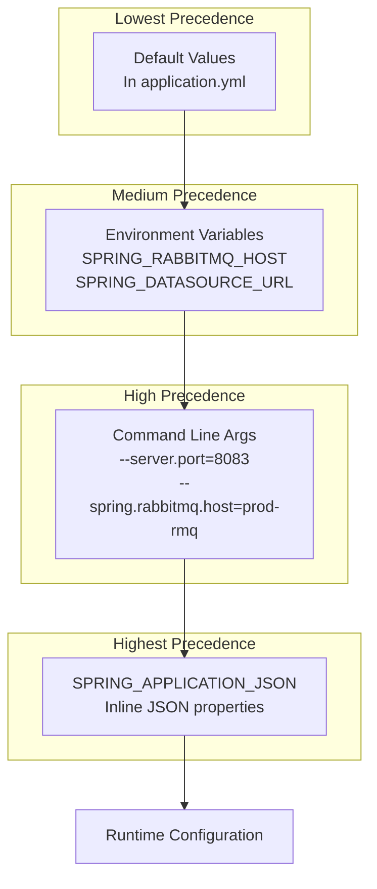
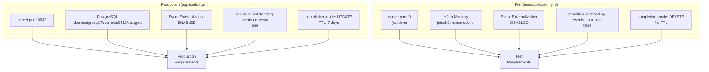
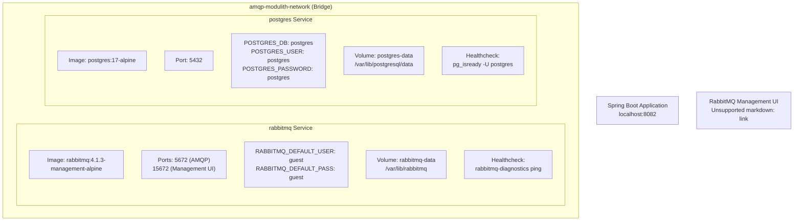

# Deployment Configuration

> **Relevant source files**
> * [docker-compose.yml](https://github.com/philipz/spring-monolith-amqp-poc/blob/c93f55b5/docker-compose.yml)
> * [src/main/resources/application.yml](https://github.com/philipz/spring-monolith-amqp-poc/blob/c93f55b5/src/main/resources/application.yml)
> * [src/test/resources/application.yml](https://github.com/philipz/spring-monolith-amqp-poc/blob/c93f55b5/src/test/resources/application.yml)

## Purpose and Scope

This document explains how to configure the application for different deployment environments, with emphasis on the differences between production and test configurations, environment variable override mechanisms, and configuration best practices.

For information about database-specific configuration including connection pooling and schema initialization, see [Database Configuration](/philipz/spring-monolith-amqp-poc/4.2-database-configuration). For RabbitMQ topology setup including exchanges and queues, see [RabbitMQ Configuration](/philipz/spring-monolith-amqp-poc/4.3-rabbitmq-configuration). For general application configuration parameters, see [Application Configuration](/philipz/spring-monolith-amqp-poc/4.1-application-configuration).

**Sources:** [src/main/resources/application.yml L1-L67](https://github.com/philipz/spring-monolith-amqp-poc/blob/c93f55b5/src/main/resources/application.yml#L1-L67)

 [src/test/resources/application.yml L1-L58](https://github.com/philipz/spring-monolith-amqp-poc/blob/c93f55b5/src/test/resources/application.yml#L1-L58)

---

## Configuration Files Overview

The application uses two primary configuration files:

| File | Purpose | Database | Event Externalization | Use Case |
| --- | --- | --- | --- | --- |
| `src/main/resources/application.yml` | Production configuration | PostgreSQL | Enabled | Runtime deployment, Docker containers |
| `src/test/resources/application.yml` | Test configuration | H2 in-memory | Disabled | Unit tests, integration tests |

Both files follow the Spring Boot YAML configuration format and support environment variable substitution using the `${VARIABLE_NAME:default}` syntax.

**Sources:** [src/main/resources/application.yml L1-L67](https://github.com/philipz/spring-monolith-amqp-poc/blob/c93f55b5/src/main/resources/application.yml#L1-L67)

 [src/test/resources/application.yml L1-L58](https://github.com/philipz/spring-monolith-amqp-poc/blob/c93f55b5/src/test/resources/application.yml#L1-L58)

---

## Configuration Override Hierarchy

The following diagram illustrates how configuration values are resolved, from lowest to highest precedence:

### Diagram: Configuration Resolution Chain



**Example Resolution:**

* `server.port` defined as `8082` in [application.yml L2](https://github.com/philipz/spring-monolith-amqp-poc/blob/c93f55b5/application.yml#L2-L2)
* Environment variable `SERVER_PORT=9000` overrides to `9000`
* Command line `--server.port=8083` overrides to `8083`

**Sources:** [src/main/resources/application.yml L1-L67](https://github.com/philipz/spring-monolith-amqp-poc/blob/c93f55b5/src/main/resources/application.yml#L1-L67)

---

## Production vs Test Configuration Comparison

### Diagram: Configuration Differences by Environment



**Sources:** [src/main/resources/application.yml L2-L41](https://github.com/philipz/spring-monolith-amqp-poc/blob/c93f55b5/src/main/resources/application.yml#L2-L41)

 [src/test/resources/application.yml L3-L36](https://github.com/philipz/spring-monolith-amqp-poc/blob/c93f55b5/src/test/resources/application.yml#L3-L36)

### Detailed Comparison Table

| Configuration Property | Production Value | Test Value | Rationale |
| --- | --- | --- | --- |
| `server.port` | `8082` | `0` (random) | Tests use random ports to avoid conflicts when running multiple test suites |
| `spring.datasource.url` | `jdbc:postgresql://localhost:5432/postgres` | `jdbc:h2:mem:modulith` | H2 in-memory database is faster and doesn't require external setup |
| `spring.datasource.driver-class-name` | `org.postgresql.Driver` | `org.h2.Driver` | Driver matches database type |
| `spring.modulith.events.externalization.enabled` | `true` | `false` | Tests typically don't need external message broker integration |
| `spring.modulith.events.republish-outstanding-events-on-restart` | `true` | `false` | Production requires reliability guarantees; tests use ephemeral state |
| `spring.modulith.events.completion-mode` | `UPDATE` | `DELETE` | Production keeps event history for audit; tests clean up automatically |
| `spring.modulith.events.time-to-live` | `7d` (604800s) | Not set | Production retains completed events for debugging; tests don't need retention |

**Sources:** [src/main/resources/application.yml L1-L67](https://github.com/philipz/spring-monolith-amqp-poc/blob/c93f55b5/src/main/resources/application.yml#L1-L67)

 [src/test/resources/application.yml L1-L58](https://github.com/philipz/spring-monolith-amqp-poc/blob/c93f55b5/src/test/resources/application.yml#L1-L58)

---

## Environment Variable Mapping

The application uses Spring Boot's relaxed binding to map environment variables to configuration properties. The following table documents all supported environment variables:

### Server Configuration

| Environment Variable | Property | Default | Description |
| --- | --- | --- | --- |
| `SERVER_PORT` | `server.port` | `8082` | HTTP server port |

**Sources:** [src/main/resources/application.yml L1-L2](https://github.com/philipz/spring-monolith-amqp-poc/blob/c93f55b5/src/main/resources/application.yml#L1-L2)

### Database Configuration

| Environment Variable | Property | Default | Description |
| --- | --- | --- | --- |
| `SPRING_DATASOURCE_URL` | `spring.datasource.url` | `jdbc:postgresql://localhost:5432/postgres` | JDBC connection URL |
| `SPRING_DATASOURCE_USERNAME` | `spring.datasource.username` | `postgres` | Database username |
| `SPRING_DATASOURCE_PASSWORD` | `spring.datasource.password` | `postgres` | Database password |
| `SPRING_DATASOURCE_HIKARI_MAXIMUM_POOL_SIZE` | `spring.datasource.hikari.maximum-pool-size` | `10` | Maximum connection pool size |
| `SPRING_DATASOURCE_HIKARI_MINIMUM_IDLE` | `spring.datasource.hikari.minimum-idle` | `2` | Minimum idle connections |
| `SPRING_DATASOURCE_HIKARI_CONNECTION_TIMEOUT` | `spring.datasource.hikari.connection-timeout` | `30000` | Connection timeout (ms) |
| `SPRING_DATASOURCE_HIKARI_IDLE_TIMEOUT` | `spring.datasource.hikari.idle-timeout` | `600000` | Idle timeout (10 minutes) |
| `SPRING_DATASOURCE_HIKARI_MAX_LIFETIME` | `spring.datasource.hikari.max-lifetime` | `1800000` | Max connection lifetime (30 minutes) |

**Sources:** [src/main/resources/application.yml L16-L26](https://github.com/philipz/spring-monolith-amqp-poc/blob/c93f55b5/src/main/resources/application.yml#L16-L26)

### RabbitMQ Configuration

| Environment Variable | Property | Default | Description |
| --- | --- | --- | --- |
| `SPRING_RABBITMQ_HOST` | `spring.rabbitmq.host` | `localhost` | RabbitMQ broker hostname |
| `SPRING_RABBITMQ_PORT` | `spring.rabbitmq.port` | `5672` | AMQP port |
| `SPRING_RABBITMQ_USERNAME` | `spring.rabbitmq.username` | `guest` | Authentication username |
| `SPRING_RABBITMQ_PASSWORD` | `spring.rabbitmq.password` | `guest` | Authentication password |

**Sources:** [src/main/resources/application.yml L7-L14](https://github.com/philipz/spring-monolith-amqp-poc/blob/c93f55b5/src/main/resources/application.yml#L7-L14)

### Spring Modulith Event Configuration

| Environment Variable | Property | Default | Description |
| --- | --- | --- | --- |
| `SPRING_MODULITH_EVENTS_EXTERNALIZATION_ENABLED` | `spring.modulith.events.externalization.enabled` | `true` | Enable/disable event externalization to RabbitMQ |
| `SPRING_MODULITH_EVENTS_TIME_TO_LIVE` | `spring.modulith.events.time-to-live` | `7d` | Retention period for completed events |

**Sources:** [src/main/resources/application.yml L28-L41](https://github.com/philipz/spring-monolith-amqp-poc/blob/c93f55b5/src/main/resources/application.yml#L28-L41)

### Application-Specific Configuration

| Environment Variable | Property | Default | Description |
| --- | --- | --- | --- |
| `APP_AMQP_NEW_ORDERS_BIND` | `app.amqp.new-orders.bind` | `true` | Whether to bind `new-orders` queue to `BookStoreExchange` |
| `APP_AMQP_NEW_ORDERS_RETRY_MAX_ATTEMPTS` | `app.amqp.new-orders.retry-max-attempts` | `3` | Maximum retry attempts before DLQ |

**Note:** These can also be overridden via `SPRING_APPLICATION_JSON` for complex deployments:

```
SPRING_APPLICATION_JSON='{"app":{"amqp":{"new-orders":{"retry-max-attempts":5}}}}'
```

**Sources:** [src/main/resources/application.yml L58-L66](https://github.com/philipz/spring-monolith-amqp-poc/blob/c93f55b5/src/main/resources/application.yml#L58-L66)

---

## Docker Compose Configuration

The [docker-compose.yml L1-L50](https://github.com/philipz/spring-monolith-amqp-poc/blob/c93f55b5/docker-compose.yml#L1-L50)

 file defines the infrastructure services required for local development and testing:

### Diagram: Docker Infrastructure Components



**Sources:** [docker-compose.yml L1-L50](https://github.com/philipz/spring-monolith-amqp-poc/blob/c93f55b5/docker-compose.yml#L1-L50)

### Service Configuration Details

**PostgreSQL Service:**

* Container name: `amqp-modulith-postgres`
* Character encoding: UTF-8
* Health check: 10-second intervals, 5 retries
* Persistent volume: `postgres-data` (local driver)

**RabbitMQ Service:**

* Container name: `amqp-modulith-rabbitmq`
* Includes management plugin
* Health check: 10-second intervals, 5 retries
* Persistent volume: `rabbitmq-data` (local driver)

**Network:**

* Name: `amqp-modulith-network`
* Driver: bridge (default Docker networking)

**Sources:** [docker-compose.yml L1-L50](https://github.com/philipz/spring-monolith-amqp-poc/blob/c93f55b5/docker-compose.yml#L1-L50)

---

## Configuration Best Practices

### 1. Environment-Specific Overrides

Use environment variables for values that change between environments:

```javascript
# Development
export SPRING_RABBITMQ_HOST=localhost
export SPRING_DATASOURCE_URL=jdbc:postgresql://localhost:5432/postgres

# Staging
export SPRING_RABBITMQ_HOST=staging-rmq.example.com
export SPRING_DATASOURCE_URL=jdbc:postgresql://staging-db.example.com:5432/demo

# Production
export SPRING_RABBITMQ_HOST=prod-rmq.example.com
export SPRING_DATASOURCE_URL=jdbc:postgresql://prod-db.example.com:5432/demo
export SPRING_MODULITH_EVENTS_EXTERNALIZATION_ENABLED=true
```

**Sources:** [src/main/resources/application.yml L7-L20](https://github.com/philipz/spring-monolith-amqp-poc/blob/c93f55b5/src/main/resources/application.yml#L7-L20)

### 2. Secret Management

Never commit sensitive values to version control. Use environment variables or secret management systems:

```css
# Bad: Hardcoded in application.yml
spring.datasource.password: my-secret-password

# Good: Environment variable
spring.datasource.password: ${SPRING_DATASOURCE_PASSWORD}
```

**Sources:** [src/main/resources/application.yml L19-L20](https://github.com/philipz/spring-monolith-amqp-poc/blob/c93f55b5/src/main/resources/application.yml#L19-L20)

### 3. Connection Pool Tuning

The default HikariCP settings are optimized for moderate load. Adjust based on your deployment:

| Deployment Type | Max Pool Size | Min Idle | Rationale |
| --- | --- | --- | --- |
| Development | 5 | 1 | Minimal resource usage |
| Testing (CI/CD) | 10 | 2 | Default values, stable tests |
| Production (Low Load) | 10 | 5 | Quick response, low overhead |
| Production (High Load) | 50 | 20 | Handle traffic spikes |

**Formula:** `max-pool-size ≈ (core_count × 2) + effective_spindle_count`

**Sources:** [src/main/resources/application.yml L21-L26](https://github.com/philipz/spring-monolith-amqp-poc/blob/c93f55b5/src/main/resources/application.yml#L21-L26)

### 4. Event System Configuration

| Environment | Externalization | Republish on Restart | Completion Mode | TTL |
| --- | --- | --- | --- | --- |
| Production | Enabled | `true` | `UPDATE` | 7 days |
| Staging | Enabled | `true` | `UPDATE` | 3 days |
| Development | Enabled | `false` | `DELETE` | N/A |
| Testing | Disabled | `false` | `DELETE` | N/A |

**Rationale:**

* **UPDATE mode:** Preserves event history for debugging and audit trails
* **Republish on restart:** Ensures at-least-once delivery guarantees
* **TTL:** Balances storage costs with debugging needs

**Sources:** [src/main/resources/application.yml L28-L41](https://github.com/philipz/spring-monolith-amqp-poc/blob/c93f55b5/src/main/resources/application.yml#L28-L41)

 [src/test/resources/application.yml L26-L36](https://github.com/philipz/spring-monolith-amqp-poc/blob/c93f55b5/src/test/resources/application.yml#L26-L36)

### 5. AMQP Binding Configuration

Control the `app.amqp.new-orders.bind` property carefully to avoid feedback loops:

| Scenario | Bind Value | Reason |
| --- | --- | --- |
| Application consumes external messages | `true` | Queue receives from `BookStoreExchange` |
| Application only externalizes events | `false` | Prevents consuming own `OrderCreatedEvent` |
| Full integration (consume + publish) | `true` | Requires external system to publish to different routing key |

**Sources:** [src/main/resources/application.yml L58-L63](https://github.com/philipz/spring-monolith-amqp-poc/blob/c93f55b5/src/main/resources/application.yml#L58-L63)

---

## Complete Configuration Structure

### Diagram: Full Configuration Hierarchy

```mermaid
flowchart TD

AMQP_BIND["app.amqp.new-orders.bind: true"]
AMQP_RETRY["app.amqp.new-orders.retry-max-attempts: 3"]
HEALTH["health endpoint<br>show-details: always"]
EXPOSE["exposure.include<br>health,info"]
LOG_MODULITH["org.springframework.modulith: INFO"]
LOG_AMQP["org.springframework.amqp: INFO"]
EXT_ENABLED["externalization.enabled: true"]
SCHEMA_INIT["jdbc.schema-initialization.enabled: true"]
REPUBLISH["republish-outstanding-events-on-restart: true"]
COMPLETION["completion-mode: UPDATE"]
TTL["time-to-live: 7d"]
RMQ_HOST["rabbitmq.host: localhost"]
RMQ_PORT["rabbitmq.port: 5672"]
RMQ_USER["rabbitmq.username: guest"]
RMQ_PASS["rabbitmq.password: guest"]
RMQ_CACHE["cache.channel.size: 50"]
HIKARI_MAX["maximum-pool-size: 10"]
HIKARI_MIN["minimum-idle: 2"]
HIKARI_TIMEOUT["connection-timeout: 30000"]
HIKARI_IDLE["idle-timeout: 600000"]
HIKARI_LIFETIME["max-lifetime: 1800000"]
SERVER_PORT["server.port: 8082"]
APP_NAME["spring.application.name: demo"]
ROOT["application.yml"]
DS_URL["datasource.url<br>jdbc:postgresql://localhost:5432/postgres"]
DS_DRIVER["datasource.driver-class-name<br>org.postgresql.Driver"]
DS_USER["datasource.username: postgres"]
DS_PASS["datasource.password: postgres"]

subgraph Database ["Database Configuration"]
    DS_URL
    DS_DRIVER
    DS_USER
    DS_PASS

subgraph HikariCP ["HikariCP Settings"]
    HIKARI_MAX
    HIKARI_MIN
    HIKARI_TIMEOUT
    HIKARI_IDLE
    HIKARI_LIFETIME
end
end

subgraph AppCustom ["Application-Specific"]
    AMQP_BIND
    AMQP_RETRY
end

subgraph Management ["Management Endpoints"]
    HEALTH
    EXPOSE
end

subgraph Logging ["Logging Configuration"]
    LOG_MODULITH
    LOG_AMQP
end

subgraph Modulith ["Spring Modulith Events"]
    EXT_ENABLED
    SCHEMA_INIT
    REPUBLISH
    COMPLETION
    TTL
end

subgraph RabbitMQ ["RabbitMQ Configuration"]
    RMQ_HOST
    RMQ_PORT
    RMQ_USER
    RMQ_PASS
    RMQ_CACHE
end

subgraph Server ["Server Configuration"]
    SERVER_PORT
    APP_NAME
end
```



**Sources:** [src/main/resources/application.yml L1-L67](https://github.com/philipz/spring-monolith-amqp-poc/blob/c93f55b5/src/main/resources/application.yml#L1-L67)

---

## Deployment Scenarios

### Scenario 1: Local Development with Docker Compose

```markdown
# Start infrastructure
docker-compose up -d

# Run application with default configuration
./mvnw spring-boot:run
```

The application connects to `localhost:5432` (PostgreSQL) and `localhost:5672` (RabbitMQ) using defaults from [application.yml L8-L20](https://github.com/philipz/spring-monolith-amqp-poc/blob/c93f55b5/application.yml#L8-L20)

**Sources:** [docker-compose.yml L1-L50](https://github.com/philipz/spring-monolith-amqp-poc/blob/c93f55b5/docker-compose.yml#L1-L50)

 [src/main/resources/application.yml L1-L67](https://github.com/philipz/spring-monolith-amqp-poc/blob/c93f55b5/src/main/resources/application.yml#L1-L67)

### Scenario 2: Cloud Deployment with Managed Services

```javascript
# Set environment variables for cloud resources
export SPRING_DATASOURCE_URL=jdbc:postgresql://prod-db.region.rds.amazonaws.com:5432/demo
export SPRING_DATASOURCE_USERNAME=dbuser
export SPRING_DATASOURCE_PASSWORD=<secret>
export SPRING_RABBITMQ_HOST=prod-mq.region.mq.amazonaws.com
export SPRING_RABBITMQ_USERNAME=mquser
export SPRING_RABBITMQ_PASSWORD=<secret>
export SPRING_DATASOURCE_HIKARI_MAXIMUM_POOL_SIZE=50

# Run application
java -jar demo-0.0.1-SNAPSHOT.jar
```

**Sources:** [src/main/resources/application.yml L7-L26](https://github.com/philipz/spring-monolith-amqp-poc/blob/c93f55b5/src/main/resources/application.yml#L7-L26)

### Scenario 3: Kubernetes Deployment with ConfigMap

```yaml
# ConfigMap for non-sensitive configuration
apiVersion: v1
kind: ConfigMap
metadata:
  name: demo-config
data:
  SERVER_PORT: "8082"
  SPRING_RABBITMQ_HOST: "rabbitmq-service"
  SPRING_DATASOURCE_URL: "jdbc:postgresql://postgres-service:5432/demo"
  SPRING_MODULITH_EVENTS_EXTERNALIZATION_ENABLED: "true"
  APP_AMQP_NEW_ORDERS_BIND: "true"

---
# Secret for sensitive values
apiVersion: v1
kind: Secret
metadata:
  name: demo-secrets
type: Opaque
data:
  SPRING_DATASOURCE_USERNAME: <base64-encoded>
  SPRING_DATASOURCE_PASSWORD: <base64-encoded>
  SPRING_RABBITMQ_USERNAME: <base64-encoded>
  SPRING_RABBITMQ_PASSWORD: <base64-encoded>
```

**Sources:** [src/main/resources/application.yml L1-L67](https://github.com/philipz/spring-monolith-amqp-poc/blob/c93f55b5/src/main/resources/application.yml#L1-L67)

---

## Configuration Validation

The application validates critical configuration at startup:

| Configuration | Validation | Failure Behavior |
| --- | --- | --- |
| `spring.datasource.url` | Connection test | Application fails to start |
| `spring.rabbitmq.host` | Connection test | Application fails to start (if externalization enabled) |
| `spring.modulith.events.jdbc.schema-initialization.enabled` | Table existence check | Schema auto-created if missing |
| `app.amqp.new-orders.bind` | Boolean validation | Defaults to `true` if invalid |

Spring Boot performs these checks during the `ApplicationContext` initialization phase. Connection failures result in clear error messages indicating which service is unavailable.

**Sources:** [src/main/resources/application.yml L16-L34](https://github.com/philipz/spring-monolith-amqp-poc/blob/c93f55b5/src/main/resources/application.yml#L16-L34)

---

## Summary

The deployment configuration system provides:

* **Environment flexibility:** Override any setting via environment variables
* **Test isolation:** Separate configuration with H2 and disabled externalization
* **Production reliability:** PostgreSQL with event replay and audit trails
* **Docker integration:** Pre-configured infrastructure services
* **Security best practices:** No hardcoded secrets, environment-based credentials

Key configuration files:

* [src/main/resources/application.yml L1-L67](https://github.com/philipz/spring-monolith-amqp-poc/blob/c93f55b5/src/main/resources/application.yml#L1-L67) : Production defaults
* [src/test/resources/application.yml L1-L58](https://github.com/philipz/spring-monolith-amqp-poc/blob/c93f55b5/src/test/resources/application.yml#L1-L58) : Test overrides
* [docker-compose.yml L1-L50](https://github.com/philipz/spring-monolith-amqp-poc/blob/c93f55b5/docker-compose.yml#L1-L50) : Local infrastructure

For runtime configuration details, see [Application Configuration](/philipz/spring-monolith-amqp-poc/4.1-application-configuration). For database-specific settings, see [Database Configuration](/philipz/spring-monolith-amqp-poc/4.2-database-configuration). For RabbitMQ topology, see [RabbitMQ Configuration](/philipz/spring-monolith-amqp-poc/4.3-rabbitmq-configuration).

**Sources:** [src/main/resources/application.yml L1-L67](https://github.com/philipz/spring-monolith-amqp-poc/blob/c93f55b5/src/main/resources/application.yml#L1-L67)

 [src/test/resources/application.yml L1-L58](https://github.com/philipz/spring-monolith-amqp-poc/blob/c93f55b5/src/test/resources/application.yml#L1-L58)

 [docker-compose.yml L1-L50](https://github.com/philipz/spring-monolith-amqp-poc/blob/c93f55b5/docker-compose.yml#L1-L50)