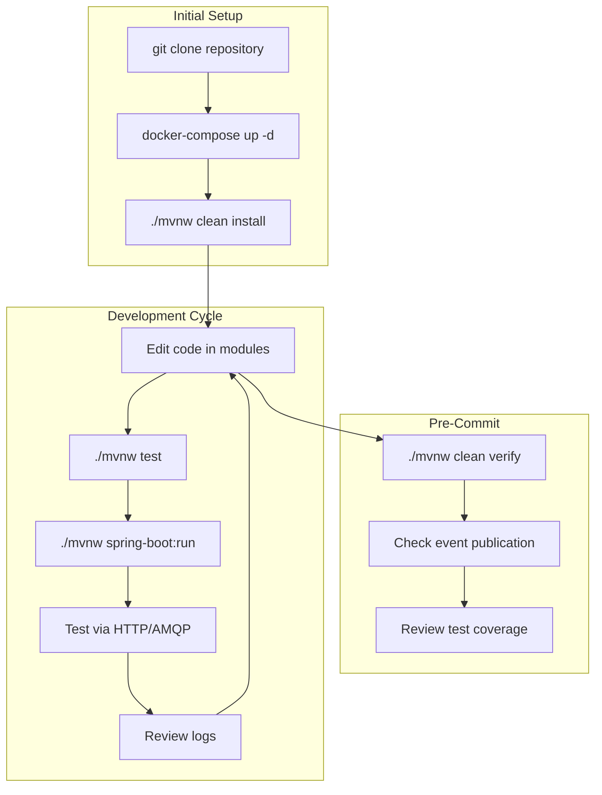
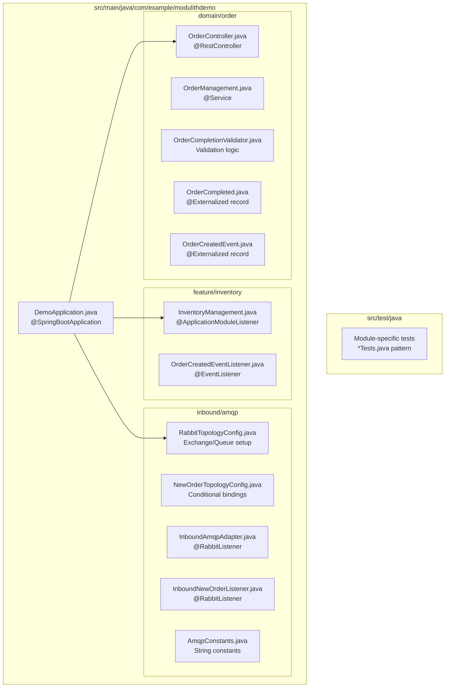
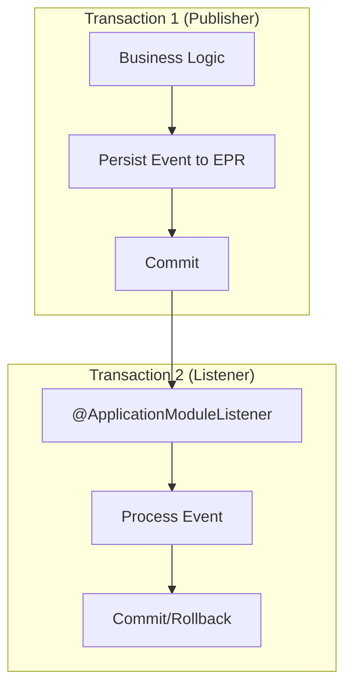

# Development Guide

> **Relevant source files**
> * [README.md](https://github.com/philipz/spring-monolith-amqp-poc/blob/c93f55b5/README.md)
> * [pom.xml](https://github.com/philipz/spring-monolith-amqp-poc/blob/c93f55b5/pom.xml)
> * [src/main/java/com/example/modulithdemo/inventory/app/InventoryManagement.java](https://github.com/philipz/spring-monolith-amqp-poc/blob/c93f55b5/src/main/java/com/example/modulithdemo/inventory/app/InventoryManagement.java)
> * [src/main/java/com/example/modulithdemo/inventory/app/OrderCreatedEventListener.java](https://github.com/philipz/spring-monolith-amqp-poc/blob/c93f55b5/src/main/java/com/example/modulithdemo/inventory/app/OrderCreatedEventListener.java)

## Purpose and Scope

This page provides practical guidance for developers working on the spring-monolith-amqp-poc codebase. It covers common development workflows, local environment setup, and best practices for working with the Spring Modulith architecture. For detailed configuration options, see [Configuration](/philipz/spring-monolith-amqp-poc/4-configuration). For in-depth testing strategies, see [Testing Strategy](/philipz/spring-monolith-amqp-poc/8.2-testing-strategy). For production deployment considerations, see [Operational Considerations](/philipz/spring-monolith-amqp-poc/9-operational-considerations).

---

## Prerequisites

Before beginning development, ensure the following tools are installed:

| Tool | Version | Purpose |
| --- | --- | --- |
| Java | 21 | Runtime and compilation |
| Maven | 3.8+ | Build tool (wrapper included) |
| Docker | 20.10+ | Local infrastructure (PostgreSQL, RabbitMQ) |
| Docker Compose | 1.29+ | Multi-container orchestration |
| Git | 2.30+ | Version control |

**Optional but recommended:**

* IDE with Spring Boot support (IntelliJ IDEA, Eclipse STS, VS Code)
* RabbitMQ management plugin browser access
* PostgreSQL client for database inspection

**Sources:** [README.md L14-L16](https://github.com/philipz/spring-monolith-amqp-poc/blob/c93f55b5/README.md#L14-L16)

 [pom.xml L30](https://github.com/philipz/spring-monolith-amqp-poc/blob/c93f55b5/pom.xml#L30-L30)

---

## Quick Start Development Workflow

### Development Workflow Overview



**Sources:** [README.md L12-L29](https://github.com/philipz/spring-monolith-amqp-poc/blob/c93f55b5/README.md#L12-L29)

 [README.md L156-L161](https://github.com/philipz/spring-monolith-amqp-poc/blob/c93f55b5/README.md#L156-L161)

### Build Commands

| Command | Purpose | When to Use |
| --- | --- | --- |
| `./mvnw clean install` | Full build with tests | Initial setup, after pulling changes |
| `./mvnw compile` | Compile without tests | Quick syntax check |
| `./mvnw test` | Run unit tests only | Frequent during development |
| `./mvnw verify` | Full build with integration tests | Before commits |
| `./mvnw clean package` | Create executable JAR | Preparing deployable artifact |
| `./mvnw spring-boot:run` | Run application from source | Local development |

**Build output:**

* Compiled classes: `target/classes/`
* Test classes: `target/test-classes/`
* Executable JAR: `target/amqp-modulith-0.0.1-SNAPSHOT.jar`
* Docker image tag: `philipz/amqp-modulith:0.0.1-SNAPSHOT`

**Sources:** [README.md L17-L24](https://github.com/philipz/spring-monolith-amqp-poc/blob/c93f55b5/README.md#L17-L24)

 [README.md L156-L160](https://github.com/philipz/spring-monolith-amqp-poc/blob/c93f55b5/README.md#L156-L160)

 [pom.xml L32](https://github.com/philipz/spring-monolith-amqp-poc/blob/c93f55b5/pom.xml#L32-L32)

### Running the Application

**Option 1: Maven Spring Boot Plugin (Development)**

```
./mvnw spring-boot:run
```

* Application starts on `http://localhost:8082` (production profile) or `http://localhost:8081` (default)
* Hot reload not enabled by default
* Connects to Docker PostgreSQL and RabbitMQ

**Option 2: Executable JAR**

```
java -jar target/amqp-modulith-0.0.1-SNAPSHOT.jar
```

* Use for testing production-like deployment
* Environment variables override configuration

**Option 3: Without RabbitMQ**

```
./mvnw spring-boot:run \
  -Dspring-boot.run.arguments="--spring.modulith.events.externalization.enabled=false --spring.rabbitmq.listener.simple.auto-startup=false"
```

* Disables AMQP integration
* Internal events still work
* Useful for testing core business logic

**Sources:** [README.md L20-L29](https://github.com/philipz/spring-monolith-amqp-poc/blob/c93f55b5/README.md#L20-L29)

 [README.md L26-L29](https://github.com/philipz/spring-monolith-amqp-poc/blob/c93f55b5/README.md#L26-L29)

---

## Module Structure and Code Organization

### Application Module Layout



**Module Package Naming Convention:**

* `domain/*` - Core business logic, owns domain models and events
* `feature/*` - Optional features that react to domain events
* `inbound/*` - External integration adapters (AMQP, REST, etc.)
* `outbound/*` - External system clients (not used in this POC)

**Sources:** [README.md L32-L44](https://github.com/philipz/spring-monolith-amqp-poc/blob/c93f55b5/README.md#L32-L44)

### Adding a New Module

**Step 1: Create Package Structure**

```markdown
src/main/java/com/example/modulithdemo/
└── feature/
    └── notification/
        ├── package-info.java          # Optional: Module documentation
        ├── app/
        │   └── NotificationService.java
        └── domain/
            └── NotificationSent.java   # Optional: Module-specific event
```

**Step 2: Implement Event Listener**

Create a listener in your new module that reacts to existing domain events:

```python
@Component
public class NotificationService {
    
    @ApplicationModuleListener  // Async, new transaction
    void onOrderCompleted(OrderCompleted event) {
        // Send notification logic
    }
}
```

**Step 3: Verify Module Boundaries**

Spring Modulith enforces module boundaries at compile time. Violations result in build failures. Modules can only:

* Publish events via `ApplicationEventPublisher`
* Listen to events from other modules via `@ApplicationModuleListener` or `@EventListener`
* Access explicitly exported APIs (via `@org.springframework.modulith.ApplicationModule`)

**Sources:** [README.md L32-L44](https://github.com/philipz/spring-monolith-amqp-poc/blob/c93f55b5/README.md#L32-L44)

 [src/main/java/com/example/modulithdemo/inventory/app/InventoryManagement.java L1-L18](https://github.com/philipz/spring-monolith-amqp-poc/blob/c93f55b5/src/main/java/com/example/modulithdemo/inventory/app/InventoryManagement.java#L1-L18)

---

## Working with Events

### Event Development Pattern

```mermaid
sequenceDiagram
  participant Developer
  participant domain/order
  participant OrderManagement
  participant OrderCompleted
  participant @Externalized record
  participant feature/inventory
  participant InventoryManagement
  participant Event Publication
  participant Registry (DB)
  participant RabbitMQ

  Developer->>OrderCompleted: "1. Define event record"
  Developer->>domain/order: "2. Publish via ApplicationEventPublisher"
  Developer->>feature/inventory: "3. Create @ApplicationModuleListener"
  note over domain/order,InventoryManagement: Runtime Execution
  domain/order->>Event Publication: "publishEvent() → persist"
  Event Publication->>feature/inventory: "Async dispatch (REQUIRES_NEW)"
  Event Publication->>RabbitMQ: "Externalize if @Externalized"
  Developer->>Developer: "4. Run ./mvnw test"
  Developer->>Developer: "5. Verify logs and DB"
```

**Sources:** [src/main/java/com/example/modulithdemo/inventory/app/InventoryManagement.java L1-L18](https://github.com/philipz/spring-monolith-amqp-poc/blob/c93f55b5/src/main/java/com/example/modulithdemo/inventory/app/InventoryManagement.java#L1-L18)

### Creating Domain Events

**Pattern 1: @Externalized Event (Published to RabbitMQ)**

```
@Externalized("domain.events::order.completed")
public record OrderCompleted(UUID orderId) {}
```

* Routing format: `{exchange}::{routingKey}`
* Automatically serialized to JSON via Jackson
* Stored in Event Publication Registry before externalization

**Pattern 2: Internal-Only Event**

```
public record InventoryReserved(UUID orderId, String productCode) {}
```

* Not externalized to RabbitMQ
* Only dispatched within the application
* Still persisted in Event Publication Registry

**Event Naming Conventions:**

* Past tense: `OrderCompleted`, `PaymentProcessed` (facts that occurred)
* Include event source: `Order*`, `Payment*`, `Inventory*`
* Records preferred over classes for immutability

**Sources:** [README.md L5-L7](https://github.com/philipz/spring-monolith-amqp-poc/blob/c93f55b5/README.md#L5-L7)

 [README.md L36-L37](https://github.com/philipz/spring-monolith-amqp-poc/blob/c93f55b5/README.md#L36-L37)

### Event Listener Patterns

**@ApplicationModuleListener (Recommended for Cross-Module)**

```
@ApplicationModuleListener  // Async, REQUIRES_NEW transaction
void onOrderCompleted(OrderCompleted event) {
    // Runs in separate transaction
    // Failure doesn't affect publisher
}
```

**@EventListener (Synchronous, Same Transaction)**

```
@EventListener  // Sync, same transaction as publisher
public void onOrderCreated(OrderCreatedEvent event) {
    // Runs in publisher's transaction
    // Failure rolls back publisher
}
```

**Comparison:**

| Feature | @ApplicationModuleListener | @EventListener |
| --- | --- | --- |
| Transaction | New (`REQUIRES_NEW`) | Same as publisher |
| Execution | Asynchronous | Synchronous |
| Failure isolation | Yes | No |
| Use case | Cross-module reactions | Within-module validation |

**Sources:** [src/main/java/com/example/modulithdemo/inventory/app/InventoryManagement.java L14-L17](https://github.com/philipz/spring-monolith-amqp-poc/blob/c93f55b5/src/main/java/com/example/modulithdemo/inventory/app/InventoryManagement.java#L14-L17)

 [src/main/java/com/example/modulithdemo/inventory/app/OrderCreatedEventListener.java L15-L20](https://github.com/philipz/spring-monolith-amqp-poc/blob/c93f55b5/src/main/java/com/example/modulithdemo/inventory/app/OrderCreatedEventListener.java#L15-L20)

---

## Local Development Environment Setup

### Docker Infrastructure Setup

The application requires PostgreSQL and RabbitMQ running locally. Use the provided Docker Compose configuration:

```markdown
# Start infrastructure
docker-compose up -d

# Verify services are running
docker-compose ps

# View logs
docker-compose logs -f postgres
docker-compose logs -f rabbitmq

# Stop services
docker-compose down

# Stop and remove volumes (clean slate)
docker-compose down -v
```

**Infrastructure Ports:**

| Service | Port | Access URL | Credentials |
| --- | --- | --- | --- |
| PostgreSQL | 5432 | `jdbc:postgresql://localhost:5432/postgres` | `postgres/postgres` |
| RabbitMQ AMQP | 5672 | N/A | `guest/guest` |
| RabbitMQ Management | 15672 | `http://localhost:15672` | `guest/guest` |
| Application (default) | 8081 | `http://localhost:8081` | N/A |
| Application (prod) | 8082 | `http://localhost:8082` | N/A |

**Sources:** [README.md L103-L117](https://github.com/philipz/spring-monolith-amqp-poc/blob/c93f55b5/README.md#L103-L117)

### RabbitMQ Management Console

Access the RabbitMQ management UI at `http://localhost:15672` (guest/guest) to:

1. **Inspect Exchanges:** * `domain.events` - Externalized Spring Modulith events * `BookStoreExchange` - New order messages
2. **Monitor Queues:** * `new-orders` - Inbound order messages * `new-orders-dlq` - Dead-letter queue for failed messages
3. **Publish Test Messages:** * Navigate to Exchanges → `BookStoreExchange` → Publish message * Use routing key `orders.new` * Paste JSON payload from README.md:132-139
4. **View Message Flow:** * Check queue message rates * Inspect message headers and payloads * Monitor consumer connections

**Sources:** [README.md L128-L143](https://github.com/philipz/spring-monolith-amqp-poc/blob/c93f55b5/README.md#L128-L143)

### Database Access

**Connection via psql:**

```
psql -h localhost -U postgres -d postgres
```

**Key tables:**

* `event_publication` - Spring Modulith Event Publication Registry
* Application domain tables (orders, inventory, etc.)

**Inspect Event Publication Registry:**

```sql
SELECT id, event_type, listener_id, publication_date, completion_date 
FROM event_publication 
ORDER BY publication_date DESC 
LIMIT 10;
```

**Sources:** [README.md L105-L108](https://github.com/philipz/spring-monolith-amqp-poc/blob/c93f55b5/README.md#L105-L108)

---

## Common Development Tasks

### Task 1: Adding a New Event Type

**Step 1:** Define the event record in the appropriate domain module

```go
package com.example.modulithdemo.order.domain;

@Externalized("domain.events::order.cancelled")
public record OrderCancelled(UUID orderId, String reason) {}
```

**Step 2:** Publish the event from a service

```python
@Service
public class OrderManagement {
    private final ApplicationEventPublisher events;
    
    public void cancel(UUID orderId, String reason) {
        // Business logic...
        events.publishEvent(new OrderCancelled(orderId, reason));
    }
}
```

**Step 3:** Create listener in consuming module

```python
@Component
public class InventoryManagement {
    @ApplicationModuleListener
    void onOrderCancelled(OrderCancelled event) {
        // Release inventory
    }
}
```

**Step 4:** Test the flow

```
./mvnw test -Dtest=OrderCancellationTests
```

### Task 2: Configuring AMQP Topology

To add a new exchange/queue binding, create or modify topology configuration:

```python
@Configuration
public class MyTopologyConfig {
    
    @Bean
    Exchange myExchange() {
        return ExchangeBuilder
            .directExchange("my.exchange")
            .durable(true)
            .build();
    }
    
    @Bean
    Queue myQueue() {
        return QueueBuilder
            .durable("my-queue")
            .withArgument("x-dead-letter-exchange", "my-dlx")
            .build();
    }
    
    @Bean
    Binding myBinding(Queue myQueue, Exchange myExchange) {
        return BindingBuilder
            .bind(myQueue)
            .to(myExchange)
            .with("my.routing.key")
            .noargs();
    }
}
```

**Conditional Binding Pattern:**

Use `@ConditionalOnProperty` to control topology creation:

```
@Bean
@ConditionalOnProperty(name = "app.amqp.my-feature.enabled", havingValue = "true")
Binding conditionalBinding() {
    // Only created if property is true
}
```

**Sources:** [README.md L43-L44](https://github.com/philipz/spring-monolith-amqp-poc/blob/c93f55b5/README.md#L43-L44)

### Task 3: Testing Event Flows Locally

**Manual Testing via HTTP:**

```markdown
# Complete an order (triggers OrderCompleted event)
curl -X POST http://localhost:8081/orders/$(uuidgen)/complete

# Expected logs:
# [OrderManagement] Publishing OrderCompleted event
# [Inventory] received OrderCompleted: ...
# [AMQP] Externalized to domain.events with routing key order.completed
```

**Manual Testing via RabbitMQ:**

1. Open RabbitMQ Management UI: `http://localhost:15672`
2. Navigate to Exchanges → `BookStoreExchange`
3. Publish message with routing key `orders.new`:

```json
{
  "orderNumber": "TEST-001",
  "productCode": "BOOK-123",
  "quantity": 1,
  "customer": {
    "name": "Test User",
    "email": "test@example.com",
    "phone": "555-0100"
  }
}
```

1. Check application logs for `OrderCreatedEvent` processing

**Sources:** [README.md L119-L143](https://github.com/philipz/spring-monolith-amqp-poc/blob/c93f55b5/README.md#L119-L143)

### Task 4: Debugging Event Publication Issues

**Check Event Publication Registry:**

```sql
-- Find unpublished events
SELECT * FROM event_publication WHERE completion_date IS NULL;

-- Find failed events (older than 5 minutes)
SELECT * FROM event_publication 
WHERE completion_date IS NULL 
  AND publication_date < NOW() - INTERVAL '5 minutes';
```

**Enable Debug Logging:**

Add to `application.yml`:

```yaml
logging:
  level:
    org.springframework.modulith.events: DEBUG
    org.springframework.amqp: DEBUG
```

**Check RabbitMQ Connection:**

```markdown
# View connection status
docker-compose logs rabbitmq | grep connection

# Check if application is connected
curl -u guest:guest http://localhost:15672/api/connections
```

**Sources:** [README.md L26-L29](https://github.com/philipz/spring-monolith-amqp-poc/blob/c93f55b5/README.md#L26-L29)

---

## Development Best Practices

### Module Boundary Enforcement

**DO:**

* Communicate between modules via events only
* Use `@ApplicationModuleListener` for async cross-module reactions
* Keep domain logic in `domain/*` packages
* Place features that react to domain events in `feature/*` packages

**DON'T:**

* Call methods directly across module boundaries
* Share internal domain models between modules
* Use direct database access across modules
* Create circular event dependencies (A publishes → B listens → B publishes → A listens)

### Event Design Guidelines

**Event Granularity:**

* One event per business fact: `OrderCompleted`, not `OrderStatusChanged`
* Include minimal necessary data (often just IDs)
* Use events for notification, not data transfer

**Event Naming:**

* Past tense verbs: `OrderCreated`, `PaymentProcessed`
* Domain-prefixed: `Order*`, `Payment*`, `Inventory*`
* Avoid generic names: `DataChanged`, `EntityUpdated`

**Externalization Strategy:**

* Use `@Externalized` only for events consumed by external systems
* Default to internal-only events unless integration is required
* Set appropriate routing keys matching consumer expectations

### Transaction Boundaries

**Understanding Transaction Isolation:**



* Publisher transaction commits before listener executes
* Listener failure doesn't affect publisher
* Retries are automatic via Event Publication Registry

**Sources:** [src/main/java/com/example/modulithdemo/inventory/app/InventoryManagement.java L14-L17](https://github.com/philipz/spring-monolith-amqp-poc/blob/c93f55b5/src/main/java/com/example/modulithdemo/inventory/app/InventoryManagement.java#L14-L17)

### Testing Module Interactions

**Pattern: Scenario Test**

```python
@ApplicationModuleTest
class OrderInventoryIntegrationTests {
    
    @Test
    void completingOrderUpdatesInventory(Scenario scenario) {
        // Given: Initial state
        
        // When: Trigger business logic
        orderManagement.complete(orderId);
        
        // Then: Verify event was published and processed
        scenario
            .publish(OrderCompleted.class)  // Verify event published
            .andWaitForStateChange(() -> inventoryService.getStock(productId))
            .matching(stock -> stock == expectedValue);
    }
}
```

**Use @SpringBootTest for full integration:**

```python
@SpringBootTest
class FullIntegrationTest {
    
    @Test
    void endToEndOrderFlow() {
        // Test complete flow including AMQP externalization
    }
}
```

**Sources:** [README.md L145-L153](https://github.com/philipz/spring-monolith-amqp-poc/blob/c93f55b5/README.md#L145-L153)

---

## Environment Configuration Override

### Development Overrides

**Via Command Line:**

```
./mvnw spring-boot:run -Dspring-boot.run.arguments="\
  --server.port=9090 \
  --spring.rabbitmq.host=remote-host \
  --spring.modulith.events.externalization.enabled=false"
```

**Via Environment Variables:**

```javascript
export SPRING_RABBITMQ_HOST=remote-host
export SPRING_RABBITMQ_PORT=5672
export SPRING_RABBITMQ_USERNAME=myuser
export SPRING_RABBITMQ_PASSWORD=mypassword
./mvnw spring-boot:run
```

**Via application-dev.yml:**

Create `src/main/resources/application-dev.yml`:

```yaml
spring:
  rabbitmq:
    host: localhost
  modulith:
    events:
      externalization:
        enabled: true

logging:
  level:
    com.example.modulithdemo: DEBUG
```

Run with profile:

```
./mvnw spring-boot:run -Dspring-boot.run.profiles=dev
```

**Sources:** [README.md L103-L116](https://github.com/philipz/spring-monolith-amqp-poc/blob/c93f55b5/README.md#L103-L116)

### Common Configuration Scenarios

| Scenario | Configuration |
| --- | --- |
| Disable AMQP entirely | `--spring.modulith.events.externalization.enabled=false --spring.rabbitmq.listener.simple.auto-startup=false` |
| Use remote RabbitMQ | `--spring.rabbitmq.host=remote.server --spring.rabbitmq.port=5672` |
| Enable new-orders binding | `--app.amqp.new-orders.bind=true` |
| Change application port | `--server.port=9090` |
| Use PostgreSQL instead of H2 | Set profile to production or override datasource URL |
| Enable debug logging | `--logging.level.org.springframework.modulith.events=DEBUG` |

**Sources:** [README.md L111-L116](https://github.com/philipz/spring-monolith-amqp-poc/blob/c93f55b5/README.md#L111-L116)

---

## Troubleshooting Common Issues

### Build Failures

**Module Boundary Violations:**

```
[ERROR] com.example.modulithdemo.feature.inventory accesses 
        com.example.modulithdemo.domain.order.internal but it is not exported
```

**Solution:** Remove direct class references between modules. Use events instead.

**Dependency Conflicts:**

```
[ERROR] Failed to execute goal on project: Could not resolve dependencies
```

**Solution:** Run `./mvnw dependency:tree` to identify conflicts. Update versions in `pom.xml`.

### Runtime Issues

**RabbitMQ Connection Failed:**

```
java.net.ConnectException: Connection refused (Connection refused)
```

**Solution:**

1. Verify Docker is running: `docker-compose ps`
2. Start RabbitMQ: `docker-compose up -d rabbitmq`
3. Or disable AMQP: `--spring.modulith.events.externalization.enabled=false`

**Event Not Externalized:**

```
[DEBUG] Event published but not sent to RabbitMQ
```

**Solution:**

1. Check event has `@Externalized` annotation
2. Verify externalization is enabled in configuration
3. Check RabbitMQ connection logs
4. Query `event_publication` table for completion status

**Listener Not Triggered:**

```
Event published but listener method not called
```

**Solution:**

1. Verify listener is `@Component` or `@Service`
2. Check method signature matches event type exactly
3. Enable debug logging: `logging.level.org.springframework.modulith.events=DEBUG`
4. Check Event Publication Registry for errors

**Sources:** [README.md L26-L29](https://github.com/philipz/spring-monolith-amqp-poc/blob/c93f55b5/README.md#L26-L29)

 [README.md L164-L170](https://github.com/philipz/spring-monolith-amqp-poc/blob/c93f55b5/README.md#L164-L170)

---

## Next Steps

* **For detailed dependency management:** See [Build and Dependencies](/philipz/spring-monolith-amqp-poc/8.1-build-and-dependencies)
* **For comprehensive testing approaches:** See [Testing Strategy](/philipz/spring-monolith-amqp-poc/8.2-testing-strategy)
* **For Docker Compose details:** See [Local Development Setup](/philipz/spring-monolith-amqp-poc/8.3-local-development-setup)
* **For CI/CD pipeline information:** See [CI/CD and Automation](/philipz/spring-monolith-amqp-poc/8.4-cicd-and-automation)
* **For configuration details:** See [Configuration](/philipz/spring-monolith-amqp-poc/4-configuration)
* **For deployment strategies:** See [Operational Considerations](/philipz/spring-monolith-amqp-poc/9-operational-considerations)

**Sources:** [pom.xml L1-L169](https://github.com/philipz/spring-monolith-amqp-poc/blob/c93f55b5/pom.xml#L1-L169)

 [README.md L1-L176](https://github.com/philipz/spring-monolith-amqp-poc/blob/c93f55b5/README.md#L1-L176)