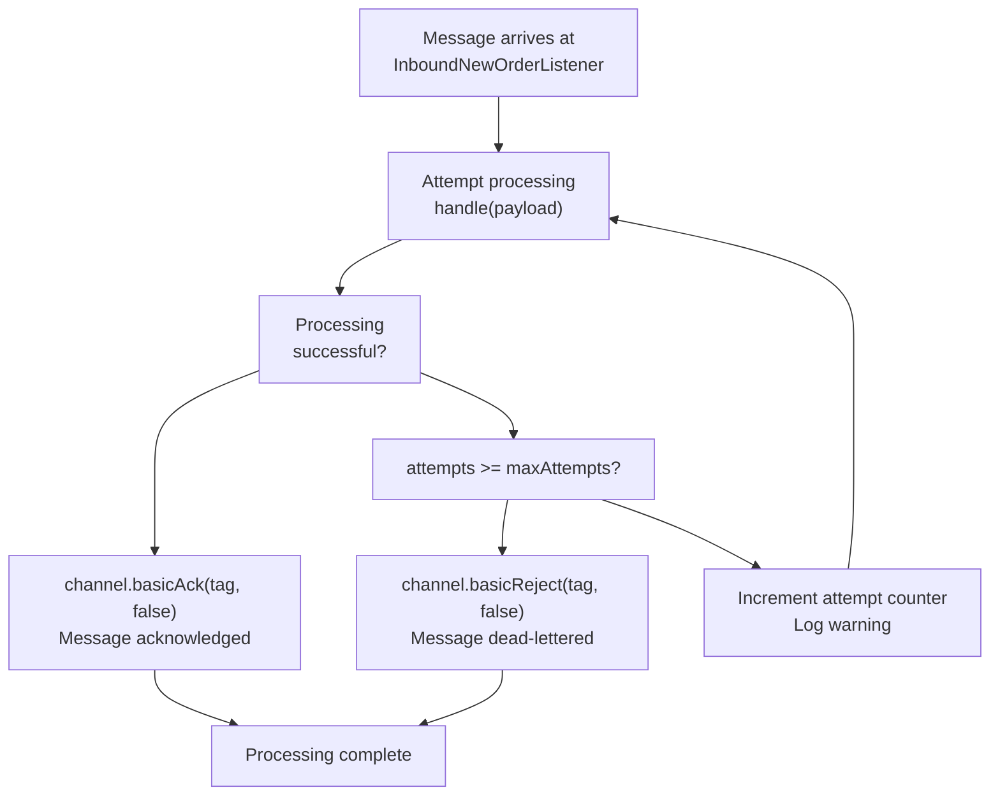
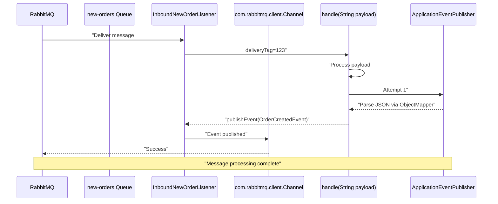
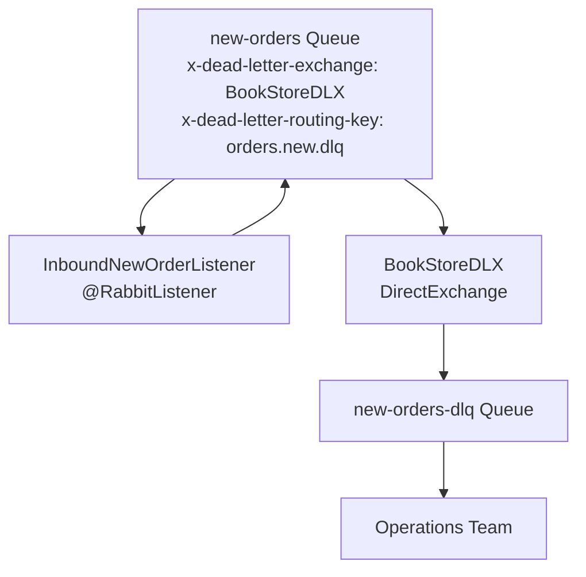

# Error Handling and Retries

> **Relevant source files**
> * [src/main/java/com/example/modulithdemo/messaging/inbound/amqp/InboundNewOrderListener.java](https://github.com/philipz/spring-monolith-amqp-poc/blob/c93f55b5/src/main/java/com/example/modulithdemo/messaging/inbound/amqp/InboundNewOrderListener.java)
> * [src/main/resources/application.yml](https://github.com/philipz/spring-monolith-amqp-poc/blob/c93f55b5/src/main/resources/application.yml)
> * [src/test/java/com/example/modulithdemo/messaging/inbound/amqp/InboundNewOrderListenerRetryTests.java](https://github.com/philipz/spring-monolith-amqp-poc/blob/c93f55b5/src/test/java/com/example/modulithdemo/messaging/inbound/amqp/InboundNewOrderListenerRetryTests.java)

## Purpose and Scope

This page documents the error handling and retry mechanisms for message processing in the spring-monolith-amqp-poc application. It covers inbound message retry strategies, dead-letter queue configuration, manual acknowledgment patterns, and failure recovery procedures. For outbound event reliability guarantees via the Event Publication Registry, see [Event Publication Registry](/philipz/spring-monolith-amqp-poc/6.1-event-publication-registry). For RabbitMQ topology details including dead-letter exchange configuration, see [Topology Configuration](/philipz/spring-monolith-amqp-poc/7.1-topology-configuration).

---

## Inbound Message Retry Strategy

The application implements a configurable retry mechanism for inbound messages consumed from the `new-orders` queue. The retry logic is encapsulated in `InboundNewOrderListener` and operates at the application level before messages are acknowledged or rejected.

### Retry Configuration

Retry behavior is controlled via the `app.amqp.new-orders.retry-max-attempts` configuration property:

| Property | Default | Description |
| --- | --- | --- |
| `app.amqp.new-orders.retry-max-attempts` | 3 | Maximum processing attempts before message rejection |

**Sources:** [src/main/resources/application.yml L64-L66](https://github.com/philipz/spring-monolith-amqp-poc/blob/c93f55b5/src/main/resources/application.yml#L64-L66)

### Retry Loop Implementation

The `InboundNewOrderListener.processWithAck()` method implements a synchronous retry loop that:

1. Attempts to process the message via `handle(String payload)`
2. On success, invokes `basicAck` to acknowledge the message
3. On failure, increments attempt counter and retries
4. After exhausting `maxAttempts`, invokes `basicReject(requeue=false)` to dead-letter the message



**Sources:** [src/main/java/com/example/modulithdemo/messaging/inbound/amqp/InboundNewOrderListener.java L80-L98](https://github.com/philipz/spring-monolith-amqp-poc/blob/c93f55b5/src/main/java/com/example/modulithdemo/messaging/inbound/amqp/InboundNewOrderListener.java#L80-L98)

### Key Implementation Details

The retry mechanism exhibits these characteristics:

* **Synchronous retries**: All retry attempts occur within the same `@RabbitListener` invocation, blocking the channel until success or exhaustion
* **No backoff delay**: Retries execute immediately without exponential backoff or sleep intervals
* **Exception handling**: Any exception thrown by `handle()` triggers a retry; both `IOException` and general exceptions are caught
* **Manual acknowledgment**: The container factory is configured with `AcknowledgeMode.MANUAL`, giving the listener full control over message disposition

**Sources:** [src/main/java/com/example/modulithdemo/messaging/inbound/amqp/InboundNewOrderListener.java L42-L52](https://github.com/philipz/spring-monolith-amqp-poc/blob/c93f55b5/src/main/java/com/example/modulithdemo/messaging/inbound/amqp/InboundNewOrderListener.java#L42-L52)

 [src/main/java/com/example/modulithdemo/messaging/inbound/amqp/InboundNewOrderListener.java L80-L98](https://github.com/philipz/spring-monolith-amqp-poc/blob/c93f55b5/src/main/java/com/example/modulithdemo/messaging/inbound/amqp/InboundNewOrderListener.java#L80-L98)

---

## Manual Acknowledgment Strategy

The application uses manual message acknowledgment to precisely control when messages are removed from the queue or dead-lettered. This pattern provides stronger reliability guarantees than automatic acknowledgment.

### Acknowledgment Flow



**Sources:** [src/main/java/com/example/modulithdemo/messaging/inbound/amqp/InboundNewOrderListener.java L43-L52](https://github.com/philipz/spring-monolith-amqp-poc/blob/c93f55b5/src/main/java/com/example/modulithdemo/messaging/inbound/amqp/InboundNewOrderListener.java#L43-L52)

 [src/main/java/com/example/modulithdemo/messaging/inbound/amqp/InboundNewOrderListener.java L55-L77](https://github.com/philipz/spring-monolith-amqp-poc/blob/c93f55b5/src/main/java/com/example/modulithdemo/messaging/inbound/amqp/InboundNewOrderListener.java#L55-L77)

### Acknowledgment Methods

| Method | Parameters | Behavior |
| --- | --- | --- |
| `channel.basicAck(tag, false)` | `multiple=false` | Acknowledges single message, removes from queue |
| `channel.basicReject(tag, false)` | `requeue=false` | Rejects message without requeue, triggers dead-letter routing |

The `multiple=false` parameter ensures only the specific message with the given `deliveryTag` is acknowledged, preventing accidental bulk acknowledgment of unprocessed messages.

**Sources:** [src/main/java/com/example/modulithdemo/messaging/inbound/amqp/InboundNewOrderListener.java L48](https://github.com/philipz/spring-monolith-amqp-poc/blob/c93f55b5/src/main/java/com/example/modulithdemo/messaging/inbound/amqp/InboundNewOrderListener.java#L48-L48)

 [src/main/java/com/example/modulithdemo/messaging/inbound/amqp/InboundNewOrderListener.java L50](https://github.com/philipz/spring-monolith-amqp-poc/blob/c93f55b5/src/main/java/com/example/modulithdemo/messaging/inbound/amqp/InboundNewOrderListener.java#L50-L50)

---

## Dead-Letter Queue Routing

Messages that fail processing after exhausting all retry attempts are rejected with `requeue=false`, which triggers RabbitMQ's dead-letter exchange mechanism.

### Dead-Letter Topology

The `new-orders` queue is configured with dead-letter parameters that route failed messages to the `new-orders-dlq` queue:

| Queue Property | Value | Purpose |
| --- | --- | --- |
| `x-dead-letter-exchange` | `BookStoreDLX` | Exchange to route rejected messages |
| `x-dead-letter-routing-key` | `orders.new.dlq` | Routing key for DLQ binding |



For complete topology configuration details, see [Topology Configuration](/philipz/spring-monolith-amqp-poc/7.1-topology-configuration).

**Sources:** [src/main/resources/application.yml L64-L66](https://github.com/philipz/spring-monolith-amqp-poc/blob/c93f55b5/src/main/resources/application.yml#L64-L66)

### Rejection Trigger Conditions

A message is rejected to the DLQ when:

1. `InboundNewOrderListener.handle()` throws an exception
2. The exception is caught and `attempts` counter reaches `maxAttempts` (default: 3)
3. The `processWithAck()` method invokes the `reject` callback
4. `channel.basicReject(tag, false)` is executed, marking the message for dead-lettering

**Sources:** [src/main/java/com/example/modulithdemo/messaging/inbound/amqp/InboundNewOrderListener.java L87-L92](https://github.com/philipz/spring-monolith-amqp-poc/blob/c93f55b5/src/main/java/com/example/modulithdemo/messaging/inbound/amqp/InboundNewOrderListener.java#L87-L92)

---

## Failure Scenarios and Recovery

### Common Failure Scenarios

#### Deserialization Failures

If the message payload cannot be deserialized into `NewOrderMessage`, an `IOException` is thrown:

```
// From InboundNewOrderListener.handle()
NewOrderMessage dto = objectMapper.readValue(payload, NewOrderMessage.class);
```

This typically occurs when:

* JSON payload is malformed
* Required fields are missing
* Field types don't match the DTO schema

**Sources:** [src/main/java/com/example/modulithdemo/messaging/inbound/amqp/InboundNewOrderListener.java L57](https://github.com/philipz/spring-monolith-amqp-poc/blob/c93f55b5/src/main/java/com/example/modulithdemo/messaging/inbound/amqp/InboundNewOrderListener.java#L57-L57)

#### Event Publication Failures

After deserialization, the listener publishes `OrderCreatedEvent` to the internal event bus. Failures can occur if:

* Database connection fails (Event Publication Registry write)
* Transaction rollback due to downstream constraints
* Application context is shutting down

**Sources:** [src/main/java/com/example/modulithdemo/messaging/inbound/amqp/InboundNewOrderListener.java L70](https://github.com/philipz/spring-monolith-amqp-poc/blob/c93f55b5/src/main/java/com/example/modulithdemo/messaging/inbound/amqp/InboundNewOrderListener.java#L70-L70)

#### Channel Errors

If `basicAck` or `basicReject` operations fail (e.g., channel closed), the error is logged but not propagated. The message remains in "unacknowledged" state and will be redelivered when the channel recovers.

**Sources:** [src/main/java/com/example/modulithdemo/messaging/inbound/amqp/InboundNewOrderListener.java L48](https://github.com/philipz/spring-monolith-amqp-poc/blob/c93f55b5/src/main/java/com/example/modulithdemo/messaging/inbound/amqp/InboundNewOrderListener.java#L48-L48)

 [src/main/java/com/example/modulithdemo/messaging/inbound/amqp/InboundNewOrderListener.java L50](https://github.com/philipz/spring-monolith-amqp-poc/blob/c93f55b5/src/main/java/com/example/modulithdemo/messaging/inbound/amqp/InboundNewOrderListener.java#L50-L50)

### Recovery Procedures

#### Reprocessing Dead-Lettered Messages

Messages in `new-orders-dlq` can be reprocessed by:

1. **RabbitMQ Management UI**: Navigate to the DLQ, view message details, and use "Move messages" to return them to `new-orders`
2. **Shovel Plugin**: Configure a shovel to automatically move messages from DLQ back to the main queue after a delay
3. **Custom Consumer**: Implement a dedicated consumer for the DLQ that republishes messages after fixing data issues

#### Monitoring Retry Exhaustion

The application logs warnings at each retry attempt and when messages are dead-lettered:

| Log Level | Message Pattern | Trigger |
| --- | --- | --- |
| `WARN` | `attempt {}/{} failed; retrying` | Each failed attempt before exhaustion |
| `WARN` | `failing after {} attempts; dead-lettering` | Final rejection to DLQ |

**Sources:** [src/main/java/com/example/modulithdemo/messaging/inbound/amqp/InboundNewOrderListener.java L90](https://github.com/philipz/spring-monolith-amqp-poc/blob/c93f55b5/src/main/java/com/example/modulithdemo/messaging/inbound/amqp/InboundNewOrderListener.java#L90-L90)

 [src/main/java/com/example/modulithdemo/messaging/inbound/amqp/InboundNewOrderListener.java L94](https://github.com/philipz/spring-monolith-amqp-poc/blob/c93f55b5/src/main/java/com/example/modulithdemo/messaging/inbound/amqp/InboundNewOrderListener.java#L94-L94)

---

## Outbound Event Reliability

While inbound messages use application-level retries, outbound events leverage the Event Publication Registry for at-least-once delivery guarantees.

### Key Reliability Features

| Feature | Configuration | Behavior |
| --- | --- | --- |
| Transactional outbox | Enabled by Spring Modulith | Events persisted in same transaction as business data |
| Restart republication | `republish-outstanding-events-on-restart: true` | Unprocessed events resent on application restart |
| Completion mode | `completion-mode: UPDATE` | Events marked complete but retained for 7-day audit trail |
| Time-to-live | `time-to-live: 7d` | Completed events eligible for cleanup after 7 days |

For detailed Event Publication Registry documentation, see [Event Publication Registry](/philipz/spring-monolith-amqp-poc/6.1-event-publication-registry).

**Sources:** [src/main/resources/application.yml L36-L41](https://github.com/philipz/spring-monolith-amqp-poc/blob/c93f55b5/src/main/resources/application.yml#L36-L41)

### Externalization Retry Behavior

The `spring-modulith-events-amqp` module automatically retries failed event externalization attempts. If RabbitMQ is unavailable:

1. The event remains in `event_publication` table with `completion_date` = NULL
2. On application restart, the event is republished due to `republish-outstanding-events-on-restart: true`
3. No data loss occurs because events are persisted transactionally with business data

**Sources:** [src/main/resources/application.yml L36](https://github.com/philipz/spring-monolith-amqp-poc/blob/c93f55b5/src/main/resources/application.yml#L36-L36)

---

## Testing Retry Behavior

The `InboundNewOrderListenerRetryTests` class validates retry logic using test doubles:

### Test Case: Success After Retries

Tests that a listener succeeding on the 3rd attempt:

* Attempts processing 3 times
* Invokes `ack` callback exactly once
* Does not invoke `reject` callback

**Sources:** [src/test/java/com/example/modulithdemo/messaging/inbound/amqp/InboundNewOrderListenerRetryTests.java L14-L33](https://github.com/philipz/spring-monolith-amqp-poc/blob/c93f55b5/src/test/java/com/example/modulithdemo/messaging/inbound/amqp/InboundNewOrderListenerRetryTests.java#L14-L33)

### Test Case: Rejection After Exhaustion

Tests that a listener always failing:

* Attempts processing `maxAttempts` times (3)
* Invokes `reject` callback exactly once
* Does not invoke `ack` callback

**Sources:** [src/test/java/com/example/modulithdemo/messaging/inbound/amqp/InboundNewOrderListenerRetryTests.java L36-L52](https://github.com/philipz/spring-monolith-amqp-poc/blob/c93f55b5/src/test/java/com/example/modulithdemo/messaging/inbound/amqp/InboundNewOrderListenerRetryTests.java#L36-L52)

---

## Configuration Reference

### Retry Configuration

```yaml
app:
  amqp:
    new-orders:
      retry-max-attempts: 3  # Number of attempts before dead-lettering
```

**Environment Variable Override:**

```
SPRING_APPLICATION_JSON='{"app":{"amqp":{"new-orders":{"retry-max-attempts":5}}}}'
```

**Sources:** [src/main/resources/application.yml L58-L66](https://github.com/philipz/spring-monolith-amqp-poc/blob/c93f55b5/src/main/resources/application.yml#L58-L66)

### Channel Pooling

```yaml
spring:
  rabbitmq:
    cache:
      channel:
        size: 50  # Increase for higher throughput
```

Higher channel cache sizes improve concurrency but consume more memory. Each channel maintains its own unacknowledged message buffer.

**Sources:** [src/main/resources/application.yml L12-L14](https://github.com/philipz/spring-monolith-amqp-poc/blob/c93f55b5/src/main/resources/application.yml#L12-L14)