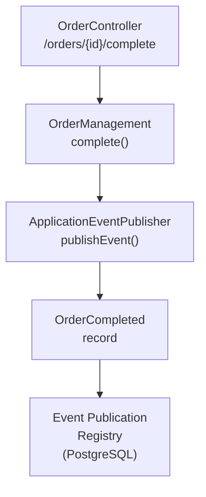
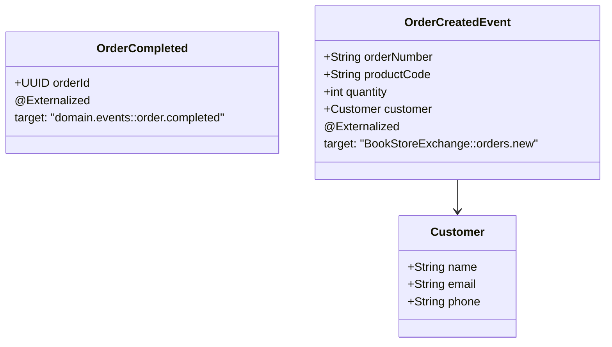
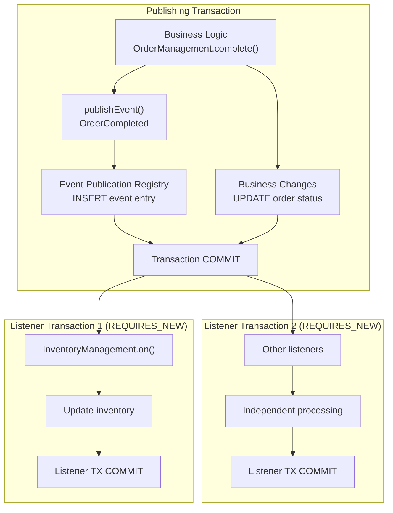
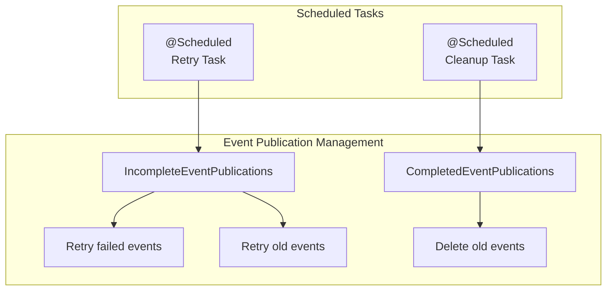
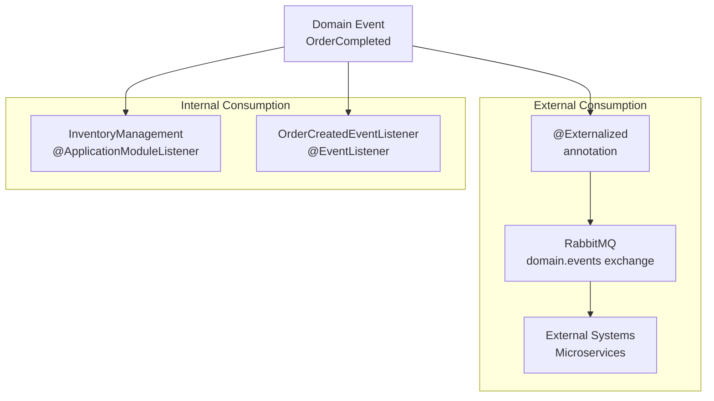
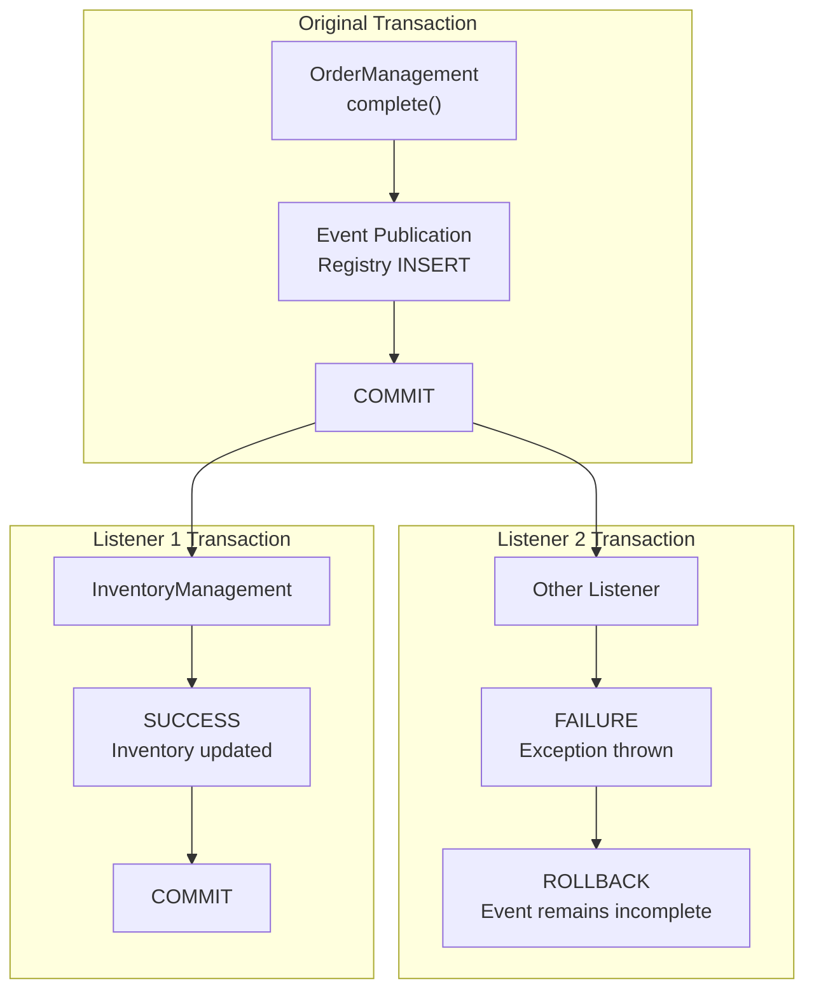

# Event-Driven Architecture

> **Relevant source files**
> * [Application_Events_and_AMQP_Integration.md](https://github.com/philipz/spring-monolith-amqp-poc/blob/c93f55b5/Application_Events_and_AMQP_Integration.md)
> * [CLAUDE.md](https://github.com/philipz/spring-monolith-amqp-poc/blob/c93f55b5/CLAUDE.md)
> * [Event-design.md](https://github.com/philipz/spring-monolith-amqp-poc/blob/c93f55b5/Event-design.md)
> * [README.md](https://github.com/philipz/spring-monolith-amqp-poc/blob/c93f55b5/README.md)
> * [src/main/java/com/example/modulithdemo/inventory/app/InventoryManagement.java](https://github.com/philipz/spring-monolith-amqp-poc/blob/c93f55b5/src/main/java/com/example/modulithdemo/inventory/app/InventoryManagement.java)
> * [src/main/java/com/example/modulithdemo/inventory/app/OrderCreatedEventListener.java](https://github.com/philipz/spring-monolith-amqp-poc/blob/c93f55b5/src/main/java/com/example/modulithdemo/inventory/app/OrderCreatedEventListener.java)

## Purpose and Scope

This document describes the event-driven architecture patterns used in the spring-monolith-amqp-poc application. It covers internal event publication and consumption, the transactional outbox pattern via Event Publication Registry, and transaction boundary management using `@ApplicationModuleListener`.

For information about how events are externalized to RabbitMQ, see [AMQP Integration Overview](/philipz/spring-monolith-amqp-poc/3.3-amqp-integration-overview). For details on how Spring Modulith enforces module boundaries, see [Spring Modulith Design](/philipz/spring-monolith-amqp-poc/3.1-spring-modulith-design). For configuration of the Event Publication Registry database, see [Database Configuration](/philipz/spring-monolith-amqp-poc/4.2-database-configuration).

## Event Publication Mechanism

Events in this application are published using Spring's `ApplicationEventPublisher` interface within transactional service methods. The publishing module does not need to know which modules will consume the events, maintaining loose coupling between modules.

**Event Publication Pattern**



**Sources:** [src/main/java/com/example/modulithdemo/order/domain/OrderManagement.java](https://github.com/philipz/spring-monolith-amqp-poc/blob/c93f55b5/src/main/java/com/example/modulithdemo/order/domain/OrderManagement.java)

 [CLAUDE.md L65-L69](https://github.com/philipz/spring-monolith-amqp-poc/blob/c93f55b5/CLAUDE.md#L65-L69)

The `OrderManagement` service demonstrates the publication pattern:

```python
@Service
@RequiredArgsConstructor
class OrderManagement {
  private final ApplicationEventPublisher events;

  @Transactional
  public void complete(Order order) {
    // Business logic
    events.publishEvent(new OrderCompleted(order.getId()));
  }
}
```

**Sources:** [Event-design.md L20-L30](https://github.com/philipz/spring-monolith-amqp-poc/blob/c93f55b5/Event-design.md#L20-L30)

 [Application_Events_and_AMQP_Integration.md L17-L29](https://github.com/philipz/spring-monolith-amqp-poc/blob/c93f55b5/Application_Events_and_AMQP_Integration.md#L17-L29)

## Domain Events as Records

Domain events are immutable records that represent business facts that have occurred. The application defines two primary domain events:

| Event Type | Purpose | Externalized | Exchange | Routing Key |
| --- | --- | --- | --- | --- |
| `OrderCompleted` | Order completion notification | Yes | `domain.events` | `order.completed` |
| `OrderCreatedEvent` | New order creation | Yes | `BookStoreExchange` | `orders.new` |

**Event Definitions in Code**



**Sources:** [CLAUDE.md L65-L68](https://github.com/philipz/spring-monolith-amqp-poc/blob/c93f55b5/CLAUDE.md#L65-L68)

 [README.md L5-L7](https://github.com/philipz/spring-monolith-amqp-poc/blob/c93f55b5/README.md#L5-L7)

 [README.md L37](https://github.com/philipz/spring-monolith-amqp-poc/blob/c93f55b5/README.md#L37-L37)

## Event Consumption Patterns

The application uses two distinct patterns for event consumption, each with different transactional semantics and use cases.

### @ApplicationModuleListener Pattern

The `@ApplicationModuleListener` annotation is the recommended pattern for cross-module event consumption. It combines three Spring annotations:

* `@Async` - Asynchronous processing
* `@Transactional(propagation = REQUIRES_NEW)` - New transaction
* `@TransactionalEventListener` - After commit

**ApplicationModuleListener Transaction Flow**

```mermaid
sequenceDiagram
  participant OrderManagement
  participant @Transactional
  participant Event Publication
  participant Registry
  participant InventoryManagement
  participant @ApplicationModuleListener

  note over OrderManagement,Registry: Original Transaction
  OrderManagement->>Event Publication: publishEvent(OrderCompleted)
  Event Publication->>Event Publication: Persist event entry
  OrderManagement->>OrderManagement: Business logic completes
  note over OrderManagement,Registry: Transaction COMMITS
  note over Event Publication,@ApplicationModuleListener: New Transaction (REQUIRES_NEW)
  Event Publication->>InventoryManagement: Dispatch OrderCompleted
  InventoryManagement->>InventoryManagement: Process event
  note over InventoryManagement,@ApplicationModuleListener: Independent failure handling
```

**Sources:** [CLAUDE.md L86-L90](https://github.com/philipz/spring-monolith-amqp-poc/blob/c93f55b5/CLAUDE.md#L86-L90)

 [Event-design.md L9-L12](https://github.com/philipz/spring-monolith-amqp-poc/blob/c93f55b5/Event-design.md#L9-L12)

 [Application_Events_and_AMQP_Integration.md L31-L42](https://github.com/philipz/spring-monolith-amqp-poc/blob/c93f55b5/Application_Events_and_AMQP_Integration.md#L31-L42)

The `InventoryManagement` class demonstrates this pattern:

[src/main/java/com/example/modulithdemo/inventory/app/InventoryManagement.java L1-L19](https://github.com/philipz/spring-monolith-amqp-poc/blob/c93f55b5/src/main/java/com/example/modulithdemo/inventory/app/InventoryManagement.java#L1-L19)

```python
@Component
public class InventoryManagement {
  @ApplicationModuleListener
  void on(OrderCompleted event) {
    log.info("[Inventory] received OrderCompleted: {}", event);
    // Runs asynchronously in REQUIRES_NEW transaction
  }
}
```

**Sources:** [src/main/java/com/example/modulithdemo/inventory/app/InventoryManagement.java L10-L18](https://github.com/philipz/spring-monolith-amqp-poc/blob/c93f55b5/src/main/java/com/example/modulithdemo/inventory/app/InventoryManagement.java#L10-L18)

### @EventListener Pattern

The `@EventListener` annotation provides synchronous, same-transaction event handling. This pattern is used for simpler event processing that does not require transaction isolation.

[src/main/java/com/example/modulithdemo/inventory/app/OrderCreatedEventListener.java L1-L22](https://github.com/philipz/spring-monolith-amqp-poc/blob/c93f55b5/src/main/java/com/example/modulithdemo/inventory/app/OrderCreatedEventListener.java#L1-L22)

```python
@Component
public class OrderCreatedEventListener {
  @EventListener
  public void onOrderCreated(OrderCreatedEvent event) {
    log.info("Processing OrderCreatedEvent...");
    // Runs synchronously in caller's transaction
  }
}
```

**Sources:** [src/main/java/com/example/modulithdemo/inventory/app/OrderCreatedEventListener.java L10-L21](https://github.com/philipz/spring-monolith-amqp-poc/blob/c93f55b5/src/main/java/com/example/modulithdemo/inventory/app/OrderCreatedEventListener.java#L10-L21)

**Comparison of Event Listener Patterns**

| Aspect | @ApplicationModuleListener | @EventListener |
| --- | --- | --- |
| Execution | Asynchronous | Synchronous |
| Transaction | `REQUIRES_NEW` (isolated) | Caller's transaction |
| Timing | After commit | Based on phase (default: after commit) |
| Failure Impact | Independent, retryable | Rolls back caller |
| Use Case | Cross-module communication | Same-module or simple reactions |

**Sources:** [CLAUDE.md L86-L90](https://github.com/philipz/spring-monolith-amqp-poc/blob/c93f55b5/CLAUDE.md#L86-L90)

 [Event-design.md L9-L39](https://github.com/philipz/spring-monolith-amqp-poc/blob/c93f55b5/Event-design.md#L9-L39)

## Transaction Boundaries and Event Processing

Transaction boundaries are critical to understanding event reliability. Events published within a transaction are only visible to listeners after the transaction commits successfully.

**Transaction Boundary Architecture**



**Sources:** [CLAUDE.md L89-L90](https://github.com/philipz/spring-monolith-amqp-poc/blob/c93f55b5/CLAUDE.md#L89-L90)

 [Application_Events_and_AMQP_Integration.md L43-L48](https://github.com/philipz/spring-monolith-amqp-poc/blob/c93f55b5/Application_Events_and_AMQP_Integration.md#L43-L48)

### Transaction Isolation Benefits

The `REQUIRES_NEW` propagation in `@ApplicationModuleListener` provides several critical benefits:

1. **Failure Isolation**: If a listener fails, it does not roll back the original business transaction
2. **Independent Retry**: Failed listeners can be retried independently via the Event Publication Registry
3. **Concurrent Processing**: Multiple listeners process events concurrently without blocking each other
4. **Module Autonomy**: Each module controls its own transaction boundaries and error handling

**Sources:** [Event-design.md L11-L12](https://github.com/philipz/spring-monolith-amqp-poc/blob/c93f55b5/Event-design.md#L11-L12)

 [Application_Events_and_AMQP_Integration.md L45-L48](https://github.com/philipz/spring-monolith-amqp-poc/blob/c93f55b5/Application_Events_and_AMQP_Integration.md#L45-L48)

## Event Publication Registry (Transactional Outbox)

The Event Publication Registry (EPR) implements the transactional outbox pattern, ensuring that events are never lost even if external systems are unavailable or processing fails.

**Event Publication Registry Schema**

```css
#mermaid-xwkk4htbq7a{font-family:ui-sans-serif,-apple-system,system-ui,Segoe UI,Helvetica;font-size:16px;fill:#333;}@keyframes edge-animation-frame{from{stroke-dashoffset:0;}}@keyframes dash{to{stroke-dashoffset:0;}}#mermaid-xwkk4htbq7a .edge-animation-slow{stroke-dasharray:9,5!important;stroke-dashoffset:900;animation:dash 50s linear infinite;stroke-linecap:round;}#mermaid-xwkk4htbq7a .edge-animation-fast{stroke-dasharray:9,5!important;stroke-dashoffset:900;animation:dash 20s linear infinite;stroke-linecap:round;}#mermaid-xwkk4htbq7a .error-icon{fill:#dddddd;}#mermaid-xwkk4htbq7a .error-text{fill:#222222;stroke:#222222;}#mermaid-xwkk4htbq7a .edge-thickness-normal{stroke-width:1px;}#mermaid-xwkk4htbq7a .edge-thickness-thick{stroke-width:3.5px;}#mermaid-xwkk4htbq7a .edge-pattern-solid{stroke-dasharray:0;}#mermaid-xwkk4htbq7a .edge-thickness-invisible{stroke-width:0;fill:none;}#mermaid-xwkk4htbq7a .edge-pattern-dashed{stroke-dasharray:3;}#mermaid-xwkk4htbq7a .edge-pattern-dotted{stroke-dasharray:2;}#mermaid-xwkk4htbq7a .marker{fill:#999;stroke:#999;}#mermaid-xwkk4htbq7a .marker.cross{stroke:#999;}#mermaid-xwkk4htbq7a svg{font-family:ui-sans-serif,-apple-system,system-ui,Segoe UI,Helvetica;font-size:16px;}#mermaid-xwkk4htbq7a p{margin:0;}#mermaid-xwkk4htbq7a .entityBox{fill:#ffffff;stroke:#dddddd;}#mermaid-xwkk4htbq7a .relationshipLabelBox{fill:#dddddd;opacity:0.7;background-color:#dddddd;}#mermaid-xwkk4htbq7a .relationshipLabelBox rect{opacity:0.5;}#mermaid-xwkk4htbq7a .labelBkg{background-color:rgba(221, 221, 221, 0.5);}#mermaid-xwkk4htbq7a .edgeLabel .label{fill:#dddddd;font-size:14px;}#mermaid-xwkk4htbq7a .label{font-family:ui-sans-serif,-apple-system,system-ui,Segoe UI,Helvetica;color:#333;}#mermaid-xwkk4htbq7a .edge-pattern-dashed{stroke-dasharray:8,8;}#mermaid-xwkk4htbq7a .node rect,#mermaid-xwkk4htbq7a .node circle,#mermaid-xwkk4htbq7a .node ellipse,#mermaid-xwkk4htbq7a .node polygon{fill:#ffffff;stroke:#dddddd;stroke-width:1px;}#mermaid-xwkk4htbq7a .relationshipLine{stroke:#999;stroke-width:1;fill:none;}#mermaid-xwkk4htbq7a .marker{fill:none!important;stroke:#999!important;stroke-width:1;}#mermaid-xwkk4htbq7a :root{--mermaid-font-family:"trebuchet ms",verdana,arial,sans-serif;}EVENT_PUBLICATIONUUIDidPKTEXTlistener_idTEXTevent_typeTEXTserialized_eventTIMESTAMPpublication_dateTIMESTAMPcompletion_date
```

**Sources:** [Application_Events_and_AMQP_Integration.md L50-L62](https://github.com/philipz/spring-monolith-amqp-poc/blob/c93f55b5/Application_Events_and_AMQP_Integration.md#L50-L62)

The `event_publication` table structure:

| Column | Type | Purpose |
| --- | --- | --- |
| `id` | UUID | Primary key for event entry |
| `listener_id` | TEXT | Identifies the target listener |
| `event_type` | TEXT | Fully qualified event class name |
| `serialized_event` | TEXT | JSON representation of event |
| `publication_date` | TIMESTAMP | When event was published |
| `completion_date` | TIMESTAMP | When listener completed (null if pending) |

**Sources:** [Application_Events_and_AMQP_Integration.md L50-L62](https://github.com/philipz/spring-monolith-amqp-poc/blob/c93f55b5/Application_Events_and_AMQP_Integration.md#L50-L62)

 [CLAUDE.md L83-L84](https://github.com/philipz/spring-monolith-amqp-poc/blob/c93f55b5/CLAUDE.md#L83-L84)

### Event Completion Modes

The Event Publication Registry supports three completion modes, configured via `spring.modulith.events.completion-mode`:

**Completion Mode Comparison**

```mermaid
flowchart TD

A1["Event Published"]
A2["Processing Completes"]
A3["Copy to<br>archive table"]
A4["Delete from<br>active table"]
D1["Event Published"]
D2["Processing Completes"]
D3["Record DELETED<br>immediately"]
U1["Event Published"]
U2["Processing Completes"]
U3["completion_date<br>SET to timestamp"]
U4["Record kept<br>for audit"]

subgraph subGraph2 ["ARCHIVE Mode"]
    A1
    A2
    A3
    A4
    A1 --> A2
    A2 --> A3
    A3 --> A4
end

subgraph subGraph1 ["DELETE Mode"]
    D1
    D2
    D3
    D1 --> D2
    D2 --> D3
end

subgraph subGraph0 ["UPDATE Mode (Default)"]
    U1
    U2
    U3
    U4
    U1 --> U2
    U2 --> U3
    U3 --> U4
end
```



**Sources:** [Application_Events_and_AMQP_Integration.md L64-L70](https://github.com/philipz/spring-monolith-amqp-poc/blob/c93f55b5/Application_Events_and_AMQP_Integration.md#L64-L70)

 [CLAUDE.md L108](https://github.com/philipz/spring-monolith-amqp-poc/blob/c93f55b5/CLAUDE.md#L108-L108)

| Mode | Behavior | Use Case | Storage Impact |
| --- | --- | --- | --- |
| `UPDATE` | Sets `completion_date`, keeps record | Production with audit requirements | Grows over time, needs cleanup |
| `DELETE` | Removes completed events immediately | Testing, memory-constrained | Minimal storage |
| `ARCHIVE` | Moves to separate archive table | Long-term audit with performance | Requires archive table management |

**Sources:** [Application_Events_and_AMQP_Integration.md L64-L70](https://github.com/philipz/spring-monolith-amqp-poc/blob/c93f55b5/Application_Events_and_AMQP_Integration.md#L64-L70)

### Reliability Guarantees

The Event Publication Registry provides several reliability mechanisms:

**Event Republication on Restart**

When configured with `spring.modulith.events.republish-outstanding-events-on-restart=true`, the application automatically resubmits incomplete events on startup.

```sql
spring:
  modulith:
    events:
      republish-outstanding-events-on-restart: true
      completion-mode: UPDATE
```

**Sources:** [CLAUDE.md L109](https://github.com/philipz/spring-monolith-amqp-poc/blob/c93f55b5/CLAUDE.md#L109-L109)

 [Application_Events_and_AMQP_Integration.md L47-L48](https://github.com/philipz/spring-monolith-amqp-poc/blob/c93f55b5/Application_Events_and_AMQP_Integration.md#L47-L48)

**Incomplete Event Management**

The framework provides APIs for managing incomplete events:



**Sources:** [Application_Events_and_AMQP_Integration.md L73-L85](https://github.com/philipz/spring-monolith-amqp-poc/blob/c93f55b5/Application_Events_and_AMQP_Integration.md#L73-L85)

 [Application_Events_and_AMQP_Integration.md L267-L281](https://github.com/philipz/spring-monolith-amqp-poc/blob/c93f55b5/Application_Events_and_AMQP_Integration.md#L267-L281)

## Event Lifecycle

The complete lifecycle of an event from publication to completion involves multiple stages and components.

**Complete Event Lifecycle Flow**

```mermaid
sequenceDiagram
  participant Client
  participant OrderController
  participant OrderManagement
  participant ApplicationEventPublisher
  participant Event Publication
  participant Registry (DB)
  participant InventoryManagement
  participant @ApplicationModuleListener
  participant OrderCreatedEventListener
  participant @EventListener
  participant RabbitMQ
  participant (if @Externalized)

  Client->>OrderController: POST /orders/{id}/complete
  OrderController->>OrderManagement: complete(orderId)
  note over OrderManagement,Registry (DB): Transaction Boundary
  OrderManagement->>ApplicationEventPublisher: publishEvent(OrderCompleted)
  ApplicationEventPublisher->>Event Publication: Persist event entry
  OrderManagement->>OrderManagement: listener_id, serialized_event
  note over OrderManagement,Registry (DB): Transaction COMMITS
  OrderManagement-->>OrderController: Update order state
  OrderController-->>Client: Success
  loop [Async Processing]
    Event Publication->>InventoryManagement: 202 Accepted
    InventoryManagement->>InventoryManagement: Dispatch event
    InventoryManagement->>Event Publication: (REQUIRES_NEW TX)
    Event Publication->>OrderCreatedEventListener: Process inventory update
    OrderCreatedEventListener->>OrderCreatedEventListener: Mark complete
    OrderCreatedEventListener->>Event Publication: SET completion_date
    note over Event Publication,(if @Externalized): If @Externalized
    Event Publication->>RabbitMQ: Dispatch event
    RabbitMQ-->>Event Publication: (same TX context)
    Event Publication->>Event Publication: Process notification
  end
```

**Sources:** [Event-design.md L1-L192](https://github.com/philipz/spring-monolith-amqp-poc/blob/c93f55b5/Event-design.md#L1-L192)

 [Application_Events_and_AMQP_Integration.md L1-L70](https://github.com/philipz/spring-monolith-amqp-poc/blob/c93f55b5/Application_Events_and_AMQP_Integration.md#L1-L70)

 [CLAUDE.md L79-L91](https://github.com/philipz/spring-monolith-amqp-poc/blob/c93f55b5/CLAUDE.md#L79-L91)

### Event States

Events in the Event Publication Registry transition through distinct states:

| State | `completion_date` | Description | Next Actions |
| --- | --- | --- | --- |
| **Pending** | NULL | Event published, awaiting processing | Dispatched to listeners |
| **Processing** | NULL | Currently being processed by listener | Await completion or failure |
| **Completed** | Set to timestamp | Successfully processed by all listeners | Archive or cleanup per mode |
| **Failed** | NULL (old `publication_date`) | Processing failed, awaiting retry | Resubmit via API or restart |

**Sources:** [Application_Events_and_AMQP_Integration.md L64-L70](https://github.com/philipz/spring-monolith-amqp-poc/blob/c93f55b5/Application_Events_and_AMQP_Integration.md#L64-L70)

 [Event-design.md L187-L188](https://github.com/philipz/spring-monolith-amqp-poc/blob/c93f55b5/Event-design.md#L187-L188)

## Internal Events vs. Externalized Events

The application distinguishes between internal events (consumed only within the application) and externalized events (published to RabbitMQ).

**Event Classification by Destination**



**Sources:** [README.md L5-L7](https://github.com/philipz/spring-monolith-amqp-poc/blob/c93f55b5/README.md#L5-L7)

 [CLAUDE.md L74-L77](https://github.com/philipz/spring-monolith-amqp-poc/blob/c93f55b5/CLAUDE.md#L74-L77)

### @Externalized Annotation

Events marked with `@Externalized` are automatically published to RabbitMQ after successful internal processing. The annotation specifies the exchange and routing key:

```
@Externalized("domain.events::order.completed")
public record OrderCompleted(UUID orderId) {}

@Externalized("BookStoreExchange::orders.new")  
public record OrderCreatedEvent(
    String orderNumber,
    String productCode,
    int quantity,
    Customer customer
) {}
```

**Sources:** [Event-design.md L77-L90](https://github.com/philipz/spring-monolith-amqp-poc/blob/c93f55b5/Event-design.md#L77-L90)

 [CLAUDE.md L67-L68](https://github.com/philipz/spring-monolith-amqp-poc/blob/c93f55b5/CLAUDE.md#L67-L68)

 [README.md L6](https://github.com/philipz/spring-monolith-amqp-poc/blob/c93f55b5/README.md#L6-L6)

**Externalization Routing Pattern**

The `@Externalized` annotation uses the format: `"exchangeName::routingKey"`

| Event | Exchange | Routing Key | Purpose |
| --- | --- | --- | --- |
| `OrderCompleted` | `domain.events` | `order.completed` | Notify external systems of order completion |
| `OrderCreatedEvent` | `BookStoreExchange` | `orders.new` | Broadcast new orders to external consumers |

**Sources:** [Event-design.md L82-L84](https://github.com/philipz/spring-monolith-amqp-poc/blob/c93f55b5/Event-design.md#L82-L84)

 [README.md L74](https://github.com/philipz/spring-monolith-amqp-poc/blob/c93f55b5/README.md#L74-L74)

## Event-Driven Communication Guarantees

The event-driven architecture in this application provides several important guarantees through the combination of Spring Modulith and the Event Publication Registry.

**Reliability Guarantees**

| Guarantee | Mechanism | Implementation |
| --- | --- | --- |
| **At-Least-Once Delivery** | Event Publication Registry | Events persisted in same transaction as business logic |
| **Transaction Isolation** | `REQUIRES_NEW` propagation | Listeners run in independent transactions |
| **Failure Recovery** | Republish on restart | Incomplete events resubmitted automatically |
| **Audit Trail** | `UPDATE` completion mode | Event history maintained for troubleshooting |
| **Ordering** | Publication timestamp | Events processed in publication order per listener |

**Sources:** [CLAUDE.md L88-L90](https://github.com/philipz/spring-monolith-amqp-poc/blob/c93f55b5/CLAUDE.md#L88-L90)

 [Application_Events_and_AMQP_Integration.md L43-L48](https://github.com/philipz/spring-monolith-amqp-poc/blob/c93f55b5/Application_Events_and_AMQP_Integration.md#L43-L48)

 [Event-design.md L11-L12](https://github.com/philipz/spring-monolith-amqp-poc/blob/c93f55b5/Event-design.md#L11-L12)

### Preventing Cascading Failures

The `@ApplicationModuleListener` pattern prevents cascading failures through transaction isolation:



**Sources:** [Application_Events_and_AMQP_Integration.md L45-L48](https://github.com/philipz/spring-monolith-amqp-poc/blob/c93f55b5/Application_Events_and_AMQP_Integration.md#L45-L48)

 [Event-design.md L187](https://github.com/philipz/spring-monolith-amqp-poc/blob/c93f55b5/Event-design.md#L187-L187)

**Key Isolation Benefits:**

1. Original transaction always succeeds if business logic succeeds
2. Failed listeners can retry without affecting completed listeners
3. External system failures (RabbitMQ) don't prevent internal processing
4. Each module maintains its own error handling and retry logic

**Sources:** [CLAUDE.md L89](https://github.com/philipz/spring-monolith-amqp-poc/blob/c93f55b5/CLAUDE.md#L89-L89)

 [Application_Events_and_AMQP_Integration.md L48](https://github.com/philipz/spring-monolith-amqp-poc/blob/c93f55b5/Application_Events_and_AMQP_Integration.md#L48-L48)

## Best Practices and Design Principles

The event-driven architecture in this codebase follows several important design principles:

### Event Naming Conventions

Events should be named as past-tense facts representing completed business actions:

* ✅ `OrderCompleted` - Describes what happened
* ✅ `OrderCreatedEvent` - Describes the creation fact
* ❌ `OrderEvent` - Too generic
* ❌ `CompleteOrder` - Sounds like a command

**Sources:** [Event-design.md L191](https://github.com/philipz/spring-monolith-amqp-poc/blob/c93f55b5/Event-design.md#L191-L191)

### Module Communication Guidelines

1. **Never use direct bean dependencies across modules** - Only communicate through events
2. **Events belong to the publishing module** - Define events in the `domain/events` package of the module that publishes them
3. **Use `@ApplicationModuleListener` for cross-module communication** - Ensures proper transaction isolation
4. **Use `@EventListener` for same-module reactions** - When transaction isolation is not needed

**Sources:** [CLAUDE.md L88](https://github.com/philipz/spring-monolith-amqp-poc/blob/c93f55b5/CLAUDE.md#L88-L88)

 [README.md L170](https://github.com/philipz/spring-monolith-amqp-poc/blob/c93f55b5/README.md#L170-L170)

 [Event-design.md L191](https://github.com/philipz/spring-monolith-amqp-poc/blob/c93f55b5/Event-design.md#L191-L191)

### Transaction Design Guidelines

1. **Keep original transaction short** - Only business logic and event publication
2. **Move I/O operations to listeners** - External calls, logging, notifications should be in `@ApplicationModuleListener` methods
3. **Design for failure** - Assume listener transactions may fail and need retry
4. **Avoid long-running listeners** - Break down complex processing into multiple steps

**Sources:** [Event-design.md L122](https://github.com/philipz/spring-monolith-amqp-poc/blob/c93f55b5/Event-design.md#L122-L122)

 [Application_Events_and_AMQP_Integration.md L47-L48](https://github.com/philipz/spring-monolith-amqp-poc/blob/c93f55b5/Application_Events_and_AMQP_Integration.md#L47-L48)

---

**Sources:** [CLAUDE.md L59-L145](https://github.com/philipz/spring-monolith-amqp-poc/blob/c93f55b5/CLAUDE.md#L59-L145)

 [README.md L1-L176](https://github.com/philipz/spring-monolith-amqp-poc/blob/c93f55b5/README.md#L1-L176)

 [Event-design.md L1-L192](https://github.com/philipz/spring-monolith-amqp-poc/blob/c93f55b5/Event-design.md#L1-L192)

 [Application_Events_and_AMQP_Integration.md L1-L466](https://github.com/philipz/spring-monolith-amqp-poc/blob/c93f55b5/Application_Events_and_AMQP_Integration.md#L1-L466)

 [src/main/java/com/example/modulithdemo/inventory/app/InventoryManagement.java L1-L19](https://github.com/philipz/spring-monolith-amqp-poc/blob/c93f55b5/src/main/java/com/example/modulithdemo/inventory/app/InventoryManagement.java#L1-L19)

 [src/main/java/com/example/modulithdemo/inventory/app/OrderCreatedEventListener.java L1-L22](https://github.com/philipz/spring-monolith-amqp-poc/blob/c93f55b5/src/main/java/com/example/modulithdemo/inventory/app/OrderCreatedEventListener.java#L1-L22)