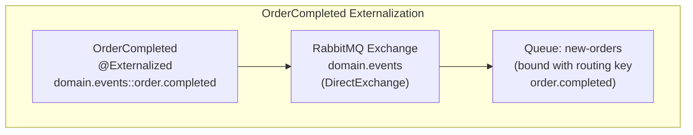
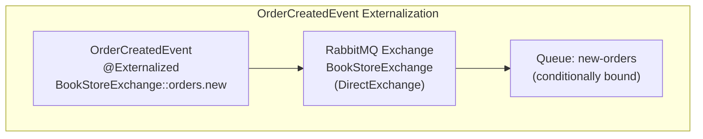
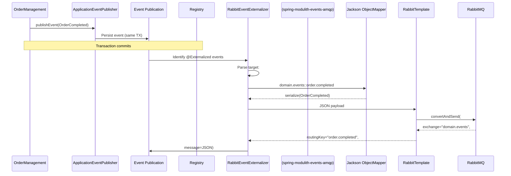
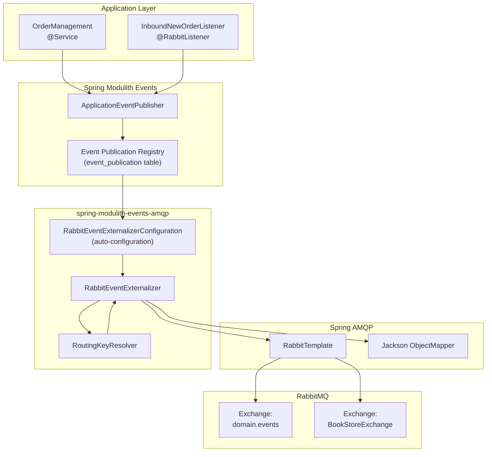

# Event Externalization

> **Relevant source files**
> * [Application_Events_and_AMQP_Integration.md](https://github.com/philipz/spring-monolith-amqp-poc/blob/c93f55b5/Application_Events_and_AMQP_Integration.md)
> * [Event-design.md](https://github.com/philipz/spring-monolith-amqp-poc/blob/c93f55b5/Event-design.md)
> * [README.md](https://github.com/philipz/spring-monolith-amqp-poc/blob/c93f55b5/README.md)
> * [src/main/java/com/example/modulithdemo/inventory/app/InventoryManagement.java](https://github.com/philipz/spring-monolith-amqp-poc/blob/c93f55b5/src/main/java/com/example/modulithdemo/inventory/app/InventoryManagement.java)
> * [src/main/java/com/example/modulithdemo/inventory/app/OrderCreatedEventListener.java](https://github.com/philipz/spring-monolith-amqp-poc/blob/c93f55b5/src/main/java/com/example/modulithdemo/inventory/app/OrderCreatedEventListener.java)
> * [src/main/resources/application.yml](https://github.com/philipz/spring-monolith-amqp-poc/blob/c93f55b5/src/main/resources/application.yml)

## Purpose and Scope

This document explains how internal Spring Application Events are externalized to RabbitMQ using the `@Externalized` annotation and the `spring-modulith-events-amqp` module. Event externalization enables domain events published within the application to be automatically serialized and published to AMQP exchanges, allowing external systems to consume these events.

For information about the Event Publication Registry and transactional outbox pattern that underlies event externalization, see [Event Publication Registry](/philipz/spring-monolith-amqp-poc/6.1-event-publication-registry). For internal event consumption patterns, see [Event Listeners](/philipz/spring-monolith-amqp-poc/6.3-event-listeners). For RabbitMQ topology and infrastructure details, see [AMQP Integration Details](/philipz/spring-monolith-amqp-poc/7-amqp-integration-details).

**Sources:** [README.md L1-L176](https://github.com/philipz/spring-monolith-amqp-poc/blob/c93f55b5/README.md#L1-L176)

 [Application_Events_and_AMQP_Integration.md L1-L466](https://github.com/philipz/spring-monolith-amqp-poc/blob/c93f55b5/Application_Events_and_AMQP_Integration.md#L1-L466)

 [Event-design.md L1-L192](https://github.com/philipz/spring-monolith-amqp-poc/blob/c93f55b5/Event-design.md#L1-L192)

---

## Event Externalization Overview

Event externalization is the process of taking internal Spring Application Events and publishing them to an external message broker (RabbitMQ). The `spring-modulith-events-amqp` module automatically detects events marked with the `@Externalized` annotation and publishes them to the configured AMQP exchange after the originating transaction commits.

The externalization process operates independently from the Event Publication Registry's internal event dispatch mechanism, ensuring that failures in external publishing do not affect internal event processing.

### Key Components

| Component | Purpose |
| --- | --- |
| `@Externalized` annotation | Marks events for externalization and specifies routing |
| `spring-modulith-events-amqp` | Auto-configuration and externalization logic |
| `RabbitEventExternalizerConfiguration` | Spring auto-configuration class |
| Jackson `ObjectMapper` | JSON serialization of events |
| `RabbitTemplate` | AMQP message publishing |

**Sources:** [Application_Events_and_AMQP_Integration.md L87-L166](https://github.com/philipz/spring-monolith-amqp-poc/blob/c93f55b5/Application_Events_and_AMQP_Integration.md#L87-L166)

 [Event-design.md L45-L92](https://github.com/philipz/spring-monolith-amqp-poc/blob/c93f55b5/Event-design.md#L45-L92)

---

## The @Externalized Annotation

The `@Externalized` annotation from `org.springframework.modulith.events` identifies which events should be published to RabbitMQ. The annotation's value specifies the routing target using the format `"exchange-name::routing-key"`.

### Annotation Syntax Patterns

```python
@Externalized("exchange-name")                          // Simple: routing key derived from event type
@Externalized("exchange-name::static.routing.key")      // Static routing key
@Externalized("exchange-name::#{#this.propertyName()}") // Dynamic routing key using SpEL
```

### Routing Target Resolution

For AMQP (RabbitMQ) externalization:

* The portion before `::` is the **exchange name**
* The portion after `::` is the **routing key**
* If no `::` is present, the routing key defaults to the event's simple class name

SpEL expressions in routing keys are evaluated against the event instance, allowing dynamic routing based on event properties.

**Sources:** [Event-design.md L76-L92](https://github.com/philipz/spring-monolith-amqp-poc/blob/c93f55b5/Event-design.md#L76-L92)

 [Application_Events_and_AMQP_Integration.md L126-L147](https://github.com/philipz/spring-monolith-amqp-poc/blob/c93f55b5/Application_Events_and_AMQP_Integration.md#L126-L147)

---

## Externalized Events in the Codebase

The application defines two domain events that are externalized to RabbitMQ:

### OrderCompleted Event



**Event Definition:** The `OrderCompleted` record is annotated with `@Externalized("domain.events::order.completed")`, directing the event to the `domain.events` exchange with routing key `order.completed`.

**Published By:** The `OrderManagement` service in the `domain/order` module publishes this event when an order is completed via the REST API endpoint `POST /orders/{id}/complete`.

### OrderCreatedEvent Event



**Event Definition:** The `OrderCreatedEvent` record is annotated with `@Externalized("BookStoreExchange::orders.new")`, targeting the `BookStoreExchange` exchange with routing key `orders.new`.

**Published By:** The `InboundNewOrderListener` in the `inbound/amqp` module publishes this event after consuming new order JSON messages from the `new-orders` queue.

**Feedback Loop Prevention:** The `new-orders` queue's binding to `BookStoreExchange` is controlled by the configuration property `app.amqp.new-orders.bind` (default: `false`), preventing the application from consuming its own externalized `OrderCreatedEvent` messages.

**Sources:** [README.md L5-L80](https://github.com/philipz/spring-monolith-amqp-poc/blob/c93f55b5/README.md#L5-L80)

 [application.yml L58-L66](https://github.com/philipz/spring-monolith-amqp-poc/blob/c93f55b5/application.yml#L58-L66)

---

## Event Externalization Flow

### Complete Externalization Sequence



### Transaction and Timing Guarantees

1. **Event Publication**: Events are published via `ApplicationEventPublisher` within the originating transaction
2. **EPR Persistence**: The Event Publication Registry persists the event in the same transaction (transactional outbox pattern)
3. **Transaction Commit**: The business transaction commits, making both business data and event record durable
4. **Externalization Trigger**: After transaction commit, Spring Modulith identifies events with `@Externalized`
5. **Serialization**: Events are serialized to JSON using Jackson
6. **AMQP Publishing**: JSON payload is sent to RabbitMQ via `RabbitTemplate`
7. **Completion Marking**: Successful externalization updates the Event Publication Registry

This sequence ensures that events are never lost even if externalization fails, as the Event Publication Registry can republish outstanding events on restart (when `spring.modulith.events.republish-outstanding-events-on-restart=true`).

**Sources:** [Application_Events_and_AMQP_Integration.md L3-L49](https://github.com/philipz/spring-monolith-amqp-poc/blob/c93f55b5/Application_Events_and_AMQP_Integration.md#L3-L49)

 [Event-design.md L9-L42](https://github.com/philipz/spring-monolith-amqp-poc/blob/c93f55b5/Event-design.md#L9-L42)

 [application.yml L28-L41](https://github.com/philipz/spring-monolith-amqp-poc/blob/c93f55b5/application.yml#L28-L41)

---

## JSON Serialization

### Default Serialization Mechanism

Event externalization uses Spring Boot's auto-configured Jackson `ObjectMapper` to serialize events to JSON. The serialized JSON becomes the AMQP message body.

### Serialization Characteristics

| Aspect | Behavior |
| --- | --- |
| Serializer | Jackson `ObjectMapper` (auto-configured) |
| Format | JSON (UTF-8 string) |
| Property names | Derived from record components or field names |
| Null handling | Follows Jackson defaults (included by default) |
| Date/Time | ISO-8601 format via `JavaTimeModule` |

### Example Serialization

For an `OrderCompleted` event:

```
// Event definition
@Externalized("domain.events::order.completed")
public record OrderCompleted(UUID orderId) {}

// Instance
new OrderCompleted(UUID.fromString("550e8400-e29b-41d4-a716-446655440000"))

// Serialized JSON
{
  "orderId": "550e8400-e29b-41d4-a716-446655440000"
}
```

For an `OrderCreatedEvent`:

```
// Event definition
@Externalized("BookStoreExchange::orders.new")
public record OrderCreatedEvent(
    String orderNumber,
    String productCode,
    int quantity,
    CustomerInfo customer
) {}

// Serialized JSON
{
  "orderNumber": "A123",
  "productCode": "BOOK-001",
  "quantity": 2,
  "customer": {
    "name": "Alice",
    "email": "alice@example.com",
    "phone": "123"
  }
}
```

### Custom Serialization

To customize serialization, provide a custom `EventSerializer` bean:

```python
@Component
public class CustomEventSerializer implements EventSerializer {
    @Override
    public String serialize(Object event) {
        // Custom serialization logic
    }
}
```

**Sources:** [Application_Events_and_AMQP_Integration.md L191-L205](https://github.com/philipz/spring-monolith-amqp-poc/blob/c93f55b5/Application_Events_and_AMQP_Integration.md#L191-L205)

 [Event-design.md L69-L72](https://github.com/philipz/spring-monolith-amqp-poc/blob/c93f55b5/Event-design.md#L69-L72)

---

## Configuration Options

### Externalization Enablement

Event externalization is controlled by the `spring.modulith.events.externalization.enabled` property:

**Configuration:** [application.yml L28-L31](https://github.com/philipz/spring-monolith-amqp-poc/blob/c93f55b5/application.yml#L28-L31)

```yaml
spring:
  modulith:
    events:
      externalization:
        enabled: ${SPRING_MODULITH_EVENTS_EXTERNALIZATION_ENABLED:true}
```

* **Default:** `true` (externalization enabled)
* **Environment Override:** Set `SPRING_MODULITH_EVENTS_EXTERNALIZATION_ENABLED=false` to disable

### RabbitMQ Connection Settings

AMQP connection configuration for event publishing:

**Configuration:** [application.yml L7-L14](https://github.com/philipz/spring-monolith-amqp-poc/blob/c93f55b5/application.yml#L7-L14)

```css
spring:
  rabbitmq:
    host: ${SPRING_RABBITMQ_HOST:localhost}
    port: ${SPRING_RABBITMQ_PORT:5672}
    username: ${SPRING_RABBITMQ_USERNAME:guest}
    password: ${SPRING_RABBITMQ_PASSWORD:guest}
    cache:
      channel:
        size: 50   # Channel cache for higher throughput
```

| Property | Purpose | Default |
| --- | --- | --- |
| `spring.rabbitmq.host` | RabbitMQ server hostname | `localhost` |
| `spring.rabbitmq.port` | AMQP port | `5672` |
| `spring.rabbitmq.username` | Authentication username | `guest` |
| `spring.rabbitmq.password` | Authentication password | `guest` |
| `spring.rabbitmq.cache.channel.size` | Cached channels for publishing | `50` |

### Event Publication Registry Settings

These settings affect how externalized events are tracked in the EPR:

**Configuration:** [application.yml L36-L41](https://github.com/philipz/spring-monolith-amqp-poc/blob/c93f55b5/application.yml#L36-L41)

```sql
spring:
  modulith:
    events:
      republish-outstanding-events-on-restart: true
      completion-mode: UPDATE
      time-to-live: ${SPRING_MODULITH_EVENTS_TIME_TO_LIVE:7d}
```

| Property | Purpose | Value |
| --- | --- | --- |
| `republish-outstanding-events-on-restart` | Retry failed externalizations on startup | `true` |
| `completion-mode` | How to handle completed events | `UPDATE` (keeps history) |
| `time-to-live` | How long to keep completed event records | `7d` (7 days) |

**Completion Modes:**

* `UPDATE`: Sets `completion_date` but retains the record for audit/debugging (production recommended)
* `DELETE`: Removes completed event records immediately (reduces storage)
* `ARCHIVE`: Moves completed events to an archive table

**Sources:** [application.yml L7-L41](https://github.com/philipz/spring-monolith-amqp-poc/blob/c93f55b5/application.yml#L7-L41)

 [Application_Events_and_AMQP_Integration.md L63-L86](https://github.com/philipz/spring-monolith-amqp-poc/blob/c93f55b5/Application_Events_and_AMQP_Integration.md#L63-L86)

---

## Externalization Architecture

### Component Interaction



### Auto-Configuration Components

The `spring-modulith-events-amqp` module provides auto-configuration through `RabbitEventExternalizerConfiguration`, which:

1. Detects the presence of `spring-rabbit` on the classpath
2. Registers a `RabbitEventExternalizer` bean
3. Integrates with the Event Publication Registry
4. Uses the existing `RabbitTemplate` bean for publishing

**Dependencies:** [pom.xml](https://github.com/philipz/spring-monolith-amqp-poc/blob/c93f55b5/pom.xml)

 includes:

* `spring-modulith-events-amqp` (version managed by BOM)
* `spring-boot-starter-amqp` (Spring AMQP integration)
* `spring-modulith-events-jackson` (JSON serialization)

**Sources:** [Event-design.md L52-L74](https://github.com/philipz/spring-monolith-amqp-poc/blob/c93f55b5/Event-design.md#L52-L74)

 [Application_Events_and_AMQP_Integration.md L87-L121](https://github.com/philipz/spring-monolith-amqp-poc/blob/c93f55b5/Application_Events_and_AMQP_Integration.md#L87-L121)

---

## Operational Considerations

### Reliability and Guarantees

Event externalization provides **at-least-once delivery** guarantees through the Event Publication Registry:

* Events are persisted before externalization attempt
* Failed externalization attempts leave the event in "incomplete" state
* On restart, incomplete events are republished (when `republish-outstanding-events-on-restart=true`)
* Successful publishing marks the event as completed in the EPR

### Error Handling

When externalization fails (e.g., RabbitMQ unavailable, network issues):

1. The Event Publication Registry retains the event as incomplete
2. Internal event listeners still process the event (they are independent)
3. On application restart, the event is re-externalized
4. Manual resubmission is possible via `IncompleteEventPublications` API

### Monitoring Points

To monitor event externalization:

* **Event Publication Registry table**: Query for incomplete events
* **Spring Boot Actuator**: Health endpoints for RabbitMQ connection status [application.yml L48-L56](https://github.com/philipz/spring-monolith-amqp-poc/blob/c93f55b5/application.yml#L48-L56)
* **RabbitMQ Management UI**: Monitor exchange message rates (port 15672)
* **Application logs**: INFO level for `org.springframework.modulith` and `org.springframework.amqp` [application.yml L43-L46](https://github.com/philipz/spring-monolith-amqp-poc/blob/c93f55b5/application.yml#L43-L46)

### Performance Tuning

For high-throughput scenarios:

* **Channel cache size**: Increase `spring.rabbitmq.cache.channel.size` (default: 50) [application.yml L13-L14](https://github.com/philipz/spring-monolith-amqp-poc/blob/c93f55b5/application.yml#L13-L14)
* **Connection pool**: Tune HikariCP settings for Event Publication Registry access [application.yml L21-L26](https://github.com/philipz/spring-monolith-amqp-poc/blob/c93f55b5/application.yml#L21-L26)
* **Completion mode**: Use `DELETE` mode to reduce EPR table size if audit trail is not required
* **TTL cleanup**: Schedule periodic cleanup of old completed events

**Sources:** [application.yml L1-L67](https://github.com/philipz/spring-monolith-amqp-poc/blob/c93f55b5/application.yml#L1-L67)

 [Application_Events_and_AMQP_Integration.md L263-L282](https://github.com/philipz/spring-monolith-amqp-poc/blob/c93f55b5/Application_Events_and_AMQP_Integration.md#L263-L282)

---

## Testing Event Externalization

### Test Configuration

In test environments, event externalization behavior can be controlled:

* Disable externalization: `--spring.modulith.events.externalization.enabled=false`
* Disable RabbitMQ listeners: `--spring.rabbitmq.listener.simple.auto-startup=false`
* Use in-memory H2 for Event Publication Registry (test profile default)

### Verification Approaches

To verify externalization in tests:

1. **Event Publication Registry inspection**: Query `event_publication` table for completed events
2. **RabbitMQ test containers**: Use Testcontainers to spin up RabbitMQ for integration tests
3. **Scenario DSL**: Use Spring Modulith's `@EnableScenarios` for event flow testing
4. **Mock consumers**: Create test `@RabbitListener` methods to verify published messages

**Sources:** [README.md L147-L153](https://github.com/philipz/spring-monolith-amqp-poc/blob/c93f55b5/README.md#L147-L153)

 [Application_Events_and_AMQP_Integration.md L284-L301](https://github.com/philipz/spring-monolith-amqp-poc/blob/c93f55b5/Application_Events_and_AMQP_Integration.md#L284-L301)

---

## Summary

Event externalization bridges internal Spring Application Events with external RabbitMQ consumers through:

* **@Externalized annotation**: Declarative routing to AMQP exchanges
* **Automatic serialization**: JSON conversion via Jackson
* **Transactional guarantees**: Outbox pattern via Event Publication Registry
* **Reliability**: At-least-once delivery with restart republication
* **Configuration flexibility**: Environment-based enablement and connection settings

The `spring-modulith-events-amqp` module handles all externalization mechanics automatically, requiring only annotation and configuration. This approach allows the domain model to remain focused on business logic while event externalization concerns are handled infrastructurally.

**Sources:** [Application_Events_and_AMQP_Integration.md L1-L466](https://github.com/philipz/spring-monolith-amqp-poc/blob/c93f55b5/Application_Events_and_AMQP_Integration.md#L1-L466)

 [Event-design.md L1-L192](https://github.com/philipz/spring-monolith-amqp-poc/blob/c93f55b5/Event-design.md#L1-L192)

 [README.md L1-L176](https://github.com/philipz/spring-monolith-amqp-poc/blob/c93f55b5/README.md#L1-L176)