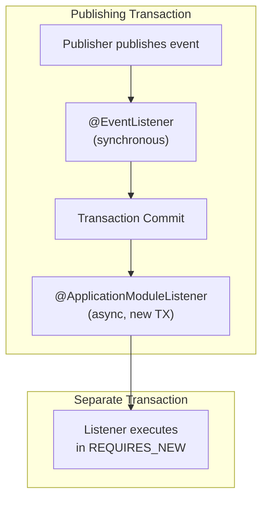
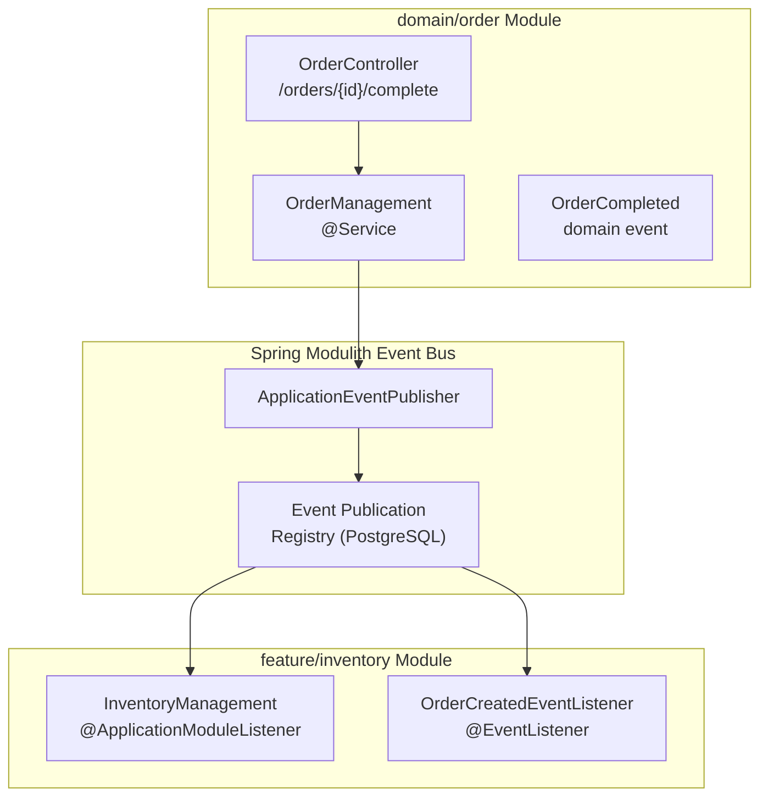
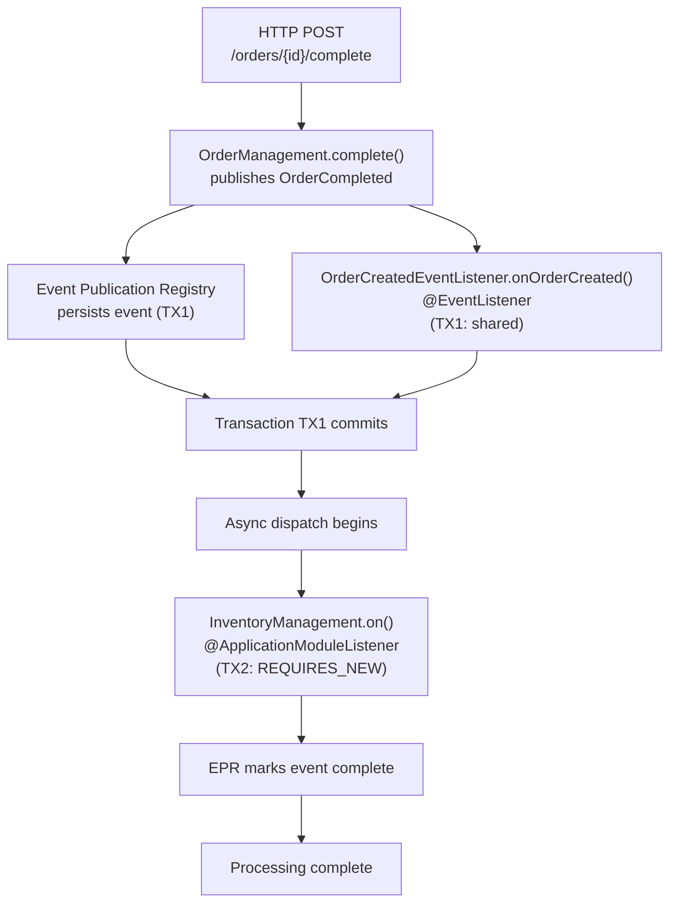

# Event Listeners

> **Relevant source files**
> * [Application_Events_and_AMQP_Integration.md](https://github.com/philipz/spring-monolith-amqp-poc/blob/c93f55b5/Application_Events_and_AMQP_Integration.md)
> * [CLAUDE.md](https://github.com/philipz/spring-monolith-amqp-poc/blob/c93f55b5/CLAUDE.md)
> * [Event-design.md](https://github.com/philipz/spring-monolith-amqp-poc/blob/c93f55b5/Event-design.md)
> * [README.md](https://github.com/philipz/spring-monolith-amqp-poc/blob/c93f55b5/README.md)
> * [src/main/java/com/example/modulithdemo/inventory/app/InventoryManagement.java](https://github.com/philipz/spring-monolith-amqp-poc/blob/c93f55b5/src/main/java/com/example/modulithdemo/inventory/app/InventoryManagement.java)
> * [src/main/java/com/example/modulithdemo/inventory/app/OrderCreatedEventListener.java](https://github.com/philipz/spring-monolith-amqp-poc/blob/c93f55b5/src/main/java/com/example/modulithdemo/inventory/app/OrderCreatedEventListener.java)

## Purpose and Scope

This document explains the event listener patterns used for internal event consumption within the application. It covers the two primary listener annotations (`@ApplicationModuleListener` and `@EventListener`), their transaction propagation behaviors, and when to use each pattern for cross-module communication.

For information about event publication and persistence, see [Event Publication Registry](/philipz/spring-monolith-amqp-poc/6.1-event-publication-registry). For details on externalizing events to RabbitMQ, see [Event Externalization](/philipz/spring-monolith-amqp-poc/6.2-event-externalization).

---

## Listener Annotation Overview

Spring Modulith provides two main patterns for consuming application events within the modular monolith. The choice between them depends on transaction isolation requirements and whether the listener is part of cross-module communication.

### Listener Types Comparison

| Aspect | `@ApplicationModuleListener` | `@EventListener` |
| --- | --- | --- |
| **Transaction Propagation** | `REQUIRES_NEW` (new transaction) | Inherits calling transaction |
| **Execution** | Asynchronous (after commit) | Synchronous or asynchronous |
| **Use Case** | Cross-module event consumption | Same-module event handling |
| **Isolation** | Complete isolation from publisher | Shares transaction with publisher |
| **Retry Support** | Automatic via Event Publication Registry | Manual implementation required |
| **Recommended For** | Module boundaries | Internal module logic |

Sources: [CLAUDE.md L86-L89](https://github.com/philipz/spring-monolith-amqp-poc/blob/c93f55b5/CLAUDE.md#L86-L89)

 [Event-design.md L9-L12](https://github.com/philipz/spring-monolith-amqp-poc/blob/c93f55b5/Event-design.md#L9-L12)

 [Application_Events_and_AMQP_Integration.md L8-L12](https://github.com/philipz/spring-monolith-amqp-poc/blob/c93f55b5/Application_Events_and_AMQP_Integration.md#L8-L12)

---

## @ApplicationModuleListener Pattern

### Transaction Semantics

The `@ApplicationModuleListener` annotation is the recommended pattern for cross-module event consumption. It combines three Spring annotations into a single, purpose-built annotation:

```
@ApplicationModuleListener = @Async + @Transactional(REQUIRES_NEW) + @TransactionalEventListener
```

This combination ensures that:

1. The listener executes **asynchronously** after the publishing transaction commits
2. The listener runs in a **new transaction** (`REQUIRES_NEW`), isolated from the publisher
3. Event processing failures in one module **do not affect** other modules or the publisher

Sources: [CLAUDE.md L89](https://github.com/philipz/spring-monolith-amqp-poc/blob/c93f55b5/CLAUDE.md#L89-L89)

 [Event-design.md L11-L12](https://github.com/philipz/spring-monolith-amqp-poc/blob/c93f55b5/Event-design.md#L11-L12)

 [Application_Events_and_AMQP_Integration.md L31](https://github.com/philipz/spring-monolith-amqp-poc/blob/c93f55b5/Application_Events_and_AMQP_Integration.md#L31-L31)

### Implementation Example

The inventory module demonstrates the canonical `@ApplicationModuleListener` usage:

[src/main/java/com/example/modulithdemo/inventory/app/InventoryManagement.java L10-L18](https://github.com/philipz/spring-monolith-amqp-poc/blob/c93f55b5/src/main/java/com/example/modulithdemo/inventory/app/InventoryManagement.java#L10-L18)

This listener method:

* Executes in a **new transaction** separate from order completion
* Runs **asynchronously** after the `OrderManagement.complete()` transaction commits
* Can fail independently without rolling back the order completion
* Automatically participates in the Event Publication Registry for retry guarantees

Sources: [src/main/java/com/example/modulithdemo/inventory/app/InventoryManagement.java L1-L19](https://github.com/philipz/spring-monolith-amqp-poc/blob/c93f55b5/src/main/java/com/example/modulithdemo/inventory/app/InventoryManagement.java#L1-L19)

### Event Flow with Transaction Boundaries

```mermaid
sequenceDiagram
  participant OrderManagement
  participant @Service
  participant ApplicationEventPublisher
  participant Event Publication
  participant Registry
  participant InventoryManagement
  participant @ApplicationModuleListener

  note over OrderManagement,@Service: Transaction TX1 begins
  OrderManagement->>OrderManagement: complete(orderId)
  OrderManagement->>ApplicationEventPublisher: publishEvent(OrderCompleted)
  ApplicationEventPublisher->>Event Publication: Register event
  note over OrderManagement,Registry: Business logic + event
  note over OrderManagement,@Service: Transaction TX1 commits
  note over Event Publication,@ApplicationModuleListener: After TX1 commit
  note over InventoryManagement,@ApplicationModuleListener: New Transaction TX2 begins
  Event Publication->>InventoryManagement: (within TX1)
  InventoryManagement->>InventoryManagement: on(OrderCompleted)
  note over InventoryManagement,@ApplicationModuleListener: Transaction TX2 commits
```

**Diagram: Transaction Isolation in @ApplicationModuleListener**

This diagram shows how the `@ApplicationModuleListener` creates a separate transaction boundary (`TX2`) that is completely isolated from the publishing transaction (`TX1`). The Event Publication Registry ensures the event is persisted within `TX1`, providing at-least-once delivery guarantees even if `TX2` fails.

Sources: [CLAUDE.md L86-L90](https://github.com/philipz/spring-monolith-amqp-poc/blob/c93f55b5/CLAUDE.md#L86-L90)

 [Application_Events_and_AMQP_Integration.md L43-L48](https://github.com/philipz/spring-monolith-amqp-poc/blob/c93f55b5/Application_Events_and_AMQP_Integration.md#L43-L48)

 [Event-design.md L187](https://github.com/philipz/spring-monolith-amqp-poc/blob/c93f55b5/Event-design.md#L187-L187)

### Benefits of Transaction Isolation

The `REQUIRES_NEW` propagation provides critical architectural benefits:

1. **Failure Isolation**: If inventory processing fails, the order completion remains successful
2. **Independent Retry**: Failed listeners can be retried via the Event Publication Registry without re-executing business logic
3. **Module Autonomy**: Each module manages its own transactional consistency
4. **Prevents Cascading Rollbacks**: One module's failure cannot rollback another module's work

Sources: [Application_Events_and_AMQP_Integration.md L31-L41](https://github.com/philipz/spring-monolith-amqp-poc/blob/c93f55b5/Application_Events_and_AMQP_Integration.md#L31-L41)

 [CLAUDE.md L89](https://github.com/philipz/spring-monolith-amqp-poc/blob/c93f55b5/CLAUDE.md#L89-L89)

---

## @EventListener Pattern

### When to Use @EventListener

The standard `@EventListener` annotation is appropriate for **same-module event handling** where transaction sharing is desired or when synchronous processing is required.

### Implementation Example

The inventory module also includes a synchronous listener for `OrderCreatedEvent`:

[src/main/java/com/example/modulithdemo/inventory/app/OrderCreatedEventListener.java L10-L21](https://github.com/philipz/spring-monolith-amqp-poc/blob/c93f55b5/src/main/java/com/example/modulithdemo/inventory/app/OrderCreatedEventListener.java#L10-L21)

Key characteristics:

* **Synchronous execution** within the publisher's transaction
* **No automatic retry** - failures propagate to the publisher
* Suitable for **validation** or **same-module coordination**
* Not registered in Event Publication Registry by default

Sources: [src/main/java/com/example/modulithdemo/inventory/app/OrderCreatedEventListener.java L1-L22](https://github.com/philipz/spring-monolith-amqp-poc/blob/c93f55b5/src/main/java/com/example/modulithdemo/inventory/app/OrderCreatedEventListener.java#L1-L22)

### Transaction Propagation Behavior



**Diagram: @EventListener vs @ApplicationModuleListener Execution**

This diagram illustrates the fundamental difference in execution timing and transaction boundaries between the two listener patterns. `@EventListener` executes synchronously within the publishing transaction, while `@ApplicationModuleListener` executes asynchronously after commit in a new transaction.

Sources: [Application_Events_and_AMQP_Integration.md L14-L42](https://github.com/philipz/spring-monolith-amqp-poc/blob/c93f55b5/Application_Events_and_AMQP_Integration.md#L14-L42)

 [CLAUDE.md L89](https://github.com/philipz/spring-monolith-amqp-poc/blob/c93f55b5/CLAUDE.md#L89-L89)

### Use Cases for @EventListener

| Scenario | Rationale |
| --- | --- |
| **Validation** | Need to fail the publishing transaction if validation fails |
| **Same-module coordination** | Multiple components within one module need synchronous updates |
| **Immediate feedback** | Publisher needs to know immediately if processing succeeded |
| **Transactional consistency** | All changes must commit or rollback together |

Sources: [Event-design.md L187](https://github.com/philipz/spring-monolith-amqp-poc/blob/c93f55b5/Event-design.md#L187-L187)

 [Application_Events_and_AMQP_Integration.md L14-L31](https://github.com/philipz/spring-monolith-amqp-poc/blob/c93f55b5/Application_Events_and_AMQP_Integration.md#L14-L31)

---

## Module Communication Architecture

### Event-Driven Module Boundaries

Spring Modulith enforces loose coupling between modules through event-based communication. Modules **never directly depend on each other's beans**; instead, they communicate exclusively through published events.



**Diagram: Module Communication via Events**

This diagram maps the actual code entities involved in cross-module communication. The `OrderManagement` service publishes events via `ApplicationEventPublisher`, which are persisted in the Event Publication Registry and then dispatched to listeners in the `inventory` module. The dashed lines indicate asynchronous dispatch after transaction commit.

Sources: [CLAUDE.md L61-L77](https://github.com/philipz/spring-monolith-amqp-poc/blob/c93f55b5/CLAUDE.md#L61-L77)

 [README.md L32-L44](https://github.com/philipz/spring-monolith-amqp-poc/blob/c93f55b5/README.md#L32-L44)

### Module Package Structure

The application follows Spring Modulith package conventions for module boundaries:

| Module | Package | Listener Class | Listener Pattern |
| --- | --- | --- | --- |
| **Order (domain)** | `com.example.modulithdemo.order.domain` | N/A (publishes events) | N/A |
| **Inventory (feature)** | `com.example.modulithdemo.inventory.app` | `InventoryManagement` | `@ApplicationModuleListener` |
| **Inventory (feature)** | `com.example.modulithdemo.inventory.app` | `OrderCreatedEventListener` | `@EventListener` |

Sources: [CLAUDE.md L61-L77](https://github.com/philipz/spring-monolith-amqp-poc/blob/c93f55b5/CLAUDE.md#L61-L77)

---

## Event Listener Registration and Discovery

### Listener Method Signature Requirements

Both listener patterns support flexible method signatures:

**Minimal signature:**

```
@ApplicationModuleListener
void on(OrderCompleted event) { ... }
```

**With metadata:**

```
@ApplicationModuleListener
void on(OrderCompleted event, ApplicationEvent applicationEvent) { ... }
```

**With context:**

```
@EventListener
void handle(OrderCreatedEvent event, 
            @Header("source") String source) { ... }
```

Sources: [Application_Events_and_AMQP_Integration.md L31-L42](https://github.com/philipz/spring-monolith-amqp-poc/blob/c93f55b5/Application_Events_and_AMQP_Integration.md#L31-L42)

 [Event-design.md L14-L39](https://github.com/philipz/spring-monolith-amqp-poc/blob/c93f55b5/Event-design.md#L14-L39)

### Listener Discovery Mechanism

Spring Modulith automatically discovers listeners during application startup:

1. **Component Scanning**: All `@Component` classes are scanned for listener methods
2. **Event Type Resolution**: The event parameter type determines which events trigger the listener
3. **Registry Integration**: Methods with `@ApplicationModuleListener` are registered in the Event Publication Registry
4. **Transaction Proxy**: Spring creates transactional proxies with appropriate propagation behavior

Sources: [Application_Events_and_AMQP_Integration.md L8-L12](https://github.com/philipz/spring-monolith-amqp-poc/blob/c93f55b5/Application_Events_and_AMQP_Integration.md#L8-L12)

---

## Error Handling and Retry Patterns

### Automatic Retry via Event Publication Registry

Listeners annotated with `@ApplicationModuleListener` automatically benefit from the Event Publication Registry's retry mechanism. If a listener throws an exception:

1. The event remains **incomplete** in the registry
2. Application restart automatically **republishes** incomplete events (if `republish-outstanding-events-on-restart: true`)
3. Manual retry is possible via `IncompleteEventPublications.resubmit()`

Configuration in [src/main/resources/application.yml](https://github.com/philipz/spring-monolith-amqp-poc/blob/c93f55b5/src/main/resources/application.yml)

:

```yaml
spring:
  modulith:
    events:
      republish-outstanding-events-on-restart: true
```

Sources: [CLAUDE.md L106-L109](https://github.com/philipz/spring-monolith-amqp-poc/blob/c93f55b5/CLAUDE.md#L106-L109)

 [Application_Events_and_AMQP_Integration.md L48](https://github.com/philipz/spring-monolith-amqp-poc/blob/c93f55b5/Application_Events_and_AMQP_Integration.md#L48-L48)

### Manual Retry with @EventListener

The `@EventListener` pattern requires manual retry logic:

**Using Spring Retry:**

```
@EventListener
@Retryable(maxAttempts = 3, backoff = @Backoff(delay = 1000))
public void onOrderCreated(OrderCreatedEvent event) {
    // Processing logic
}

@Recover
public void handleFailure(Exception ex, OrderCreatedEvent event) {
    log.error("All retry attempts exhausted: {}", event);
}
```

Sources: [Application_Events_and_AMQP_Integration.md L243-L260](https://github.com/philipz/spring-monolith-amqp-poc/blob/c93f55b5/Application_Events_and_AMQP_Integration.md#L243-L260)

---

## Listener Execution Flow

### Complete Event Lifecycle



**Diagram: Complete Event Listener Execution Flow**

This flowchart shows the complete lifecycle of event publishing and consumption, including both listener patterns. Note how `@EventListener` executes within `TX1` before commit, while `@ApplicationModuleListener` executes asynchronously after commit in a new transaction (`TX2`).

Sources: [CLAUDE.md L79-L90](https://github.com/philipz/spring-monolith-amqp-poc/blob/c93f55b5/CLAUDE.md#L79-L90)

 [Application_Events_and_AMQP_Integration.md L14-L48](https://github.com/philipz/spring-monolith-amqp-poc/blob/c93f55b5/Application_Events_and_AMQP_Integration.md#L14-L48)

---

## Best Practices

### Choosing the Right Listener Pattern

| Requirement | Recommended Pattern | Rationale |
| --- | --- | --- |
| **Cross-module communication** | `@ApplicationModuleListener` | Transaction isolation, automatic retry |
| **Within same module** | `@EventListener` | Simpler, synchronous execution |
| **Long-running operations** | `@ApplicationModuleListener` | Async execution, doesn't block publisher |
| **Validation that should fail publisher** | `@EventListener` | Shares transaction, can rollback |
| **External API calls** | `@ApplicationModuleListener` | Failure isolation, independent retry |
| **Database updates in different module** | `@ApplicationModuleListener` | Separate transaction, prevents locks |

Sources: [CLAUDE.md L135-L140](https://github.com/philipz/spring-monolith-amqp-poc/blob/c93f55b5/CLAUDE.md#L135-L140)

 [Event-design.md L187-L191](https://github.com/philipz/spring-monolith-amqp-poc/blob/c93f55b5/Event-design.md#L187-L191)

### Listener Method Design

**Good practices:**

1. **Keep methods focused**: One listener should handle one type of event
2. **Use meaningful method names**: `on(OrderCompleted)` or `handle(OrderCreated)`
3. **Log appropriately**: Include event details for debugging
4. **Avoid circular dependencies**: Don't publish events that trigger the same listener
5. **Handle idempotency**: Listeners may be called multiple times (at-least-once delivery)

**Example from codebase:**

[src/main/java/com/example/modulithdemo/inventory/app/InventoryManagement.java L14-L17](https://github.com/philipz/spring-monolith-amqp-poc/blob/c93f55b5/src/main/java/com/example/modulithdemo/inventory/app/InventoryManagement.java#L14-L17)

The method is:

* **Concise**: Single responsibility (logging and processing inventory)
* **Named clearly**: `on()` indicates event handling
* **Properly annotated**: Uses `@ApplicationModuleListener` for cross-module communication
* **Logs event data**: Facilitates debugging and monitoring

Sources: [src/main/java/com/example/modulithdemo/inventory/app/InventoryManagement.java L10-L18](https://github.com/philipz/spring-monolith-amqp-poc/blob/c93f55b5/src/main/java/com/example/modulithdemo/inventory/app/InventoryManagement.java#L10-L18)

 [src/main/java/com/example/modulithdemo/inventory/app/OrderCreatedEventListener.java L15-L20](https://github.com/philipz/spring-monolith-amqp-poc/blob/c93f55b5/src/main/java/com/example/modulithdemo/inventory/app/OrderCreatedEventListener.java#L15-L20)

### Testing Event Listeners

Listeners can be tested in isolation or as part of integration tests:

**Unit testing:**

```
@Test
void testListenerLogic() {
    OrderCompleted event = new OrderCompleted(UUID.randomUUID());
    inventoryManagement.on(event);
    // Verify behavior
}
```

**Integration testing with Spring Modulith:**

```python
@ModulithTest
class InventoryEventTests {
    @Test
    void receivesOrderCompletedEvent(Scenario scenario) {
        scenario.stimulate(() -> orderManagement.complete(orderId))
                .andWaitForEventOfType(OrderCompleted.class)
                .toArrive();
    }
}
```

Sources: [CLAUDE.md L93-L99](https://github.com/philipz/spring-monolith-amqp-poc/blob/c93f55b5/CLAUDE.md#L93-L99)

 [README.md L146-L153](https://github.com/philipz/spring-monolith-amqp-poc/blob/c93f55b5/README.md#L146-L153)

---

## Configuration Reference

### Event Listener Configuration

Key configuration properties affecting listener behavior:

| Property | Default | Effect |
| --- | --- | --- |
| `spring.modulith.events.republish-outstanding-events-on-restart` | `true` | Auto-retry failed `@ApplicationModuleListener` events on restart |
| `spring.modulith.events.completion-mode` | `UPDATE` | How completed events are handled (UPDATE/DELETE/ARCHIVE) |
| `spring.task.execution.pool.core-size` | `2` | Thread pool size for async listeners |

Production configuration: [src/main/resources/application.yml](https://github.com/philipz/spring-monolith-amqp-poc/blob/c93f55b5/src/main/resources/application.yml)

Test configuration (disables externalization): [src/test/resources/application.yml](https://github.com/philipz/spring-monolith-amqp-poc/blob/c93f55b5/src/test/resources/application.yml)

Sources: [CLAUDE.md L103-L116](https://github.com/philipz/spring-monolith-amqp-poc/blob/c93f55b5/CLAUDE.md#L103-L116)

---

## Related Components

This page focused on event consumption patterns. For related topics:

* **Event Publishing**: See [Event Publication Registry](/philipz/spring-monolith-amqp-poc/6.1-event-publication-registry) for details on how events are published and persisted
* **Event Externalization**: See [Event Externalization](/philipz/spring-monolith-amqp-poc/6.2-event-externalization) for how events are sent to RabbitMQ
* **Inbound AMQP**: See [Inbound AMQP Module](/philipz/spring-monolith-amqp-poc/5.3-inbound-amqp-module) for how external messages are converted to internal events
* **Module Design**: See [Spring Modulith Design](/philipz/spring-monolith-amqp-poc/3.1-spring-modulith-design) for overall modular architecture principles

Sources: [CLAUDE.md L59-L90](https://github.com/philipz/spring-monolith-amqp-poc/blob/c93f55b5/CLAUDE.md#L59-L90)

 [README.md L1-L10](https://github.com/philipz/spring-monolith-amqp-poc/blob/c93f55b5/README.md#L1-L10)