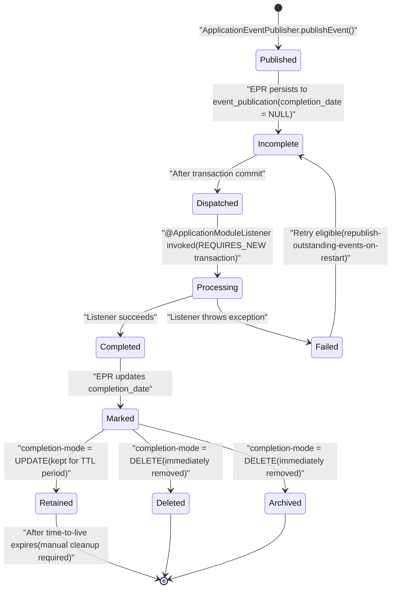
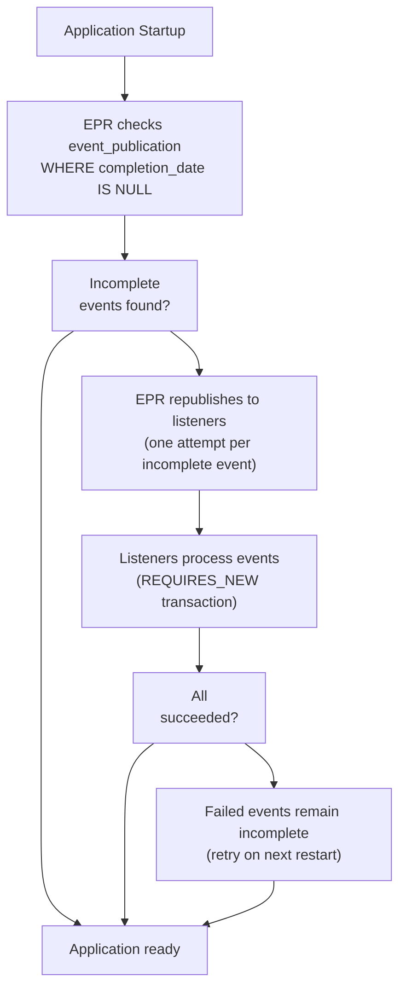
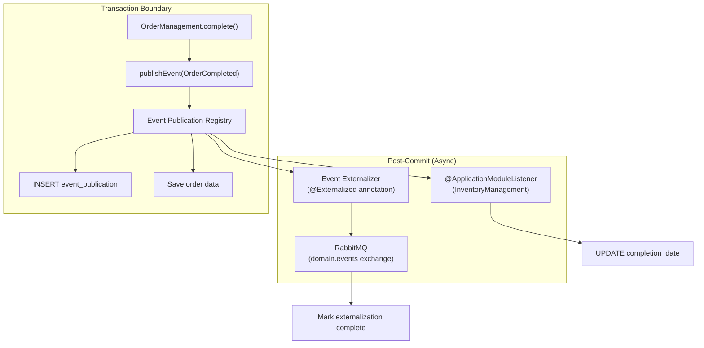

# Event Publication Registry

> **Relevant source files**
> * [Application_Events_and_AMQP_Integration.md](https://github.com/philipz/spring-monolith-amqp-poc/blob/c93f55b5/Application_Events_and_AMQP_Integration.md)
> * [CLAUDE.md](https://github.com/philipz/spring-monolith-amqp-poc/blob/c93f55b5/CLAUDE.md)
> * [Event-design.md](https://github.com/philipz/spring-monolith-amqp-poc/blob/c93f55b5/Event-design.md)
> * [src/main/resources/application.yml](https://github.com/philipz/spring-monolith-amqp-poc/blob/c93f55b5/src/main/resources/application.yml)

## Purpose and Scope

The Event Publication Registry (EPR) is Spring Modulith's implementation of the **transactional outbox pattern**, providing reliable, at-least-once delivery guarantees for application events. The EPR persists event publication records in the database within the same transaction as business logic, ensuring that events are never lost even if the application crashes before they can be dispatched to listeners or externalized to AMQP.

This document covers the EPR's database schema, transactional semantics, configuration options, completion modes, and event lifecycle management. For information about how events are externalized to RabbitMQ after being persisted in the EPR, see [Event Externalization](/philipz/spring-monolith-amqp-poc/6.2-event-externalization). For details on how listeners consume events from the EPR, see [Event Listeners](/philipz/spring-monolith-amqp-poc/6.3-event-listeners).

**Sources:** [src/main/resources/application.yml L28-L41](https://github.com/philipz/spring-monolith-amqp-poc/blob/c93f55b5/src/main/resources/application.yml#L28-L41)

 [CLAUDE.md L83-L90](https://github.com/philipz/spring-monolith-amqp-poc/blob/c93f55b5/CLAUDE.md#L83-L90)

 [Application_Events_and_AMQP_Integration.md L46-L62](https://github.com/philipz/spring-monolith-amqp-poc/blob/c93f55b5/Application_Events_and_AMQP_Integration.md#L46-L62)

---

## Database Schema

The EPR automatically creates the `event_publication` table to persist event publication records. The schema is initialized by Spring Modulith when `spring.modulith.events.jdbc.schema-initialization.enabled` is set to `true`.

### event_publication Table Structure

```python
#mermaid-svena7hbryb{font-family:ui-sans-serif,-apple-system,system-ui,Segoe UI,Helvetica;font-size:16px;fill:#333;}@keyframes edge-animation-frame{from{stroke-dashoffset:0;}}@keyframes dash{to{stroke-dashoffset:0;}}#mermaid-svena7hbryb .edge-animation-slow{stroke-dasharray:9,5!important;stroke-dashoffset:900;animation:dash 50s linear infinite;stroke-linecap:round;}#mermaid-svena7hbryb .edge-animation-fast{stroke-dasharray:9,5!important;stroke-dashoffset:900;animation:dash 20s linear infinite;stroke-linecap:round;}#mermaid-svena7hbryb .error-icon{fill:#dddddd;}#mermaid-svena7hbryb .error-text{fill:#222222;stroke:#222222;}#mermaid-svena7hbryb .edge-thickness-normal{stroke-width:1px;}#mermaid-svena7hbryb .edge-thickness-thick{stroke-width:3.5px;}#mermaid-svena7hbryb .edge-pattern-solid{stroke-dasharray:0;}#mermaid-svena7hbryb .edge-thickness-invisible{stroke-width:0;fill:none;}#mermaid-svena7hbryb .edge-pattern-dashed{stroke-dasharray:3;}#mermaid-svena7hbryb .edge-pattern-dotted{stroke-dasharray:2;}#mermaid-svena7hbryb .marker{fill:#999;stroke:#999;}#mermaid-svena7hbryb .marker.cross{stroke:#999;}#mermaid-svena7hbryb svg{font-family:ui-sans-serif,-apple-system,system-ui,Segoe UI,Helvetica;font-size:16px;}#mermaid-svena7hbryb p{margin:0;}#mermaid-svena7hbryb .entityBox{fill:#ffffff;stroke:#dddddd;}#mermaid-svena7hbryb .relationshipLabelBox{fill:#dddddd;opacity:0.7;background-color:#dddddd;}#mermaid-svena7hbryb .relationshipLabelBox rect{opacity:0.5;}#mermaid-svena7hbryb .labelBkg{background-color:rgba(221, 221, 221, 0.5);}#mermaid-svena7hbryb .edgeLabel .label{fill:#dddddd;font-size:14px;}#mermaid-svena7hbryb .label{font-family:ui-sans-serif,-apple-system,system-ui,Segoe UI,Helvetica;color:#333;}#mermaid-svena7hbryb .edge-pattern-dashed{stroke-dasharray:8,8;}#mermaid-svena7hbryb .node rect,#mermaid-svena7hbryb .node circle,#mermaid-svena7hbryb .node ellipse,#mermaid-svena7hbryb .node polygon{fill:#ffffff;stroke:#dddddd;stroke-width:1px;}#mermaid-svena7hbryb .relationshipLine{stroke:#999;stroke-width:1;fill:none;}#mermaid-svena7hbryb .marker{fill:none!important;stroke:#999!important;stroke-width:1;}#mermaid-svena7hbryb :root{--mermaid-font-family:"trebuchet ms",verdana,arial,sans-serif;}event_publicationUUIDidPKPrimary keyTEXTlistener_idIdentifier for the event listenerTEXTevent_typeFully qualified event class nameTEXTserialized_eventJSON-serialized event payloadTIMESTAMP_WITH_TIMEZONEpublication_dateWhen event was publishedTIMESTAMP_WITH_TIMEZONEcompletion_dateWhen listener completed (null if incomplete)
```

| Column | Type | Description |
| --- | --- | --- |
| `id` | UUID | Primary key uniquely identifying the event publication |
| `listener_id` | TEXT | Identifier for the target listener (e.g., `InventoryManagement.on(OrderCompleted)`) |
| `event_type` | TEXT | Fully qualified class name of the event (e.g., `com.example.domain.order.OrderCompleted`) |
| `serialized_event` | TEXT | JSON representation of the event object serialized via Jackson |
| `publication_date` | TIMESTAMP WITH TIME ZONE | Timestamp when the event was published within the transaction |
| `completion_date` | TIMESTAMP WITH TIME ZONE | Timestamp when the listener successfully processed the event (null for incomplete) |

**Sources:** [Application_Events_and_AMQP_Integration.md L50-L62](https://github.com/philipz/spring-monolith-amqp-poc/blob/c93f55b5/Application_Events_and_AMQP_Integration.md#L50-L62)

 [src/main/resources/application.yml L32-L34](https://github.com/philipz/spring-monolith-amqp-poc/blob/c93f55b5/src/main/resources/application.yml#L32-L34)

---

## Transactional Outbox Pattern Implementation

The EPR implements the transactional outbox pattern by hooking into Spring's `ApplicationEventPublisher` mechanism. When a transactional event listener (such as those annotated with `@ApplicationModuleListener`) is detected, Spring Modulith creates an entry in the `event_publication` table **within the same database transaction** as the business operation.

### Event Publication Flow

```mermaid
sequenceDiagram
  participant OrderManagement
  participant ApplicationEventPublisher
  participant Event Publication Registry
  participant PostgreSQL
  participant (event_publication table)
  participant @ApplicationModuleListener

  note over OrderManagement,(event_publication table): Single Transaction Boundary
  OrderManagement->>ApplicationEventPublisher: publishEvent(OrderCompleted)
  ApplicationEventPublisher->>Event Publication Registry: registerEventPublication()
  Event Publication Registry->>PostgreSQL: INSERT INTO event_publication
  OrderManagement->>PostgreSQL: (id, listener_id, event_type,
  PostgreSQL-->>OrderManagement: serialized_event, publication_date)
  note over Event Publication Registry,@ApplicationModuleListener: Asynchronous Processing
  Event Publication Registry->>@ApplicationModuleListener: Save business data
  @ApplicationModuleListener->>@ApplicationModuleListener: Transaction commits
  @ApplicationModuleListener-->>Event Publication Registry: Dispatch event
  Event Publication Registry->>PostgreSQL: (REQUIRES_NEW transaction)
```

This pattern ensures that:

1. Events are **atomically persisted** with business data
2. If the transaction rolls back, no event record is created
3. If the application crashes after commit but before listener execution, events can be **replayed on restart**

**Sources:** [CLAUDE.md L86-L90](https://github.com/philipz/spring-monolith-amqp-poc/blob/c93f55b5/CLAUDE.md#L86-L90)

 [Application_Events_and_AMQP_Integration.md L46-L49](https://github.com/philipz/spring-monolith-amqp-poc/blob/c93f55b5/Application_Events_and_AMQP_Integration.md#L46-L49)

 [Event-design.md L9-L12](https://github.com/philipz/spring-monolith-amqp-poc/blob/c93f55b5/Event-design.md#L9-L12)

---

## Event Lifecycle and Completion States

Events in the EPR progress through distinct lifecycle states from publication to completion. The EPR tracks these states through the presence or absence of the `completion_date` field.

### Event State Diagram



### Lifecycle Operations by Spring Modulith

| Operation | Component | Trigger |
| --- | --- | --- |
| **Persist** | `org.springframework.modulith.events.core.EventPublicationRegistry` | Within business transaction |
| **Dispatch** | `org.springframework.modulith.events.core.DefaultEventPublicationRegistry` | After transaction commit |
| **Mark Complete** | Spring Modulith Event Infrastructure | After listener success |
| **Republish** | `org.springframework.modulith.events.core.EventPublicationRegistry` | Application restart (if enabled) |
| **Cleanup** | User-scheduled job or `CompletedEventPublications` API | Scheduled or manual |

**Sources:** [Application_Events_and_AMQP_Integration.md L64-L71](https://github.com/philipz/spring-monolith-amqp-poc/blob/c93f55b5/Application_Events_and_AMQP_Integration.md#L64-L71)

 [src/main/resources/application.yml L36-L41](https://github.com/philipz/spring-monolith-amqp-poc/blob/c93f55b5/src/main/resources/application.yml#L36-L41)

---

## Completion Modes

Spring Modulith 1.3+ supports three completion modes via `spring.modulith.events.completion-mode`, controlling how completed events are managed after successful listener execution.

### Completion Mode Comparison

| Mode | Configuration Value | Behavior | Use Case |
| --- | --- | --- | --- |
| **UPDATE** | `UPDATE` | Sets `completion_date` but retains record | Production environments requiring audit trails and debugging history |
| **DELETE** | `DELETE` | Removes completed event immediately | Test environments or storage-constrained systems |
| **ARCHIVE** | `ARCHIVE` | Moves to separate archive table before deletion | Long-term compliance or analytics requirements |

### Production Configuration (UPDATE Mode)

The demo application uses `UPDATE` mode with a 7-day time-to-live:

```sql
spring:
  modulith:
    events:
      completion-mode: UPDATE
      time-to-live: 7d  # 604800 seconds
```

Completed events remain in `event_publication` with `completion_date` set, allowing:

* **Post-mortem debugging** of event processing failures
* **Audit trail** of all published events
* **Metrics collection** on event processing times

After the TTL expires, completed events should be cleaned up via scheduled jobs using the `CompletedEventPublications` API.

**Sources:** [src/main/resources/application.yml L38-L41](https://github.com/philipz/spring-monolith-amqp-poc/blob/c93f55b5/src/main/resources/application.yml#L38-L41)

 [Application_Events_and_AMQP_Integration.md L64-L71](https://github.com/philipz/spring-monolith-amqp-poc/blob/c93f55b5/Application_Events_and_AMQP_Integration.md#L64-L71)

### Test Configuration (DELETE Mode)

Test environments use `DELETE` mode for immediate cleanup:

```sql
# src/test/resources/application.yml
spring:
  modulith:
    events:
      completion-mode: DELETE
```

This reduces storage overhead and prevents test data accumulation in the H2 in-memory database.

**Sources:** [CLAUDE.md L108-L115](https://github.com/philipz/spring-monolith-amqp-poc/blob/c93f55b5/CLAUDE.md#L108-L115)

---

## Configuration Reference

### Core EPR Configuration Options

| Property | Type | Default | Description |
| --- | --- | --- | --- |
| `spring.modulith.events.jdbc.schema-initialization.enabled` | boolean | `false` | Automatically create `event_publication` table on startup |
| `spring.modulith.events.republish-outstanding-events-on-restart` | boolean | `false` | Retry incomplete events when application restarts |
| `spring.modulith.events.completion-mode` | enum | `UPDATE` | How to handle completed events: `UPDATE`, `DELETE`, or `ARCHIVE` |
| `spring.modulith.events.time-to-live` | duration | - | TTL for completed events (e.g., `7d`, `604800s`). Only applies to `UPDATE` mode |
| `spring.modulith.events.externalization.enabled` | boolean | `true` | Enable event externalization to AMQP (does not affect EPR persistence) |

### Production Configuration Example

```sql
spring:
  modulith:
    events:
      externalization:
        enabled: true
      jdbc:
        schema-initialization:
          enabled: true
      republish-outstanding-events-on-restart: true
      completion-mode: UPDATE
      time-to-live: 7d
```

**Sources:** [src/main/resources/application.yml L28-L41](https://github.com/philipz/spring-monolith-amqp-poc/blob/c93f55b5/src/main/resources/application.yml#L28-L41)

### Database Connection Configuration

The EPR uses the application's primary `DataSource`, configured via standard Spring Boot properties:

```yaml
spring:
  datasource:
    url: jdbc:postgresql://localhost:5432/postgres
    driver-class-name: org.postgresql.Driver
    username: postgres
    password: postgres
    hikari:
      maximum-pool-size: 10
      minimum-idle: 2
      connection-timeout: 30000
      idle-timeout: 600000
      max-lifetime: 1800000
```

**Sources:** [src/main/resources/application.yml L16-L26](https://github.com/philipz/spring-monolith-amqp-poc/blob/c93f55b5/src/main/resources/application.yml#L16-L26)

---

## Reliability Guarantees

### At-Least-Once Delivery

The EPR guarantees **at-least-once delivery** for all transactional event listeners through the following mechanisms:

1. **Transactional Persistence**: Events are persisted in the same transaction as business logic
2. **Crash Recovery**: `republish-outstanding-events-on-restart: true` ensures incomplete events are retried after application restart
3. **Exception Handling**: Listener exceptions do not mark events as complete, allowing retry
4. **Idempotency Requirement**: Listeners must be idempotent to handle duplicate deliveries

### Republish on Restart Configuration



This configuration is enabled in production:

```yaml
spring:
  modulith:
    events:
      republish-outstanding-events-on-restart: true
```

**Consequences:**

* Application startup may be delayed while incomplete events are processed
* Listeners receive events again, requiring idempotent handling
* Events that failed multiple times will be retried on every restart

**Sources:** [src/main/resources/application.yml L36](https://github.com/philipz/spring-monolith-amqp-poc/blob/c93f55b5/src/main/resources/application.yml#L36-L36)

 [CLAUDE.md L86-L90](https://github.com/philipz/spring-monolith-amqp-poc/blob/c93f55b5/CLAUDE.md#L86-L90)

 [Application_Events_and_AMQP_Integration.md L48](https://github.com/philipz/spring-monolith-amqp-poc/blob/c93f55b5/Application_Events_and_AMQP_Integration.md#L48-L48)

### Failure Scenarios and Recovery

| Scenario | EPR Behavior | Recovery |
| --- | --- | --- |
| **Transaction rollback** | No event record created | No action needed - event publication cancelled |
| **Crash before listener dispatch** | Event remains incomplete | Republished on restart |
| **Listener throws exception** | `completion_date` remains null | Republished on restart |
| **Crash during listener execution** | `completion_date` remains null | Republished on restart (listener must be idempotent) |
| **Database connection failure** | Transaction rolls back entirely | Standard database retry/failover mechanisms apply |

**Sources:** [Application_Events_and_AMQP_Integration.md L48-L49](https://github.com/philipz/spring-monolith-amqp-poc/blob/c93f55b5/Application_Events_and_AMQP_Integration.md#L48-L49)

---

## Event Management APIs

Spring Modulith provides APIs for programmatic management of events in the EPR, useful for operational tasks like cleanup and manual retry.

### CompletedEventPublications Interface

The `CompletedEventPublications` interface manages events with non-null `completion_date`.

```java
@Autowired
private CompletedEventPublications completedEvents;

// Delete completed events older than specified duration
completedEvents.deleteOlderThan(Duration.ofHours(1));

// Delete completed events published before specific instant
completedEvents.deletePublicationsOlderThan(Duration.ofDays(7));
```

**Common Operations:**

| Method | Purpose | Use Case |
| --- | --- | --- |
| `deletePublicationsOlderThan(Duration)` | Delete events older than specified duration | Scheduled cleanup jobs |
| `findAll()` | Query all completed events | Audit trail inspection |

### IncompleteEventPublications Interface

The `IncompleteEventPublications` interface manages events with null `completion_date`.

```java
@Autowired
private IncompleteEventPublications incompleteEvents;

// Resubmit failed events older than 5 minutes
incompleteEvents.resubmit(Duration.ofMinutes(5));

// Query incomplete events for monitoring
Collection<?> pending = incompleteEvents.findIncompletePublications();
```

**Common Operations:**

| Method | Purpose | Use Case |
| --- | --- | --- |
| `resubmit(Duration)` | Retry events that failed longer than specified duration ago | Manual recovery from transient failures |
| `findIncompletePublications()` | Query all incomplete events | Monitoring and alerting |

**Sources:** [Application_Events_and_AMQP_Integration.md L74-L85](https://github.com/philipz/spring-monolith-amqp-poc/blob/c93f55b5/Application_Events_and_AMQP_Integration.md#L74-L85)

### Scheduled Cleanup Example

Production deployments should implement scheduled cleanup to prevent unbounded growth of the `event_publication` table when using `UPDATE` completion mode:

```python
@Component
public class EventPublicationCleanup {
    
    @Autowired
    private CompletedEventPublications completedEvents;
    
    @Autowired
    private IncompleteEventPublications incompleteEvents;
    
    // Cleanup completed events daily
    @Scheduled(cron = "0 0 2 * * *")  // 2 AM daily
    public void cleanupCompletedEvents() {
        int deleted = completedEvents.deletePublicationsOlderThan(
            Duration.ofDays(7)
        );
        log.info("Cleaned up {} completed events older than 7 days", deleted);
    }
    
    // Retry stuck events every 5 minutes
    @Scheduled(fixedDelay = 300000)
    public void retryIncompleteEvents() {
        incompleteEvents.resubmitOlderThan(Duration.ofMinutes(5));
        log.info("Resubmitted incomplete events older than 5 minutes");
    }
}
```

**Sources:** [Application_Events_and_AMQP_Integration.md L267-L281](https://github.com/philipz/spring-monolith-amqp-poc/blob/c93f55b5/Application_Events_and_AMQP_Integration.md#L267-L281)

---

## Production vs Test Configuration

The EPR configuration differs significantly between production and test environments to balance reliability, performance, and storage concerns.

### Configuration Comparison

| Aspect | Production | Test |
| --- | --- | --- |
| **Database** | PostgreSQL (`jdbc:postgresql://localhost:5432/postgres`) | H2 in-memory (`jdbc:h2:mem:testdb;MODE=PostgreSQL`) |
| **Completion Mode** | `UPDATE` | `DELETE` |
| **Time-to-Live** | `7d` (604800 seconds) | Not applicable (immediate deletion) |
| **Republish on Restart** | `true` | `false` (typically) |
| **Schema Initialization** | `true` | `true` |
| **Event Externalization** | `true` | `false` (disabled to avoid AMQP dependencies) |

### Production Configuration

Located in [src/main/resources/application.yml L28-L41](https://github.com/philipz/spring-monolith-amqp-poc/blob/c93f55b5/src/main/resources/application.yml#L28-L41)

:

```sql
spring:
  datasource:
    url: jdbc:postgresql://localhost:5432/postgres
    driver-class-name: org.postgresql.Driver
  
  modulith:
    events:
      jdbc:
        schema-initialization:
          enabled: true
      republish-outstanding-events-on-restart: true
      completion-mode: UPDATE
      time-to-live: 7d
```

**Design Rationale:**

* PostgreSQL provides durable, ACID-compliant event storage
* `UPDATE` mode retains event history for debugging and audit
* 7-day TTL balances storage costs with debugging needs
* Republish on restart ensures no events are lost during deployments

**Sources:** [src/main/resources/application.yml L16-L41](https://github.com/philipz/spring-monolith-amqp-poc/blob/c93f55b5/src/main/resources/application.yml#L16-L41)

 [CLAUDE.md L104-L110](https://github.com/philipz/spring-monolith-amqp-poc/blob/c93f55b5/CLAUDE.md#L104-L110)

### Test Configuration

Located in [src/test/resources/application.yml](https://github.com/philipz/spring-monolith-amqp-poc/blob/c93f55b5/src/test/resources/application.yml)

:

```sql
spring:
  datasource:
    url: jdbc:h2:mem:testdb;MODE=PostgreSQL
    driver-class-name: org.h2.Driver
  
  modulith:
    events:
      externalization:
        enabled: false  # Disable AMQP in tests
      completion-mode: DELETE  # Immediate cleanup
```

**Design Rationale:**

* H2 in-memory database provides fast test execution
* `DELETE` mode prevents event accumulation between tests
* Disabled externalization avoids RabbitMQ connection requirements
* `MODE=PostgreSQL` ensures schema compatibility

**Sources:** [CLAUDE.md L111-L115](https://github.com/philipz/spring-monolith-amqp-poc/blob/c93f55b5/CLAUDE.md#L111-L115)

---

## Monitoring and Observability

### Query Incomplete Events

To monitor the health of event processing, query incomplete events:

```sql
-- Count incomplete events by type
SELECT event_type, COUNT(*) as pending_count
FROM event_publication
WHERE completion_date IS NULL
GROUP BY event_type
ORDER BY pending_count DESC;

-- Oldest incomplete events
SELECT event_type, publication_date, 
       NOW() - publication_date as age
FROM event_publication
WHERE completion_date IS NULL
ORDER BY publication_date ASC
LIMIT 10;
```

### Query Completed Events

To analyze event processing times:

```sql
-- Average processing time by event type
SELECT event_type, 
       AVG(EXTRACT(EPOCH FROM (completion_date - publication_date))) as avg_seconds
FROM event_publication
WHERE completion_date IS NOT NULL
GROUP BY event_type;

-- Events completed today
SELECT COUNT(*) as completed_today
FROM event_publication
WHERE completion_date >= CURRENT_DATE;
```

**Sources:** [Application_Events_and_AMQP_Integration.md L50-L62](https://github.com/philipz/spring-monolith-amqp-poc/blob/c93f55b5/Application_Events_and_AMQP_Integration.md#L50-L62)

---

## Integration with Event Externalization

The EPR works seamlessly with Spring Modulith's event externalization mechanism. Events marked with `@Externalized` are both:

1. Persisted in the EPR for reliable delivery to **internal listeners**
2. Published to RabbitMQ for **external consumers**

Both operations are coordinated by the EPR:



**Key Points:**

* EPR persists the event **before** externalization occurs
* If externalization fails, the event remains in EPR for retry
* Internal listeners and external publishing are independent operations
* Both respect the configured completion mode

For details on externalization configuration and routing, see [Event Externalization](/philipz/spring-monolith-amqp-poc/6.2-event-externalization).

**Sources:** [Application_Events_and_AMQP_Integration.md L123-L148](https://github.com/philipz/spring-monolith-amqp-poc/blob/c93f55b5/Application_Events_and_AMQP_Integration.md#L123-L148)

 [src/main/resources/application.yml L30-L31](https://github.com/philipz/spring-monolith-amqp-poc/blob/c93f55b5/src/main/resources/application.yml#L30-L31)