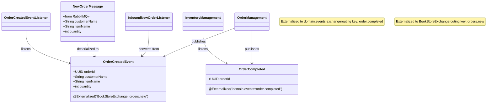
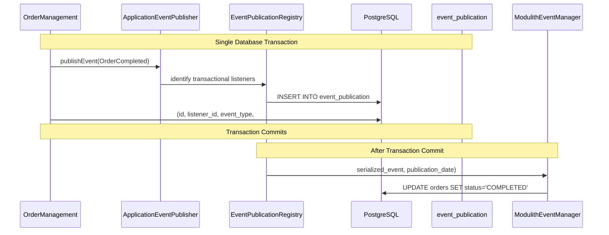
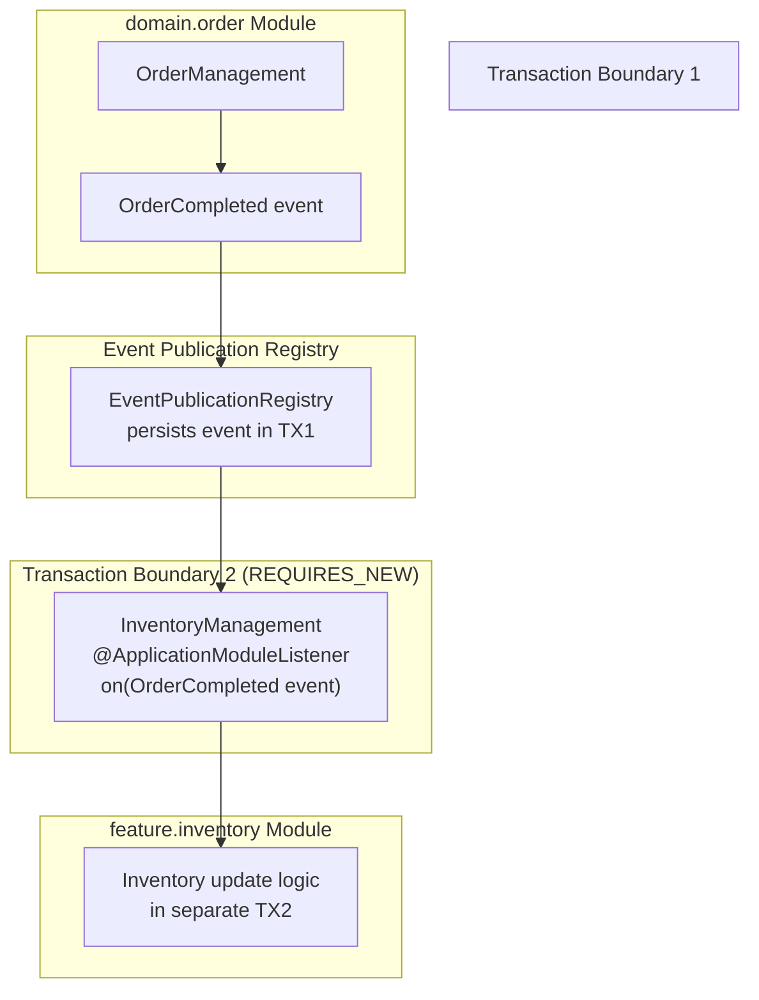
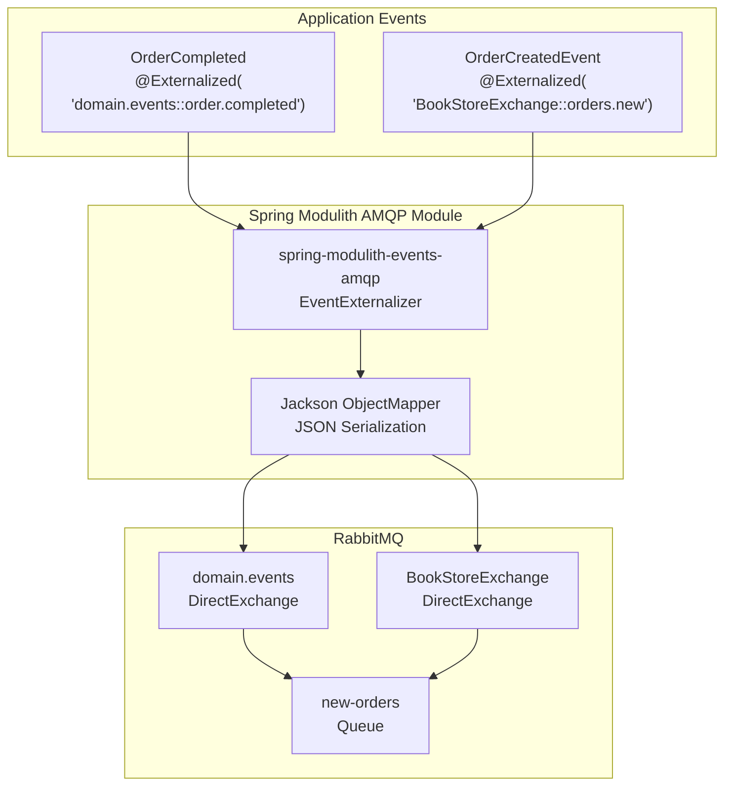
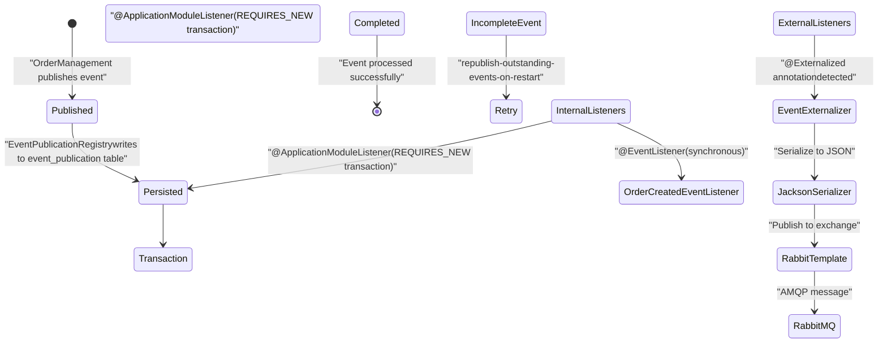

# Event System

> **Relevant source files**
> * [Application_Events_and_AMQP_Integration.md](https://github.com/philipz/spring-monolith-amqp-poc/blob/c93f55b5/Application_Events_and_AMQP_Integration.md)
> * [CLAUDE.md](https://github.com/philipz/spring-monolith-amqp-poc/blob/c93f55b5/CLAUDE.md)
> * [Event-design.md](https://github.com/philipz/spring-monolith-amqp-poc/blob/c93f55b5/Event-design.md)

## Purpose and Scope

This page provides a comprehensive overview of the event system in the spring-monolith-amqp-poc application. It covers the complete event lifecycle from publication through persistence, consumption, and externalization to RabbitMQ. The event system is built on Spring Modulith's Application Events framework and implements the transactional outbox pattern for reliable event processing.

For detailed information on specific aspects:

* Event persistence and reliability guarantees: see [Event Publication Registry](/philipz/spring-monolith-amqp-poc/6.1-event-publication-registry)
* AMQP externalization configuration: see [Event Externalization](/philipz/spring-monolith-amqp-poc/6.2-event-externalization)
* Internal event consumption patterns: see [Event Listeners](/philipz/spring-monolith-amqp-poc/6.3-event-listeners)
* RabbitMQ topology and routing: see [Topology Configuration](/philipz/spring-monolith-amqp-poc/7.1-topology-configuration)

---

## Event-Driven Architecture Overview

The application uses Spring Modulith's event-driven architecture to enable loose coupling between modules. All inter-module communication occurs exclusively through events, with no direct bean dependencies crossing module boundaries. This design enforces the principle that modules should be independently deployable and testable.

The event system consists of four main components:

| Component | Implementation | Responsibility |
| --- | --- | --- |
| Event Publisher | `ApplicationEventPublisher` | Publishes domain events within transactions |
| Event Publication Registry | `event_publication` table in PostgreSQL | Persists events for reliability (transactional outbox pattern) |
| Event Dispatcher | Spring Modulith's `EventPublicationRegistry` | Dispatches events to listeners asynchronously |
| Event Externalizer | `spring-modulith-events-amqp` | Publishes `@Externalized` events to RabbitMQ |

**Sources:** [CLAUDE.md L59-L92](https://github.com/philipz/spring-monolith-amqp-poc/blob/c93f55b5/CLAUDE.md#L59-L92)

 [Application_Events_and_AMQP_Integration.md L1-L49](https://github.com/philipz/spring-monolith-amqp-poc/blob/c93f55b5/Application_Events_and_AMQP_Integration.md#L1-L49)

---

## Core Event Types and Flow

### Domain Events

The application defines several domain events that represent state changes in the business domain:

**Event Type Diagram**



**Sources:** [CLAUDE.md L65-L69](https://github.com/philipz/spring-monolith-amqp-poc/blob/c93f55b5/CLAUDE.md#L65-L69)

 [README.md L45-L65](https://github.com/philipz/spring-monolith-amqp-poc/blob/c93f55b5/README.md#L45-L65)

### Event Publishing Pattern

Events are published using Spring's `ApplicationEventPublisher` within transactional boundaries. The pattern ensures that events are persisted atomically with business state changes:

```
// Pattern used in OrderManagement service
@Transactional
public void complete(UUID orderId) {
    // Business logic updates database
    // Event published within same transaction
    events.publishEvent(new OrderCompleted(orderId));
}
```

The key classes involved:

* **Publisher**: `OrderManagement` service [src/main/java/dev/dotspace/demo/order/OrderManagement.java](https://github.com/philipz/spring-monolith-amqp-poc/blob/c93f55b5/src/main/java/dev/dotspace/demo/order/OrderManagement.java)
* **Events**: `OrderCompleted` [src/main/java/dev/dotspace/demo/order/OrderCompleted.java](https://github.com/philipz/spring-monolith-amqp-poc/blob/c93f55b5/src/main/java/dev/dotspace/demo/order/OrderCompleted.java)  `OrderCreatedEvent` [src/main/java/dev/dotspace/demo/order/OrderCreatedEvent.java](https://github.com/philipz/spring-monolith-amqp-poc/blob/c93f55b5/src/main/java/dev/dotspace/demo/order/OrderCreatedEvent.java)
* **Controller**: `OrderController` [src/main/java/dev/dotspace/demo/order/OrderController.java](https://github.com/philipz/spring-monolith-amqp-poc/blob/c93f55b5/src/main/java/dev/dotspace/demo/order/OrderController.java)  exposes REST endpoints that trigger event publication

**Sources:** [CLAUDE.md L20-L30](https://github.com/philipz/spring-monolith-amqp-poc/blob/c93f55b5/CLAUDE.md#L20-L30)

 [Application_Events_and_AMQP_Integration.md L15-L29](https://github.com/philipz/spring-monolith-amqp-poc/blob/c93f55b5/Application_Events_and_AMQP_Integration.md#L15-L29)

 [Event-design.md L14-L30](https://github.com/philipz/spring-monolith-amqp-poc/blob/c93f55b5/Event-design.md#L14-L30)

---

## Event Publication and Persistence

### Transactional Outbox Pattern

The Event Publication Registry implements the transactional outbox pattern by persisting events in the `event_publication` table within the same database transaction as business data changes. This guarantees that events are never lost, even if the application crashes before processing them.

**Event Persistence Flow**



**Database Schema:**

| Column | Type | Purpose |
| --- | --- | --- |
| `id` | UUID | Primary key for event |
| `listener_id` | TEXT | Identifies the listener method |
| `event_type` | TEXT | Fully qualified class name |
| `serialized_event` | TEXT | JSON representation of event |
| `publication_date` | TIMESTAMP | When event was published |
| `completion_date` | TIMESTAMP | When listener completed (nullable) |

**Sources:** [Application_Events_and_AMQP_Integration.md L44-L62](https://github.com/philipz/spring-monolith-amqp-poc/blob/c93f55b5/Application_Events_and_AMQP_Integration.md#L44-L62)

 [CLAUDE.md L86-L91](https://github.com/philipz/spring-monolith-amqp-poc/blob/c93f55b5/CLAUDE.md#L86-L91)

 [application.yml L46-L52](https://github.com/philipz/spring-monolith-amqp-poc/blob/c93f55b5/application.yml#L46-L52)

### Event Completion Modes

The application uses `UPDATE` mode in production and `DELETE` mode in tests:

**Production Configuration** [application.yml L47-L51](https://github.com/philipz/spring-monolith-amqp-poc/blob/c93f55b5/application.yml#L47-L51)

:

```sql
spring:
  modulith:
    events:
      completion-mode: UPDATE
      delete-completed-events-after: 7d
```

**Test Configuration** [src/test/resources/application.yml L17-L18](https://github.com/philipz/spring-monolith-amqp-poc/blob/c93f55b5/src/test/resources/application.yml#L17-L18)

:

```sql
spring:
  modulith:
    events:
      completion-mode: DELETE
```

The `UPDATE` mode preserves a 7-day audit trail of completed events, while `DELETE` mode immediately removes completed events to reduce test data accumulation.

**Sources:** [application.yml L46-L52](https://github.com/philipz/spring-monolith-amqp-poc/blob/c93f55b5/application.yml#L46-L52)

 [src/test/resources/application.yml L16-L18](https://github.com/philipz/spring-monolith-amqp-poc/blob/c93f55b5/src/test/resources/application.yml#L16-L18)

 [Application_Events_and_AMQP_Integration.md L64-L70](https://github.com/philipz/spring-monolith-amqp-poc/blob/c93f55b5/Application_Events_and_AMQP_Integration.md#L64-L70)

---

## Event Consumption Patterns

### @ApplicationModuleListener

The recommended pattern for consuming events across module boundaries is `@ApplicationModuleListener`, which combines three Spring annotations into one:

* `@Async` - Executes asynchronously
* `@Transactional(propagation = REQUIRES_NEW)` - Creates new transaction
* `@TransactionalEventListener` - Waits for transaction commit

**Event Listener Pattern Example:**



**Key Implementation:**

The `InventoryManagement` class [src/main/java/dev/dotspace/demo/inventory/InventoryManagement.java](https://github.com/philipz/spring-monolith-amqp-poc/blob/c93f55b5/src/main/java/dev/dotspace/demo/inventory/InventoryManagement.java)

 demonstrates the pattern:

```
@ApplicationModuleListener
void on(OrderCompleted event) {
    // Runs asynchronously in new transaction (REQUIRES_NEW)
    // Failure here doesn't affect original order transaction
    log.info("Order completed: {}", event.orderId());
}
```

**Transaction Isolation Benefits:**

| Aspect | Behavior | Benefit |
| --- | --- | --- |
| Transaction Propagation | `REQUIRES_NEW` | Failures in listener don't rollback publisher |
| Async Execution | After original TX commits | Non-blocking for publisher |
| Retry Support | Via Event Publication Registry | Automatic retry on application restart |
| Module Isolation | No shared transaction context | Modules remain independent |

**Sources:** [CLAUDE.md L86-L91](https://github.com/philipz/spring-monolith-amqp-poc/blob/c93f55b5/CLAUDE.md#L86-L91)

 [Event-design.md L9-L39](https://github.com/philipz/spring-monolith-amqp-poc/blob/c93f55b5/Event-design.md#L9-L39)

 [Application_Events_and_AMQP_Integration.md L30-L42](https://github.com/philipz/spring-monolith-amqp-poc/blob/c93f55b5/Application_Events_and_AMQP_Integration.md#L30-L42)

### Internal Listeners

The application also uses `@EventListener` for synchronous event consumption within the same module:

* `OrderCreatedEventListener` [src/main/java/dev/dotspace/demo/order/OrderCreatedEventListener.java](https://github.com/philipz/spring-monolith-amqp-poc/blob/c93f55b5/src/main/java/dev/dotspace/demo/order/OrderCreatedEventListener.java)  listens synchronously to `OrderCreatedEvent` within the order module
* This pattern is used when synchronous processing within the same transaction boundary is desired

**Sources:** [CLAUDE.md L72](https://github.com/philipz/spring-monolith-amqp-poc/blob/c93f55b5/CLAUDE.md#L72-L72)

 [src/main/java/dev/dotspace/demo/order/OrderCreatedEventListener.java](https://github.com/philipz/spring-monolith-amqp-poc/blob/c93f55b5/src/main/java/dev/dotspace/demo/order/OrderCreatedEventListener.java)

---

## Event Externalization to RabbitMQ

### @Externalized Annotation

Events marked with `@Externalized` are automatically published to RabbitMQ after successful persistence in the Event Publication Registry. The annotation specifies the exchange and routing key using the pattern: `"exchange::routingKey"`.

**Event Externalization Mapping:**



**Externalization Configuration:**

The feature is enabled in [application.yml L44-L45](https://github.com/philipz/spring-monolith-amqp-poc/blob/c93f55b5/application.yml#L44-L45)

:

```yaml
spring:
  modulith:
    events:
      externalization:
        enabled: true
```

For test environments, externalization is disabled in [src/test/resources/application.yml L14-L15](https://github.com/philipz/spring-monolith-amqp-poc/blob/c93f55b5/src/test/resources/application.yml#L14-L15)

:

```yaml
spring:
  modulith:
    events:
      externalization:
        enabled: false
```

**Sources:** [CLAUDE.md L67-L69](https://github.com/philipz/spring-monolith-amqp-poc/blob/c93f55b5/CLAUDE.md#L67-L69)

 [Event-design.md L45-L92](https://github.com/philipz/spring-monolith-amqp-poc/blob/c93f55b5/Event-design.md#L45-L92)

 [application.yml L43-L45](https://github.com/philipz/spring-monolith-amqp-poc/blob/c93f55b5/application.yml#L43-L45)

 [Application_Events_and_AMQP_Integration.md L123-L140](https://github.com/philipz/spring-monolith-amqp-poc/blob/c93f55b5/Application_Events_and_AMQP_Integration.md#L123-L140)

### JSON Serialization

Events are serialized to JSON using Jackson's `ObjectMapper`. The `spring-modulith-events-jackson` dependency provides automatic serialization support.

**Dependency:** [pom.xml L43-L47](https://github.com/philipz/spring-monolith-amqp-poc/blob/c93f55b5/pom.xml#L43-L47)

```xml
<dependency>
    <groupId>org.springframework.modulith</groupId>
    <artifactId>spring-modulith-events-jackson</artifactId>
</dependency>
```

**Sources:** [pom.xml L43-L47](https://github.com/philipz/spring-monolith-amqp-poc/blob/c93f55b5/pom.xml#L43-L47)

 [Event-design.md L67-L72](https://github.com/philipz/spring-monolith-amqp-poc/blob/c93f55b5/Event-design.md#L67-L72)

 [Application_Events_and_AMQP_Integration.md L191-L204](https://github.com/philipz/spring-monolith-amqp-poc/blob/c93f55b5/Application_Events_and_AMQP_Integration.md#L191-L204)

---

## Inbound Message Processing

### Converting External Messages to Internal Events

The `inbound.amqp` module bridges external RabbitMQ messages to internal application events. This creates a unidirectional integration where external systems can trigger internal workflows.

**Inbound Message Flow:**

```mermaid
sequenceDiagram
  participant RabbitMQ
  participant new-orders queue
  participant InboundNewOrderListener
  participant @RabbitListener
  participant ApplicationEventPublisher
  participant EventPublicationRegistry
  participant OrderCreatedEventListener
  participant @EventListener
  participant InventoryManagement
  participant @ApplicationModuleListener

  RabbitMQ->>InboundNewOrderListener: NewOrderMessage (JSON)
  InboundNewOrderListener->>InboundNewOrderListener: deserialize to NewOrderMessage
  InboundNewOrderListener->>InboundNewOrderListener: convert to OrderCreatedEvent
  InboundNewOrderListener->>ApplicationEventPublisher: publishEvent(OrderCreatedEvent)
  ApplicationEventPublisher->>EventPublicationRegistry: persist event
  ApplicationEventPublisher->>OrderCreatedEventListener: dispatch synchronously (@EventListener)
  OrderCreatedEventListener->>OrderCreatedEventListener: log order created
  ApplicationEventPublisher->>InventoryManagement: dispatch async (@ApplicationModuleListener)
  InventoryManagement->>InventoryManagement: process in new transaction
  InboundNewOrderListener->>RabbitMQ: acknowledge (manual ACK)
```

**Key Classes:**

* `InboundNewOrderListener` [src/main/java/dev/dotspace/demo/amqp/InboundNewOrderListener.java](https://github.com/philipz/spring-monolith-amqp-poc/blob/c93f55b5/src/main/java/dev/dotspace/demo/amqp/InboundNewOrderListener.java)  - `@RabbitListener` that consumes from `new-orders` queue
* `NewOrderMessage` - DTO for deserializing incoming JSON messages
* `OrderCreatedEvent` - Internal domain event published after conversion

**Manual Acknowledgment:**

The listener uses manual acknowledgment mode [application.yml L36-L37](https://github.com/philipz/spring-monolith-amqp-poc/blob/c93f55b5/application.yml#L36-L37)

:

```yaml
spring:
  rabbitmq:
    listener:
      simple:
        acknowledge-mode: manual
```

This ensures messages are only acknowledged after successful conversion and internal event publication.

**Sources:** [CLAUDE.md L74-L78](https://github.com/philipz/spring-monolith-amqp-poc/blob/c93f55b5/CLAUDE.md#L74-L78)

 [src/main/java/dev/dotspace/demo/amqp/InboundNewOrderListener.java](https://github.com/philipz/spring-monolith-amqp-poc/blob/c93f55b5/src/main/java/dev/dotspace/demo/amqp/InboundNewOrderListener.java)

 [application.yml L30-L42](https://github.com/philipz/spring-monolith-amqp-poc/blob/c93f55b5/application.yml#L30-L42)

---

## Complete Event Lifecycle

### End-to-End Flow

**Complete Event Lifecycle Diagram:**



### Reliability Guarantees

The event system provides several reliability guarantees:

| Guarantee | Implementation | Configuration |
| --- | --- | --- |
| At-least-once delivery | Event Publication Registry with transactional outbox | Always enabled |
| Automatic retry | Republish on application restart | `republish-outstanding-events-on-restart: true` |
| Event audit trail | 7-day retention of completed events | `delete-completed-events-after: 7d` |
| Transaction isolation | `REQUIRES_NEW` for listeners | Built into `@ApplicationModuleListener` |
| Manual acknowledgment | RabbitMQ message ACK after processing | `acknowledge-mode: manual` |

**Configuration:** [application.yml L46-L52](https://github.com/philipz/spring-monolith-amqp-poc/blob/c93f55b5/application.yml#L46-L52)

**Sources:** [CLAUDE.md L86-L91](https://github.com/philipz/spring-monolith-amqp-poc/blob/c93f55b5/CLAUDE.md#L86-L91)

 [Application_Events_and_AMQP_Integration.md L44-L49](https://github.com/philipz/spring-monolith-amqp-poc/blob/c93f55b5/Application_Events_and_AMQP_Integration.md#L44-L49)

 [application.yml L46-L52](https://github.com/philipz/spring-monolith-amqp-poc/blob/c93f55b5/application.yml#L46-L52)

---

## Event Configuration Reference

### Production Configuration

**Key Settings** [application.yml L43-L52](https://github.com/philipz/spring-monolith-amqp-poc/blob/c93f55b5/application.yml#L43-L52)

:

```sql
spring:
  modulith:
    events:
      externalization:
        enabled: true
      completion-mode: UPDATE
      delete-completed-events-after: 7d
      republish-outstanding-events-on-restart: true
```

| Property | Value | Purpose |
| --- | --- | --- |
| `externalization.enabled` | `true` | Enable AMQP event externalization |
| `completion-mode` | `UPDATE` | Keep completed events for audit (7 days) |
| `delete-completed-events-after` | `7d` | Auto-delete events after 7 days |
| `republish-outstanding-events-on-restart` | `true` | Retry incomplete events on startup |

### Test Configuration

**Test Overrides** [src/test/resources/application.yml L13-L18](https://github.com/philipz/spring-monolith-amqp-poc/blob/c93f55b5/src/test/resources/application.yml#L13-L18)

:

```sql
spring:
  modulith:
    events:
      externalization:
        enabled: false
      completion-mode: DELETE
```

Tests use `DELETE` mode to avoid accumulating event history and disable externalization to avoid requiring RabbitMQ in test environments.

**Sources:** [application.yml L43-L52](https://github.com/philipz/spring-monolith-amqp-poc/blob/c93f55b5/application.yml#L43-L52)

 [src/test/resources/application.yml L13-L18](https://github.com/philipz/spring-monolith-amqp-poc/blob/c93f55b5/src/test/resources/application.yml#L13-L18)

 [CLAUDE.md L103-L116](https://github.com/philipz/spring-monolith-amqp-poc/blob/c93f55b5/CLAUDE.md#L103-L116)

---

## Dependencies

The event system requires the following Maven dependencies:

**Core Event Dependencies** [pom.xml L27-L47](https://github.com/philipz/spring-monolith-amqp-poc/blob/c93f55b5/pom.xml#L27-L47)

:

| Dependency | Purpose |
| --- | --- |
| `spring-modulith-starter-jpa` | Event Publication Registry with JPA/JDBC persistence |
| `spring-modulith-events-amqp` | AMQP event externalization support |
| `spring-modulith-events-jackson` | JSON serialization for events |
| `spring-rabbit` | RabbitMQ client integration |

**Sources:** [pom.xml L27-L47](https://github.com/philipz/spring-monolith-amqp-poc/blob/c93f55b5/pom.xml#L27-L47)

 [CLAUDE.md L7](https://github.com/philipz/spring-monolith-amqp-poc/blob/c93f55b5/CLAUDE.md#L7-L7)

 [Application_Events_and_AMQP_Integration.md L91-L105](https://github.com/philipz/spring-monolith-amqp-poc/blob/c93f55b5/Application_Events_and_AMQP_Integration.md#L91-L105)