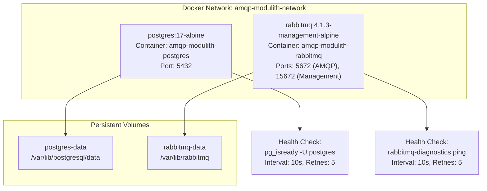
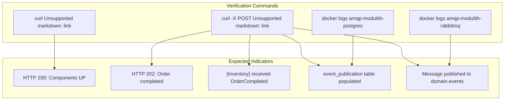
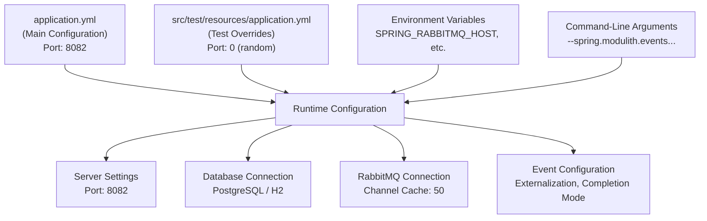

# Getting Started

> **Relevant source files**
> * [README.md](https://github.com/philipz/spring-monolith-amqp-poc/blob/c93f55b5/README.md)
> * [docker-compose.yml](https://github.com/philipz/spring-monolith-amqp-poc/blob/c93f55b5/docker-compose.yml)
> * [mvnw](https://github.com/philipz/spring-monolith-amqp-poc/blob/c93f55b5/mvnw)
> * [src/main/java/com/example/modulithdemo/inventory/app/InventoryManagement.java](https://github.com/philipz/spring-monolith-amqp-poc/blob/c93f55b5/src/main/java/com/example/modulithdemo/inventory/app/InventoryManagement.java)
> * [src/main/java/com/example/modulithdemo/inventory/app/OrderCreatedEventListener.java](https://github.com/philipz/spring-monolith-amqp-poc/blob/c93f55b5/src/main/java/com/example/modulithdemo/inventory/app/OrderCreatedEventListener.java)
> * [src/main/resources/application.yml](https://github.com/philipz/spring-monolith-amqp-poc/blob/c93f55b5/src/main/resources/application.yml)
> * [src/test/resources/application.yml](https://github.com/philipz/spring-monolith-amqp-poc/blob/c93f55b5/src/test/resources/application.yml)

This page provides step-by-step instructions for setting up and running the spring-monolith-amqp-poc application in a local development environment. It covers infrastructure provisioning, application build, startup procedures, and verification steps.

For architectural concepts and module design patterns, see [Architecture](/philipz/spring-monolith-amqp-poc/3-architecture). For detailed configuration reference, see [Configuration](/philipz/spring-monolith-amqp-poc/4-configuration). For development workflows and testing strategies, see [Development Guide](/philipz/spring-monolith-amqp-poc/8-development-guide).

---

## Prerequisites

The following software must be installed before proceeding:

| Requirement | Version | Purpose |
| --- | --- | --- |
| **Java Development Kit (JDK)** | 21 or higher | Application runtime and compilation |
| **Docker** | 20.10+ | Infrastructure containers (PostgreSQL, RabbitMQ) |
| **Docker Compose** | 2.0+ | Multi-container orchestration |
| **Maven** | 3.8+ (or use included wrapper) | Build tool and dependency management |

**Verification Commands:**

```markdown
java -version        # Should show Java 21+
docker --version     # Should show Docker 20.10+
docker-compose --version  # Should show Compose 2.0+
./mvnw --version     # Maven wrapper (downloads Maven if needed)
```

**Sources:** [README.md L14-L16](https://github.com/philipz/spring-monolith-amqp-poc/blob/c93f55b5/README.md#L14-L16)

---

## Infrastructure Setup

The application requires two backing services: PostgreSQL for data persistence and event publication registry, and RabbitMQ for AMQP message routing. These are provisioned via Docker Compose.

### Docker Compose Topology



**Sources:** [docker-compose.yml L1-L50](https://github.com/philipz/spring-monolith-amqp-poc/blob/c93f55b5/docker-compose.yml#L1-L50)

### Start Infrastructure

Execute the following command from the repository root:

```
docker-compose up -d
```

This command:

1. Creates the `amqp-modulith-network` bridge network
2. Pulls container images if not present locally
3. Starts PostgreSQL on `localhost:5432` with credentials `postgres/postgres`
4. Starts RabbitMQ on `localhost:5672` (AMQP) and `localhost:15672` (Management UI)
5. Initializes persistent volumes for data retention

### Verify Infrastructure Health

```markdown
# Check container status
docker-compose ps

# Expected output: Both services should show "healthy" status
# NAME                        STATUS
# amqp-modulith-postgres      Up (healthy)
# amqp-modulith-rabbitmq      Up (healthy)

# Test PostgreSQL connectivity
docker exec amqp-modulith-postgres pg_isready -U postgres

# Test RabbitMQ connectivity
docker exec amqp-modulith-rabbitmq rabbitmq-diagnostics ping
```

**RabbitMQ Management UI:** Navigate to `http://localhost:15672` (credentials: `guest/guest`) to inspect exchanges, queues, and message flow.

**Sources:** [docker-compose.yml L2-L39](https://github.com/philipz/spring-monolith-amqp-poc/blob/c93f55b5/docker-compose.yml#L2-L39)

---

## Building the Application

The project uses Maven with the Spring Boot plugin for building and packaging.

### Build Commands

```go
# Clean build with all tests
./mvnw clean verify

# Build without running tests (faster)
./mvnw clean package -DskipTests

# Run tests only
./mvnw test
```

The build process:

1. Resolves dependencies defined in [pom.xml L7-L80](https://github.com/philipz/spring-monolith-amqp-poc/blob/c93f55b5/pom.xml#L7-L80)
2. Compiles Java sources with Java 21 target
3. Executes unit and integration tests
4. Packages application into executable JAR: `target/modulithdemo-0.0.1-SNAPSHOT.jar`

**Sources:** [README.md L17-L24](https://github.com/philipz/spring-monolith-amqp-poc/blob/c93f55b5/README.md#L17-L24)

 [mvnw L1-L296](https://github.com/philipz/spring-monolith-amqp-poc/blob/c93f55b5/mvnw#L1-L296)

---

## Running the Application

### Startup Sequence

```mermaid
sequenceDiagram
  participant Developer
  participant Spring Boot Application
  participant (Port 8082)
  participant PostgreSQL
  participant (Port 5432)
  participant RabbitMQ
  participant (Port 5672)

  Developer->>Spring Boot Application: "./mvnw spring-boot:run"
  note over Spring Boot Application,(Port 5432): Database Initialization
  Spring Boot Application->>PostgreSQL: "Connect to jdbc:postgresql://localhost:5432/postgres"
  PostgreSQL-->>Spring Boot Application: "Connection established"
  Spring Boot Application->>PostgreSQL: "Initialize event_publication table
  PostgreSQL-->>Spring Boot Application: (spring.modulith.events.jdbc.schema-initialization)"
  note over Spring Boot Application,(Port 5672): AMQP Initialization
  Spring Boot Application->>RabbitMQ: "Schema ready"
  RabbitMQ-->>Spring Boot Application: "Connect to localhost:5672 (guest/guest)"
  Spring Boot Application->>RabbitMQ: "Connection established (50 channels cached)"
  Spring Boot Application->>RabbitMQ: "Declare exchanges: domain.events, BookStoreExchange, BookStoreDLX"
  Spring Boot Application->>RabbitMQ: "Declare queues: new-orders, new-orders-dlq"
  RabbitMQ-->>Spring Boot Application: "Bind queue new-orders if app.amqp.new-orders.bind=true"
  note over Spring Boot Application,(Port 8082): Module Initialization
  Spring Boot Application->>Spring Boot Application: "Topology configured"
  Spring Boot Application->>Spring Boot Application: "Load modules: domain/order, feature/inventory, inbound/amqp"
  Spring Boot Application->>Spring Boot Application: "Register @ApplicationModuleListener beans"
  Spring Boot Application-->>Developer: "Start @RabbitListener consumers"
```

**Sources:** [src/main/resources/application.yml L1-L67](https://github.com/philipz/spring-monolith-amqp-poc/blob/c93f55b5/src/main/resources/application.yml#L1-L67)

### Startup Options

#### Option 1: Maven Spring Boot Plugin (Development)

```
./mvnw spring-boot:run
```

This method automatically recompiles changed classes and is suitable for active development.

#### Option 2: Executable JAR (Production-like)

```markdown
# Build JAR first
./mvnw clean package

# Run JAR
java -jar target/modulithdemo-0.0.1-SNAPSHOT.jar
```

This method simulates production deployment and includes all dependencies in a single artifact.

**Sources:** [README.md L20-L24](https://github.com/philipz/spring-monolith-amqp-poc/blob/c93f55b5/README.md#L20-L24)

### Environment Variable Overrides

The application supports runtime configuration via environment variables:

| Variable | Default | Purpose |
| --- | --- | --- |
| `SPRING_RABBITMQ_HOST` | `localhost` | RabbitMQ server hostname |
| `SPRING_RABBITMQ_PORT` | `5672` | RabbitMQ AMQP port |
| `SPRING_RABBITMQ_USERNAME` | `guest` | RabbitMQ authentication username |
| `SPRING_RABBITMQ_PASSWORD` | `guest` | RabbitMQ authentication password |
| `SPRING_DATASOURCE_URL` | `jdbc:postgresql://localhost:5432/postgres` | PostgreSQL JDBC URL |
| `SPRING_DATASOURCE_USERNAME` | `postgres` | PostgreSQL username |
| `SPRING_DATASOURCE_PASSWORD` | `postgres` | PostgreSQL password |
| `SPRING_MODULITH_EVENTS_EXTERNALIZATION_ENABLED` | `true` | Enable/disable event externalization to RabbitMQ |

**Example with overrides:**

```
SPRING_RABBITMQ_HOST=rabbitmq-server \
SPRING_RABBITMQ_USERNAME=admin \
SPRING_RABBITMQ_PASSWORD=secret123 \
./mvnw spring-boot:run
```

**Sources:** [src/main/resources/application.yml L8-L31](https://github.com/philipz/spring-monolith-amqp-poc/blob/c93f55b5/src/main/resources/application.yml#L8-L31)

### Running Without RabbitMQ

If RabbitMQ is unavailable, the application can still run with internal event processing by disabling AMQP features:

```
./mvnw spring-boot:run \
  -Dspring-boot.run.arguments="\
  --spring.modulith.events.externalization.enabled=false \
  --spring.rabbitmq.listener.simple.auto-startup=false"
```

This configuration:

* Disables event externalization to RabbitMQ ([application.yml L31](https://github.com/philipz/spring-monolith-amqp-poc/blob/c93f55b5/application.yml#L31-L31) )
* Prevents `@RabbitListener` beans from starting ([InboundNewOrderListener](https://github.com/philipz/spring-monolith-amqp-poc/blob/c93f55b5/InboundNewOrderListener)  [InboundAmqpAdapter](https://github.com/philipz/spring-monolith-amqp-poc/blob/c93f55b5/InboundAmqpAdapter) )
* Maintains internal event bus functionality for module communication

**Sources:** [README.md L26-L29](https://github.com/philipz/spring-monolith-amqp-poc/blob/c93f55b5/README.md#L26-L29)

---

## Verification Steps

### Application Health Check

```css
# Check application status
curl http://localhost:8082/actuator/health

# Expected response:
# {
#   "status": "UP",
#   "components": {
#     "db": {"status": "UP"},
#     "rabbit": {"status": "UP"}
#   }
# }
```

**Sources:** [src/main/resources/application.yml L48-L56](https://github.com/philipz/spring-monolith-amqp-poc/blob/c93f55b5/src/main/resources/application.yml#L48-L56)

### Module and Component Verification



### Functional Verification: Complete an Order

```css
# Generate a random UUID for testing
ORDER_ID=$(uuidgen)

# Trigger order completion
curl -X POST "http://localhost:8082/orders/${ORDER_ID}/complete"

# Expected HTTP response: 202 Accepted
```

**Expected log output:**

```
[Inventory] received OrderCompleted: OrderCompleted[orderId=<UUID>]
Published event to exchange 'domain.events' with routing key 'order.completed'
```

The above verifies:

1. REST endpoint (`OrderController`) is accessible
2. Internal event publication works (`OrderManagement` → event bus)
3. Event listener execution (`InventoryManagement.on(OrderCompleted)`)
4. Event externalization to RabbitMQ (if enabled)

**Sources:** [README.md L119-L126](https://github.com/philipz/spring-monolith-amqp-poc/blob/c93f55b5/README.md#L119-L126)

 [src/main/java/com/example/modulithdemo/inventory/app/InventoryManagement.java L1-L19](https://github.com/philipz/spring-monolith-amqp-poc/blob/c93f55b5/src/main/java/com/example/modulithdemo/inventory/app/InventoryManagement.java#L1-L19)

### Database Verification: Event Publication Registry

```sql
# Connect to PostgreSQL container
docker exec -it amqp-modulith-postgres psql -U postgres -d postgres

# Query event publication registry
postgres=# SELECT id, event_type, publication_date, completion_date 
           FROM event_publication 
           ORDER BY publication_date DESC 
           LIMIT 5;
```

The `event_publication` table stores all published events with metadata. For production configuration (`completion-mode: UPDATE`), completed events remain for 7 days ([application.yml L38-L41](https://github.com/philipz/spring-monolith-amqp-poc/blob/c93f55b5/application.yml#L38-L41)

). For test configuration, events are deleted immediately ([src/test/resources/application.yml L36](https://github.com/philipz/spring-monolith-amqp-poc/blob/c93f55b5/src/test/resources/application.yml#L36-L36)

).

**Sources:** [src/main/resources/application.yml L32-L41](https://github.com/philipz/spring-monolith-amqp-poc/blob/c93f55b5/src/main/resources/application.yml#L32-L41)

---

## Configuration Overview

The application uses a hierarchical configuration system with environment-specific overrides:

### Configuration File Structure



**Sources:** [src/main/resources/application.yml L1-L67](https://github.com/philipz/spring-monolith-amqp-poc/blob/c93f55b5/src/main/resources/application.yml#L1-L67)

 [src/test/resources/application.yml L1-L58](https://github.com/philipz/spring-monolith-amqp-poc/blob/c93f55b5/src/test/resources/application.yml#L1-L58)

### Key Configuration Sections

| Section | File Location | Purpose |
| --- | --- | --- |
| Server Settings | [application.yml L1-L2](https://github.com/philipz/spring-monolith-amqp-poc/blob/c93f55b5/application.yml#L1-L2) | HTTP port (8082) |
| Database | [application.yml L16-L26](https://github.com/philipz/spring-monolith-amqp-poc/blob/c93f55b5/application.yml#L16-L26) | PostgreSQL connection, HikariCP pooling |
| RabbitMQ | [application.yml L7-L14](https://github.com/philipz/spring-monolith-amqp-poc/blob/c93f55b5/application.yml#L7-L14) | AMQP connection, channel cache size |
| Event System | [application.yml L28-L41](https://github.com/philipz/spring-monolith-amqp-poc/blob/c93f55b5/application.yml#L28-L41) | Event externalization, completion mode, TTL |
| Custom Properties | [application.yml L58-L66](https://github.com/philipz/spring-monolith-amqp-poc/blob/c93f55b5/application.yml#L58-L66) | `app.amqp.new-orders.bind`, retry configuration |

For detailed configuration reference, see [Application Configuration](/philipz/spring-monolith-amqp-poc/4.1-application-configuration), [Database Configuration](/philipz/spring-monolith-amqp-poc/4.2-database-configuration), and [RabbitMQ Configuration](/philipz/spring-monolith-amqp-poc/4.3-rabbitmq-configuration).

**Sources:** [src/main/resources/application.yml L1-L67](https://github.com/philipz/spring-monolith-amqp-poc/blob/c93f55b5/src/main/resources/application.yml#L1-L67)

---

## Troubleshooting

### Connection Refused: PostgreSQL

**Symptom:** Application fails to start with `Connection refused: localhost:5432`

**Resolution:**

```markdown
# Verify PostgreSQL container is running
docker-compose ps postgres

# Check PostgreSQL logs
docker logs amqp-modulith-postgres

# Restart infrastructure if needed
docker-compose restart postgres
```

### Connection Refused: RabbitMQ

**Symptom:** Application fails to start with `Connection refused: localhost:5672`

**Resolution:**

```markdown
# Verify RabbitMQ container is running
docker-compose ps rabbitmq

# Check RabbitMQ logs
docker logs amqp-modulith-rabbitmq

# If RabbitMQ is unavailable, disable AMQP features (see "Running Without RabbitMQ" above)
```

### Port Conflict: 8082 Already in Use

**Symptom:** `Port 8082 is already in use`

**Resolution:**

```markdown
# Override server port via environment variable
SERVER_PORT=8083 ./mvnw spring-boot:run

# Or via command-line argument
./mvnw spring-boot:run -Dspring-boot.run.arguments="--server.port=8083"
```

### Event Publication Registry Schema Missing

**Symptom:** `Table 'event_publication' doesn't exist`

**Resolution:**

The schema should be automatically created by Spring Modulith. Verify configuration:

```yaml
spring:
  modulith:
    events:
      jdbc:
        schema-initialization:
          enabled: true  # Must be true
```

If the issue persists, check database permissions and connection settings in [application.yml L16-L26](https://github.com/philipz/spring-monolith-amqp-poc/blob/c93f55b5/application.yml#L16-L26)

**Sources:** [src/main/resources/application.yml L32-L34](https://github.com/philipz/spring-monolith-amqp-poc/blob/c93f55b5/src/main/resources/application.yml#L32-L34)

---

## Next Steps

* **Test the Application:** See [Testing Strategy](/philipz/spring-monolith-amqp-poc/8.2-testing-strategy) for running unit and integration tests
* **Understand the Architecture:** See [Architecture](/philipz/spring-monolith-amqp-poc/3-architecture) for module design and event patterns
* **Explore AMQP Integration:** See [AMQP Integration Details](/philipz/spring-monolith-amqp-poc/7-amqp-integration-details) for message routing and topology
* **Configure for Production:** See [Deployment Configuration](/philipz/spring-monolith-amqp-poc/9.1-deployment-configuration) for production settings

**Sources:** [README.md L1-L176](https://github.com/philipz/spring-monolith-amqp-poc/blob/c93f55b5/README.md#L1-L176)