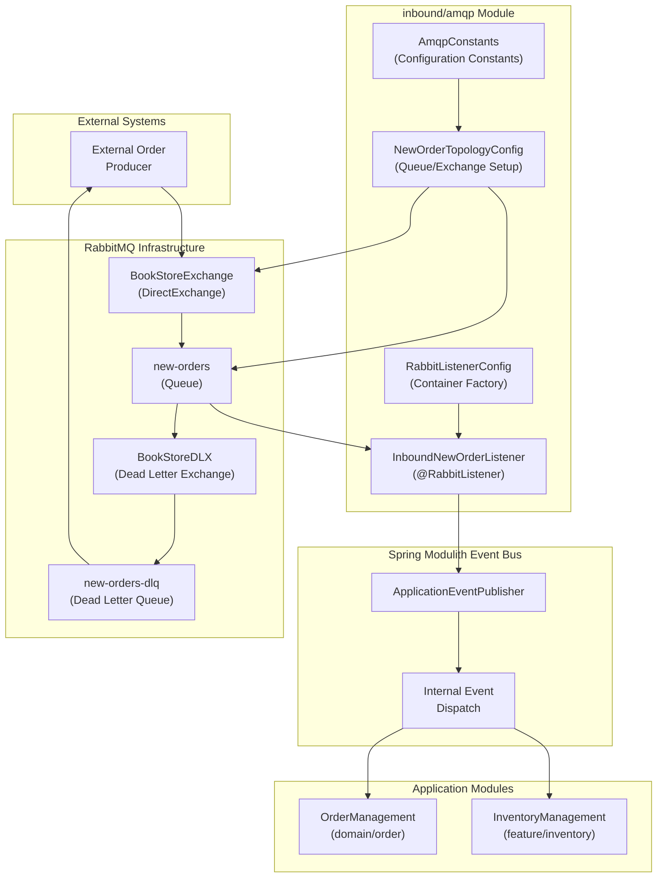
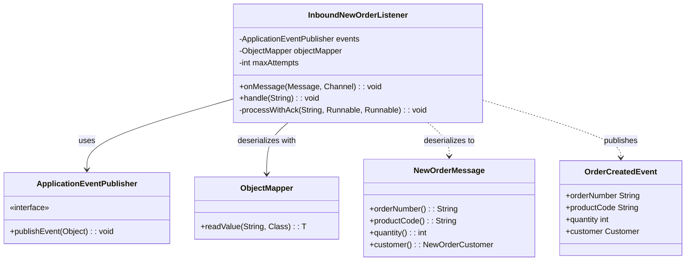
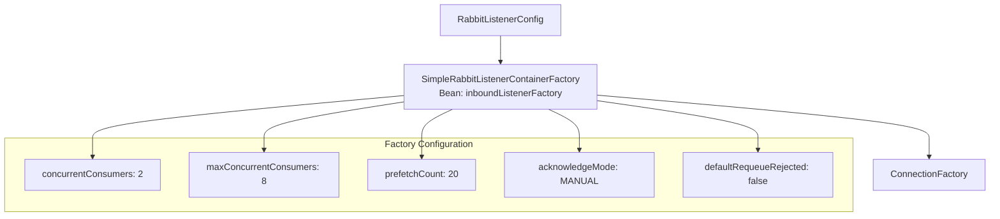
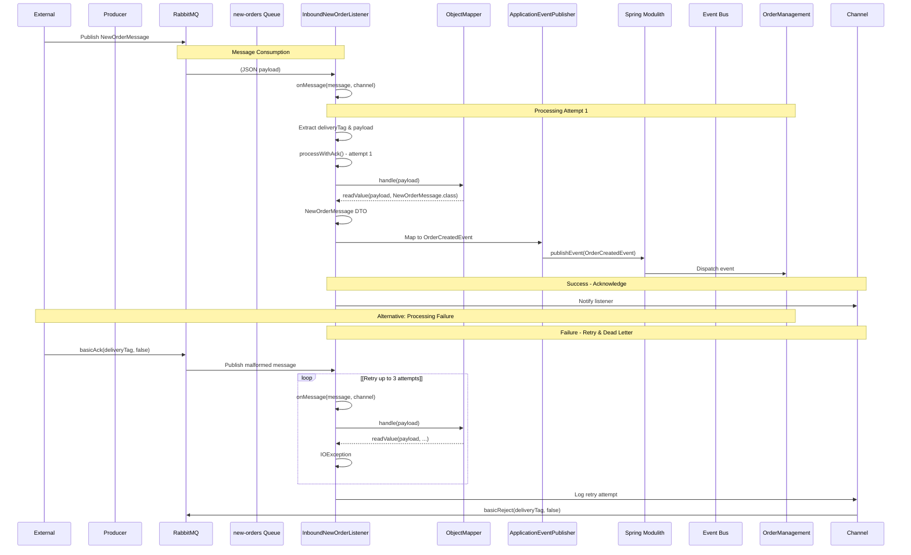
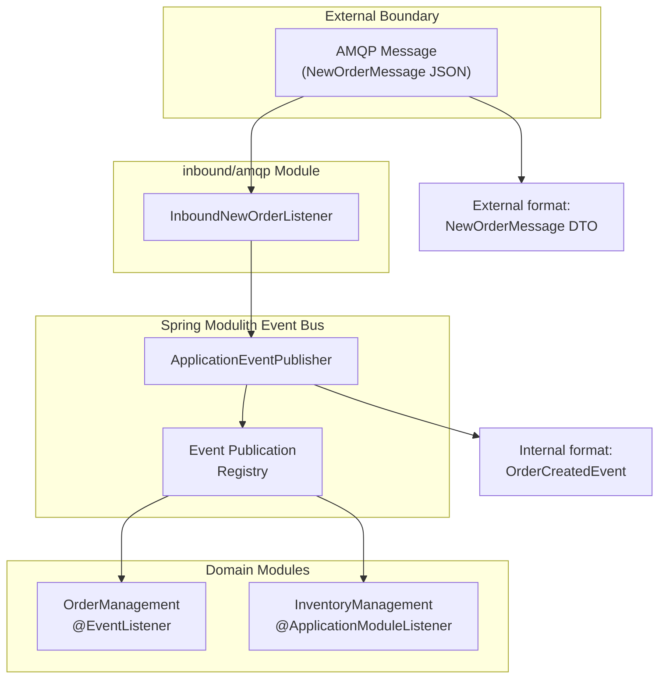

# Inbound AMQP Module

> **Relevant source files**
> * [src/main/java/com/example/modulithdemo/config/RabbitListenerConfig.java](https://github.com/philipz/spring-monolith-amqp-poc/blob/c93f55b5/src/main/java/com/example/modulithdemo/config/RabbitListenerConfig.java)
> * [src/main/java/com/example/modulithdemo/messaging/inbound/amqp/AmqpConstants.java](https://github.com/philipz/spring-monolith-amqp-poc/blob/c93f55b5/src/main/java/com/example/modulithdemo/messaging/inbound/amqp/AmqpConstants.java)
> * [src/main/java/com/example/modulithdemo/messaging/inbound/amqp/InboundNewOrderListener.java](https://github.com/philipz/spring-monolith-amqp-poc/blob/c93f55b5/src/main/java/com/example/modulithdemo/messaging/inbound/amqp/InboundNewOrderListener.java)

## Purpose and Scope

The **Inbound AMQP Module** (`inbound/amqp`) is responsible for consuming AMQP messages from RabbitMQ and bridging them into the application's internal event system. This module serves as the integration boundary between external message producers and the Spring Modulith event bus.

The module listens to the `new-orders` queue, deserializes incoming messages, converts them to internal domain events (`OrderCreatedEvent`), and publishes them for downstream consumption by other application modules. It implements manual acknowledgment, retry logic, and dead-letter queue handling to ensure reliable message processing.

For information about outbound event externalization to RabbitMQ, see [Event Externalization](/philipz/spring-monolith-amqp-poc/6.2-event-externalization). For details on RabbitMQ topology setup, see [Topology Configuration](/philipz/spring-monolith-amqp-poc/7.1-topology-configuration). For broader AMQP integration patterns, see [AMQP Integration Overview](/philipz/spring-monolith-amqp-poc/3.3-amqp-integration-overview).

**Sources:** [src/main/java/com/example/modulithdemo/messaging/inbound/amqp/InboundNewOrderListener.java L1-L100](https://github.com/philipz/spring-monolith-amqp-poc/blob/c93f55b5/src/main/java/com/example/modulithdemo/messaging/inbound/amqp/InboundNewOrderListener.java#L1-L100)

 README.md, CLAUDE.md

---

## Module Responsibilities

The Inbound AMQP Module fulfills the following responsibilities:

| Responsibility | Description |
| --- | --- |
| **Message Consumption** | Listens to the `new-orders` queue via `@RabbitListener` annotations |
| **Deserialization** | Converts JSON message payloads to `NewOrderMessage` DTOs using Jackson |
| **Event Adaptation** | Transforms external message formats into internal `OrderCreatedEvent` domain events |
| **Event Publication** | Publishes converted events to the Spring Modulith event bus via `ApplicationEventPublisher` |
| **Reliability** | Implements manual acknowledgment, configurable retry logic (default: 3 attempts), and dead-letter queue integration |
| **Performance** | Configures concurrent consumers (2-8) and prefetch limits (20) for high-throughput processing |

**Sources:** [src/main/java/com/example/modulithdemo/messaging/inbound/amqp/InboundNewOrderListener.java L18-L23](https://github.com/philipz/spring-monolith-amqp-poc/blob/c93f55b5/src/main/java/com/example/modulithdemo/messaging/inbound/amqp/InboundNewOrderListener.java#L18-L23)

 [src/main/java/com/example/modulithdemo/config/RabbitListenerConfig.java L1-L31](https://github.com/philipz/spring-monolith-amqp-poc/blob/c93f55b5/src/main/java/com/example/modulithdemo/config/RabbitListenerConfig.java#L1-L31)

---

## Architecture Overview



**Diagram: Inbound AMQP Module Architecture**

This diagram illustrates how the Inbound AMQP Module bridges external AMQP messages into the Spring Modulith event system. External producers publish to `BookStoreExchange`, which routes messages to the `new-orders` queue. `InboundNewOrderListener` consumes these messages, converts them to `OrderCreatedEvent` instances, and publishes them internally. Failed messages are routed to `new-orders-dlq` via the dead-letter exchange.

**Sources:** [src/main/java/com/example/modulithdemo/messaging/inbound/amqp/AmqpConstants.java L1-L25](https://github.com/philipz/spring-monolith-amqp-poc/blob/c93f55b5/src/main/java/com/example/modulithdemo/messaging/inbound/amqp/AmqpConstants.java#L1-L25)

 High-Level System Architecture diagrams

---

## Key Components

### AmqpConstants

The `AmqpConstants` class centralizes all AMQP configuration constants to prevent duplication and ensure consistency across the module.

```
AmqpConstants (src/main/java/com/example/modulithdemo/messaging/inbound/amqp/AmqpConstants.java)
├── BOOKSTORE_EXCHANGE = "BookStoreExchange"
├── BOOKSTORE_DLX = "BookStoreDLX"
├── NEW_ORDERS_QUEUE = "new-orders"
├── NEW_ORDERS_DLQ = "new-orders-dlq"
├── ORDERS_NEW_ROUTING = "orders.new"
└── ORDERS_NEW_DLQ_ROUTING = "orders.new.dlq"
```

| Constant | Value | Purpose |
| --- | --- | --- |
| `BOOKSTORE_EXCHANGE` | `"BookStoreExchange"` | Inbound exchange where external systems publish new order messages |
| `BOOKSTORE_DLX` | `"BookStoreDLX"` | Dead-letter exchange for failed message routing |
| `NEW_ORDERS_QUEUE` | `"new-orders"` | Main queue consumed by `InboundNewOrderListener` |
| `NEW_ORDERS_DLQ` | `"new-orders-dlq"` | Dead-letter queue for poison messages after retry exhaustion |
| `ORDERS_NEW_ROUTING` | `"orders.new"` | Routing key for new order messages |
| `ORDERS_NEW_DLQ_ROUTING` | `"orders.new.dlq"` | Routing key for dead-lettered messages |

**Sources:** [src/main/java/com/example/modulithdemo/messaging/inbound/amqp/AmqpConstants.java L1-L25](https://github.com/philipz/spring-monolith-amqp-poc/blob/c93f55b5/src/main/java/com/example/modulithdemo/messaging/inbound/amqp/AmqpConstants.java#L1-L25)

---

### InboundNewOrderListener

The `InboundNewOrderListener` is the core message consumer component, annotated with `@RabbitListener` to automatically bind to the `new-orders` queue.



**Diagram: InboundNewOrderListener Component Structure**

#### Key Methods

* **`onMessage(Message message, Channel channel)`** [InboundNewOrderListener.java L43-L52](https://github.com/philipz/spring-monolith-amqp-poc/blob/c93f55b5/InboundNewOrderListener.java#L43-L52) * Entry point for RabbitMQ message consumption * Extracts delivery tag and payload from the AMQP message * Delegates to `processWithAck()` with acknowledgment callbacks
* **`handle(String payload)`** [InboundNewOrderListener.java L55-L77](https://github.com/philipz/spring-monolith-amqp-poc/blob/c93f55b5/InboundNewOrderListener.java#L55-L77) * Core business logic for message processing * Deserializes JSON payload to `NewOrderMessage` DTO using Jackson `ObjectMapper` * Maps DTO fields to `OrderCreatedEvent` domain event * Publishes event via `ApplicationEventPublisher` * Throws `IOException` on failure to trigger retry logic
* **`processWithAck(String payload, Runnable ack, Runnable reject)`** [InboundNewOrderListener.java L80-L98](https://github.com/philipz/spring-monolith-amqp-poc/blob/c93f55b5/InboundNewOrderListener.java#L80-L98) * Implements retry mechanism (configurable via `app.amqp.new-orders.retry-max-attempts`, default: 3) * Calls `ack.run()` on successful processing (executes `channel.basicAck()`) * Calls `reject.run()` after exhausting retries (executes `channel.basicReject()` with `requeue=false`) * Logs retry attempts and final dead-letter decision

#### Configuration

The listener is configured with:

* **Queue binding:** `AmqpConstants.NEW_ORDERS_QUEUE` (`"new-orders"`)
* **Container factory:** `inboundListenerFactory` for performance tuning and manual acknowledgment
* **Max attempts:** Injected via `@Value("${app.amqp.new-orders.retry-max-attempts:3}")`

**Sources:** [src/main/java/com/example/modulithdemo/messaging/inbound/amqp/InboundNewOrderListener.java L1-L100](https://github.com/philipz/spring-monolith-amqp-poc/blob/c93f55b5/src/main/java/com/example/modulithdemo/messaging/inbound/amqp/InboundNewOrderListener.java#L1-L100)

---

### RabbitListenerConfig

The `RabbitListenerConfig` class defines the `inboundListenerFactory` bean, which configures the listener container for optimal performance and reliability.



**Diagram: RabbitListenerConfig Factory Setup**

#### Configuration Parameters

| Parameter | Value | Purpose |
| --- | --- | --- |
| `concurrentConsumers` | `2` | Initial number of concurrent message consumers |
| `maxConcurrentConsumers` | `8` | Maximum consumers under high load (dynamic scaling) |
| `prefetchCount` | `20` | Maximum unacknowledged messages per consumer (flow control) |
| `acknowledgeMode` | `AcknowledgeMode.MANUAL` | Enables explicit message acknowledgment for reliability |
| `defaultRequeueRejected` | `false` | Prevents infinite redelivery loops by dead-lettering on rejection |

The manual acknowledgment mode (`AcknowledgeMode.MANUAL`) is critical for reliability, as it allows `InboundNewOrderListener` to control exactly when messages are acknowledged or rejected based on processing success.

**Sources:** [src/main/java/com/example/modulithdemo/config/RabbitListenerConfig.java L1-L31](https://github.com/philipz/spring-monolith-amqp-poc/blob/c93f55b5/src/main/java/com/example/modulithdemo/config/RabbitListenerConfig.java#L1-L31)

---

### NewOrderTopologyConfig

While the `NewOrderTopologyConfig` class is not provided in the source files, it is referenced in the high-level diagrams and serves to:

1. Declare the `BookStoreExchange` and `BookStoreDLX` exchanges
2. Create the `new-orders` and `new-orders-dlq` queues
3. Bind queues to exchanges with appropriate routing keys
4. Configure dead-letter exchange parameters on the `new-orders` queue
5. Conditionally enable/disable bindings via the `app.amqp.new-orders.bind` property

This conditional binding mechanism prevents the application from consuming its own externalized events, avoiding feedback loops.

**Sources:** High-Level System Architecture diagrams, README.md

---

## Message Processing Flow



**Diagram: Message Processing Sequence**

This sequence diagram illustrates the complete message processing lifecycle:

1. **Consumption:** External producer publishes to `new-orders` queue; RabbitMQ invokes `onMessage()`
2. **Deserialization:** `ObjectMapper` converts JSON to `NewOrderMessage` DTO
3. **Transformation:** DTO fields are mapped to `OrderCreatedEvent` domain event
4. **Publication:** Event is published to Spring Modulith event bus
5. **Acknowledgment:** On success, `channel.basicAck()` removes message from queue
6. **Failure Handling:** On repeated failures (3 attempts), `channel.basicReject(requeue=false)` triggers dead-letter routing

**Sources:** [src/main/java/com/example/modulithdemo/messaging/inbound/amqp/InboundNewOrderListener.java L43-L98](https://github.com/philipz/spring-monolith-amqp-poc/blob/c93f55b5/src/main/java/com/example/modulithdemo/messaging/inbound/amqp/InboundNewOrderListener.java#L43-L98)

 [src/main/java/com/example/modulithdemo/config/RabbitListenerConfig.java L25-L26](https://github.com/philipz/spring-monolith-amqp-poc/blob/c93f55b5/src/main/java/com/example/modulithdemo/config/RabbitListenerConfig.java#L25-L26)

---

## Error Handling and Retry Mechanism

The Inbound AMQP Module implements a multi-layered error handling strategy:

### Retry Logic

The retry mechanism is implemented in the `processWithAck()` method [InboundNewOrderListener.java L80-L98](https://github.com/philipz/spring-monolith-amqp-poc/blob/c93f55b5/InboundNewOrderListener.java#L80-L98)

:

```
Retry Flow:
1. Attempt message processing
2. If exception occurs:
   - Increment attempt counter
   - If attempts < maxAttempts (default: 3):
     - Log warning with attempt count
     - Retry immediately (synchronous retry)
   - Else:
     - Log final failure
     - Execute reject callback (dead-letter the message)
3. If processing succeeds:
   - Execute ack callback
   - Exit loop
```

**Configuration:** The maximum retry attempts can be configured via `app.amqp.new-orders.retry-max-attempts` property (default: 3).

### Dead-Letter Queue Handling

When a message exceeds the maximum retry attempts:

1. `InboundNewOrderListener` calls `channel.basicReject(deliveryTag, false)` with `requeue=false`
2. `RabbitListenerConfig` sets `defaultRequeueRejected=false` to prevent requeuing
3. The `new-orders` queue's dead-letter exchange configuration routes the message to `BookStoreDLX`
4. `BookStoreDLX` routes to `new-orders-dlq` with routing key `orders.new.dlq`

The dead-letter queue serves as a holding area for poison messages, enabling manual inspection and recovery without blocking the main processing queue.

### Manual Acknowledgment Strategy

Manual acknowledgment (`AcknowledgeMode.MANUAL`) provides precise control over message lifecycle:

* **`basicAck(tag, false)`:** [InboundNewOrderListener.java L48](https://github.com/philipz/spring-monolith-amqp-poc/blob/c93f55b5/InboundNewOrderListener.java#L48-L48)  - Removes message from queue after successful processing
* **`basicReject(tag, false)`:** [InboundNewOrderListener.java L50](https://github.com/philipz/spring-monolith-amqp-poc/blob/c93f55b5/InboundNewOrderListener.java#L50-L50)  - Rejects message and triggers dead-letter routing

This approach prevents message loss while avoiding infinite redelivery loops that could occur with automatic acknowledgment and requeuing.

**Sources:** [src/main/java/com/example/modulithdemo/messaging/inbound/amqp/InboundNewOrderListener.java L80-L98](https://github.com/philipz/spring-monolith-amqp-poc/blob/c93f55b5/src/main/java/com/example/modulithdemo/messaging/inbound/amqp/InboundNewOrderListener.java#L80-L98)

 [src/main/java/com/example/modulithdemo/config/RabbitListenerConfig.java L24-L26](https://github.com/philipz/spring-monolith-amqp-poc/blob/c93f55b5/src/main/java/com/example/modulithdemo/config/RabbitListenerConfig.java#L24-L26)

---

## Integration with Spring Modulith Event Bus

The Inbound AMQP Module serves as a bridge between external AMQP messages and the internal Spring Modulith event system:



**Diagram: AMQP-to-Event Bridge**

### Event Conversion Process

1. **External Format:** Messages arrive as JSON payloads conforming to `NewOrderMessage` schema: ```yaml NewOrderMessage {   orderNumber: String   productCode: String   quantity: int   customer: {     name: String     email: String     phone: String   } } ```
2. **Deserialization:** Jackson `ObjectMapper` converts JSON to `NewOrderMessage` DTO [InboundNewOrderListener.java L57](https://github.com/philipz/spring-monolith-amqp-poc/blob/c93f55b5/InboundNewOrderListener.java#L57-L57)
3. **Mapping:** DTO fields are mapped to domain types: * `NewOrderMessage.NewOrderCustomer` → `com.example.modulithdemo.order.domain.Customer` * `NewOrderMessage` → `OrderCreatedEvent` [InboundNewOrderListener.java L59-L69](https://github.com/philipz/spring-monolith-amqp-poc/blob/c93f55b5/InboundNewOrderListener.java#L59-L69)
4. **Publication:** `ApplicationEventPublisher.publishEvent()` emits the event [InboundNewOrderListener.java L70](https://github.com/philipz/spring-monolith-amqp-poc/blob/c93f55b5/InboundNewOrderListener.java#L70-L70)
5. **Dispatch:** Spring Modulith's event bus delivers the event to registered listeners (both `@EventListener` and `@ApplicationModuleListener`)

### Transaction Boundaries

* **Listener Transaction:** Each `@RabbitListener` invocation runs in its own transaction (AMQP acknowledgment)
* **Event Publication:** The `publishEvent()` call executes within the listener's transaction, ensuring atomicity between message acknowledgment and event publication
* **Downstream Listeners:** `@ApplicationModuleListener` methods execute in new transactions (`REQUIRES_NEW`), isolating failures

This design ensures that a message is only acknowledged after the `OrderCreatedEvent` has been successfully published and persisted to the Event Publication Registry.

**Sources:** [src/main/java/com/example/modulithdemo/messaging/inbound/amqp/InboundNewOrderListener.java L64-L70](https://github.com/philipz/spring-monolith-amqp-poc/blob/c93f55b5/src/main/java/com/example/modulithdemo/messaging/inbound/amqp/InboundNewOrderListener.java#L64-L70)

 application.yml, CLAUDE.md

---

## Configuration Properties

The Inbound AMQP Module is controlled by the following configuration properties:

| Property | Default | Description |
| --- | --- | --- |
| `app.amqp.new-orders.bind` | `false` | Controls whether to bind `new-orders` queue to `domain.events` exchange. Set to `false` to prevent consuming own externalized events. |
| `app.amqp.new-orders.retry-max-attempts` | `3` | Maximum number of processing attempts before dead-lettering a message. |
| `spring.rabbitmq.listener.simple.concurrency` | `2` | Initial number of concurrent consumers (overridden by `inboundListenerFactory`). |
| `spring.rabbitmq.listener.simple.max-concurrency` | `8` | Maximum number of concurrent consumers (overridden by `inboundListenerFactory`). |
| `spring.rabbitmq.listener.simple.prefetch` | `20` | Prefetch count for flow control (overridden by `inboundListenerFactory`). |

### Preventing Feedback Loops

The `app.amqp.new-orders.bind=false` default configuration is critical for avoiding feedback loops. When set to `false`:

* The `new-orders` queue only binds to `BookStoreExchange` (external producer exchange)
* The `new-orders` queue does NOT bind to `domain.events` exchange (where `OrderCreatedEvent` is externalized)
* This prevents the application from consuming its own externalized `OrderCreatedEvent` messages

Setting `app.amqp.new-orders.bind=true` would be appropriate in scenarios where you explicitly want to consume your own externalized events (e.g., event sourcing, audit trails, or testing).

**Sources:** application.yml, High-Level System Architecture diagrams, README.md

---

## Testing Considerations

The `InboundNewOrderListener` is designed with testability in mind:

1. **Separated Logic:** The `handle(String payload)` method [InboundNewOrderListener.java L55-L77](https://github.com/philipz/spring-monolith-amqp-poc/blob/c93f55b5/InboundNewOrderListener.java#L55-L77)  contains the core business logic and can be tested without RabbitMQ infrastructure (no `Channel` or `Message` dependencies).
2. **Package-Private Methods:** The `processWithAck()` method [InboundNewOrderListener.java L80](https://github.com/philipz/spring-monolith-amqp-poc/blob/c93f55b5/InboundNewOrderListener.java#L80-L80)  is package-private, allowing unit tests to verify retry logic with mock acknowledgment callbacks.
3. **Configurable Dependencies:** All dependencies (`ApplicationEventPublisher`, `ObjectMapper`, `maxAttempts`) are injected via constructor, enabling easy mocking.

**Example Test Structure:**

```
Test Scenarios:
- Valid message deserialization and event publication
- Malformed JSON handling and retry exhaustion
- Retry logic with configurable attempt counts
- Acknowledgment callback invocation on success
- Rejection callback invocation on failure
```

**Sources:** [src/main/java/com/example/modulithdemo/messaging/inbound/amqp/InboundNewOrderListener.java L54-L98](https://github.com/philipz/spring-monolith-amqp-poc/blob/c93f55b5/src/main/java/com/example/modulithdemo/messaging/inbound/amqp/InboundNewOrderListener.java#L54-L98)

---

## Summary

The Inbound AMQP Module provides a robust, reliable bridge between external AMQP message producers and the Spring Modulith event-driven architecture. Key design principles include:

* **Reliability:** Manual acknowledgment, configurable retry logic, and dead-letter queue integration prevent message loss
* **Performance:** Concurrent consumers (2-8), prefetch limits (20), and tuned connection pooling optimize throughput
* **Modularity:** Strict separation between external message formats and internal domain events maintains module boundaries
* **Testability:** Separated logic and dependency injection enable comprehensive unit testing

For information on how these internal events are consumed by other modules, see [Event Listeners](/philipz/spring-monolith-amqp-poc/6.3-event-listeners). For details on outbound event externalization, see [Event Externalization](/philipz/spring-monolith-amqp-poc/6.2-event-externalization). For AMQP topology details, see [Topology Configuration](/philipz/spring-monolith-amqp-poc/7.1-topology-configuration).

**Sources:** [src/main/java/com/example/modulithdemo/messaging/inbound/amqp/InboundNewOrderListener.java L1-L100](https://github.com/philipz/spring-monolith-amqp-poc/blob/c93f55b5/src/main/java/com/example/modulithdemo/messaging/inbound/amqp/InboundNewOrderListener.java#L1-L100)

 [src/main/java/com/example/modulithdemo/config/RabbitListenerConfig.java L1-L31](https://github.com/philipz/spring-monolith-amqp-poc/blob/c93f55b5/src/main/java/com/example/modulithdemo/config/RabbitListenerConfig.java#L1-L31)

 [src/main/java/com/example/modulithdemo/messaging/inbound/amqp/AmqpConstants.java L1-L25](https://github.com/philipz/spring-monolith-amqp-poc/blob/c93f55b5/src/main/java/com/example/modulithdemo/messaging/inbound/amqp/AmqpConstants.java#L1-L25)