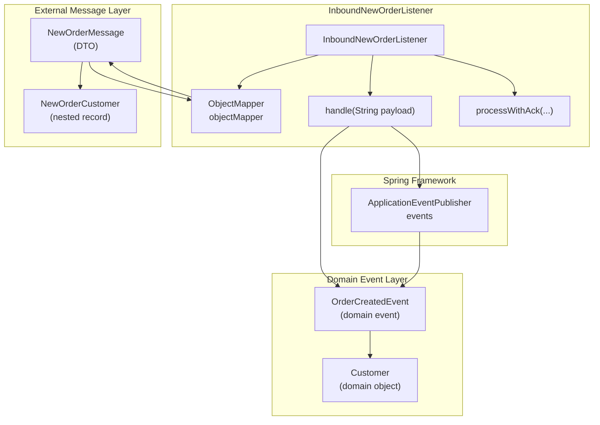
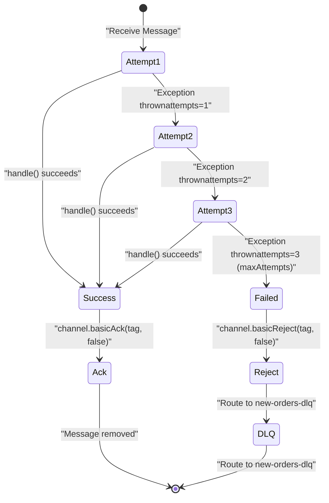
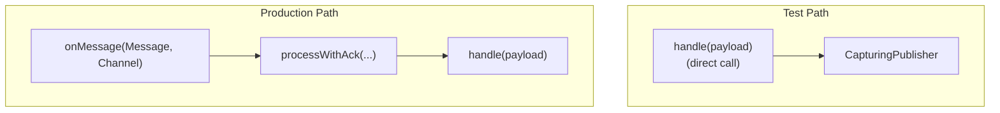

# Inbound Message Processing

> **Relevant source files**
> * [src/main/java/com/example/modulithdemo/messaging/inbound/amqp/InboundNewOrderListener.java](https://github.com/philipz/spring-monolith-amqp-poc/blob/c93f55b5/src/main/java/com/example/modulithdemo/messaging/inbound/amqp/InboundNewOrderListener.java)
> * [src/main/java/com/example/modulithdemo/messaging/inbound/amqp/NewOrderMessage.java](https://github.com/philipz/spring-monolith-amqp-poc/blob/c93f55b5/src/main/java/com/example/modulithdemo/messaging/inbound/amqp/NewOrderMessage.java)
> * [src/test/java/com/example/modulithdemo/messaging/inbound/amqp/InboundNewOrderListenerTests.java](https://github.com/philipz/spring-monolith-amqp-poc/blob/c93f55b5/src/test/java/com/example/modulithdemo/messaging/inbound/amqp/InboundNewOrderListenerTests.java)

## Purpose and Scope

This page documents how the application consumes and processes incoming AMQP messages from RabbitMQ queues. It covers message deserialization, conversion to internal domain events, manual acknowledgment strategies, and retry logic. For RabbitMQ topology configuration and queue bindings, see [Topology Configuration](/philipz/spring-monolith-amqp-poc/7.1-topology-configuration). For error handling patterns including dead-letter queues, see [Error Handling and Retries](/philipz/spring-monolith-amqp-poc/7.3-error-handling-and-retries). For the broader context of the inbound AMQP module, see [Inbound AMQP Module](/philipz/spring-monolith-amqp-poc/5.3-inbound-amqp-module).

---

## Message Listener Architecture

The `InboundNewOrderListener` class serves as the primary entry point for consuming messages from the `new-orders` queue. It uses Spring AMQP's `@RabbitListener` annotation with manual acknowledgment mode to ensure reliable message processing.

### Listener Configuration

```
@RabbitListener(queues = AmqpConstants.NEW_ORDERS_QUEUE, containerFactory = "inboundListenerFactory")
```

| Configuration Aspect | Value | Description |
| --- | --- | --- |
| **Queue** | `AmqpConstants.NEW_ORDERS_QUEUE` | Constant reference to `"new-orders"` queue |
| **Container Factory** | `"inboundListenerFactory"` | Custom factory with manual acknowledgment enabled |
| **Acknowledgment Mode** | Manual | Allows explicit message ack/reject after processing |
| **Retry Attempts** | 3 (configurable) | Set via `app.amqp.new-orders.retry-max-attempts` |

The listener method signature receives both the `Message` object and the RabbitMQ `Channel`, enabling manual acknowledgment control:

[src/main/java/com/example/modulithdemo/messaging/inbound/amqp/InboundNewOrderListener.java L43-L52](https://github.com/philipz/spring-monolith-amqp-poc/blob/c93f55b5/src/main/java/com/example/modulithdemo/messaging/inbound/amqp/InboundNewOrderListener.java#L43-L52)

**Sources:** [src/main/java/com/example/modulithdemo/messaging/inbound/amqp/InboundNewOrderListener.java L1-L99](https://github.com/philipz/spring-monolith-amqp-poc/blob/c93f55b5/src/main/java/com/example/modulithdemo/messaging/inbound/amqp/InboundNewOrderListener.java#L1-L99)

---

## Message Processing Flow

The following diagram illustrates the complete message processing pipeline from queue consumption to internal event publication:

### Message Processing Sequence

```

```

**Sources:** [src/main/java/com/example/modulithdemo/messaging/inbound/amqp/InboundNewOrderListener.java L43-L98](https://github.com/philipz/spring-monolith-amqp-poc/blob/c93f55b5/src/main/java/com/example/modulithdemo/messaging/inbound/amqp/InboundNewOrderListener.java#L43-L98)

---

## Message Deserialization

### NewOrderMessage DTO

The application uses a record-based DTO with nested customer information for type-safe deserialization:

[src/main/java/com/example/modulithdemo/messaging/inbound/amqp/NewOrderMessage.java L1-L19](https://github.com/philipz/spring-monolith-amqp-poc/blob/c93f55b5/src/main/java/com/example/modulithdemo/messaging/inbound/amqp/NewOrderMessage.java#L1-L19)

| Field | Type | Description |
| --- | --- | --- |
| `orderNumber` | `String` | Unique order identifier |
| `productCode` | `String` | Product SKU or code |
| `quantity` | `int` | Order quantity |
| `customer` | `NewOrderCustomer` | Nested customer record |

The `@JsonIgnoreProperties(ignoreUnknown = true)` annotation provides resilience against schema evolution by ignoring unexpected fields in incoming messages.

### Jackson ObjectMapper Configuration

The listener uses Spring's auto-configured `ObjectMapper` bean for JSON deserialization:

[src/main/java/com/example/modulithdemo/messaging/inbound/amqp/InboundNewOrderListener.java L56-L57](https://github.com/philipz/spring-monolith-amqp-poc/blob/c93f55b5/src/main/java/com/example/modulithdemo/messaging/inbound/amqp/InboundNewOrderListener.java#L56-L57)

Deserialization failures throw `IOException`, which triggers the retry mechanism.

**Sources:** [src/main/java/com/example/modulithdemo/messaging/inbound/amqp/NewOrderMessage.java L1-L19](https://github.com/philipz/spring-monolith-amqp-poc/blob/c93f55b5/src/main/java/com/example/modulithdemo/messaging/inbound/amqp/NewOrderMessage.java#L1-L19)

 [src/main/java/com/example/modulithdemo/messaging/inbound/amqp/InboundNewOrderListener.java L56-L73](https://github.com/philipz/spring-monolith-amqp-poc/blob/c93f55b5/src/main/java/com/example/modulithdemo/messaging/inbound/amqp/InboundNewOrderListener.java#L56-L73)

---

## Event Conversion and Publication

### DTO to Domain Event Mapping

The listener converts the external `NewOrderMessage` DTO to the internal `OrderCreatedEvent` domain event:

[src/main/java/com/example/modulithdemo/messaging/inbound/amqp/InboundNewOrderListener.java L58-L69](https://github.com/philipz/spring-monolith-amqp-poc/blob/c93f55b5/src/main/java/com/example/modulithdemo/messaging/inbound/amqp/InboundNewOrderListener.java#L58-L69)

This conversion creates a boundary between external message formats and internal domain models, allowing independent evolution of each.

### Component Interaction Diagram



**Sources:** [src/main/java/com/example/modulithdemo/messaging/inbound/amqp/InboundNewOrderListener.java L55-L77](https://github.com/philipz/spring-monolith-amqp-poc/blob/c93f55b5/src/main/java/com/example/modulithdemo/messaging/inbound/amqp/InboundNewOrderListener.java#L55-L77)

 [src/main/java/com/example/modulithdemo/messaging/inbound/amqp/NewOrderMessage.java L1-L19](https://github.com/philipz/spring-monolith-amqp-poc/blob/c93f55b5/src/main/java/com/example/modulithdemo/messaging/inbound/amqp/NewOrderMessage.java#L1-L19)

---

## Manual Acknowledgment Strategy

The listener implements manual acknowledgment to ensure messages are only removed from the queue after successful processing. This provides stronger delivery guarantees than automatic acknowledgment.

### Acknowledgment Logic

| Outcome | Action | RabbitMQ Behavior |
| --- | --- | --- |
| **Success** | `channel.basicAck(tag, false)` | Message removed from queue |
| **Retryable Failure** | None (retry in-process) | Message remains unacknowledged |
| **Terminal Failure** | `channel.basicReject(tag, false)` | Message routed to dead-letter exchange |

The `requeue = false` parameter in `basicReject` ensures failed messages are sent to the dead-letter queue rather than being requeued infinitely:

[src/main/java/com/example/modulithdemo/messaging/inbound/amqp/InboundNewOrderListener.java L48-L51](https://github.com/philipz/spring-monolith-amqp-poc/blob/c93f55b5/src/main/java/com/example/modulithdemo/messaging/inbound/amqp/InboundNewOrderListener.java#L48-L51)

**Sources:** [src/main/java/com/example/modulithdemo/messaging/inbound/amqp/InboundNewOrderListener.java L43-L52](https://github.com/philipz/spring-monolith-amqp-poc/blob/c93f55b5/src/main/java/com/example/modulithdemo/messaging/inbound/amqp/InboundNewOrderListener.java#L43-L52)

---

## Retry Mechanism

### Retry Loop Implementation

The `processWithAck` method implements an in-process retry loop with configurable maximum attempts:

[src/main/java/com/example/modulithdemo/messaging/inbound/amqp/InboundNewOrderListener.java L80-L98](https://github.com/philipz/spring-monolith-amqp-poc/blob/c93f55b5/src/main/java/com/example/modulithdemo/messaging/inbound/amqp/InboundNewOrderListener.java#L80-L98)

### Retry State Machine



### Configuration

The maximum retry attempts are configurable via application properties:

| Property | Default | Description |
| --- | --- | --- |
| `app.amqp.new-orders.retry-max-attempts` | `3` | Number of processing attempts before dead-lettering |

[src/main/java/com/example/modulithdemo/messaging/inbound/amqp/InboundNewOrderListener.java L34](https://github.com/philipz/spring-monolith-amqp-poc/blob/c93f55b5/src/main/java/com/example/modulithdemo/messaging/inbound/amqp/InboundNewOrderListener.java#L34-L34)

**Sources:** [src/main/java/com/example/modulithdemo/messaging/inbound/amqp/InboundNewOrderListener.java L31-L39](https://github.com/philipz/spring-monolith-amqp-poc/blob/c93f55b5/src/main/java/com/example/modulithdemo/messaging/inbound/amqp/InboundNewOrderListener.java#L31-L39)

 [src/main/java/com/example/modulithdemo/messaging/inbound/amqp/InboundNewOrderListener.java L80-L98](https://github.com/philipz/spring-monolith-amqp-poc/blob/c93f55b5/src/main/java/com/example/modulithdemo/messaging/inbound/amqp/InboundNewOrderListener.java#L80-L98)

---

## Error Handling

### Exception Propagation

The `handle` method throws `IOException` to signal processing failures:

[src/main/java/com/example/modulithdemo/messaging/inbound/amqp/InboundNewOrderListener.java L72-L76](https://github.com/philipz/spring-monolith-amqp-poc/blob/c93f55b5/src/main/java/com/example/modulithdemo/messaging/inbound/amqp/InboundNewOrderListener.java#L72-L76)

All exceptions are caught and wrapped as `IOException` to provide a consistent error contract for the retry mechanism.

### Logging Strategy

| Log Level | Condition | Message |
| --- | --- | --- |
| `INFO` | Message received | `[InboundNewOrderListener] received payload from 'new-orders': {payload}` |
| `INFO` | Event published | `[InboundNewOrderListener] published OrderCreatedEvent: {event}` |
| `WARN` | Retry attempt | `[InboundNewOrderListener] attempt {n}/{max} failed; retrying` |
| `WARN` | Max retries reached | `[InboundNewOrderListener] failing after {max} attempts; dead-lettering` |
| `ERROR` | Ack/Reject failed | `Ack failed` or `Reject failed` |

[src/main/java/com/example/modulithdemo/messaging/inbound/amqp/InboundNewOrderListener.java L46](https://github.com/philipz/spring-monolith-amqp-poc/blob/c93f55b5/src/main/java/com/example/modulithdemo/messaging/inbound/amqp/InboundNewOrderListener.java#L46-L46)

 [src/main/java/com/example/modulithdemo/messaging/inbound/amqp/InboundNewOrderListener.java L71](https://github.com/philipz/spring-monolith-amqp-poc/blob/c93f55b5/src/main/java/com/example/modulithdemo/messaging/inbound/amqp/InboundNewOrderListener.java#L71-L71)

 [src/main/java/com/example/modulithdemo/messaging/inbound/amqp/InboundNewOrderListener.java L94](https://github.com/philipz/spring-monolith-amqp-poc/blob/c93f55b5/src/main/java/com/example/modulithdemo/messaging/inbound/amqp/InboundNewOrderListener.java#L94-L94)

 [src/main/java/com/example/modulithdemo/messaging/inbound/amqp/InboundNewOrderListener.java L90](https://github.com/philipz/spring-monolith-amqp-poc/blob/c93f55b5/src/main/java/com/example/modulithdemo/messaging/inbound/amqp/InboundNewOrderListener.java#L90-L90)

**Sources:** [src/main/java/com/example/modulithdemo/messaging/inbound/amqp/InboundNewOrderListener.java L46-L98](https://github.com/philipz/spring-monolith-amqp-poc/blob/c93f55b5/src/main/java/com/example/modulithdemo/messaging/inbound/amqp/InboundNewOrderListener.java#L46-L98)

---

## Testing Approach

### Unit Test Strategy

The listener separates concerns to enable testing without RabbitMQ infrastructure:



The `handle` method is public and testable independently of AMQP infrastructure:

[src/main/java/com/example/modulithdemo/messaging/inbound/amqp/InboundNewOrderListener.java L55-L77](https://github.com/philipz/spring-monolith-amqp-poc/blob/c93f55b5/src/main/java/com/example/modulithdemo/messaging/inbound/amqp/InboundNewOrderListener.java#L55-L77)

### Test Cases

| Test | Scenario | Verification |
| --- | --- | --- |
| `onMessage_publishesOrderCreatedEvent_onValidJson` | Valid JSON message | Asserts `OrderCreatedEvent` published with correct fields |
| `onMessage_throws_andDoesNotPublish_onMalformedJson` | Invalid JSON | Asserts exception thrown, no events published |

[src/test/java/com/example/modulithdemo/messaging/inbound/amqp/InboundNewOrderListenerTests.java L21-L49](https://github.com/philipz/spring-monolith-amqp-poc/blob/c93f55b5/src/test/java/com/example/modulithdemo/messaging/inbound/amqp/InboundNewOrderListenerTests.java#L21-L49)

 [src/test/java/com/example/modulithdemo/messaging/inbound/amqp/InboundNewOrderListenerTests.java L51-L61](https://github.com/philipz/spring-monolith-amqp-poc/blob/c93f55b5/src/test/java/com/example/modulithdemo/messaging/inbound/amqp/InboundNewOrderListenerTests.java#L51-L61)

### CapturingPublisher Pattern

The test suite uses a custom `ApplicationEventPublisher` implementation to capture published events without Spring context:

[src/test/java/com/example/modulithdemo/messaging/inbound/amqp/InboundNewOrderListenerTests.java L16-L19](https://github.com/philipz/spring-monolith-amqp-poc/blob/c93f55b5/src/test/java/com/example/modulithdemo/messaging/inbound/amqp/InboundNewOrderListenerTests.java#L16-L19)

This pattern enables fast, isolated unit tests that verify event publication behavior.

**Sources:** [src/test/java/com/example/modulithdemo/messaging/inbound/amqp/InboundNewOrderListenerTests.java L1-L62](https://github.com/philipz/spring-monolith-amqp-poc/blob/c93f55b5/src/test/java/com/example/modulithdemo/messaging/inbound/amqp/InboundNewOrderListenerTests.java#L1-L62)

 [src/main/java/com/example/modulithdemo/messaging/inbound/amqp/InboundNewOrderListener.java L55-L77](https://github.com/philipz/spring-monolith-amqp-poc/blob/c93f55b5/src/main/java/com/example/modulithdemo/messaging/inbound/amqp/InboundNewOrderListener.java#L55-L77)

---

## Integration with Event System

Once the `OrderCreatedEvent` is published via `ApplicationEventPublisher`, it enters the Spring Modulith event system. The Event Publication Registry persists the event transactionally, and any modules with `@ApplicationModuleListener` or `@EventListener` handlers receive the event asynchronously. For details on event publication and internal dispatch, see [Event Publication Registry](/philipz/spring-monolith-amqp-poc/6.1-event-publication-registry) and [Event Listeners](/philipz/spring-monolith-amqp-poc/6.3-event-listeners).

**Sources:** [src/main/java/com/example/modulithdemo/messaging/inbound/amqp/InboundNewOrderListener.java L70](https://github.com/philipz/spring-monolith-amqp-poc/blob/c93f55b5/src/main/java/com/example/modulithdemo/messaging/inbound/amqp/InboundNewOrderListener.java#L70-L70)