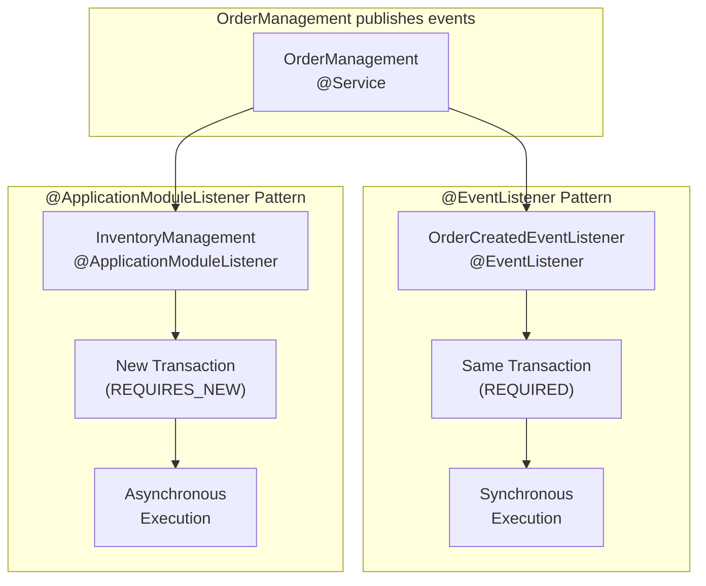
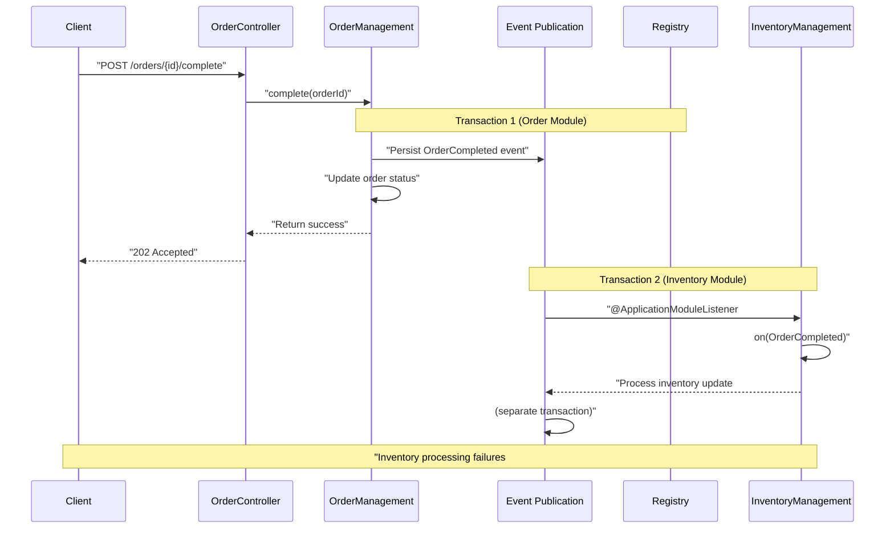
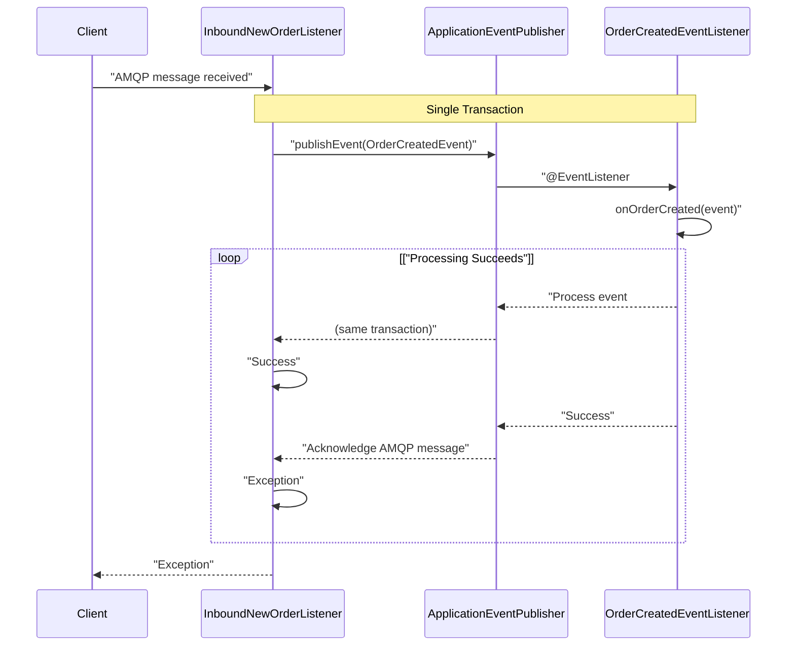
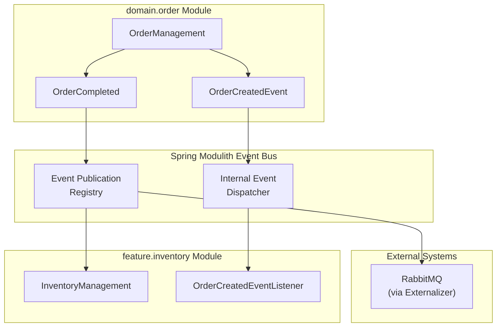
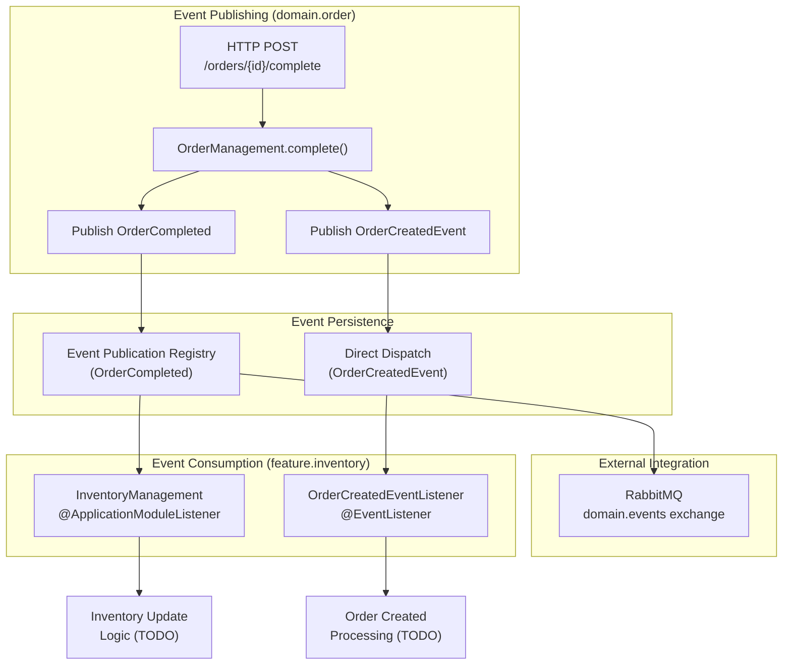

# Inventory Module

> **Relevant source files**
> * [CLAUDE.md](https://github.com/philipz/spring-monolith-amqp-poc/blob/c93f55b5/CLAUDE.md)
> * [README.md](https://github.com/philipz/spring-monolith-amqp-poc/blob/c93f55b5/README.md)
> * [src/main/java/com/example/modulithdemo/inventory/app/InventoryManagement.java](https://github.com/philipz/spring-monolith-amqp-poc/blob/c93f55b5/src/main/java/com/example/modulithdemo/inventory/app/InventoryManagement.java)
> * [src/main/java/com/example/modulithdemo/inventory/app/OrderCreatedEventListener.java](https://github.com/philipz/spring-monolith-amqp-poc/blob/c93f55b5/src/main/java/com/example/modulithdemo/inventory/app/OrderCreatedEventListener.java)

## Purpose and Scope

The Inventory Module (`feature.inventory`) demonstrates Spring Modulith's cross-module event consumption patterns. This module reacts to domain events published by the Order Module ([see 5.1](/philipz/spring-monolith-amqp-poc/5.1-order-domain-module)) without direct dependencies, showcasing loose coupling through event-driven architecture.

This page documents the inventory module's event listeners, transaction boundaries, and integration patterns. For information about the events themselves, see [Event System](/philipz/spring-monolith-amqp-poc/6-event-system). For AMQP integration patterns, see [Inbound AMQP Module](/philipz/spring-monolith-amqp-poc/5.3-inbound-amqp-module).

**Sources:** [README.md L32-L44](https://github.com/philipz/spring-monolith-amqp-poc/blob/c93f55b5/README.md#L32-L44)

 [CLAUDE.md L71-L77](https://github.com/philipz/spring-monolith-amqp-poc/blob/c93f55b5/CLAUDE.md#L71-L77)

---

## Module Structure

The inventory module is organized under the `com.example.modulithdemo.inventory` package with the following structure:

```
feature/inventory/
└── app/
    ├── InventoryManagement.java
    └── OrderCreatedEventListener.java
```

| Component | Type | Purpose |
| --- | --- | --- |
| `InventoryManagement` | `@Component` | Asynchronous event handler using `@ApplicationModuleListener` for `OrderCompleted` events |
| `OrderCreatedEventListener` | `@Component` | Synchronous event handler using `@EventListener` for `OrderCreatedEvent` events |

Both components listen to events from the Order Module but use different Spring Modulith patterns with distinct transaction behaviors.

**Sources:** [src/main/java/com/example/modulithdemo/inventory/app/InventoryManagement.java L1-L19](https://github.com/philipz/spring-monolith-amqp-poc/blob/c93f55b5/src/main/java/com/example/modulithdemo/inventory/app/InventoryManagement.java#L1-L19)

 [src/main/java/com/example/modulithdemo/inventory/app/OrderCreatedEventListener.java L1-L22](https://github.com/philipz/spring-monolith-amqp-poc/blob/c93f55b5/src/main/java/com/example/modulithdemo/inventory/app/OrderCreatedEventListener.java#L1-L22)

---

## Event Listener Components

### InventoryManagement - Asynchronous Event Handler

The `InventoryManagement` class demonstrates Spring Modulith's `@ApplicationModuleListener` pattern:

```python
@Component
public class InventoryManagement {
  
  @ApplicationModuleListener
  void on(OrderCompleted event) {
    log.info("[Inventory] received OrderCompleted: {}", event);
  }
}
```

**Key Characteristics:**

* **Annotation:** `@ApplicationModuleListener` ([InventoryManagement.java L14](https://github.com/philipz/spring-monolith-amqp-poc/blob/c93f55b5/InventoryManagement.java#L14-L14) )
* **Event Type:** `OrderCompleted` from `domain.order` module
* **Transaction Propagation:** `REQUIRES_NEW` - executes in a separate transaction
* **Execution:** Asynchronous, after the originating transaction commits
* **Failure Isolation:** Failures do not affect the order completion transaction

The `@ApplicationModuleListener` annotation ensures that inventory updates occur independently of order processing, preventing cascading failures and enabling horizontal scalability.

**Sources:** [src/main/java/com/example/modulithdemo/inventory/app/InventoryManagement.java L10-L18](https://github.com/philipz/spring-monolith-amqp-poc/blob/c93f55b5/src/main/java/com/example/modulithdemo/inventory/app/InventoryManagement.java#L10-L18)

 [CLAUDE.md L86-L90](https://github.com/philipz/spring-monolith-amqp-poc/blob/c93f55b5/CLAUDE.md#L86-L90)

---

### OrderCreatedEventListener - Synchronous Event Handler

The `OrderCreatedEventListener` class uses Spring's standard `@EventListener` pattern:

```python
@Component
public class OrderCreatedEventListener {
  
  @EventListener
  public void onOrderCreated(OrderCreatedEvent event) {
    log.info("Processing OrderCreatedEvent orderNumber={}, productCode={}, quantity={}, customer={}",
            event.orderNumber(), event.productCode(), event.quantity(), event.customer());
    // TODO: Add business logic here
  }
}
```

**Key Characteristics:**

* **Annotation:** `@EventListener` ([OrderCreatedEventListener.java L15](https://github.com/philipz/spring-monolith-amqp-poc/blob/c93f55b5/OrderCreatedEventListener.java#L15-L15) )
* **Event Type:** `OrderCreatedEvent` from `domain.order` module
* **Transaction Propagation:** Participates in the publishing transaction (default `REQUIRED`)
* **Execution:** Synchronous, within the same transaction context
* **Failure Impact:** Failures roll back the entire publishing transaction

This listener is intended for operations that must succeed as part of the order creation flow, such as initial inventory reservations or validation checks.

**Sources:** [src/main/java/com/example/modulithdemo/inventory/app/OrderCreatedEventListener.java L10-L21](https://github.com/philipz/spring-monolith-amqp-poc/blob/c93f55b5/src/main/java/com/example/modulithdemo/inventory/app/OrderCreatedEventListener.java#L10-L21)

---

## Event Listener Pattern Comparison

### Listener Pattern Differences



**Sources:** [CLAUDE.md L86-L91](https://github.com/philipz/spring-monolith-amqp-poc/blob/c93f55b5/CLAUDE.md#L86-L91)

 [README.md L5-L7](https://github.com/philipz/spring-monolith-amqp-poc/blob/c93f55b5/README.md#L5-L7)

---

### Transaction Boundary Comparison

| Aspect | `@ApplicationModuleListener` | `@EventListener` |
| --- | --- | --- |
| **Transaction Propagation** | `REQUIRES_NEW` | `REQUIRED` (default) |
| **Execution Timing** | After publishing transaction commits | Within publishing transaction |
| **Failure Impact** | Isolated - does not affect publisher | Rolls back entire transaction |
| **Use Case** | Independent operations, eventual consistency | Operations requiring atomicity |
| **Retry Behavior** | Automatic via Event Publication Registry | Manual implementation needed |
| **Event Persistence** | Persisted to `event_publication` table | No persistence guarantee |

**Sources:** [CLAUDE.md L86-L91](https://github.com/philipz/spring-monolith-amqp-poc/blob/c93f55b5/CLAUDE.md#L86-L91)

---

## Transaction Boundaries and Event Processing

### Asynchronous Processing with @ApplicationModuleListener

The following sequence diagram illustrates the transaction isolation provided by `@ApplicationModuleListener`:



**Sources:** [CLAUDE.md L86-L91](https://github.com/philipz/spring-monolith-amqp-poc/blob/c93f55b5/CLAUDE.md#L86-L91)

 [README.md L5-L6](https://github.com/philipz/spring-monolith-amqp-poc/blob/c93f55b5/README.md#L5-L6)

---

### Synchronous Processing with @EventListener

In contrast, the `@EventListener` pattern executes within the same transaction:



**Sources:** [src/main/java/com/example/modulithdemo/inventory/app/OrderCreatedEventListener.java L15-L20](https://github.com/philipz/spring-monolith-amqp-poc/blob/c93f55b5/src/main/java/com/example/modulithdemo/inventory/app/OrderCreatedEventListener.java#L15-L20)

---

## Integration with Order Module

### Event Flow Architecture

The following diagram shows how the inventory module integrates with the order module through Spring Modulith's event bus:



**Sources:** [README.md L48-L81](https://github.com/philipz/spring-monolith-amqp-poc/blob/c93f55b5/README.md#L48-L81)

 [CLAUDE.md L79-L84](https://github.com/philipz/spring-monolith-amqp-poc/blob/c93f55b5/CLAUDE.md#L79-L84)

---

### Module Boundaries and Coupling

The inventory module demonstrates Spring Modulith's strict module boundary enforcement:

| Boundary Rule | Implementation |
| --- | --- |
| **No Direct Dependencies** | Inventory module does not import order module classes except events |
| **Event-Only Communication** | All integration through `OrderCompleted` and `OrderCreatedEvent` |
| **Loose Coupling** | Order module has no knowledge of inventory module existence |
| **Interface Stability** | Events serve as published API contracts between modules |

**Verification:**
Spring Modulith's `@ModulithTest` automatically verifies these boundaries at test time, failing the build if direct dependencies are detected.

**Sources:** [CLAUDE.md L86-L91](https://github.com/philipz/spring-monolith-amqp-poc/blob/c93f55b5/CLAUDE.md#L86-L91)

 [README.md L170](https://github.com/philipz/spring-monolith-amqp-poc/blob/c93f55b5/README.md#L170-L170)

---

## Event Processing Flow

### Complete Event Flow with Both Listeners



**Sources:** [README.md L86-L100](https://github.com/philipz/spring-monolith-amqp-poc/blob/c93f55b5/README.md#L86-L100)

 [CLAUDE.md L79-L91](https://github.com/philipz/spring-monolith-amqp-poc/blob/c93f55b5/CLAUDE.md#L79-L91)

---

## Implementation Patterns

### Current Implementation Status

Both listener components currently log events without implementing business logic:

**InventoryManagement ([InventoryManagement.java L15-L17](https://github.com/philipz/spring-monolith-amqp-poc/blob/c93f55b5/InventoryManagement.java#L15-L17)

):**

```
@ApplicationModuleListener
void on(OrderCompleted event) {
  log.info("[Inventory] received OrderCompleted: {}", event);
}
```

**OrderCreatedEventListener ([OrderCreatedEventListener.java L16-L19](https://github.com/philipz/spring-monolith-amqp-poc/blob/c93f55b5/OrderCreatedEventListener.java#L16-L19)

):**

```
@EventListener
public void onOrderCreated(OrderCreatedEvent event) {
  log.info("Processing OrderCreatedEvent orderNumber={}, productCode={}, quantity={}, customer={}",
          event.orderNumber(), event.productCode(), event.quantity(), event.customer());
  // TODO: Add business logic here
}
```

### Extension Points for Business Logic

The placeholder implementations provide clear extension points for typical inventory operations:

| Listener | Suggested Business Logic | Implementation Notes |
| --- | --- | --- |
| `InventoryManagement` | Reduce stock levels, update availability, trigger reordering | Use `REQUIRES_NEW` transaction for isolation |
| `OrderCreatedEventListener` | Reserve inventory, validate stock, pre-allocation | Must succeed or fail with order creation |

**Sources:** [src/main/java/com/example/modulithdemo/inventory/app/InventoryManagement.java L15-L17](https://github.com/philipz/spring-monolith-amqp-poc/blob/c93f55b5/src/main/java/com/example/modulithdemo/inventory/app/InventoryManagement.java#L15-L17)

 [src/main/java/com/example/modulithdemo/inventory/app/OrderCreatedEventListener.java L16-L20](https://github.com/philipz/spring-monolith-amqp-poc/blob/c93f55b5/src/main/java/com/example/modulithdemo/inventory/app/OrderCreatedEventListener.java#L16-L20)

---

## Testing and Verification

### Module Test Example

The inventory module can be tested in isolation using `@ModulithTest`:

```python
@ModulithTest
class InventoryModuleTests {
  
  @Test
  void inventoryManagementReceivesOrderCompleted() {
    // Test that @ApplicationModuleListener reacts to events
    // Verify transaction isolation
  }
  
  @Test
  void orderCreatedEventListenerReceivesSynchronously() {
    // Test that @EventListener executes in same transaction
  }
}
```

The test configuration automatically uses H2 in-memory database and disables event externalization for fast, isolated testing.

**Sources:** [CLAUDE.md L93-L99](https://github.com/philipz/spring-monolith-amqp-poc/blob/c93f55b5/CLAUDE.md#L93-L99)

 [README.md L146-L153](https://github.com/philipz/spring-monolith-amqp-poc/blob/c93f55b5/README.md#L146-L153)

---

## Configuration Considerations

### Event Processing Configuration

The inventory module's behavior is controlled by Spring Modulith event configuration ([see 4.1](/philipz/spring-monolith-amqp-poc/4.1-application-configuration)):

| Property | Default | Impact on Inventory Module |
| --- | --- | --- |
| `spring.modulith.events.externalization.enabled` | `true` | Controls whether `OrderCompleted` is externalized after inventory processing |
| `spring.modulith.republish-outstanding-events-on-restart` | `true` | Ensures inventory updates are retried after application restart |
| `spring.modulith.events.jdbc.schema-initialization.enabled` | `true` | Creates `event_publication` table for reliability |

**Sources:** [CLAUDE.md L103-L116](https://github.com/philipz/spring-monolith-amqp-poc/blob/c93f55b5/CLAUDE.md#L103-L116)

---

## Summary

The Inventory Module demonstrates Spring Modulith's event-driven architecture through two complementary patterns:

1. **`InventoryManagement`** - Asynchronous, isolated event processing using `@ApplicationModuleListener`
2. **`OrderCreatedEventListener`** - Synchronous, transactional event processing using `@EventListener`

These patterns enable loose coupling between modules while providing flexibility in transaction boundaries and failure handling. The module serves as a reference implementation for cross-module event consumption in Spring Modulith applications.

**Sources:** [README.md L32-L44](https://github.com/philipz/spring-monolith-amqp-poc/blob/c93f55b5/README.md#L32-L44)

 [CLAUDE.md L59-L91](https://github.com/philipz/spring-monolith-amqp-poc/blob/c93f55b5/CLAUDE.md#L59-L91)