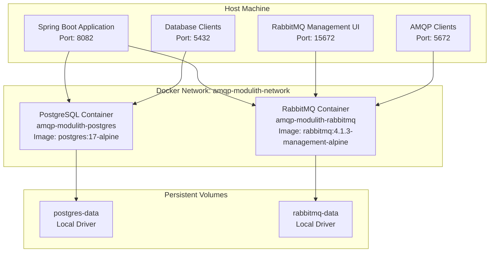
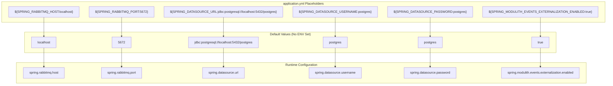

# Local Development Setup

> **Relevant source files**
> * [README.md](https://github.com/philipz/spring-monolith-amqp-poc/blob/c93f55b5/README.md)
> * [docker-compose.yml](https://github.com/philipz/spring-monolith-amqp-poc/blob/c93f55b5/docker-compose.yml)
> * [src/main/java/com/example/modulithdemo/inventory/app/InventoryManagement.java](https://github.com/philipz/spring-monolith-amqp-poc/blob/c93f55b5/src/main/java/com/example/modulithdemo/inventory/app/InventoryManagement.java)
> * [src/main/java/com/example/modulithdemo/inventory/app/OrderCreatedEventListener.java](https://github.com/philipz/spring-monolith-amqp-poc/blob/c93f55b5/src/main/java/com/example/modulithdemo/inventory/app/OrderCreatedEventListener.java)
> * [src/main/resources/application.yml](https://github.com/philipz/spring-monolith-amqp-poc/blob/c93f55b5/src/main/resources/application.yml)
> * [src/test/resources/application.yml](https://github.com/philipz/spring-monolith-amqp-poc/blob/c93f55b5/src/test/resources/application.yml)

This document provides a step-by-step guide for setting up a local development environment for the spring-monolith-amqp-poc application. It covers infrastructure provisioning via Docker Compose, environment variable configuration, and application startup procedures.

For build and dependency management, see [Build and Dependencies](/philipz/spring-monolith-amqp-poc/8.1-build-and-dependencies). For testing-specific setup, see [Testing Strategy](/philipz/spring-monolith-amqp-poc/8.2-testing-strategy). For production deployment configuration, see [Deployment Configuration](/philipz/spring-monolith-amqp-poc/9.1-deployment-configuration).

---

## Prerequisites

The following software must be installed on the development machine:

| Component | Version | Purpose |
| --- | --- | --- |
| Java Development Kit | 21+ | Application runtime and compilation |
| Maven | 3.9+ (or use `./mvnw` wrapper) | Build automation |
| Docker | 20.10+ | Infrastructure containers |
| Docker Compose | 2.0+ | Multi-container orchestration |

Verify installations:

```markdown
java -version        # Should show Java 21 or higher
./mvnw --version     # Should show Maven 3.9+ and Java 21
docker --version     # Should show Docker 20.10+
docker compose version  # Should show Compose 2.0+
```

**Sources:** [README.md L14-L15](https://github.com/philipz/spring-monolith-amqp-poc/blob/c93f55b5/README.md#L14-L15)

---

## Infrastructure Setup with Docker Compose

The application requires PostgreSQL (database and Event Publication Registry) and RabbitMQ (message broker) to run. Both are provisioned via Docker Compose.

### Docker Compose Topology



**Sources:** [docker-compose.yml L1-L50](https://github.com/philipz/spring-monolith-amqp-poc/blob/c93f55b5/docker-compose.yml#L1-L50)

### Starting Infrastructure

Navigate to the repository root and execute:

```
docker compose up -d
```

This command:

1. Creates network `amqp-modulith-network` (bridge driver)
2. Creates volumes `postgres-data` and `rabbitmq-data`
3. Starts PostgreSQL on port `5432` with credentials `postgres/postgres`
4. Starts RabbitMQ on ports `5672` (AMQP) and `15672` (management UI)
5. Runs health checks to ensure containers are ready

**Container Details:**

| Container | Name | Ports | Credentials | Healthcheck |
| --- | --- | --- | --- | --- |
| PostgreSQL | `amqp-modulith-postgres` | 5432:5432 | postgres/postgres | `pg_isready -U postgres` |
| RabbitMQ | `amqp-modulith-rabbitmq` | 5672:5672, 15672:15672 | guest/guest | `rabbitmq-diagnostics ping` |

**Sources:** [docker-compose.yml L2-L40](https://github.com/philipz/spring-monolith-amqp-poc/blob/c93f55b5/docker-compose.yml#L2-L40)

### Verifying Infrastructure

Check container status:

```
docker compose ps
```

Expected output shows both containers in `Up` state with `(healthy)` status.

Access RabbitMQ management UI:

```yaml
http://localhost:15672
Login: guest/guest
```

Test PostgreSQL connection:

```sql
docker exec -it amqp-modulith-postgres psql -U postgres -d postgres -c "SELECT version();"
```

**Sources:** [docker-compose.yml L14-L37](https://github.com/philipz/spring-monolith-amqp-poc/blob/c93f55b5/docker-compose.yml#L14-L37)

---

## Environment Variable Configuration

The application uses environment variables for runtime configuration, with sensible defaults for local development defined in [application.yml L1-L67](https://github.com/philipz/spring-monolith-amqp-poc/blob/c93f55b5/application.yml#L1-L67)

### Environment Variable Mapping



**Sources:** [application.yml L7-L41](https://github.com/philipz/spring-monolith-amqp-poc/blob/c93f55b5/application.yml#L7-L41)

### Key Configuration Properties

| Property | Environment Variable | Default | Purpose |
| --- | --- | --- | --- |
| `server.port` | N/A | 8082 | Application HTTP port |
| `spring.rabbitmq.host` | `SPRING_RABBITMQ_HOST` | localhost | RabbitMQ hostname |
| `spring.rabbitmq.port` | `SPRING_RABBITMQ_PORT` | 5672 | RabbitMQ AMQP port |
| `spring.rabbitmq.username` | `SPRING_RABBITMQ_USERNAME` | guest | RabbitMQ username |
| `spring.rabbitmq.password` | `SPRING_RABBITMQ_PASSWORD` | guest | RabbitMQ password |
| `spring.datasource.url` | `SPRING_DATASOURCE_URL` | jdbc:postgresql://localhost:5432/postgres | PostgreSQL JDBC URL |
| `spring.datasource.username` | `SPRING_DATASOURCE_USERNAME` | postgres | PostgreSQL username |
| `spring.datasource.password` | `SPRING_DATASOURCE_PASSWORD` | postgres | PostgreSQL password |
| `spring.modulith.events.externalization.enabled` | `SPRING_MODULITH_EVENTS_EXTERNALIZATION_ENABLED` | true | Enable event externalization to RabbitMQ |
| `app.amqp.new-orders.bind` | N/A | true | Bind `new-orders` queue to `BookStoreExchange` |

**Sources:** [application.yml L1-L67](https://github.com/philipz/spring-monolith-amqp-poc/blob/c93f55b5/application.yml#L1-L67)

### Setting Environment Variables

For local development with Docker Compose infrastructure, the defaults work without modification. To override:

**Unix/Linux/macOS:**

```javascript
export SPRING_RABBITMQ_HOST=rabbitmq.example.com
export SPRING_DATASOURCE_PASSWORD=custom_password
./mvnw spring-boot:run
```

**Windows (PowerShell):**

```
$env:SPRING_RABBITMQ_HOST="rabbitmq.example.com"
$env:SPRING_DATASOURCE_PASSWORD="custom_password"
./mvnw spring-boot:run
```

**Command-line arguments:**

```
./mvnw spring-boot:run -Dspring-boot.run.arguments="--spring.rabbitmq.host=rabbitmq.example.com"
```

**Sources:** [application.yml L8-L20](https://github.com/philipz/spring-monolith-amqp-poc/blob/c93f55b5/application.yml#L8-L20)

 [README.md L111-L115](https://github.com/philipz/spring-monolith-amqp-poc/blob/c93f55b5/README.md#L111-L115)

---

## Running the Application

### Standard Startup

With Docker Compose infrastructure running and default configuration:

```
./mvnw spring-boot:run
```

The application will:

1. Connect to PostgreSQL at `localhost:5432`
2. Initialize Event Publication Registry schema via [application.yml L32-L34](https://github.com/philipz/spring-monolith-amqp-poc/blob/c93f55b5/application.yml#L32-L34)
3. Connect to RabbitMQ at `localhost:5672`
4. Create AMQP topology (exchanges, queues, bindings)
5. Start HTTP server on port `8082`

**Expected log output:**

```
Started DemoApplication in X.XXX seconds
Event externalization enabled: true
Event publication registry initialized
RabbitMQ connection established
```

**Sources:** [README.md L20-L24](https://github.com/philipz/spring-monolith-amqp-poc/blob/c93f55b5/README.md#L20-L24)

 [application.yml L1-L6](https://github.com/philipz/spring-monolith-amqp-poc/blob/c93f55b5/application.yml#L1-L6)

### Running Without RabbitMQ

To run without RabbitMQ (internal events only, no externalization):

```
./mvnw spring-boot:run \
  -Dspring-boot.run.arguments="--spring.modulith.events.externalization.enabled=false --spring.rabbitmq.listener.simple.auto-startup=false"
```

This configuration:

* Disables event externalization to AMQP
* Prevents RabbitMQ listener containers from starting
* Internal event processing (e.g., `InventoryManagement` listening to `OrderCompleted`) still works

**Sources:** [README.md L26-L29](https://github.com/philipz/spring-monolith-amqp-poc/blob/c93f55b5/README.md#L26-L29)

### Running Pre-built JAR

Build the application:

```
./mvnw clean package
```

Execute the JAR:

```
java -jar target/modulithdemo-0.0.1-SNAPSHOT.jar
```

**Sources:** [README.md L22-L24](https://github.com/philipz/spring-monolith-amqp-poc/blob/c93f55b5/README.md#L22-L24)

---

## Application Startup Flow

```mermaid
sequenceDiagram
  participant Developer
  participant ./mvnw
  participant DemoApplication
  participant PostgreSQL
  participant localhost:5432
  participant RabbitMQ
  participant localhost:5672

  Developer->>./mvnw: spring-boot:run
  ./mvnw->>DemoApplication: Start Spring Boot
  DemoApplication->>DemoApplication: Load application.yml
  note over DemoApplication: Read properties with defaults
  DemoApplication->>PostgreSQL: Connect JDBC
  PostgreSQL-->>DemoApplication: Connection OK
  DemoApplication->>PostgreSQL: Initialize schema
  note over PostgreSQL,localhost:5432: CREATE TABLE event_publication
  PostgreSQL-->>DemoApplication: Schema ready
  DemoApplication->>RabbitMQ: Connect AMQP
  RabbitMQ-->>DemoApplication: Connection OK
  DemoApplication->>RabbitMQ: Declare topology
  note over RabbitMQ,localhost:5672: domain.events Exchange
  RabbitMQ-->>DemoApplication: Topology ready
  DemoApplication->>DemoApplication: Start @RabbitListener containers
  note over DemoApplication: InboundAmqpAdapter
  DemoApplication->>DemoApplication: Start Tomcat on port 8082
  DemoApplication-->>Developer: Application started
  note over Developer: http://localhost:8082/actuator/health
```

**Sources:** [application.yml L1-L67](https://github.com/philipz/spring-monolith-amqp-poc/blob/c93f55b5/application.yml#L1-L67)

 [docker-compose.yml L1-L50](https://github.com/philipz/spring-monolith-amqp-poc/blob/c93f55b5/docker-compose.yml#L1-L50)

---

## Verifying the Setup

### Health Check Endpoint

Access Spring Boot Actuator health endpoint:

```
curl http://localhost:8082/actuator/health
```

Expected response:

```json
{
  "status": "UP",
  "components": {
    "db": {
      "status": "UP",
      "details": {
        "database": "PostgreSQL",
        "validationQuery": "isValid()"
      }
    },
    "rabbit": {
      "status": "UP",
      "details": {
        "version": "4.1.3"
      }
    }
  }
}
```

**Sources:** [application.yml L48-L56](https://github.com/philipz/spring-monolith-amqp-poc/blob/c93f55b5/application.yml#L48-L56)

### Testing Order Completion Flow

Trigger an order completion to verify internal event processing:

```
curl -X POST http://localhost:8082/orders/550e8400-e29b-41d4-a716-446655440000/complete
```

Expected response:

```
HTTP/1.1 202 Accepted
```

Check application logs for:

```
[Inventory] received OrderCompleted: OrderCompleted[orderId=550e8400-e29b-41d4-a716-446655440000]
```

This confirms:

* `OrderManagement` published `OrderCompleted` event
* `InventoryManagement` consumed the event via `@ApplicationModuleListener`
* Event was persisted to Event Publication Registry

**Sources:** [src/main/java/com/example/modulithdemo/inventory/app/InventoryManagement.java L1-L19](https://github.com/philipz/spring-monolith-amqp-poc/blob/c93f55b5/src/main/java/com/example/modulithdemo/inventory/app/InventoryManagement.java#L1-L19)

 [README.md L121-L126](https://github.com/philipz/spring-monolith-amqp-poc/blob/c93f55b5/README.md#L121-L126)

### Testing AMQP Integration

Verify event externalization by checking RabbitMQ Management UI:

1. Navigate to `http://localhost:15672` (guest/guest)
2. Go to "Exchanges" tab
3. Verify existence of: * `domain.events` (DirectExchange) * `BookStoreExchange` (DirectExchange) * `BookStoreDLX` (DirectExchange)
4. Go to "Queues" tab
5. Verify existence of: * `new-orders` (bound to both `domain.events` and `BookStoreExchange`) * `new-orders-dlq` (dead-letter queue)

Publish a test message to `new-orders` queue:

1. In RabbitMQ UI, go to "Queues" → `new-orders` → "Publish message"
2. Use payload:

```json
{
  "orderNumber": "TEST-001",
  "productCode": "BOOK-001",
  "quantity": 1,
  "customer": {
    "name": "Test User",
    "email": "test@example.com",
    "phone": "123456789"
  }
}
```

1. Click "Publish message"

Check application logs for:

```
Processing OrderCreatedEvent orderNumber=TEST-001, productCode=BOOK-001, quantity=1
```

This confirms `InboundNewOrderListener` consumed the message and published `OrderCreatedEvent`.

**Sources:** [README.md L128-L143](https://github.com/philipz/spring-monolith-amqp-poc/blob/c93f55b5/README.md#L128-L143)

 [src/main/java/com/example/modulithdemo/inventory/app/OrderCreatedEventListener.java L1-L22](https://github.com/philipz/spring-monolith-amqp-poc/blob/c93f55b5/src/main/java/com/example/modulithdemo/inventory/app/OrderCreatedEventListener.java#L1-L22)

---

## IDE Configuration

### IntelliJ IDEA

1. **Import Project:** * File → Open → Select repository root directory * IntelliJ will detect Maven project and import automatically
2. **Configure JDK:** * File → Project Structure → Project → SDK → Select Java 21
3. **Enable Annotation Processing:** * Settings → Build, Execution, Deployment → Compiler → Annotation Processors * Check "Enable annotation processing"
4. **Run Configuration:** * Run → Edit Configurations → Add New → Spring Boot * Main class: `com.example.modulithdemo.DemoApplication` * Module: `modulithdemo` * Environment variables (optional): ``` SPRING_RABBITMQ_HOST=localhost; SPRING_DATASOURCE_URL=jdbc:postgresql://localhost:5432/postgres ```
5. **Docker Integration:** * Open `docker-compose.yml` * Click green arrow in gutter → "Run 'docker-compose.yml: Compose Deployment'"

**Sources:** Repository structure, [docker-compose.yml L1-L50](https://github.com/philipz/spring-monolith-amqp-poc/blob/c93f55b5/docker-compose.yml#L1-L50)

### Visual Studio Code

1. **Install Extensions:** * Extension Pack for Java * Spring Boot Extension Pack * Docker
2. **Open Project:** * File → Open Folder → Select repository root
3. **Configure Java Home:** * Command Palette (Ctrl+Shift+P) → "Java: Configure Java Runtime" * Set Java 21 as project JDK
4. **Run Configuration:** * Create `.vscode/launch.json`:

```json
{
  "version": "0.2.0",
  "configurations": [
    {
      "type": "java",
      "name": "Spring Boot-DemoApplication",
      "request": "launch",
      "cwd": "${workspaceFolder}",
      "mainClass": "com.example.modulithdemo.DemoApplication",
      "projectName": "modulithdemo",
      "args": "",
      "envFile": "${workspaceFolder}/.env"
    }
  ]
}
```

1. **Start Docker Compose:** * Right-click `docker-compose.yml` → "Compose Up"

**Sources:** Repository structure, [docker-compose.yml L1-L50](https://github.com/philipz/spring-monolith-amqp-poc/blob/c93f55b5/docker-compose.yml#L1-L50)

---

## Common Development Scenarios

### Scenario 1: Running Tests Without Infrastructure

Tests use H2 in-memory database and can run without Docker:

```
./mvnw test
```

Test configuration disables event externalization and uses ephemeral H2:

| Property | Test Value | Production Value |
| --- | --- | --- |
| `spring.datasource.url` | jdbc:h2:mem:modulith | jdbc:postgresql://localhost:5432/postgres |
| `spring.modulith.events.externalization.enabled` | false | true |
| `spring.modulith.events.completion-mode` | DELETE | UPDATE |
| `spring.modulith.events.republish-outstanding-events-on-restart` | false | true |

**Sources:** [src/test/resources/application.yml L1-L58](https://github.com/philipz/spring-monolith-amqp-poc/blob/c93f55b5/src/test/resources/application.yml#L1-L58)

### Scenario 2: Disabling AMQP Queue Binding

To prevent the application from consuming its own externalized `OrderCreatedEvent` messages (feedback loop), disable the binding:

```
./mvnw spring-boot:run \
  -Dspring-boot.run.arguments="--app.amqp.new-orders.bind=false"
```

This sets `app.amqp.new-orders.bind=false`, preventing `NewOrderTopologyConfig` from binding `new-orders` queue to `BookStoreExchange`.

**Sources:** [application.yml L58-L66](https://github.com/philipz/spring-monolith-amqp-poc/blob/c93f55b5/application.yml#L58-L66)

 [README.md L116](https://github.com/philipz/spring-monolith-amqp-poc/blob/c93f55b5/README.md#L116-L116)

### Scenario 3: Debugging Event Externalization

Enable DEBUG logging for Spring Modulith and AMQP:

```
./mvnw spring-boot:run \
  -Dspring-boot.run.arguments="--logging.level.org.springframework.modulith=DEBUG --logging.level.org.springframework.amqp=DEBUG"
```

Check logs for:

* Event serialization: `Serializing event of type OrderCompleted`
* AMQP publish: `Publishing message to exchange 'domain.events' with routing key 'order.completed'`
* Event completion: `Marking event publication as completed`

**Sources:** [application.yml L43-L46](https://github.com/philipz/spring-monolith-amqp-poc/blob/c93f55b5/application.yml#L43-L46)

---

## Troubleshooting

### Connection Refused (PostgreSQL)

**Symptom:**

```
Connection to localhost:5432 refused
```

**Diagnosis:**

```
docker compose ps postgres
```

**Solutions:**

1. Start PostgreSQL: `docker compose up -d postgres`
2. Check port binding: `docker port amqp-modulith-postgres 5432`
3. Verify healthcheck: `docker inspect amqp-modulith-postgres | grep -A 5 Health`

**Sources:** [docker-compose.yml L2-L20](https://github.com/philipz/spring-monolith-amqp-poc/blob/c93f55b5/docker-compose.yml#L2-L20)

### Connection Refused (RabbitMQ)

**Symptom:**

```
Connection refused: localhost:5672
```

**Diagnosis:**

```
docker compose ps rabbitmq
docker logs amqp-modulith-rabbitmq
```

**Solutions:**

1. Start RabbitMQ: `docker compose up -d rabbitmq`
2. Wait for readiness: `docker exec amqp-modulith-rabbitmq rabbitmq-diagnostics ping`
3. Check management UI: `http://localhost:15672`

**Sources:** [docker-compose.yml L22-L40](https://github.com/philipz/spring-monolith-amqp-poc/blob/c93f55b5/docker-compose.yml#L22-L40)

### Event Publication Registry Table Not Found

**Symptom:**

```
Table "event_publication" doesn't exist
```

**Cause:** Schema initialization disabled

**Solution:**
Verify [application.yml L32-L34](https://github.com/philipz/spring-monolith-amqp-poc/blob/c93f55b5/application.yml#L32-L34)

 has:

```
spring.modulith.events.jdbc.schema-initialization.enabled: true
```

Restart application to trigger schema creation.

**Sources:** [application.yml L32-L34](https://github.com/philipz/spring-monolith-amqp-poc/blob/c93f55b5/application.yml#L32-L34)

### Port Already in Use

**Symptom:**

```
Port 8082 is already in use
```

**Solutions:**

1. Use different port:

```
./mvnw spring-boot:run -Dspring-boot.run.arguments="--server.port=8083"
```

1. Find and kill process using port:

```markdown
# Unix/Linux/macOS
lsof -ti:8082 | xargs kill -9

# Windows
netstat -ano | findstr :8082
taskkill /PID <PID> /F
```

**Sources:** [application.yml L1-L2](https://github.com/philipz/spring-monolith-amqp-poc/blob/c93f55b5/application.yml#L1-L2)

---

## Additional Resources

* **Configuration Details:** See [Application Configuration](/philipz/spring-monolith-amqp-poc/4.1-application-configuration) for complete property reference
* **Database Setup:** See [Database Configuration](/philipz/spring-monolith-amqp-poc/4.2-database-configuration) for connection pooling and schema details
* **RabbitMQ Setup:** See [RabbitMQ Configuration](/philipz/spring-monolith-amqp-poc/4.3-rabbitmq-configuration) for topology and channel management
* **Testing:** See [Testing Strategy](/philipz/spring-monolith-amqp-poc/8.2-testing-strategy) for test environment setup

**Sources:** Table of contents structure