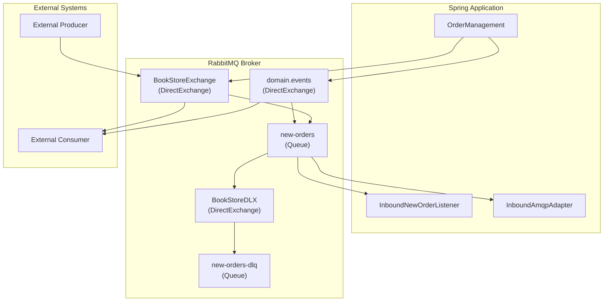
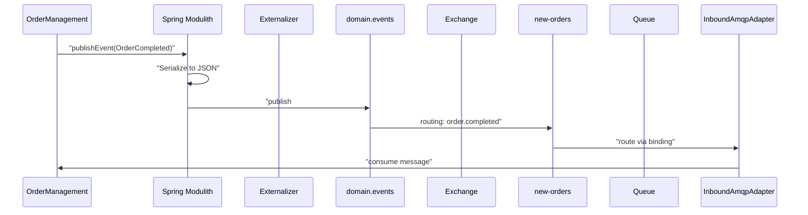
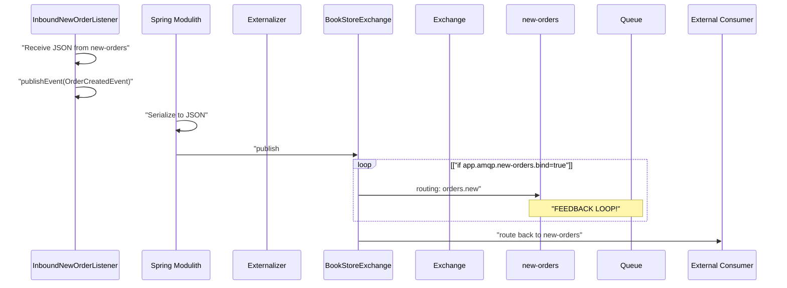
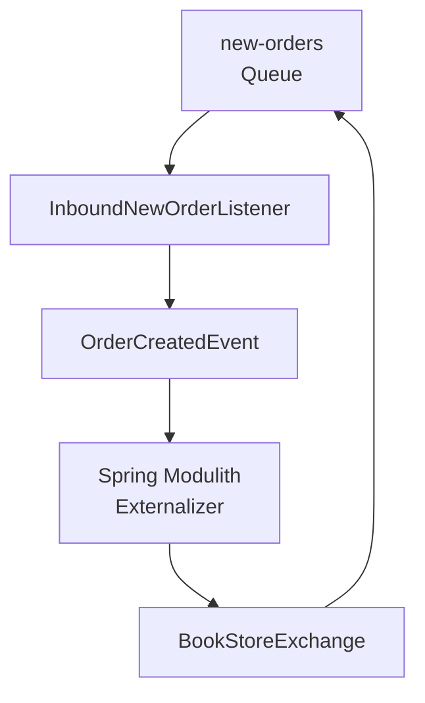
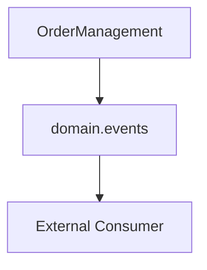
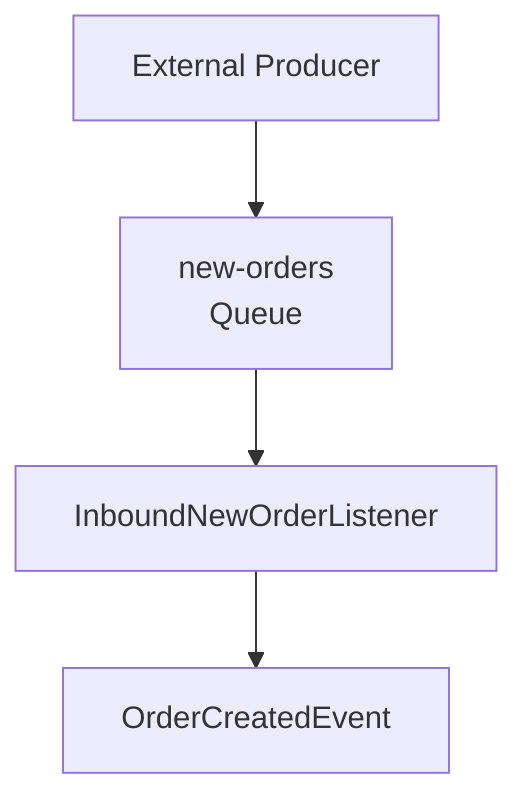
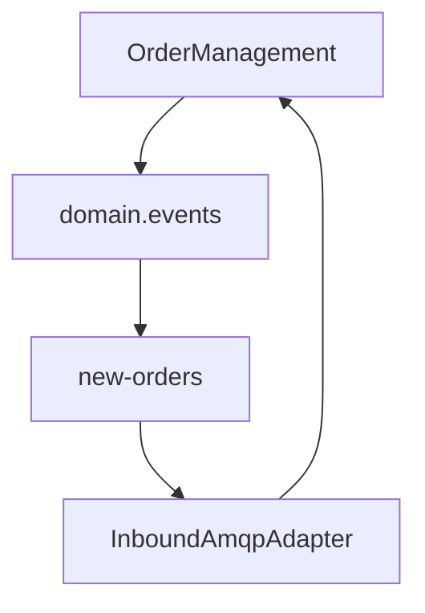

# Message Routing and Patterns

> **Relevant source files**
> * [README.md](https://github.com/philipz/spring-monolith-amqp-poc/blob/c93f55b5/README.md)
> * [src/main/java/com/example/modulithdemo/inventory/app/InventoryManagement.java](https://github.com/philipz/spring-monolith-amqp-poc/blob/c93f55b5/src/main/java/com/example/modulithdemo/inventory/app/InventoryManagement.java)
> * [src/main/java/com/example/modulithdemo/inventory/app/OrderCreatedEventListener.java](https://github.com/philipz/spring-monolith-amqp-poc/blob/c93f55b5/src/main/java/com/example/modulithdemo/inventory/app/OrderCreatedEventListener.java)
> * [src/main/java/com/example/modulithdemo/messaging/inbound/amqp/AmqpConstants.java](https://github.com/philipz/spring-monolith-amqp-poc/blob/c93f55b5/src/main/java/com/example/modulithdemo/messaging/inbound/amqp/AmqpConstants.java)
> * [src/main/resources/application.yml](https://github.com/philipz/spring-monolith-amqp-poc/blob/c93f55b5/src/main/resources/application.yml)

## Purpose and Scope

This page documents the message routing mechanisms and patterns used in the RabbitMQ integration. It covers routing keys, exchange bindings, message flow patterns, and the prevention of feedback loops. For topology configuration details including exchange and queue declarations, see [Topology Configuration](/philipz/spring-monolith-amqp-poc/7.1-topology-configuration). For error handling and dead-letter routing, see [Error Handling and Retries](/philipz/spring-monolith-amqp-poc/7.3-error-handling-and-retries).

---

## Overview

The application implements multiple routing patterns to support both event externalization (outbound) and message consumption (inbound). The routing strategy uses RabbitMQ Direct Exchanges with specific routing keys to ensure messages reach their intended destinations while preventing unintended message loops.

**Sources:** [README.md L48-L100](https://github.com/philipz/spring-monolith-amqp-poc/blob/c93f55b5/README.md#L48-L100)

 [Diagram 4 from context](https://github.com/philipz/spring-monolith-amqp-poc/blob/c93f55b5/Diagram 4 from context)

---

## Exchange and Routing Key Definitions

All AMQP constants are centralized in `AmqpConstants` to prevent duplication and ensure consistency across configuration classes.

### Constants Reference

| Constant | Value | Purpose |
| --- | --- | --- |
| `BOOKSTORE_EXCHANGE` | `"BookStoreExchange"` | Inbound exchange for external new order messages |
| `BOOKSTORE_DLX` | `"BookStoreDLX"` | Dead-letter exchange for failed messages |
| `NEW_ORDERS_QUEUE` | `"new-orders"` | Primary queue for new order consumption |
| `NEW_ORDERS_DLQ` | `"new-orders-dlq"` | Dead-letter queue for poison messages |
| `ORDERS_NEW_ROUTING` | `"orders.new"` | Routing key for new order messages |
| `ORDERS_NEW_DLQ_ROUTING` | `"orders.new.dlq"` | Routing key for dead-letter messages |

The `domain.events` exchange is managed by Spring Modulith's event externalization and uses routing key `order.completed` for `OrderCompleted` events.

**Sources:** [src/main/java/com/example/modulithdemo/messaging/inbound/amqp/AmqpConstants.java L1-L24](https://github.com/philipz/spring-monolith-amqp-poc/blob/c93f55b5/src/main/java/com/example/modulithdemo/messaging/inbound/amqp/AmqpConstants.java#L1-L24)

---

## Routing Topology

### Complete Routing Architecture



**Sources:** [README.md L48-L100](https://github.com/philipz/spring-monolith-amqp-poc/blob/c93f55b5/README.md#L48-L100)

 [Diagram 4 from context](https://github.com/philipz/spring-monolith-amqp-poc/blob/c93f55b5/Diagram 4 from context)

---

## Outbound Message Routing

### OrderCompleted Event Flow

The `OrderCompleted` event is externalized to the `domain.events` exchange with routing key `order.completed`. This event is generated when an order is completed via the REST API.



**Routing Configuration:**

* **Exchange:** `domain.events` (created by Spring Modulith AMQP module)
* **Routing Key:** `order.completed`
* **Binding:** Configured in `RabbitTopologyConfig`
* **Message Format:** JSON serialized via Jackson

The `new-orders` queue is bound to `domain.events` with routing key `order.completed`, allowing `InboundAmqpAdapter` to consume externalized events and republish them internally (demonstration pattern).

**Sources:** [README.md L36-L42](https://github.com/philipz/spring-monolith-amqp-poc/blob/c93f55b5/README.md#L36-L42)

 [README.md L74-L77](https://github.com/philipz/spring-monolith-amqp-poc/blob/c93f55b5/README.md#L74-L77)

### OrderCreatedEvent Flow

The `OrderCreatedEvent` is externalized to `BookStoreExchange` with routing key `orders.new`. This event is generated when a new order is received via AMQP.



**Routing Configuration:**

* **Exchange:** `BookStoreExchange`
* **Routing Key:** `orders.new`
* **Conditional Binding:** Controlled by `app.amqp.new-orders.bind` property
* **Message Format:** JSON serialized via Jackson

**Sources:** [README.md L37](https://github.com/philipz/spring-monolith-amqp-poc/blob/c93f55b5/README.md#L37-L37)

 [README.md L80](https://github.com/philipz/spring-monolith-amqp-poc/blob/c93f55b5/README.md#L80-L80)

 [src/main/resources/application.yml L58-L66](https://github.com/philipz/spring-monolith-amqp-poc/blob/c93f55b5/src/main/resources/application.yml#L58-L66)

---

## Inbound Message Routing

### External Message Consumption

The `new-orders` queue receives messages from two sources:

1. **External Producers:** Publish directly to `BookStoreExchange` with routing key `orders.new`
2. **Internal Events:** Externalized `OrderCompleted` events from `domain.events` exchange

### Routing Table

| Source | Exchange | Routing Key | Queue | Listener |
| --- | --- | --- | --- | --- |
| External new orders | `BookStoreExchange` | `orders.new` | `new-orders` | `InboundNewOrderListener` |
| Externalized OrderCompleted | `domain.events` | `order.completed` | `new-orders` | `InboundAmqpAdapter` |
| Dead-letter messages | `BookStoreDLX` | `orders.new.dlq` | `new-orders-dlq` | Manual inspection |

**Sources:** [src/main/java/com/example/modulithdemo/messaging/inbound/amqp/AmqpConstants.java L1-L24](https://github.com/philipz/spring-monolith-amqp-poc/blob/c93f55b5/src/main/java/com/example/modulithdemo/messaging/inbound/amqp/AmqpConstants.java#L1-L24)

 [README.md L68-L80](https://github.com/philipz/spring-monolith-amqp-poc/blob/c93f55b5/README.md#L68-L80)

---

## Feedback Loop Prevention

### The Problem

When `OrderCreatedEvent` is externalized to `BookStoreExchange::orders.new` and the `new-orders` queue is also bound to `BookStoreExchange` with routing key `orders.new`, a feedback loop occurs:

1. `InboundNewOrderListener` consumes message from `new-orders`
2. Publishes `OrderCreatedEvent` internally
3. Event is externalized to `BookStoreExchange::orders.new`
4. Message routes back to `new-orders` queue
5. Loop repeats indefinitely

### Feedback Loop Scenario



### Solution: Conditional Binding

The `app.amqp.new-orders.bind` property controls whether the `new-orders` queue is bound to `BookStoreExchange`:

* **Default:** `false` (safe - no feedback loop)
* **Enable:** `true` (allows external producers to send to `BookStoreExchange`)

The binding is conditionally applied in `NewOrderTopologyConfig`:

```
@ConditionalOnProperty(
    name = "app.amqp.new-orders.bind",
    havingValue = "true",
    matchIfMissing = false
)
```

**Configuration Options:**

| Property | Value | Behavior |
| --- | --- | --- |
| `app.amqp.new-orders.bind` | `false` (default) | Queue NOT bound to `BookStoreExchange` - no feedback loop |
| `app.amqp.new-orders.bind` | `true` | Queue bound to `BookStoreExchange` - enables external producers |

**Recommendation:** Set `bind=true` only when external systems need to publish to `BookStoreExchange`. For internal-only scenarios, leave it `false`.

**Sources:** [src/main/resources/application.yml L58-L66](https://github.com/philipz/spring-monolith-amqp-poc/blob/c93f55b5/src/main/resources/application.yml#L58-L66)

 [README.md L114-L116](https://github.com/philipz/spring-monolith-amqp-poc/blob/c93f55b5/README.md#L114-L116)

---

## Routing Patterns Summary

### Pattern 1: Direct Event Externalization

**Use Case:** Publish internal domain events to external consumers

**Example:** `OrderCompleted` → `domain.events::order.completed`



**Characteristics:**

* One-way outbound flow
* No feedback loop risk
* Standard Spring Modulith pattern

### Pattern 2: Bridge Pattern (Message-to-Event)

**Use Case:** Convert external AMQP messages to internal domain events

**Example:** External message → `InboundNewOrderListener` → `OrderCreatedEvent`



**Characteristics:**

* Inbound message transformation
* Integration boundary adapter
* Enables event-driven internal processing

### Pattern 3: Demonstration Loop (Consume Own Events)

**Use Case:** Testing externalization by consuming self-published events

**Example:** `OrderCompleted` → `domain.events` → `new-orders` → `InboundAmqpAdapter`



**Characteristics:**

* Validates externalization mechanism
* Demonstrates round-trip message flow
* Not recommended for production (introduces coupling)

**Sources:** [README.md L48-L100](https://github.com/philipz/spring-monolith-amqp-poc/blob/c93f55b5/README.md#L48-L100)

 [README.md L68-L81](https://github.com/philipz/spring-monolith-amqp-poc/blob/c93f55b5/README.md#L68-L81)

---

## Routing Key Conventions

### Naming Pattern

The application follows a hierarchical naming convention for routing keys:

| Pattern | Example | Purpose |
| --- | --- | --- |
| `<resource>.<action>` | `orders.new` | Primary routing for new resources |
| `<resource>.<state>` | `order.completed` | State change notifications |
| `<resource>.<action>.dlq` | `orders.new.dlq` | Dead-letter routing |

### Exchange Type Selection

The application exclusively uses **DirectExchange** for all message routing:

**Rationale:**

* Predictable routing via exact key matching
* Simple troubleshooting and debugging
* No pattern matching overhead
* Clear coupling between publishers and consumers

Alternative exchange types (Topic, Fanout, Headers) are not used in this architecture.

**Sources:** [src/main/java/com/example/modulithdemo/messaging/inbound/amqp/AmqpConstants.java L1-L24](https://github.com/philipz/spring-monolith-amqp-poc/blob/c93f55b5/src/main/java/com/example/modulithdemo/messaging/inbound/amqp/AmqpConstants.java#L1-L24)

---

## Configuration Reference

### Application Properties

The routing behavior is controlled by the following properties:

```markdown
# Enable/disable event externalization
spring.modulith.events.externalization.enabled: true

# Control BookStoreExchange binding to prevent feedback loops
app.amqp.new-orders.bind: false

# RabbitMQ connection settings
spring.rabbitmq.host: localhost
spring.rabbitmq.port: 5672
spring.rabbitmq.cache.channel.size: 50
```

### Environment Variable Overrides

| Variable | Property | Default | Description |
| --- | --- | --- | --- |
| `SPRING_RABBITMQ_HOST` | `spring.rabbitmq.host` | `localhost` | RabbitMQ broker hostname |
| `SPRING_RABBITMQ_PORT` | `spring.rabbitmq.port` | `5672` | AMQP port |
| `SPRING_MODULITH_EVENTS_EXTERNALIZATION_ENABLED` | `spring.modulith.events.externalization.enabled` | `true` | Enable event publishing to RabbitMQ |

The `app.amqp.new-orders.bind` property can be overridden via CLI argument or `SPRING_APPLICATION_JSON` environment variable.

**Sources:** [src/main/resources/application.yml L1-L67](https://github.com/philipz/spring-monolith-amqp-poc/blob/c93f55b5/src/main/resources/application.yml#L1-L67)

---

## Message Format

All externalized events are serialized to JSON using Jackson. The message structure includes:

* **Headers:** Standard AMQP headers (timestamp, message ID)
* **Body:** JSON representation of the domain event
* **Content Type:** `application/json`
* **Content Encoding:** `UTF-8`

**Example OrderCompleted JSON:**

```json
{
  "orderId": "123e4567-e89b-12d3-a456-426614174000",
  "occurredOn": "2025-01-15T10:30:00Z"
}
```

**Example OrderCreatedEvent JSON:**

```json
{
  "orderNumber": "A123",
  "productCode": "BOOK-001",
  "quantity": 2,
  "customer": {
    "name": "Alice",
    "email": "alice@example.com",
    "phone": "123"
  }
}
```

**Sources:** [README.md L131-L143](https://github.com/philipz/spring-monolith-amqp-poc/blob/c93f55b5/README.md#L131-L143)

---

## Operational Considerations

### Routing Verification

To verify routing configuration, check the RabbitMQ Management UI ([http://localhost:15672](http://localhost:15672)):

1. Navigate to **Exchanges** → `domain.events` → **Bindings** * Should show binding to `new-orders` with routing key `order.completed`
2. Navigate to **Exchanges** → `BookStoreExchange` → **Bindings** * Check if `new-orders` is bound (depends on `app.amqp.new-orders.bind`)
3. Navigate to **Queues** → `new-orders` → **Get messages** * Verify message routing and format

### Troubleshooting Routing Issues

| Issue | Possible Cause | Solution |
| --- | --- | --- |
| Messages not routing | Incorrect routing key | Verify `AmqpConstants` values match topology |
| Duplicate messages | Feedback loop enabled | Set `app.amqp.new-orders.bind=false` |
| Messages in DLQ | Processing failures | Check [Error Handling](/philipz/spring-monolith-amqp-poc/7.3-error-handling-and-retries) for retry logic |
| No externalization | Configuration disabled | Verify `spring.modulith.events.externalization.enabled=true` |

**Sources:** [README.md L164-L170](https://github.com/philipz/spring-monolith-amqp-poc/blob/c93f55b5/README.md#L164-L170)