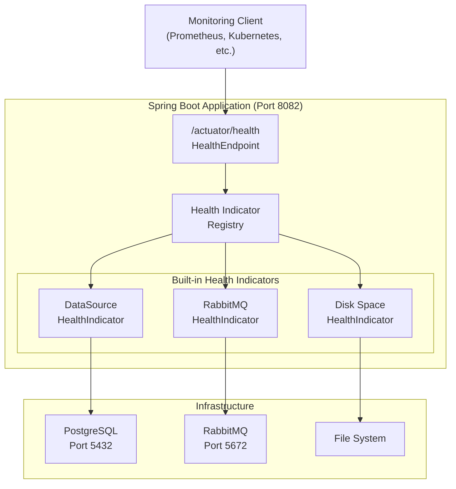
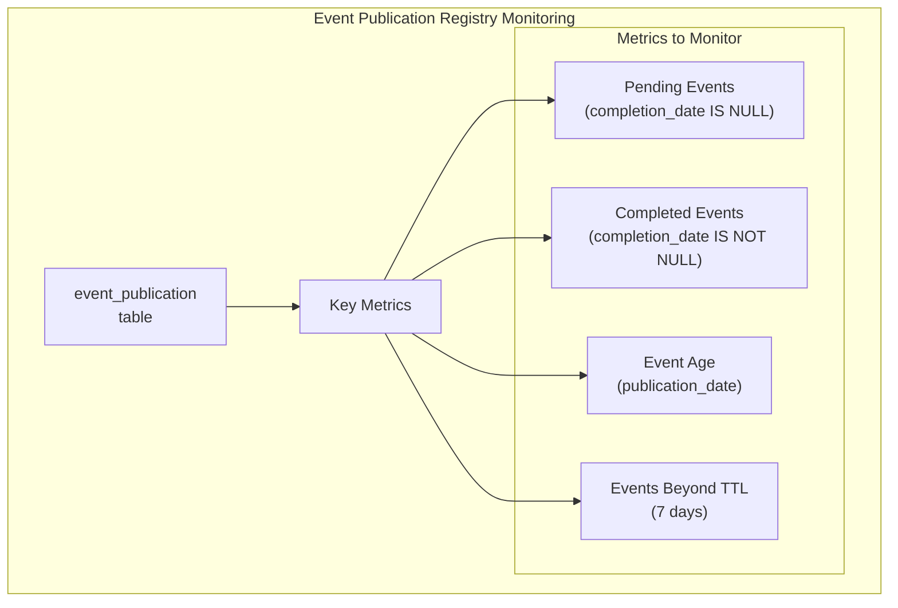
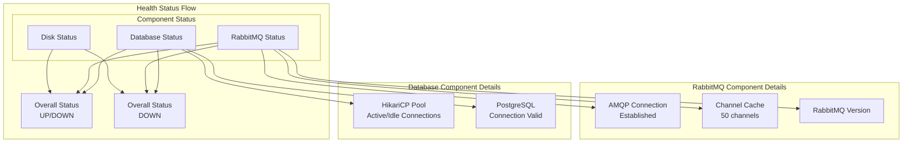
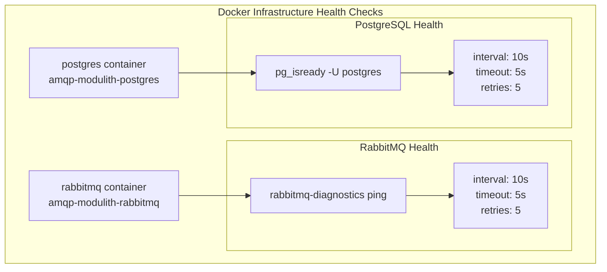

# Monitoring and Health Checks

> **Relevant source files**
> * [docker-compose.yml](https://github.com/philipz/spring-monolith-amqp-poc/blob/c93f55b5/docker-compose.yml)
> * [src/main/resources/application.yml](https://github.com/philipz/spring-monolith-amqp-poc/blob/c93f55b5/src/main/resources/application.yml)
> * [src/test/resources/application.yml](https://github.com/philipz/spring-monolith-amqp-poc/blob/c93f55b5/src/test/resources/application.yml)

## Purpose and Scope

This page documents the monitoring and health check capabilities available in the spring-monolith-amqp-poc application. It covers Spring Boot Actuator endpoints, infrastructure health checks for PostgreSQL and RabbitMQ, and operational monitoring strategies for the Event Publication Registry and connection pools.

For deployment configuration and environment settings, see [Deployment Configuration](/philipz/spring-monolith-amqp-poc/9.1-deployment-configuration). For general operational considerations, see [Operational Considerations](/philipz/spring-monolith-amqp-poc/9-operational-considerations).

---

## Spring Boot Actuator Configuration

The application exposes Spring Boot Actuator endpoints to provide runtime operational information and health status.

### Exposed Endpoints

The application is configured to expose a limited set of actuator endpoints for security:

| Endpoint | URL | Purpose |
| --- | --- | --- |
| Health | `http://localhost:8082/actuator/health` | Comprehensive health status of all components |
| Info | `http://localhost:8082/actuator/info` | Application information and metadata |

The health endpoint is configured with detailed output, showing the status of all sub-components.

**Sources:** [src/main/resources/application.yml L48-L56](https://github.com/philipz/spring-monolith-amqp-poc/blob/c93f55b5/src/main/resources/application.yml#L48-L56)

### Health Endpoint Configuration

The health endpoint provides comprehensive visibility into all system components:

```yaml
management:
  endpoint:
    health:
      show-details: always      # Always show detailed health information
      show-components: always   # Show health of individual components
```

This configuration ensures that the health endpoint returns detailed information about:

* Database connectivity (PostgreSQL or H2)
* RabbitMQ connection and channel status
* Disk space
* Application availability

**Sources:** [src/main/resources/application.yml L48-L52](https://github.com/philipz/spring-monolith-amqp-poc/blob/c93f55b5/src/main/resources/application.yml#L48-L52)

---

## Health Check Architecture

### Overall Health Check Structure



**Health Check Response Structure:**

The `/actuator/health` endpoint returns a JSON response with nested component health:

```json
{
  "status": "UP",
  "components": {
    "db": {
      "status": "UP",
      "details": {
        "database": "PostgreSQL",
        "validationQuery": "isValid()"
      }
    },
    "rabbit": {
      "status": "UP",
      "details": {
        "version": "4.1.3"
      }
    },
    "diskSpace": {
      "status": "UP",
      "details": {
        "total": 500000000000,
        "free": 300000000000,
        "threshold": 10485760
      }
    }
  }
}
```

**Sources:** [src/main/resources/application.yml L48-L56](https://github.com/philipz/spring-monolith-amqp-poc/blob/c93f55b5/src/main/resources/application.yml#L48-L56)

 [docker-compose.yml L1-L50](https://github.com/philipz/spring-monolith-amqp-poc/blob/c93f55b5/docker-compose.yml#L1-L50)

---

## Database Health Monitoring

### PostgreSQL Health Check

Spring Boot's `DataSourceHealthIndicator` automatically monitors PostgreSQL connectivity by executing validation queries against the connection pool.

#### HikariCP Connection Pool Monitoring

The application uses HikariCP with the following monitoring-relevant configuration:

| Parameter | Default Value | Environment Variable | Description |
| --- | --- | --- | --- |
| `maximum-pool-size` | 10 | `SPRING_DATASOURCE_HIKARI_MAXIMUM_POOL_SIZE` | Maximum number of connections |
| `minimum-idle` | 2 | `SPRING_DATASOURCE_HIKARI_MINIMUM_IDLE` | Minimum idle connections |
| `connection-timeout` | 30000ms | `SPRING_DATASOURCE_HIKARI_CONNECTION_TIMEOUT` | Maximum wait time for connection |
| `idle-timeout` | 600000ms (10m) | `SPRING_DATASOURCE_HIKARI_IDLE_TIMEOUT` | Maximum idle time before eviction |
| `max-lifetime` | 1800000ms (30m) | `SPRING_DATASOURCE_HIKARI_MAX_LIFETIME` | Maximum connection lifetime |

**Connection Pool Health Indicators:**

HikariCP exposes JMX metrics for monitoring:

* Active connections
* Idle connections
* Pending thread count
* Connection acquisition time
* Connection usage time

**Sources:** [src/main/resources/application.yml L21-L26](https://github.com/philipz/spring-monolith-amqp-poc/blob/c93f55b5/src/main/resources/application.yml#L21-L26)

### Docker Container Health Check

PostgreSQL container includes built-in health checks:

```yaml
healthcheck:
  test: ["CMD-SHELL", "pg_isready -U postgres"]
  interval: 10s
  timeout: 5s
  retries: 5
```

The `pg_isready` utility checks if PostgreSQL is ready to accept connections. This health check runs every 10 seconds and marks the container unhealthy after 5 consecutive failures.

**Sources:** [docker-compose.yml L14-L18](https://github.com/philipz/spring-monolith-amqp-poc/blob/c93f55b5/docker-compose.yml#L14-L18)

---

## RabbitMQ Monitoring

### RabbitMQ Management UI

RabbitMQ provides a comprehensive web-based management interface accessible at:

```yaml
http://localhost:15672
Username: guest
Password: guest
```

#### Management UI Features

The management UI provides:

| Tab | Monitoring Capabilities |
| --- | --- |
| Overview | Cluster status, message rates, connection/channel counts |
| Connections | Active connections, data rates, protocol details |
| Channels | Open channels, unacknowledged messages, consumer details |
| Exchanges | Exchange list, message rates, bindings |
| Queues | Queue depths, consumer counts, message rates, ready/unacknowledged counts |
| Admin | User management, virtual host configuration |

**Key Metrics to Monitor:**

1. **Queue Depth**: Number of messages in `new-orders` queue
2. **Dead Letter Queue**: Messages in `new-orders-dlq` requiring manual intervention
3. **Consumer Count**: Number of active consumers on each queue
4. **Message Rates**: Publish/deliver rates per second
5. **Channel Count**: Should correlate with configured cache size (50)

**Sources:** [docker-compose.yml L28-L30](https://github.com/philipz/spring-monolith-amqp-poc/blob/c93f55b5/docker-compose.yml#L28-L30)

 [src/main/resources/application.yml L12-L14](https://github.com/philipz/spring-monolith-amqp-poc/blob/c93f55b5/src/main/resources/application.yml#L12-L14)

### RabbitMQ Health Indicator

Spring Boot's `RabbitHealthIndicator` monitors RabbitMQ connectivity by checking the connection and channel status.

#### AMQP Channel Cache Configuration

```yaml
spring:
  rabbitmq:
    cache:
      channel:
        size: 50   # Cached channels for high throughput
```

The channel cache reduces connection overhead by reusing channels. Monitor:

* Channel creation rate (high rate indicates cache exhaustion)
* Channel errors (indicates connection issues)
* Cache hit rate (should be high for stable workloads)

**Sources:** [src/main/resources/application.yml L12-L14](https://github.com/philipz/spring-monolith-amqp-poc/blob/c93f55b5/src/main/resources/application.yml#L12-L14)

### Docker Container Health Check

RabbitMQ container includes built-in health checks:

```yaml
healthcheck:
  test: ["CMD", "rabbitmq-diagnostics", "ping"]
  interval: 10s
  timeout: 5s
  retries: 5
```

The `rabbitmq-diagnostics ping` command verifies that the RabbitMQ node is running and responsive. This health check runs every 10 seconds.

**Sources:** [docker-compose.yml L33-L37](https://github.com/philipz/spring-monolith-amqp-poc/blob/c93f55b5/docker-compose.yml#L33-L37)

---

## Event Publication Registry Monitoring

### Event Publication Table

The Event Publication Registry stores events in the `event_publication` table in PostgreSQL. This table requires monitoring for operational health.



### Monitoring Queries

**Count Pending Events:**

```sql
SELECT COUNT(*) 
FROM event_publication 
WHERE completion_date IS NULL;
```

**Count Completed Events:**

```sql
SELECT COUNT(*) 
FROM event_publication 
WHERE completion_date IS NOT NULL;
```

**Find Old Pending Events (older than 1 hour):**

```sql
SELECT id, event_type, publication_date, listener_id
FROM event_publication 
WHERE completion_date IS NULL 
  AND publication_date < NOW() - INTERVAL '1 hour'
ORDER BY publication_date;
```

**Count Events Beyond TTL (should be cleaned up):**

```sql
SELECT COUNT(*) 
FROM event_publication 
WHERE completion_date IS NOT NULL 
  AND completion_date < NOW() - INTERVAL '7 days';
```

### Event Publication Registry Configuration

| Configuration | Value | Description |
| --- | --- | --- |
| `completion-mode` | `UPDATE` (prod), `DELETE` (test) | Whether to keep completed events |
| `time-to-live` | `7d` | Retention period for completed events |
| `republish-outstanding-events-on-restart` | `true` (prod), `false` (test) | Retry pending events on startup |

**Alert Thresholds:**

* **High pending count**: More than 100 pending events may indicate externalization failures
* **Old pending events**: Events pending more than 1 hour suggest processing issues
* **Events beyond TTL**: Indicates cleanup job is not running

**Sources:** [src/main/resources/application.yml L32-L41](https://github.com/philipz/spring-monolith-amqp-poc/blob/c93f55b5/src/main/resources/application.yml#L32-L41)

 [src/test/resources/application.yml L33-L36](https://github.com/philipz/spring-monolith-amqp-poc/blob/c93f55b5/src/test/resources/application.yml#L33-L36)

---

## Component Health Status Matrix



### Health Status Interpretation

| Status | Meaning | Action Required |
| --- | --- | --- |
| `UP` | All components healthy | Normal operation |
| `DOWN` | One or more components failed | Immediate investigation required |
| `OUT_OF_SERVICE` | Component disabled | Check configuration |
| `UNKNOWN` | Unable to determine status | Check component logs |

**Sources:** [src/main/resources/application.yml L48-L56](https://github.com/philipz/spring-monolith-amqp-poc/blob/c93f55b5/src/main/resources/application.yml#L48-L56)

---

## Logging and Monitoring Integration

### Application Logging Levels

```yaml
logging:
  level:
    org.springframework.modulith: INFO
    org.springframework.amqp: INFO
```

The application uses INFO-level logging for Spring Modulith and AMQP components, providing visibility into:

* Event publication and externalization
* AMQP message consumption and acknowledgment
* Connection pool events
* Health check failures

**Recommended Monitoring Integration:**

1. **Prometheus**: Expose metrics via `spring-boot-starter-actuator` with micrometer
2. **Grafana**: Create dashboards for: * Event Publication Registry depth * AMQP message rates * Database connection pool usage * Health check status over time
3. **ELK Stack**: Aggregate logs for error analysis and audit trails
4. **Alerting**: Configure alerts for: * Health check failures * High pending event count * Dead letter queue growth * Connection pool exhaustion

**Sources:** [src/main/resources/application.yml L43-L46](https://github.com/philipz/spring-monolith-amqp-poc/blob/c93f55b5/src/main/resources/application.yml#L43-L46)

---

## Test Environment Health Checks

The test environment uses the same health check configuration but with different infrastructure:

| Component | Production | Test |
| --- | --- | --- |
| Database | PostgreSQL | H2 in-memory |
| Server Port | 8082 | Random (0) |
| Event Republish | Enabled | Disabled |
| Completion Mode | UPDATE | DELETE |
| RabbitMQ | Required | Optional (can be mocked) |

Health checks in the test environment verify:

* H2 database connectivity
* RabbitMQ connectivity (if running)
* Application startup and initialization

**Sources:** [src/test/resources/application.yml L1-L58](https://github.com/philipz/spring-monolith-amqp-poc/blob/c93f55b5/src/test/resources/application.yml#L1-L58)

---

## Infrastructure Health Check Summary

### Docker Compose Health Check Overview



Both containers are marked unhealthy if they fail health checks 5 consecutive times (50 seconds). The application should wait for both containers to be healthy before starting.

**Starting infrastructure with health check wait:**

```markdown
docker-compose up -d
docker-compose ps  # Check health status
```

**Sources:** [docker-compose.yml L14-L18](https://github.com/philipz/spring-monolith-amqp-poc/blob/c93f55b5/docker-compose.yml#L14-L18)

 [docker-compose.yml L33-L37](https://github.com/philipz/spring-monolith-amqp-poc/blob/c93f55b5/docker-compose.yml#L33-L37)

---

## Operational Monitoring Checklist

### Daily Monitoring Tasks

* Check `/actuator/health` endpoint for overall status
* Review RabbitMQ management UI for queue depths
* Monitor dead letter queue for failed messages
* Check Event Publication Registry for old pending events

### Weekly Monitoring Tasks

* Review HikariCP connection pool metrics
* Check AMQP channel cache hit rate
* Verify Event Publication Registry cleanup (TTL enforcement)
* Review application logs for warnings/errors

### Monthly Monitoring Tasks

* Analyze Event Publication Registry growth trends
* Review RabbitMQ connection/channel patterns
* Assess database connection pool sizing
* Evaluate actuator endpoint security configuration

**Sources:** [src/main/resources/application.yml L1-L67](https://github.com/philipz/spring-monolith-amqp-poc/blob/c93f55b5/src/main/resources/application.yml#L1-L67)

 [docker-compose.yml L1-L50](https://github.com/philipz/spring-monolith-amqp-poc/blob/c93f55b5/docker-compose.yml#L1-L50)