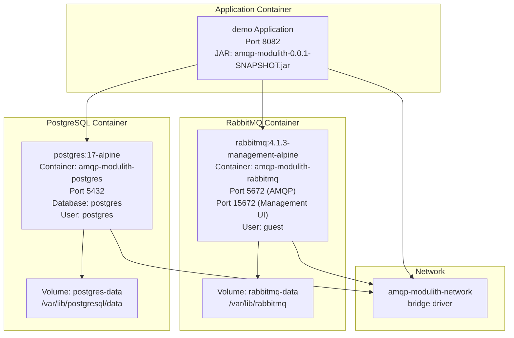
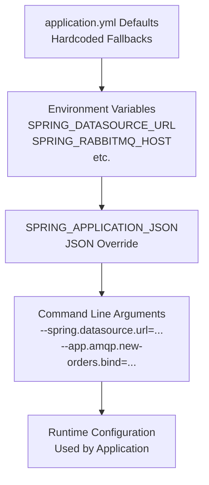
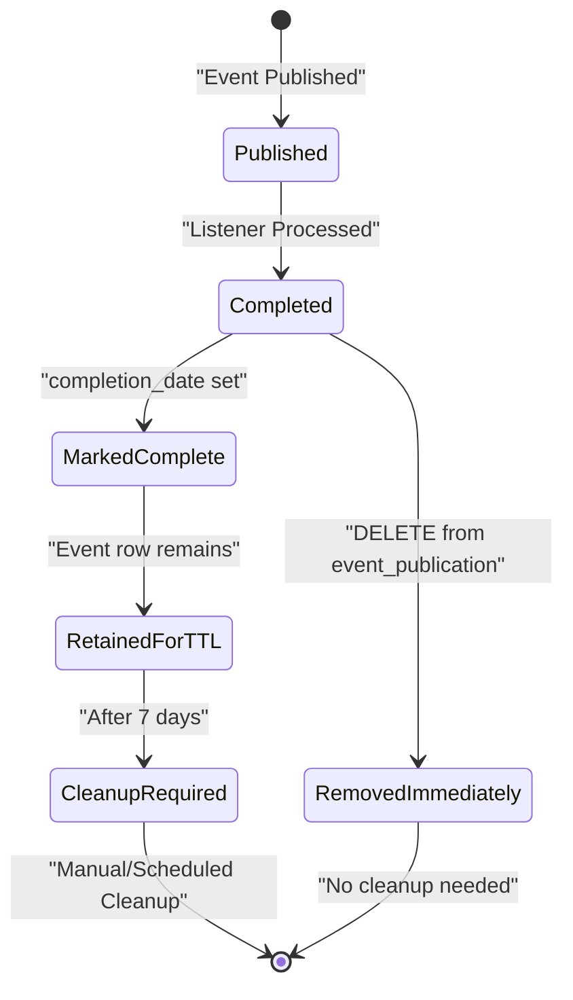
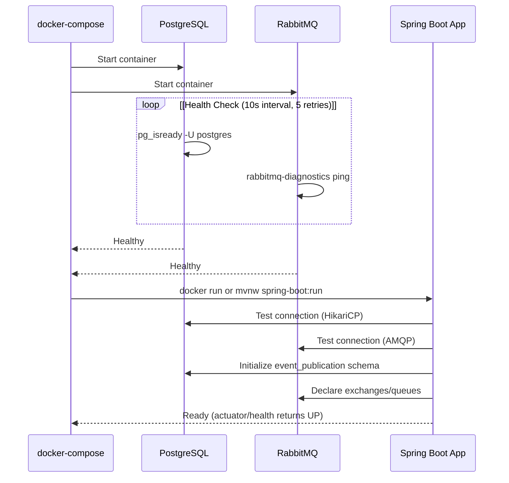
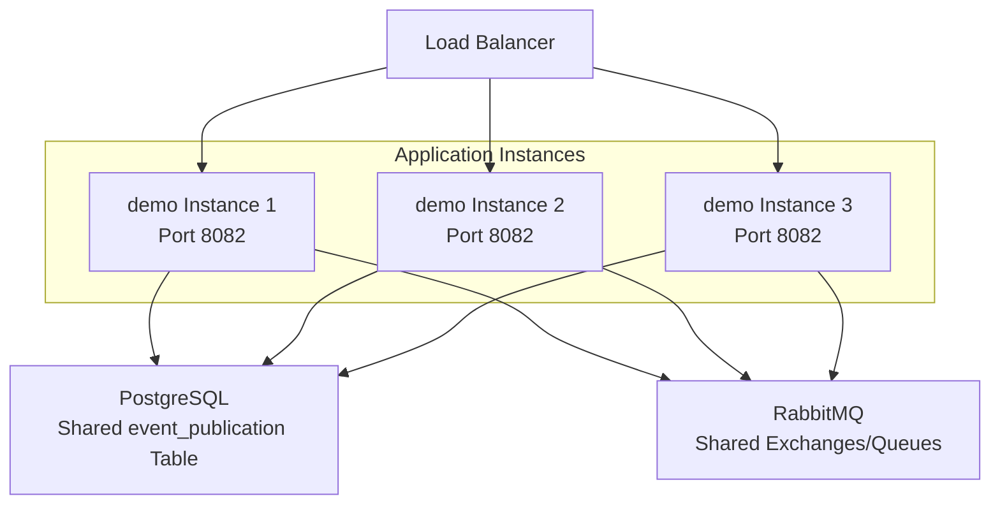

# Operational Considerations

> **Relevant source files**
> * [CLAUDE.md](https://github.com/philipz/spring-monolith-amqp-poc/blob/c93f55b5/CLAUDE.md)
> * [docker-compose.yml](https://github.com/philipz/spring-monolith-amqp-poc/blob/c93f55b5/docker-compose.yml)
> * [src/main/resources/application.yml](https://github.com/philipz/spring-monolith-amqp-poc/blob/c93f55b5/src/main/resources/application.yml)
> * [src/test/resources/application.yml](https://github.com/philipz/spring-monolith-amqp-poc/blob/c93f55b5/src/test/resources/application.yml)

This document provides operational guidance for deploying and maintaining the Spring Modulith AMQP application in production environments. It covers infrastructure requirements, configuration management, resource tuning, and common troubleshooting scenarios.

For specific deployment configuration details and environment-specific overrides, see [Deployment Configuration](/philipz/spring-monolith-amqp-poc/9.1-deployment-configuration). For monitoring endpoints, health checks, and observability, see [Monitoring and Health Checks](/philipz/spring-monolith-amqp-poc/9.2-monitoring-and-health-checks).

---

## Infrastructure Requirements

The application requires two external infrastructure components to function correctly. These dependencies are defined in `docker-compose.yml` for local development and must be provisioned separately in production environments.

### Required Services



**Sources:** [docker-compose.yml L1-L50](https://github.com/philipz/spring-monolith-amqp-poc/blob/c93f55b5/docker-compose.yml#L1-L50)

 [src/main/resources/application.yml L1-L67](https://github.com/philipz/spring-monolith-amqp-poc/blob/c93f55b5/src/main/resources/application.yml#L1-L67)

| Service | Container Image | Ports | Health Check | Volumes |
| --- | --- | --- | --- | --- |
| PostgreSQL | `postgres:17-alpine` | 5432 | `pg_isready -U postgres`Interval: 10s, Timeout: 5s, Retries: 5 | `postgres-data` |
| RabbitMQ | `rabbitmq:4.1.3-management-alpine` | 5672 (AMQP)15672 (Management) | `rabbitmq-diagnostics ping`Interval: 10s, Timeout: 5s, Retries: 5 | `rabbitmq-data` |
| Application | Spring Boot JAR | 8082 | `/actuator/health` | None (stateless) |

**Sources:** [docker-compose.yml L2-L39](https://github.com/philipz/spring-monolith-amqp-poc/blob/c93f55b5/docker-compose.yml#L2-L39)

 [src/main/resources/application.yml L48-L56](https://github.com/philipz/spring-monolith-amqp-poc/blob/c93f55b5/src/main/resources/application.yml#L48-L56)

---

## Configuration Management Strategy

The application uses a layered configuration approach with environment variable overrides. Configuration is environment-aware with separate profiles for production and testing.

### Configuration Override Hierarchy



**Sources:** [src/main/resources/application.yml L8-L26](https://github.com/philipz/spring-monolith-amqp-poc/blob/c93f55b5/src/main/resources/application.yml#L8-L26)

 [CLAUDE.md L117-L123](https://github.com/philipz/spring-monolith-amqp-poc/blob/c93f55b5/CLAUDE.md#L117-L123)

### Key Environment Variables

All configuration keys in `application.yml` support environment variable overrides using Spring Boot's relaxed binding convention. Critical variables include:

| Configuration Key | Environment Variable | Default | Purpose |
| --- | --- | --- | --- |
| `spring.datasource.url` | `SPRING_DATASOURCE_URL` | `jdbc:postgresql://localhost:5432/postgres` | PostgreSQL connection string |
| `spring.datasource.username` | `SPRING_DATASOURCE_USERNAME` | `postgres` | Database user |
| `spring.datasource.password` | `SPRING_DATASOURCE_PASSWORD` | `postgres` | Database password |
| `spring.rabbitmq.host` | `SPRING_RABBITMQ_HOST` | `localhost` | RabbitMQ hostname |
| `spring.rabbitmq.port` | `SPRING_RABBITMQ_PORT` | `5672` | RabbitMQ AMQP port |
| `spring.rabbitmq.username` | `SPRING_RABBITMQ_USERNAME` | `guest` | RabbitMQ user |
| `spring.rabbitmq.password` | `SPRING_RABBITMQ_PASSWORD` | `guest` | RabbitMQ password |
| `spring.modulith.events.externalization.enabled` | `SPRING_MODULITH_EVENTS_EXTERNALIZATION_ENABLED` | `true` | Enable/disable AMQP externalization |
| `spring.modulith.events.time-to-live` | `SPRING_MODULITH_EVENTS_TIME_TO_LIVE` | `7d` | TTL for completed events |

**Sources:** [src/main/resources/application.yml L8-L41](https://github.com/philipz/spring-monolith-amqp-poc/blob/c93f55b5/src/main/resources/application.yml#L8-L41)

 [CLAUDE.md L117-L123](https://github.com/philipz/spring-monolith-amqp-poc/blob/c93f55b5/CLAUDE.md#L117-L123)

---

## Production vs Test Configuration Differences

The application maintains separate configurations for production (`src/main/resources/application.yml`) and testing (`src/test/resources/application.yml`). Understanding these differences is critical for troubleshooting environment-specific issues.

### Configuration Comparison

| Setting | Production | Test | Rationale |
| --- | --- | --- | --- |
| **Server Port** | `8082` | `0` (random) | Tests need parallel execution without port conflicts |
| **Database** | PostgreSQL via JDBC | H2 in-memory | Tests need fast, isolated, ephemeral storage |
| **Database URL** | `jdbc:postgresql://localhost:5432/postgres` | `jdbc:h2:mem:modulith;MODE=PostgreSQL` | H2 compatibility mode mimics PostgreSQL |
| **Event Externalization** | `enabled: true` | `enabled: false` | Tests avoid external RabbitMQ dependency by default |
| **Event Completion Mode** | `UPDATE` | `DELETE` | Production retains history; tests clean up immediately |
| **Republish on Restart** | `true` | `false` | Production ensures at-least-once; tests use ephemeral state |
| **Event TTL** | `7d` (7 days) | Not specified | Production maintains audit trail; tests don't need retention |

**Sources:** [src/main/resources/application.yml L1-L67](https://github.com/philipz/spring-monolith-amqp-poc/blob/c93f55b5/src/main/resources/application.yml#L1-L67)

 [src/test/resources/application.yml L1-L58](https://github.com/philipz/spring-monolith-amqp-poc/blob/c93f55b5/src/test/resources/application.yml#L1-L58)

### Event Completion Mode Impact

The `completion-mode` setting has significant operational implications:



**Sources:** [src/main/resources/application.yml L38-L41](https://github.com/philipz/spring-monolith-amqp-poc/blob/c93f55b5/src/main/resources/application.yml#L38-L41)

 [src/test/resources/application.yml L36](https://github.com/philipz/spring-monolith-amqp-poc/blob/c93f55b5/src/test/resources/application.yml#L36-L36)

**Operational Note:** Production environments using `UPDATE` mode require scheduled cleanup jobs to prevent unbounded growth of the `event_publication` table. The 7-day TTL (`spring.modulith.events.time-to-live: 7d`) provides an audit window but does not automatically delete rows.

---

## Resource Management and Tuning

### HikariCP Connection Pool Configuration

The application uses HikariCP for PostgreSQL connection pooling. Production settings balance connection reuse with resource limits.

| Parameter | Configuration Key | Default | Description |
| --- | --- | --- | --- |
| Maximum Pool Size | `spring.datasource.hikari.maximum-pool-size` | `10` | Max concurrent database connections |
| Minimum Idle | `spring.datasource.hikari.minimum-idle` | `2` | Minimum idle connections maintained |
| Connection Timeout | `spring.datasource.hikari.connection-timeout` | `30000` ms (30s) | Max wait time for connection from pool |
| Idle Timeout | `spring.datasource.hikari.idle-timeout` | `600000` ms (10m) | Max idle time before connection closed |
| Max Lifetime | `spring.datasource.hikari.max-lifetime` | `1800000` ms (30m) | Max lifetime of connection in pool |

**Sources:** [src/main/resources/application.yml L21-L26](https://github.com/philipz/spring-monolith-amqp-poc/blob/c93f55b5/src/main/resources/application.yml#L21-L26)

**Tuning Guidelines:**

* **`maximum-pool-size`**: Set based on concurrent load. Formula: `(core_count * 2) + effective_spindle_count`. For cloud environments, consider limiting to avoid resource exhaustion.
* **`minimum-idle`**: Keep low (2-5) to reduce idle connection overhead.
* **`max-lifetime`**: Must be shorter than database connection timeout to prevent closed connections.

### RabbitMQ Channel Caching

The AMQP channel cache improves throughput by reusing channels across message operations.

```yaml
spring:
  rabbitmq:
    cache:
      channel:
        size: 50
```

**Sources:** [src/main/resources/application.yml L12-L14](https://github.com/philipz/spring-monolith-amqp-poc/blob/c93f55b5/src/main/resources/application.yml#L12-L14)

**Considerations:**

* Default channel cache is typically 25. This application increases to 50 for higher throughput.
* Each cached channel consumes memory (~50KB per channel).
* Monitor channel usage via RabbitMQ management UI (`http://localhost:15672`).
* If seeing channel exhaustion (`ChannelLimitExceededException`), increase `size` via `SPRING_RABBITMQ_CACHE_CHANNEL_SIZE`.

---

## Event Publication Registry Operations

The Event Publication Registry (EPR) is stored in the `event_publication` table and implements the transactional outbox pattern.

### Event Lifecycle Management

```

```

**Sources:** [src/main/resources/application.yml L28-L41](https://github.com/philipz/spring-monolith-amqp-poc/blob/c93f55b5/src/main/resources/application.yml#L28-L41)

### Event Publication Table Schema

The `event_publication` table stores all events with the following key columns:

| Column | Type | Purpose |
| --- | --- | --- |
| `id` | UUID | Unique event identifier |
| `listener_id` | VARCHAR | Target listener method (e.g., `feature.inventory.InventoryManagement::onOrderCompleted`) |
| `event_type` | VARCHAR | Fully qualified event class name |
| `serialized_event` | TEXT | JSON-serialized event payload |
| `publication_date` | TIMESTAMP | When event was published |
| `completion_date` | TIMESTAMP | When listener completed (NULL if pending) |

**Sources:** [CLAUDE.md L83-L90](https://github.com/philipz/spring-monolith-amqp-poc/blob/c93f55b5/CLAUDE.md#L83-L90)

### Operational Tasks

#### Monitoring Outstanding Events

Query pending events that haven't been processed:

```sql
SELECT id, listener_id, event_type, publication_date, 
       CURRENT_TIMESTAMP - publication_date AS age
FROM event_publication
WHERE completion_date IS NULL
ORDER BY publication_date DESC;
```

#### Cleanup Completed Events

For `UPDATE` mode with TTL, implement scheduled cleanup:

```sql
DELETE FROM event_publication
WHERE completion_date IS NOT NULL
  AND completion_date < CURRENT_TIMESTAMP - INTERVAL '7 days';
```

**Note:** The `spring.modulith.events.time-to-live: 7d` setting marks events for cleanup but does not auto-delete. Manual or scheduled cleanup is required.

**Sources:** [src/main/resources/application.yml L38-L41](https://github.com/philipz/spring-monolith-amqp-poc/blob/c93f55b5/src/main/resources/application.yml#L38-L41)

#### Force Event Republication

To retry failed events on restart:

```yaml
spring:
  modulith:
    events:
      republish-outstanding-events-on-restart: true
```

This setting is enabled by default in production. On application startup, all events with `completion_date IS NULL` are re-dispatched to their listeners.

**Sources:** [src/main/resources/application.yml L36](https://github.com/philipz/spring-monolith-amqp-poc/blob/c93f55b5/src/main/resources/application.yml#L36-L36)

---

## Common Operational Scenarios

### Startup Sequence

The application requires both PostgreSQL and RabbitMQ to be available before starting:



**Sources:** [docker-compose.yml L14-L37](https://github.com/philipz/spring-monolith-amqp-poc/blob/c93f55b5/docker-compose.yml#L14-L37)

 [CLAUDE.md L48-L56](https://github.com/philipz/spring-monolith-amqp-poc/blob/c93f55b5/CLAUDE.md#L48-L56)

### Running Without RabbitMQ

For testing or scenarios where AMQP integration is not needed:

```
java -jar amqp-modulith-0.0.1-SNAPSHOT.jar \
  --spring.modulith.events.externalization.enabled=false \
  --spring.rabbitmq.listener.simple.auto-startup=false
```

This disables:

* Event externalization to RabbitMQ
* Inbound AMQP listeners (`InboundNewOrderListener`, `InboundAmqpAdapter`)

**Sources:** [CLAUDE.md L41-L44](https://github.com/philipz/spring-monolith-amqp-poc/blob/c93f55b5/CLAUDE.md#L41-L44)

### Environment-Specific Configuration

Production deployment example with overrides:

```
java -jar amqp-modulith-0.0.1-SNAPSHOT.jar \
  --spring.datasource.url=jdbc:postgresql://prod-db.example.com:5432/bookstore \
  --spring.datasource.username=app_user \
  --spring.datasource.password=${DB_PASSWORD} \
  --spring.rabbitmq.host=prod-rmq.example.com \
  --spring.rabbitmq.username=app_user \
  --spring.rabbitmq.password=${RABBITMQ_PASSWORD} \
  --spring.datasource.hikari.maximum-pool-size=20 \
  --app.amqp.new-orders.bind=false
```

**Note:** Set `app.amqp.new-orders.bind=false` in production if the application should not consume externalized `OrderCreatedEvent` messages to avoid feedback loops.

**Sources:** [CLAUDE.md L35-L44](https://github.com/philipz/spring-monolith-amqp-poc/blob/c93f55b5/CLAUDE.md#L35-L44)

 [src/main/resources/application.yml L59-L63](https://github.com/philipz/spring-monolith-amqp-poc/blob/c93f55b5/src/main/resources/application.yml#L59-L63)

---

## Troubleshooting Guide

### Connection Issues

| Symptom | Likely Cause | Resolution |
| --- | --- | --- |
| `Connection refused: localhost:5432` | PostgreSQL not started | `docker-compose up -d postgres` or check `SPRING_DATASOURCE_URL` |
| `Connection refused: localhost:5672` | RabbitMQ not started | `docker-compose up -d rabbitmq` or check `SPRING_RABBITMQ_HOST` |
| `HikariPool connection timeout` | Database overloaded or pool exhausted | Increase `maximum-pool-size` or investigate slow queries |
| `ChannelLimitExceededException` | AMQP channel cache exhausted | Increase `spring.rabbitmq.cache.channel.size` |

**Sources:** [src/main/resources/application.yml L16-L26](https://github.com/philipz/spring-monolith-amqp-poc/blob/c93f55b5/src/main/resources/application.yml#L16-L26)

 [docker-compose.yml L2-L39](https://github.com/philipz/spring-monolith-amqp-poc/blob/c93f55b5/docker-compose.yml#L2-L39)

### Event Processing Issues

| Symptom | Likely Cause | Resolution |
| --- | --- | --- |
| Events stuck in `event_publication` with `completion_date IS NULL` | Listener exception or application crash | Check logs for listener errors; restart with `republish-outstanding-events-on-restart: true` |
| Events not externalized to RabbitMQ | `externalization.enabled: false` or RabbitMQ connection failed | Verify configuration; check RabbitMQ logs |
| Duplicate event processing | `republish-outstanding-events-on-restart: true` with listener not idempotent | Implement idempotency in listeners or disable republish |
| `event_publication` table growing unbounded | `completion-mode: UPDATE` without cleanup job | Implement scheduled cleanup or switch to `DELETE` mode |

**Sources:** [src/main/resources/application.yml L28-L41](https://github.com/philipz/spring-monolith-amqp-poc/blob/c93f55b5/src/main/resources/application.yml#L28-L41)

### Performance Degradation

**Symptoms:**

* Slow API responses
* High database CPU
* AMQP channel exhaustion

**Diagnostic Queries:**

```sql
-- Check pending event count
SELECT COUNT(*) FROM event_publication WHERE completion_date IS NULL;

-- Check oldest pending event
SELECT MIN(publication_date) FROM event_publication WHERE completion_date IS NULL;

-- Check event processing lag
SELECT 
  listener_id,
  COUNT(*) as pending_count,
  MIN(publication_date) as oldest_pending
FROM event_publication
WHERE completion_date IS NULL
GROUP BY listener_id;
```

**Tuning Actions:**

1. Increase HikariCP `maximum-pool-size` if database connections are exhausted
2. Increase RabbitMQ channel cache size if seeing `ChannelLimitExceededException`
3. Review `@ApplicationModuleListener` methods for slow processing
4. Implement cleanup job for completed events in `UPDATE` mode

**Sources:** [src/main/resources/application.yml L21-L26](https://github.com/philipz/spring-monolith-amqp-poc/blob/c93f55b5/src/main/resources/application.yml#L21-L26)

 [CLAUDE.md L83-L90](https://github.com/philipz/spring-monolith-amqp-poc/blob/c93f55b5/CLAUDE.md#L83-L90)

---

## Production Deployment Checklist

Before deploying to production, verify:

* PostgreSQL instance provisioned with sufficient resources
* RabbitMQ cluster configured with appropriate memory/disk limits
* `SPRING_DATASOURCE_URL` points to production database
* `SPRING_DATASOURCE_USERNAME` and `SPRING_DATASOURCE_PASSWORD` configured securely (not hardcoded)
* `SPRING_RABBITMQ_HOST`, `SPRING_RABBITMQ_USERNAME`, `SPRING_RABBITMQ_PASSWORD` configured
* `spring.modulith.events.completion-mode: UPDATE` for audit trail
* `spring.modulith.events.time-to-live` set appropriately (default: 7d)
* Scheduled cleanup job implemented for `event_publication` table
* `spring.datasource.hikari.maximum-pool-size` tuned for expected load
* `app.amqp.new-orders.bind` set to `false` if not consuming external orders
* Health check endpoint (`/actuator/health`) accessible for load balancer
* Logging level configured (`org.springframework.modulith`, `org.springframework.amqp`)
* Monitoring configured for RabbitMQ (port 15672) and database

**Sources:** [src/main/resources/application.yml L1-L67](https://github.com/philipz/spring-monolith-amqp-poc/blob/c93f55b5/src/main/resources/application.yml#L1-L67)

 [CLAUDE.md L103-L134](https://github.com/philipz/spring-monolith-amqp-poc/blob/c93f55b5/CLAUDE.md#L103-L134)

---

## Scaling Considerations

### Horizontal Scaling

The application is designed to be stateless and can scale horizontally with multiple instances:



**Considerations:**

* **Event Processing:** Multiple instances will consume from the same RabbitMQ queues. Each message is delivered to only one consumer.
* **Event Publication Registry:** Shared `event_publication` table ensures all instances see the same event state.
* **Connection Pooling:** Each instance maintains its own HikariCP pool. Total connections = `instances * maximum-pool-size`.
* **AMQP Channels:** Each instance maintains its own channel cache. Ensure RabbitMQ has sufficient channel/connection limits.

**Sources:** [src/main/resources/application.yml L21-L26](https://github.com/philipz/spring-monolith-amqp-poc/blob/c93f55b5/src/main/resources/application.yml#L21-L26)

 [docker-compose.yml L1-L50](https://github.com/philipz/spring-monolith-amqp-poc/blob/c93f55b5/docker-compose.yml#L1-L50)

### Vertical Scaling

Tune individual instance resources:

```yaml
# Example production configuration
spring:
  datasource:
    hikari:
      maximum-pool-size: 20  # 2x default for high-load scenarios
      minimum-idle: 5
  rabbitmq:
    cache:
      channel:
        size: 100  # 2x default for high message throughput
```

**Sources:** [src/main/resources/application.yml L12-L26](https://github.com/philipz/spring-monolith-amqp-poc/blob/c93f55b5/src/main/resources/application.yml#L12-L26)