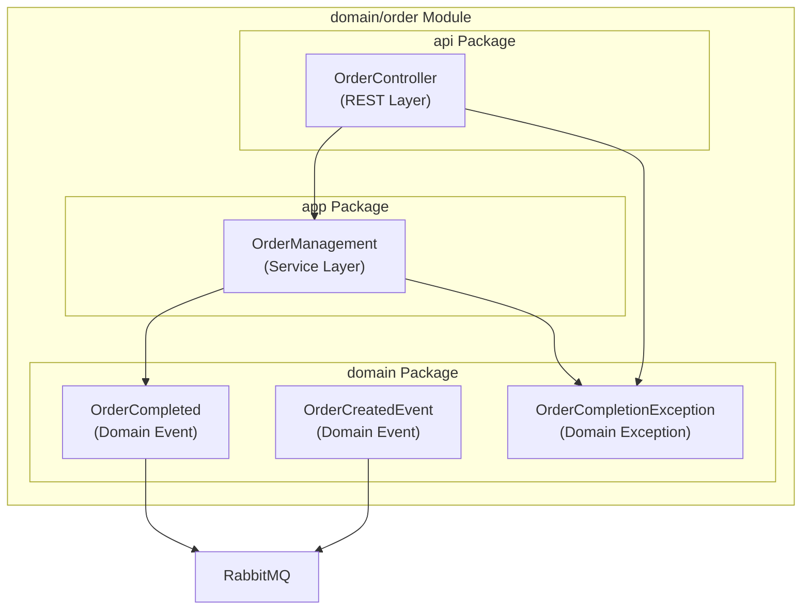
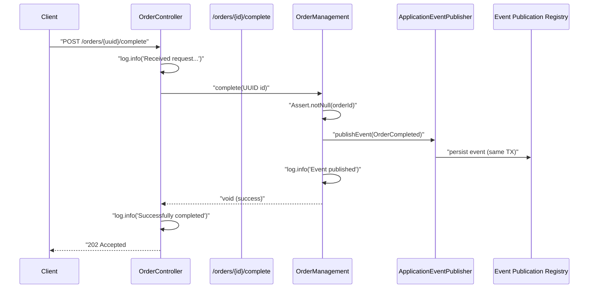
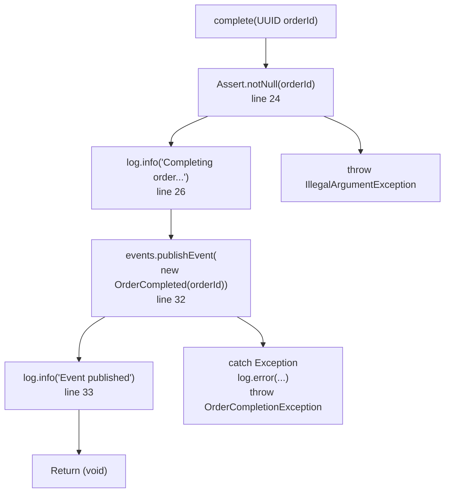
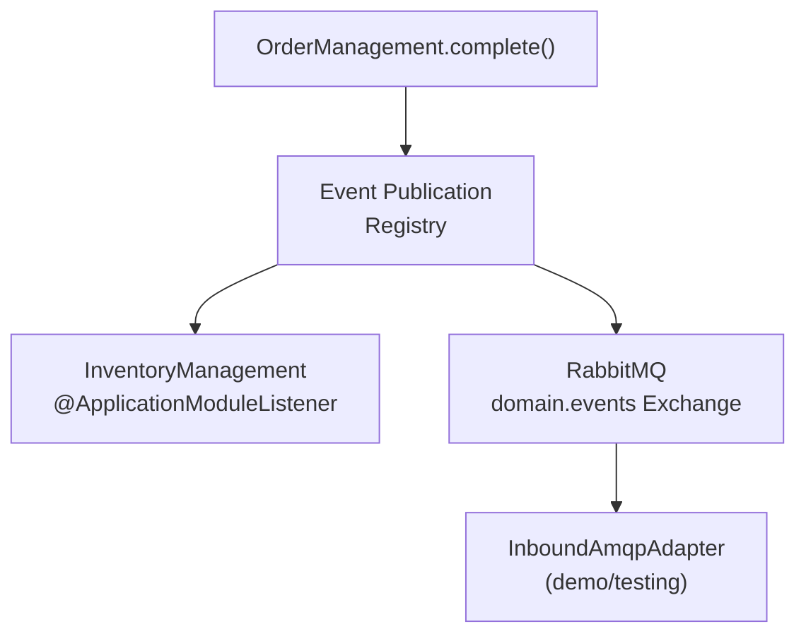
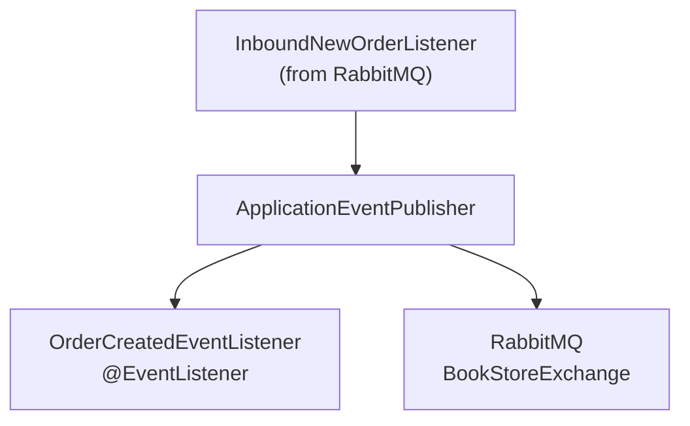
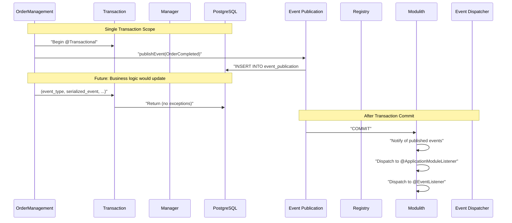
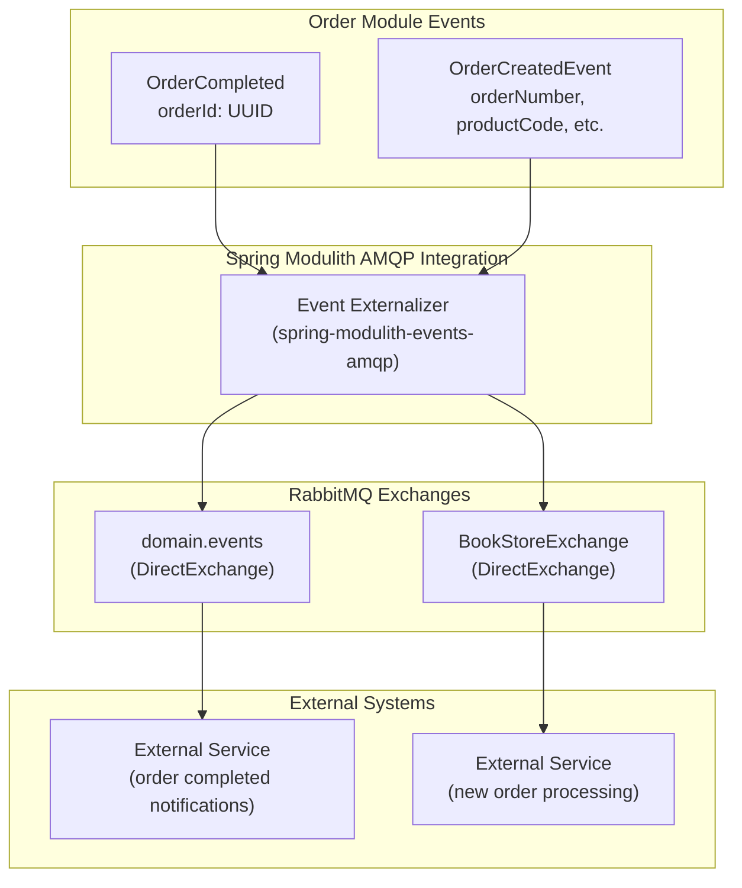
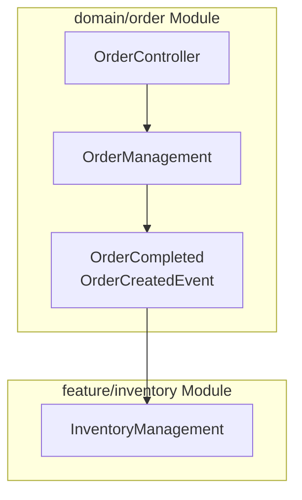
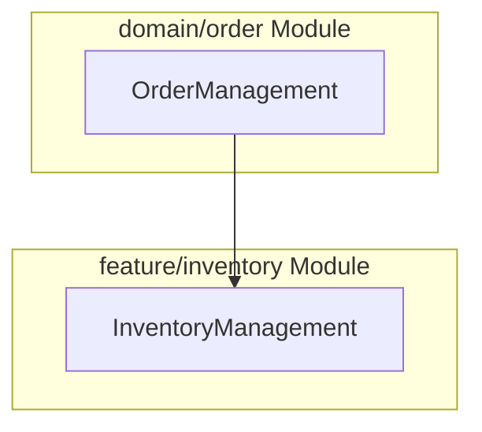

# Order Domain Module

> **Relevant source files**
> * [README.md](https://github.com/philipz/spring-monolith-amqp-poc/blob/c93f55b5/README.md)
> * [src/main/java/com/example/modulithdemo/inventory/app/InventoryManagement.java](https://github.com/philipz/spring-monolith-amqp-poc/blob/c93f55b5/src/main/java/com/example/modulithdemo/inventory/app/InventoryManagement.java)
> * [src/main/java/com/example/modulithdemo/inventory/app/OrderCreatedEventListener.java](https://github.com/philipz/spring-monolith-amqp-poc/blob/c93f55b5/src/main/java/com/example/modulithdemo/inventory/app/OrderCreatedEventListener.java)
> * [src/main/java/com/example/modulithdemo/order/api/OrderController.java](https://github.com/philipz/spring-monolith-amqp-poc/blob/c93f55b5/src/main/java/com/example/modulithdemo/order/api/OrderController.java)
> * [src/main/java/com/example/modulithdemo/order/app/OrderManagement.java](https://github.com/philipz/spring-monolith-amqp-poc/blob/c93f55b5/src/main/java/com/example/modulithdemo/order/app/OrderManagement.java)

## Purpose and Scope

The Order Domain Module (`domain/order`) is the core business logic module responsible for order management operations and domain event publishing. This module provides:

* REST API endpoints for order operations via `OrderController`
* Application service layer (`OrderManagement`) for business logic and event publication
* Domain events (`OrderCompleted` and `OrderCreatedEvent`) that drive cross-module communication
* Integration point for both internal event-driven workflows and external AMQP message externalization

For event externalization to RabbitMQ, see [Event Externalization](/philipz/spring-monolith-amqp-poc/6.2-event-externalization). For how other modules consume order events, see [Inventory Module](/philipz/spring-monolith-amqp-poc/5.2-inventory-module) and [Event Listeners](/philipz/spring-monolith-amqp-poc/6.3-event-listeners). For inbound message processing that creates order events, see [Inbound AMQP Module](/philipz/spring-monolith-amqp-poc/5.3-inbound-amqp-module).

**Sources:** [README.md L34-L37](https://github.com/philipz/spring-monolith-amqp-poc/blob/c93f55b5/README.md#L34-L37)

---

## Module Structure and Package Organization

The order module follows a layered architecture with clear separation of concerns:



| Layer | Package | Purpose | Key Classes |
| --- | --- | --- | --- |
| API | `order.api` | REST endpoints and HTTP request handling | `OrderController` |
| Application | `order.app` | Business logic and orchestration | `OrderManagement` |
| Domain | `order.domain` | Domain events and exceptions | `OrderCompleted`, `OrderCreatedEvent`, `OrderCompletionException` |

**Sources:** [README.md L34-L37](https://github.com/philipz/spring-monolith-amqp-poc/blob/c93f55b5/README.md#L34-L37)

 [src/main/java/com/example/modulithdemo/order/api/OrderController.java L1-L50](https://github.com/philipz/spring-monolith-amqp-poc/blob/c93f55b5/src/main/java/com/example/modulithdemo/order/api/OrderController.java#L1-L50)

 [src/main/java/com/example/modulithdemo/order/app/OrderManagement.java L1-L39](https://github.com/philipz/spring-monolith-amqp-poc/blob/c93f55b5/src/main/java/com/example/modulithdemo/order/app/OrderManagement.java#L1-L39)

---

## REST API Layer: OrderController

### Endpoint Overview

`OrderController` provides the HTTP interface for order operations, currently implementing a single endpoint for order completion.

**Class Location:** [src/main/java/com/example/modulithdemo/order/api/OrderController.java L13-L50](https://github.com/philipz/spring-monolith-amqp-poc/blob/c93f55b5/src/main/java/com/example/modulithdemo/order/api/OrderController.java#L13-L50)

**Key Characteristics:**

* Base path: `/orders`
* Uses constructor injection via `@RequiredArgsConstructor` (Lombok)
* Delegates business logic to `OrderManagement` service
* Comprehensive error handling with differentiated HTTP status codes

### Complete Order Endpoint



**Endpoint Details:**

| Aspect | Value |
| --- | --- |
| HTTP Method | `POST` |
| Path | `/orders/{id}/complete` |
| Path Variable | `id` (UUID) |
| Success Response | `202 Accepted` with message body |
| Error Responses | `400 Bad Request` (invalid ID), `500 Internal Server Error` (completion failure) |

**Implementation:** [src/main/java/com/example/modulithdemo/order/api/OrderController.java L22-L49](https://github.com/philipz/spring-monolith-amqp-poc/blob/c93f55b5/src/main/java/com/example/modulithdemo/order/api/OrderController.java#L22-L49)

### Error Handling Strategy

The controller implements a three-tier exception handling approach:

1. **Domain-specific failures** (`OrderCompletionException`): [OrderController.java L34-L37](https://github.com/philipz/spring-monolith-amqp-poc/blob/c93f55b5/OrderController.java#L34-L37) * Returns `500 Internal Server Error` * Logs with `log.error()`
2. **Validation failures** (`IllegalArgumentException`): [OrderController.java L39-L42](https://github.com/philipz/spring-monolith-amqp-poc/blob/c93f55b5/OrderController.java#L39-L42) * Returns `400 Bad Request` * Logs with `log.warn()`
3. **Unexpected errors** (`Exception`): [OrderController.java L44-L47](https://github.com/philipz/spring-monolith-amqp-poc/blob/c93f55b5/OrderController.java#L44-L47) * Returns `500 Internal Server Error` * Logs full stack trace

**Sources:** [src/main/java/com/example/modulithdemo/order/api/OrderController.java L13-L50](https://github.com/philipz/spring-monolith-amqp-poc/blob/c93f55b5/src/main/java/com/example/modulithdemo/order/api/OrderController.java#L13-L50)

---

## Application Service Layer: OrderManagement

### Service Responsibilities

`OrderManagement` is the core service implementing order business logic and event-driven integration patterns.

**Class Location:** [src/main/java/com/example/modulithdemo/order/app/OrderManagement.java L14-L39](https://github.com/philipz/spring-monolith-amqp-poc/blob/c93f55b5/src/main/java/com/example/modulithdemo/order/app/OrderManagement.java#L14-L39)

**Architecture Characteristics:**

* `@Service` stereotype for Spring component scanning
* `@Transactional` on business methods ensures atomic event publication
* Uses `ApplicationEventPublisher` for Spring Modulith event integration
* Constructor injection via `@RequiredArgsConstructor`

### Complete Order Operation



**Method Signature:** [OrderManagement.java L22-L23](https://github.com/philipz/spring-monolith-amqp-poc/blob/c93f55b5/OrderManagement.java#L22-L23)

```
@Transactional
public void complete(UUID orderId)
```

**Transaction Boundary:** The `@Transactional` annotation ensures that:

* Event publication to the Event Publication Registry occurs in the same transaction
* Business logic changes (future implementation) and event persistence are atomic
* Rollback occurs if any exception is thrown

**Sources:** [src/main/java/com/example/modulithdemo/order/app/OrderManagement.java L14-L39](https://github.com/philipz/spring-monolith-amqp-poc/blob/c93f55b5/src/main/java/com/example/modulithdemo/order/app/OrderManagement.java#L14-L39)

---

## Domain Events

The order module publishes two key domain events that integrate with Spring Modulith's event system.

### OrderCompleted Event

**Purpose:** Signals that an order has been successfully completed and triggers downstream workflows.

**Event Flow:**



**Event Characteristics:**

* Published by: [OrderManagement.java L32](https://github.com/philipz/spring-monolith-amqp-poc/blob/c93f55b5/OrderManagement.java#L32-L32)
* Consumed internally by: `InventoryManagement` (see [Inventory Module](/philipz/spring-monolith-amqp-poc/5.2-inventory-module))
* Externalized to: RabbitMQ exchange `domain.events` with routing key `order.completed`
* Contains: `UUID orderId` (the completed order's identifier)

**Externalization Configuration:**
The event is annotated with `@Externalized` to enable automatic publishing to RabbitMQ. The Spring Modulith AMQP module serializes the event to JSON and routes it based on configuration.

**Sources:** [README.md L5-L6](https://github.com/philipz/spring-monolith-amqp-poc/blob/c93f55b5/README.md#L5-L6)

 [src/main/java/com/example/modulithdemo/order/app/OrderManagement.java L32](https://github.com/philipz/spring-monolith-amqp-poc/blob/c93f55b5/src/main/java/com/example/modulithdemo/order/app/OrderManagement.java#L32-L32)

### OrderCreatedEvent Event

**Purpose:** Represents a newly created order, typically originating from external AMQP messages or future REST endpoints.

**Event Flow:**



**Event Characteristics:**

* Published by: `InboundNewOrderListener` (see [Inbound AMQP Module](/philipz/spring-monolith-amqp-poc/5.3-inbound-amqp-module))
* Consumed internally by: [OrderCreatedEventListener.java L15-L20](https://github.com/philipz/spring-monolith-amqp-poc/blob/c93f55b5/OrderCreatedEventListener.java#L15-L20)
* Externalized to: RabbitMQ exchange `BookStoreExchange` with routing key `orders.new`
* Contains: `orderNumber`, `productCode`, `quantity`, `customer` (full order details)

**Current Implementation:**
The `OrderCreatedEventListener` in the inventory package provides a synchronous event handler with `@EventListener` (as opposed to `@ApplicationModuleListener` used for `OrderCompleted`). This demonstrates different event consumption patterns within the same application.

**Sources:** [README.md L37](https://github.com/philipz/spring-monolith-amqp-poc/blob/c93f55b5/README.md#L37-L37)

 [src/main/java/com/example/modulithdemo/inventory/app/OrderCreatedEventListener.java L1-L21](https://github.com/philipz/spring-monolith-amqp-poc/blob/c93f55b5/src/main/java/com/example/modulithdemo/inventory/app/OrderCreatedEventListener.java#L1-L21)

---

## Event Publication and Transaction Boundaries

### Transactional Outbox Pattern Implementation

The order module leverages Spring Modulith's Event Publication Registry to implement the transactional outbox pattern:



**Key Guarantees:**

1. **Atomicity:** Events are persisted in the same database transaction as business data changes
2. **Durability:** Events survive application crashes and are republished on restart
3. **Ordering:** Events are processed in publication order per transaction
4. **At-least-once delivery:** Failed external publishing is retried until successful

**Configuration Impact:**

* `spring.modulith.events.externalization.enabled=true` enables AMQP externalization
* `republish-outstanding-events-on-restart=true` ensures reliability across restarts
* Event completion mode `UPDATE` with 7-day TTL maintains audit trail

**Sources:** [src/main/java/com/example/modulithdemo/order/app/OrderManagement.java L22-L38](https://github.com/philipz/spring-monolith-amqp-poc/blob/c93f55b5/src/main/java/com/example/modulithdemo/order/app/OrderManagement.java#L22-L38)

 [README.md L109](https://github.com/philipz/spring-monolith-amqp-poc/blob/c93f55b5/README.md#L109-L109)

---

## Integration Points with Other Modules

### Internal Event Consumption

The order domain events are consumed by other application modules without any direct dependencies:

| Consumer Module | Event | Listener Type | Transaction Boundary |
| --- | --- | --- | --- |
| `feature/inventory` | `OrderCompleted` | `@ApplicationModuleListener` | `REQUIRES_NEW` (async) |
| `feature/inventory` | `OrderCreatedEvent` | `@EventListener` | Same transaction (sync) |

**Inventory Module Integration:**

[InventoryManagement.java L14-L17](https://github.com/philipz/spring-monolith-amqp-poc/blob/c93f55b5/InventoryManagement.java#L14-L17)

 demonstrates asynchronous event consumption:

```
@ApplicationModuleListener
void on(OrderCompleted event) {
  log.info("[Inventory] received OrderCompleted: {}", event);
}
```

The `@ApplicationModuleListener` annotation ensures:

* Event processing in a new transaction (`REQUIRES_NEW`)
* Asynchronous execution to prevent blocking the order completion flow
* Resilience: failures in inventory module don't affect order completion

**Sources:** [src/main/java/com/example/modulithdemo/inventory/app/InventoryManagement.java L10-L18](https://github.com/philipz/spring-monolith-amqp-poc/blob/c93f55b5/src/main/java/com/example/modulithdemo/inventory/app/InventoryManagement.java#L10-L18)

 [src/main/java/com/example/modulithdemo/inventory/app/OrderCreatedEventListener.java L10-L21](https://github.com/philipz/spring-monolith-amqp-poc/blob/c93f55b5/src/main/java/com/example/modulithdemo/inventory/app/OrderCreatedEventListener.java#L10-L21)

### External Event Externalization



**Externalization Configuration:**

| Event | Exchange | Routing Key | Format |
| --- | --- | --- | --- |
| `OrderCompleted` | `domain.events` | `order.completed` | JSON (Jackson) |
| `OrderCreatedEvent` | `BookStoreExchange` | `orders.new` | JSON (Jackson) |

**Message Format Example:**
When `OrderCompleted` is externalized, it produces a JSON message like:

```json
{
  "orderId": "123e4567-e89b-12d3-a456-426614174000"
}
```

The serialization is handled automatically by Spring Modulith's Jackson integration.

**Sources:** [README.md L6](https://github.com/philipz/spring-monolith-amqp-poc/blob/c93f55b5/README.md#L6-L6)

 [README.md L37](https://github.com/philipz/spring-monolith-amqp-poc/blob/c93f55b5/README.md#L37-L37)

 [README.md L74-L80](https://github.com/philipz/spring-monolith-amqp-poc/blob/c93f55b5/README.md#L74-L80)

---

## Usage Examples

### Completing an Order via REST API

**Request:**

```
curl -X POST http://localhost:8081/orders/123e4567-e89b-12d3-a456-426614174000/complete
```

**Expected Response:**

```
HTTP/1.1 202 Accepted
Content-Type: text/plain

Order 123e4567-e89b-12d3-a456-426614174000 completed (event published)
```

**Logs Generated:** [OrderController.java L25-L30](https://github.com/philipz/spring-monolith-amqp-poc/blob/c93f55b5/OrderController.java#L25-L30)

```
INFO  OrderController - Received request to complete order: 123e4567-e89b-12d3-a456-426614174000
INFO  OrderManagement - Completing order with ID: 123e4567-e89b-12d3-a456-426614174000
INFO  OrderManagement - Order completion event published for order ID: 123e4567-e89b-12d3-a456-426614174000
INFO  OrderController - Successfully completed order: 123e4567-e89b-12d3-a456-426614174000
INFO  InventoryManagement - [Inventory] received OrderCompleted: OrderCompleted[orderId=123e4567-e89b-12d3-a456-426614174000]
```

**Sources:** [README.md L121-L126](https://github.com/philipz/spring-monolith-amqp-poc/blob/c93f55b5/README.md#L121-L126)

 [src/main/java/com/example/modulithdemo/order/api/OrderController.java L22-L32](https://github.com/philipz/spring-monolith-amqp-poc/blob/c93f55b5/src/main/java/com/example/modulithdemo/order/api/OrderController.java#L22-L32)

### Error Scenarios

**Invalid UUID Format:**

```
curl -X POST http://localhost:8081/orders/invalid-uuid/complete
```

Response: `400 Bad Request` with message `"Invalid order ID: ..."`

**Null Order ID (programmatic):**
If called with `null`, triggers: [OrderManagement.java L24](https://github.com/philipz/spring-monolith-amqp-poc/blob/c93f55b5/OrderManagement.java#L24-L24)

```
throw new IllegalArgumentException("Order ID must not be null")
```

**Event Publication Failure:**
If `ApplicationEventPublisher` throws exception, triggers: [OrderManagement.java L35-L36](https://github.com/philipz/spring-monolith-amqp-poc/blob/c93f55b5/OrderManagement.java#L35-L36)

```
throw new OrderCompletionException("Failed to complete order: " + orderId, e);
```

**Sources:** [src/main/java/com/example/modulithdemo/order/api/OrderController.java L34-L47](https://github.com/philipz/spring-monolith-amqp-poc/blob/c93f55b5/src/main/java/com/example/modulithdemo/order/api/OrderController.java#L34-L47)

 [src/main/java/com/example/modulithdemo/order/app/OrderManagement.java L24](https://github.com/philipz/spring-monolith-amqp-poc/blob/c93f55b5/src/main/java/com/example/modulithdemo/order/app/OrderManagement.java#L24-L24)

 [src/main/java/com/example/modulithdemo/order/app/OrderManagement.java L31-L37](https://github.com/philipz/spring-monolith-amqp-poc/blob/c93f55b5/src/main/java/com/example/modulithdemo/order/app/OrderManagement.java#L31-L37)

---

## Future Implementation Areas

The current implementation includes placeholder comments indicating planned expansions:

### Order Validation and Status Management

[OrderManagement.java L28-L29](https://github.com/philipz/spring-monolith-amqp-poc/blob/c93f55b5/OrderManagement.java#L28-L29)

 indicates:

```sql
// TODO: Add actual order validation and status update logic here
```

**Planned Implementation:**

* Order repository for persistence
* Order entity with status field (e.g., `PENDING`, `COMPLETED`, `CANCELLED`)
* Validation logic to ensure orders exist and are in valid state before completion
* Status transition enforcement

### OrderCreatedEventListener Business Logic

[OrderCreatedEventListener.java L19](https://github.com/philipz/spring-monolith-amqp-poc/blob/c93f55b5/OrderCreatedEventListener.java#L19-L19)

 indicates:

```sql
// TODO: Add business logic here (e.g., send notification, update inventory, etc.)
```

**Planned Integration:**

* Inventory reservation on order creation
* Customer notification service integration
* Order persistence in database
* Validation of product codes and quantities

**Sources:** [src/main/java/com/example/modulithdemo/order/app/OrderManagement.java L28-L29](https://github.com/philipz/spring-monolith-amqp-poc/blob/c93f55b5/src/main/java/com/example/modulithdemo/order/app/OrderManagement.java#L28-L29)

 [src/main/java/com/example/modulithdemo/inventory/app/OrderCreatedEventListener.java L19](https://github.com/philipz/spring-monolith-amqp-poc/blob/c93f55b5/src/main/java/com/example/modulithdemo/inventory/app/OrderCreatedEventListener.java#L19-L19)

---

## Module Boundary Enforcement

Spring Modulith enforces strict module boundaries, preventing direct cross-module method calls. The order module follows these principles:

### Allowed Interactions



### Prohibited Interactions



**Verification:**
Spring Modulith's module tests (via `@ModulithTest`) verify these boundaries at build time, failing compilation if violations are detected.

**Sources:** [README.md L170](https://github.com/philipz/spring-monolith-amqp-poc/blob/c93f55b5/README.md#L170-L170)

 [README.md L2-L9](https://github.com/philipz/spring-monolith-amqp-poc/blob/c93f55b5/README.md#L2-L9)