# Overview

> **Relevant source files**
> * [CLAUDE.md](https://github.com/philipz/spring-monolith-amqp-poc/blob/c93f55b5/CLAUDE.md)
> * [README.md](https://github.com/philipz/spring-monolith-amqp-poc/blob/c93f55b5/README.md)
> * [pom.xml](https://github.com/philipz/spring-monolith-amqp-poc/blob/c93f55b5/pom.xml)
> * [src/main/java/com/example/modulithdemo/inventory/app/InventoryManagement.java](https://github.com/philipz/spring-monolith-amqp-poc/blob/c93f55b5/src/main/java/com/example/modulithdemo/inventory/app/InventoryManagement.java)
> * [src/main/java/com/example/modulithdemo/inventory/app/OrderCreatedEventListener.java](https://github.com/philipz/spring-monolith-amqp-poc/blob/c93f55b5/src/main/java/com/example/modulithdemo/inventory/app/OrderCreatedEventListener.java)

## Purpose and Scope

This repository, `spring-monolith-amqp-poc`, is a proof-of-concept application demonstrating **Spring Modulith** architecture with **RabbitMQ/AMQP integration**. It showcases how to build a modular monolithic application where modules communicate exclusively through domain events, implementing both internal event-driven patterns and external message broker integration using the transactional outbox pattern.

This page provides a high-level introduction to the system architecture, technology stack, and key components. For detailed information about specific aspects:

* Setting up the application locally: see [Getting Started](/philipz/spring-monolith-amqp-poc/2-getting-started)
* In-depth architectural patterns: see [Architecture](/philipz/spring-monolith-amqp-poc/3-architecture)
* Event system implementation: see [Event System](/philipz/spring-monolith-amqp-poc/6-event-system)
* AMQP integration details: see [AMQP Integration Details](/philipz/spring-monolith-amqp-poc/7-amqp-integration-details)

**Sources:** [README.md L1-L10](https://github.com/philipz/spring-monolith-amqp-poc/blob/c93f55b5/README.md#L1-L10)

 [CLAUDE.md L1-L7](https://github.com/philipz/spring-monolith-amqp-poc/blob/c93f55b5/CLAUDE.md#L1-L7)

 [pom.xml L1-L15](https://github.com/philipz/spring-monolith-amqp-poc/blob/c93f55b5/pom.xml#L1-L15)

---

## Technology Stack

The application is built on the following technology foundation:

| Component | Version/Technology | Purpose |
| --- | --- | --- |
| **Java** | 21 | Runtime platform |
| **Spring Boot** | 3.5.5 | Application framework |
| **Spring Modulith** | 1.4.3 | Module boundary enforcement and event infrastructure |
| **Maven** | 3.x | Build and dependency management |
| **PostgreSQL** | Latest | Production database for application data and Event Publication Registry |
| **H2** | Latest | In-memory database for testing |
| **RabbitMQ** | Latest | Message broker for AMQP integration |
| **HikariCP** | (via Spring Boot) | JDBC connection pooling |
| **Jackson** | (via Spring Boot) | JSON serialization for event externalization |
| **Lombok** | Latest | Boilerplate reduction |

The Maven coordinates are `com.example:amqp-modulith:0.0.1-SNAPSHOT`.

**Sources:** [pom.xml L1-L142](https://github.com/philipz/spring-monolith-amqp-poc/blob/c93f55b5/pom.xml#L1-L142)

 [CLAUDE.md L7-L8](https://github.com/philipz/spring-monolith-amqp-poc/blob/c93f55b5/CLAUDE.md#L7-L8)

---

## System Architecture Overview

The application follows a **modular monolithic** architecture pattern, running as a single Spring Boot application on port 8082. It integrates with external infrastructure components for persistence and messaging.

### Deployment Architecture


The application serves HTTP requests on port 8082 and maintains persistent state in PostgreSQL. The `Event Publication Registry` implements the transactional outbox pattern, storing events in the same database transaction as business operations. The AMQP module externalizes selected events to RabbitMQ exchanges.

**Sources:** [pom.xml L34-L97](https://github.com/philipz/spring-monolith-amqp-poc/blob/c93f55b5/pom.xml#L34-L97)

 [README.md L105-L116](https://github.com/philipz/spring-monolith-amqp-poc/blob/c93f55b5/README.md#L105-L116)

 [CLAUDE.md L104-L109](https://github.com/philipz/spring-monolith-amqp-poc/blob/c93f55b5/CLAUDE.md#L104-L109)

---

## Module Structure

Spring Modulith enforces module boundaries through package structure under `com.example.modulithdemo`. Modules communicate exclusively via events, never through direct method calls across boundaries.

### Module Organization Diagram

```mermaid
flowchart TD

OrderController["OrderController<br>(REST API)"]
OrderManagement["OrderManagement<br>(@Service)"]
OrderCompleted["OrderCompleted<br>(Domain Event)"]
OrderCreatedEvent["OrderCreatedEvent<br>(Domain Event)"]
InventoryManagement["InventoryManagement<br>(@Component)"]
OrderCreatedEventListener["OrderCreatedEventListener<br>(@Component)"]
RabbitTopologyConfig["RabbitTopologyConfig<br>(@Configuration)"]
InboundAmqpAdapter["InboundAmqpAdapter<br>(@Component)"]
InboundNewOrderListener["InboundNewOrderListener<br>(@Component)"]
NewOrderTopologyConfig["NewOrderTopologyConfig<br>(@Configuration)"]

OrderController --> OrderManagement
OrderManagement --> OrderCompleted
OrderManagement --> OrderCreatedEvent
OrderCompleted --> InventoryManagement
OrderCreatedEvent --> OrderCreatedEventListener
InboundAmqpAdapter --> OrderCompleted
InboundNewOrderListener --> OrderCreatedEvent

subgraph inbound ["inbound.amqp(com.example.modulithdemo.inbound)"]
    RabbitTopologyConfig
    InboundAmqpAdapter
    InboundNewOrderListener
    NewOrderTopologyConfig
end

subgraph feature ["feature.inventory(com.example.modulithdemo.inventory)"]
    InventoryManagement
    OrderCreatedEventListener
end
```



**Module Responsibilities:**

| Module | Package | Purpose | Key Classes |
| --- | --- | --- | --- |
| **domain/order** | `com.example.modulithdemo.order` | Core business logic for order management | `OrderController`, `OrderManagement`, `OrderCompleted`, `OrderCreatedEvent` |
| **feature/inventory** | `com.example.modulithdemo.inventory` | Inventory management that reacts to order events | `InventoryManagement`, `OrderCreatedEventListener` |
| **inbound/amqp** | `com.example.modulithdemo.inbound` | AMQP integration layer for external messages | `InboundAmqpAdapter`, `InboundNewOrderListener`, `RabbitTopologyConfig` |

Dashed arrows (`.->`) represent event publication and consumption, which is the **only permitted form of inter-module communication**. Solid arrows (`-->`) represent direct method calls, which only occur within module boundaries.

**Sources:** [CLAUDE.md L60-L78](https://github.com/philipz/spring-monolith-amqp-poc/blob/c93f55b5/CLAUDE.md#L60-L78)

 [README.md L32-L44](https://github.com/philipz/spring-monolith-amqp-poc/blob/c93f55b5/README.md#L32-L44)

 [src/main/java/com/example/modulithdemo/inventory/app/InventoryManagement.java L1-L19](https://github.com/philipz/spring-monolith-amqp-poc/blob/c93f55b5/src/main/java/com/example/modulithdemo/inventory/app/InventoryManagement.java#L1-L19)

 [src/main/java/com/example/modulithdemo/inventory/app/OrderCreatedEventListener.java L1-L22](https://github.com/philipz/spring-monolith-amqp-poc/blob/c93f55b5/src/main/java/com/example/modulithdemo/inventory/app/OrderCreatedEventListener.java#L1-L22)

---

## Key Architectural Patterns

### 1. Event-Driven Module Communication

Modules interact through domain events published via `ApplicationEventPublisher`. Listeners use `@ApplicationModuleListener` to consume events from other modules in a new transaction (`REQUIRES_NEW`), ensuring module isolation and preventing cascading failures.


Example implementation in [`InventoryManagement`]:

* Uses `@ApplicationModuleListener` annotation
* Receives `OrderCompleted` events from the `domain.order` module
* Executes in a separate transaction for fault isolation

**Sources:** [CLAUDE.md L79-L92](https://github.com/philipz/spring-monolith-amqp-poc/blob/c93f55b5/CLAUDE.md#L79-L92)

 [src/main/java/com/example/modulithdemo/inventory/app/InventoryManagement.java L10-L18](https://github.com/philipz/spring-monolith-amqp-poc/blob/c93f55b5/src/main/java/com/example/modulithdemo/inventory/app/InventoryManagement.java#L10-L18)

### 2. Transactional Outbox Pattern (Event Publication Registry)

The `Event Publication Registry` persists events in PostgreSQL within the same transaction as business operations, guaranteeing at-least-once delivery even if the application crashes before externalizing to RabbitMQ.

Configuration in [`application.yml`]:

* Completion mode: `UPDATE` (keeps 7-day event history)
* Republish on restart: `true` (ensures no events are lost)
* Database table: `event_publication`

**Sources:** [CLAUDE.md L88-L90](https://github.com/philipz/spring-monolith-amqp-poc/blob/c93f55b5/CLAUDE.md#L88-L90)

 [pom.xml L69-L73](https://github.com/philipz/spring-monolith-amqp-poc/blob/c93f55b5/pom.xml#L69-L73)

### 3. Event Externalization to AMQP

Events marked with `@Externalized` annotation are automatically serialized to JSON and published to RabbitMQ exchanges by the `spring-modulith-events-amqp` module.

Externalization targets:

* `OrderCompleted` → `domain.events` exchange, routing key `order.completed`
* `OrderCreatedEvent` → `BookStoreExchange` exchange, routing key `orders.new`

**Sources:** [CLAUDE.md L67-L68](https://github.com/philipz/spring-monolith-amqp-poc/blob/c93f55b5/CLAUDE.md#L67-L68)

 [README.md L5-L7](https://github.com/philipz/spring-monolith-amqp-poc/blob/c93f55b5/README.md#L5-L7)

 [pom.xml L59-L63](https://github.com/philipz/spring-monolith-amqp-poc/blob/c93f55b5/pom.xml#L59-L63)

### 4. AMQP Inbound Integration

The `inbound.amqp` module consumes messages from RabbitMQ queues and converts them to internal domain events, bridging external systems with the internal event-driven architecture.

Key components:

* `InboundNewOrderListener`: Consumes from `new-orders` queue with `@RabbitListener`
* Retry mechanism: 3 attempts before dead-lettering
* Conditional topology: `app.amqp.new-orders.bind=false` by default to prevent feedback loops

**Sources:** [CLAUDE.md L74-L77](https://github.com/philipz/spring-monolith-amqp-poc/blob/c93f55b5/CLAUDE.md#L74-L77)

 [README.md L40-L44](https://github.com/philipz/spring-monolith-amqp-poc/blob/c93f55b5/README.md#L40-L44)

 [README.md L114-L116](https://github.com/philipz/spring-monolith-amqp-poc/blob/c93f55b5/README.md#L114-L116)

---

## Event Flow Summary

The following diagram illustrates the complete event lifecycle from HTTP request to AMQP externalization:

```mermaid
sequenceDiagram
  participant HTTP Client
  participant OrderController
  participant OrderManagement
  participant ApplicationEventPublisher
  participant Event Publication Registry
  participant (PostgreSQL)
  participant InventoryManagement
  participant (@ApplicationModuleListener)
  participant spring-modulith-events-amqp
  participant RabbitMQ
  participant (domain.events exchange)

  HTTP Client->>OrderController: "POST /orders/{id}/complete"
  OrderController->>OrderManagement: "complete(orderId)"
  note over OrderManagement,(PostgreSQL): "Transaction Boundary"
  OrderManagement->>ApplicationEventPublisher: "publishEvent(OrderCompleted)"
  ApplicationEventPublisher->>Event Publication Registry: "INSERT event record"
  OrderManagement-->>OrderController: "return"
  OrderController-->>HTTP Client: "202 Accepted"
  Event Publication Registry->>InventoryManagement: "Dispatch (async, REQUIRES_NEW)"
  InventoryManagement->>InventoryManagement: "Process inventory update"
  Event Publication Registry->>spring-modulith-events-amqp: "Serialize to JSON"
  spring-modulith-events-amqp->>RabbitMQ: "Publish to domain.events::order.completed"
  RabbitMQ-->>spring-modulith-events-amqp: "ACK"
  spring-modulith-events-amqp->>Event Publication Registry: "Mark completed (UPDATE mode)"
```

This flow demonstrates:

1. **Transactional consistency**: Event persisted in same transaction as business logic
2. **Async processing**: Inventory module receives event in separate transaction
3. **Reliable externalization**: Event externalized after transaction commit with retry guarantees

**Sources:** [CLAUDE.md L79-L92](https://github.com/philipz/spring-monolith-amqp-poc/blob/c93f55b5/CLAUDE.md#L79-L92)

 [README.md L121-L127](https://github.com/philipz/spring-monolith-amqp-poc/blob/c93f55b5/README.md#L121-L127)

---

## Quick Reference

### Key Dependencies

```xml
<!-- From pom.xml -->
<spring-modulith.version>1.4.3</spring-modulith.version>
<spring-boot.version>3.5.5</spring-boot.version>
<java.version>21</java.version>

<!-- Core modules -->
spring-modulith-starter-core
spring-modulith-events-api
spring-modulith-events-amqp
spring-modulith-events-jackson
spring-modulith-starter-jdbc
```

**Sources:** [pom.xml L30-L73](https://github.com/philipz/spring-monolith-amqp-poc/blob/c93f55b5/pom.xml#L30-L73)

### Application Ports and Endpoints

| Service | Port | Purpose |
| --- | --- | --- |
| **Spring Boot Application** | 8082 | REST API endpoints |
| **PostgreSQL** | 5432 | Database for application data and event registry |
| **RabbitMQ AMQP** | 5672 | Message broker protocol |
| **RabbitMQ Management** | 15672 | Web-based management console |

**Sources:** [CLAUDE.md L104-L107](https://github.com/philipz/spring-monolith-amqp-poc/blob/c93f55b5/CLAUDE.md#L104-L107)

### Primary API Endpoint

```
POST /orders/{id}/complete
```

Triggers order completion, which:

1. Publishes `OrderCompleted` event internally
2. Notifies `InventoryManagement` via `@ApplicationModuleListener`
3. Externalizes event to RabbitMQ `domain.events` exchange

**Sources:** [README.md L121-L127](https://github.com/philipz/spring-monolith-amqp-poc/blob/c93f55b5/README.md#L121-L127)

 [CLAUDE.md L69](https://github.com/philipz/spring-monolith-amqp-poc/blob/c93f55b5/CLAUDE.md#L69-L69)

### Maven Commands

| Command | Purpose |
| --- | --- |
| `./mvnw clean verify` | Full build with tests |
| `./mvnw spring-boot:run` | Run application locally |
| `./mvnw test` | Run tests only |
| `java -jar target/amqp-modulith-0.0.1-SNAPSHOT.jar` | Run packaged JAR |

**Sources:** [CLAUDE.md L11-L45](https://github.com/philipz/spring-monolith-amqp-poc/blob/c93f55b5/CLAUDE.md#L11-L45)

 [README.md L17-L24](https://github.com/philipz/spring-monolith-amqp-poc/blob/c93f55b5/README.md#L17-L24)

---

## Next Steps

For more detailed information about specific aspects of the system:

* **Setup Instructions**: [Getting Started](/philipz/spring-monolith-amqp-poc/2-getting-started)
* **Spring Modulith Design Patterns**: [Spring Modulith Design](/philipz/spring-monolith-amqp-poc/3.1-spring-modulith-design)
* **Configuration Details**: [Configuration](/philipz/spring-monolith-amqp-poc/4-configuration)
* **Module Documentation**: [Application Modules](/philipz/spring-monolith-amqp-poc/5-application-modules)
* **Event System Deep Dive**: [Event System](/philipz/spring-monolith-amqp-poc/6-event-system)
* **AMQP Integration**: [AMQP Integration Details](/philipz/spring-monolith-amqp-poc/7-amqp-integration-details)
* **Development Workflows**: [Development Guide](/philipz/spring-monolith-amqp-poc/8-development-guide)

**Sources:** [README.md L1-L176](https://github.com/philipz/spring-monolith-amqp-poc/blob/c93f55b5/README.md#L1-L176)

 [CLAUDE.md L1-L141](https://github.com/philipz/spring-monolith-amqp-poc/blob/c93f55b5/CLAUDE.md#L1-L141)