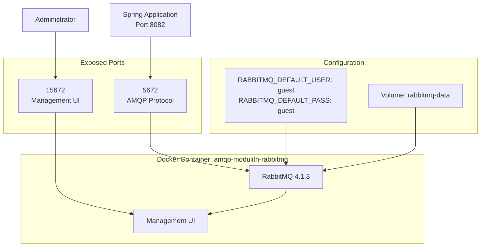
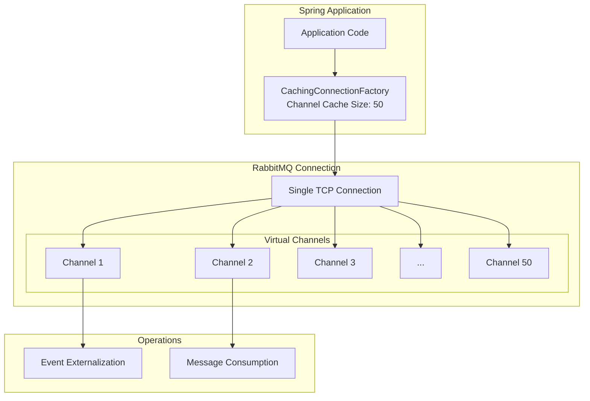
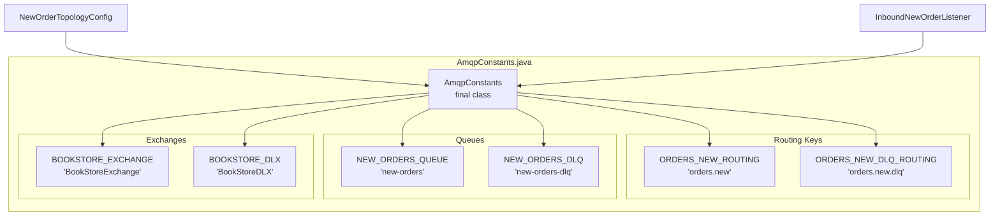
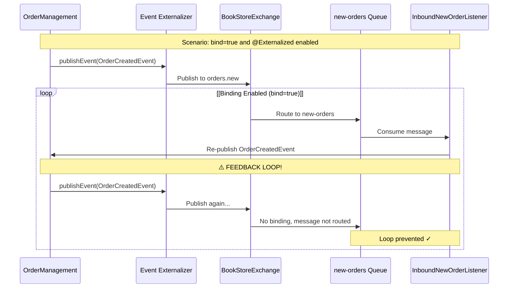
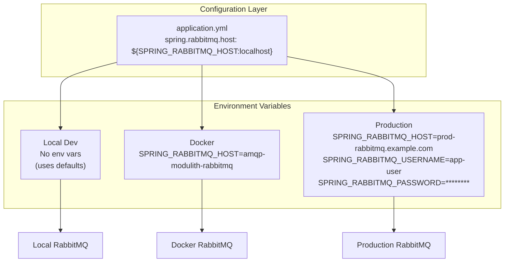
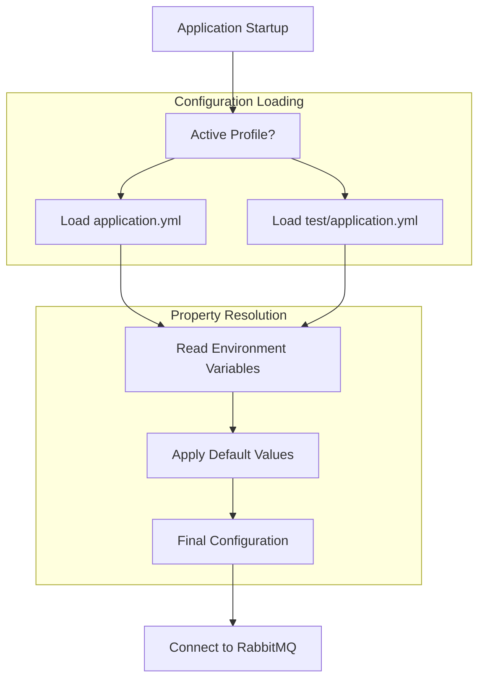
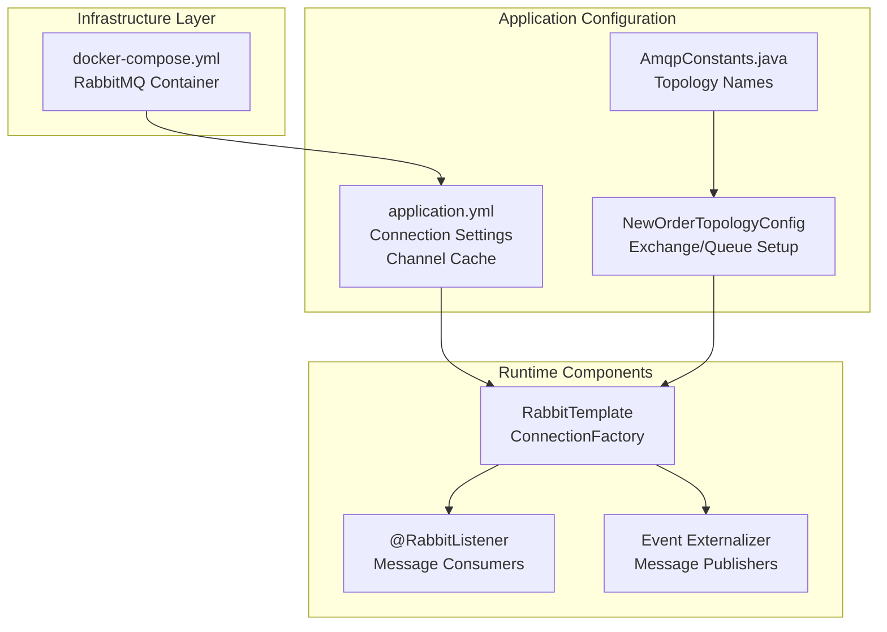

# RabbitMQ Configuration

> **Relevant source files**
> * [docker-compose.yml](https://github.com/philipz/spring-monolith-amqp-poc/blob/c93f55b5/docker-compose.yml)
> * [src/main/java/com/example/modulithdemo/messaging/inbound/amqp/AmqpConstants.java](https://github.com/philipz/spring-monolith-amqp-poc/blob/c93f55b5/src/main/java/com/example/modulithdemo/messaging/inbound/amqp/AmqpConstants.java)
> * [src/main/resources/application.yml](https://github.com/philipz/spring-monolith-amqp-poc/blob/c93f55b5/src/main/resources/application.yml)
> * [src/test/resources/application.yml](https://github.com/philipz/spring-monolith-amqp-poc/blob/c93f55b5/src/test/resources/application.yml)

## Purpose and Scope

This page documents the RabbitMQ configuration settings for the application, including connection parameters, channel pooling, and topology binding controls. This covers the infrastructure-level configuration that enables AMQP messaging integration.

For information about the logical topology (exchanges, queues, and bindings), see [Topology Configuration](/philipz/spring-monolith-amqp-poc/7.1-topology-configuration). For message routing patterns and externalization, see [Message Routing and Patterns](/philipz/spring-monolith-amqp-poc/7.2-message-routing-and-patterns). For inbound message processing implementation, see [Inbound Message Processing](/philipz/spring-monolith-amqp-poc/7.4-inbound-message-processing).

## Connection Configuration

The RabbitMQ connection is configured through Spring Boot's standard `spring.rabbitmq.*` properties. The application supports environment variable overrides to facilitate deployment across different environments.

### Basic Connection Properties

| Property | Default Value | Environment Variable | Description |
| --- | --- | --- | --- |
| `spring.rabbitmq.host` | `localhost` | `SPRING_RABBITMQ_HOST` | RabbitMQ broker hostname |
| `spring.rabbitmq.port` | `5672` | `SPRING_RABBITMQ_PORT` | AMQP protocol port |
| `spring.rabbitmq.username` | `guest` | `SPRING_RABBITMQ_USERNAME` | Authentication username |
| `spring.rabbitmq.password` | `guest` | `SPRING_RABBITMQ_PASSWORD` | Authentication password |

**Configuration Location:** [src/main/resources/application.yml L7-L11](https://github.com/philipz/spring-monolith-amqp-poc/blob/c93f55b5/src/main/resources/application.yml#L7-L11)

```yaml
spring:
  rabbitmq:
    host: ${SPRING_RABBITMQ_HOST:localhost}
    port: ${SPRING_RABBITMQ_PORT:5672}
    username: ${SPRING_RABBITMQ_USERNAME:guest}
    password: ${SPRING_RABBITMQ_PASSWORD:guest}
```

The syntax `${VAR:default}` allows environment variable override while providing sensible defaults for local development. This pattern is consistent across all configuration properties.

**Sources:** [src/main/resources/application.yml L7-L11](https://github.com/philipz/spring-monolith-amqp-poc/blob/c93f55b5/src/main/resources/application.yml#L7-L11)

 [src/test/resources/application.yml L17-L21](https://github.com/philipz/spring-monolith-amqp-poc/blob/c93f55b5/src/test/resources/application.yml#L17-L21)

---

### Docker Infrastructure Setup

The RabbitMQ broker is containerized using the official `rabbitmq:4.1.3-management-alpine` image, which includes both the AMQP broker and the management UI.



**Container Configuration:**

| Property | Value | Purpose |
| --- | --- | --- |
| Image | `rabbitmq:4.1.3-management-alpine` | Lightweight RabbitMQ with management plugin |
| Container Name | `amqp-modulith-rabbitmq` | Consistent container identification |
| AMQP Port | `5672` | Standard AMQP protocol port |
| Management Port | `15672` | Web-based management interface |
| Volume | `rabbitmq-data` | Persistent storage for messages and configuration |
| Health Check | `rabbitmq-diagnostics ping` | Container readiness verification |

**Sources:** [docker-compose.yml L22-L39](https://github.com/philipz/spring-monolith-amqp-poc/blob/c93f55b5/docker-compose.yml#L22-L39)

---

## Channel Pooling Configuration

The application configures a channel cache to improve performance by reusing RabbitMQ channels across message operations. This is critical for high-throughput scenarios where creating new channels for each operation would create significant overhead.

### Channel Cache Settings

**Configuration:** [src/main/resources/application.yml L12-L14](https://github.com/philipz/spring-monolith-amqp-poc/blob/c93f55b5/src/main/resources/application.yml#L12-L14)

```yaml
spring:
  rabbitmq:
    cache:
      channel:
        size: 50
```

The `size: 50` configuration maintains a pool of up to 50 cached channels. Each channel represents a lightweight virtual connection within a single TCP connection to RabbitMQ.



**Channel Lifecycle:**

1. Application requests a channel from `CachingConnectionFactory`
2. If available in cache, channel is reused
3. If cache is full, new channel is created (up to limit)
4. After operation completes, channel returns to cache
5. Idle channels remain in cache for reuse

**Performance Impact:** Higher channel cache sizes reduce overhead for frequent AMQP operations. The value of 50 is tuned for applications with moderate-to-high message throughput.

**Sources:** [src/main/resources/application.yml L12-L14](https://github.com/philipz/spring-monolith-amqp-poc/blob/c93f55b5/src/main/resources/application.yml#L12-L14)

 [src/test/resources/application.yml L22-L24](https://github.com/philipz/spring-monolith-amqp-poc/blob/c93f55b5/src/test/resources/application.yml#L22-L24)

---

## Topology Constants

The application defines AMQP topology constants in a centralized class to ensure consistency across configuration and runtime code. These constants define exchange names, queue names, and routing keys.

### AmqpConstants Class

**Location:** [src/main/java/com/example/modulithdemo/messaging/inbound/amqp/AmqpConstants.java L1-L24](https://github.com/philipz/spring-monolith-amqp-poc/blob/c93f55b5/src/main/java/com/example/modulithdemo/messaging/inbound/amqp/AmqpConstants.java#L1-L24)



### Constant Definitions

| Constant | Value | Purpose |
| --- | --- | --- |
| `BOOKSTORE_EXCHANGE` | `BookStoreExchange` | Inbound exchange for external new order messages |
| `BOOKSTORE_DLX` | `BookStoreDLX` | Dead-letter exchange for failed message routing |
| `NEW_ORDERS_QUEUE` | `new-orders` | Primary queue for inbound order messages |
| `NEW_ORDERS_DLQ` | `new-orders-dlq` | Dead-letter queue for poison messages |
| `ORDERS_NEW_ROUTING` | `orders.new` | Routing key for new order messages |
| `ORDERS_NEW_DLQ_ROUTING` | `orders.new.dlq` | Routing key for dead-lettered messages |

**Design Rationale:** Centralizing constants prevents duplication and typos across configuration classes and listeners. The `private` constructor prevents instantiation, enforcing the utility class pattern.

**Sources:** [src/main/java/com/example/modulithdemo/messaging/inbound/amqp/AmqpConstants.java L1-L24](https://github.com/philipz/spring-monolith-amqp-poc/blob/c93f55b5/src/main/java/com/example/modulithdemo/messaging/inbound/amqp/AmqpConstants.java#L1-L24)

---

## Topology Binding Configuration

The application provides a configuration property to control whether the `new-orders` queue should be bound to the `BookStoreExchange`. This prevents unintended feedback loops when event externalization is enabled.

### Binding Control Property

**Configuration:** [src/main/resources/application.yml L58-L66](https://github.com/philipz/spring-monolith-amqp-poc/blob/c93f55b5/src/main/resources/application.yml#L58-L66)

```yaml
app:
  amqp:
    new-orders:
      bind: true
      retry-max-attempts: 3
```

### Feedback Loop Prevention

When `OrderCreatedEvent` is marked with `@Externalized` to publish to `BookStoreExchange::orders.new`, the application must not also consume from that exchange, or it will process its own events in an infinite loop.



### Configuration Property Semantics

| Property | Value | Behavior |
| --- | --- | --- |
| `app.amqp.new-orders.bind` | `true` | Queue binds to `BookStoreExchange` with routing key `orders.new` |
| `app.amqp.new-orders.bind` | `false` | Queue does NOT bind to `BookStoreExchange` (only receives from `domain.events` externalization) |

**Default Value:** The YAML shows `bind: true`, but comments in the file indicate the intended default is `false` to prevent feedback loops. The actual implementation in `NewOrderTopologyConfig` uses `@ConditionalOnProperty` to control binding.

**Related Configuration:** The property is also used to configure retry behavior with `retry-max-attempts: 3`, which controls how many times a failed message is redelivered before being sent to the dead-letter queue.

**Sources:** [src/main/resources/application.yml L58-L66](https://github.com/philipz/spring-monolith-amqp-poc/blob/c93f55b5/src/main/resources/application.yml#L58-L66)

---

## Environment Variable Override Strategy

All RabbitMQ configuration properties support environment variable overrides using Spring Boot's `${VAR:default}` syntax. This enables environment-specific configuration without code changes.

### Override Examples



### Available Override Variables

| Environment Variable | Overrides Property | Typical Usage |
| --- | --- | --- |
| `SPRING_RABBITMQ_HOST` | `spring.rabbitmq.host` | Change broker hostname for different environments |
| `SPRING_RABBITMQ_PORT` | `spring.rabbitmq.port` | Use non-standard port (rare) |
| `SPRING_RABBITMQ_USERNAME` | `spring.rabbitmq.username` | Production credentials |
| `SPRING_RABBITMQ_PASSWORD` | `spring.rabbitmq.password` | Production credentials (use secrets management) |

### Docker Compose Integration

When running with Docker Compose, the application connects to RabbitMQ using the service name as hostname:

```
SPRING_RABBITMQ_HOST=amqp-modulith-rabbitmq
```

The Docker network `amqp-modulith-network` enables DNS resolution between containers.

**Sources:** [src/main/resources/application.yml L7-L11](https://github.com/philipz/spring-monolith-amqp-poc/blob/c93f55b5/src/main/resources/application.yml#L7-L11)

 [docker-compose.yml L47-L49](https://github.com/philipz/spring-monolith-amqp-poc/blob/c93f55b5/docker-compose.yml#L47-L49)

---

## Production vs Test Configuration

The application maintains separate configuration profiles for production and test environments, with key differences in RabbitMQ settings.

### Configuration Comparison

| Setting | Production (`application.yml`) | Test (`test/application.yml`) | Rationale |
| --- | --- | --- | --- |
| **Database** | PostgreSQL | H2 in-memory | Tests use ephemeral database |
| **Event Externalization** | `enabled: true` | `enabled: false` | Tests avoid external dependencies by default |
| **RabbitMQ Connection** | Environment-configurable | Hardcoded `localhost` | Tests assume local RabbitMQ or mocking |
| **Channel Cache** | `size: 50` | `size: 50` | Consistent performance tuning |
| **Topology Binding** | `bind: true` | `bind: true` | Same binding logic for consistency |

### Test Configuration Details

**Location:** [src/test/resources/application.yml L16-L24](https://github.com/philipz/spring-monolith-amqp-poc/blob/c93f55b5/src/test/resources/application.yml#L16-L24)

```yaml
spring:
  rabbitmq:
    host: ${SPRING_RABBITMQ_HOST:localhost}
    port: ${SPRING_RABBITMQ_PORT:5672}
    username: ${SPRING_RABBITMQ_USERNAME:guest}
    password: ${SPRING_RABBITMQ_PASSWORD:guest}
    cache:
      channel:
        size: 50
```

Test configuration inherits the same RabbitMQ settings but typically runs against a test broker or uses mocking frameworks like `spring-amqp-test` for unit tests.

### Configuration Resolution Flow



**Key Differences:**

* **Port:** Production uses `8082`, tests use random port (`0`)
* **Application Name:** Production is `demo`, tests are `demo-test`
* **Event Externalization:** Production enables AMQP externalization, tests disable it unless explicitly testing that feature

**Sources:** [src/main/resources/application.yml L1-L67](https://github.com/philipz/spring-monolith-amqp-poc/blob/c93f55b5/src/main/resources/application.yml#L1-L67)

 [src/test/resources/application.yml L1-L58](https://github.com/philipz/spring-monolith-amqp-poc/blob/c93f55b5/src/test/resources/application.yml#L1-L58)

---

## Configuration Summary

### Complete RabbitMQ Configuration Block

```yaml
spring:
  rabbitmq:
    host: ${SPRING_RABBITMQ_HOST:localhost}
    port: ${SPRING_RABBITMQ_PORT:5672}
    username: ${SPRING_RABBITMQ_USERNAME:guest}
    password: ${SPRING_RABBITMQ_PASSWORD:guest}
    cache:
      channel:
        size: 50

app:
  amqp:
    new-orders:
      bind: true
      retry-max-attempts: 3
```

### Configuration Dependencies



**Sources:** [src/main/resources/application.yml L7-L66](https://github.com/philipz/spring-monolith-amqp-poc/blob/c93f55b5/src/main/resources/application.yml#L7-L66)

 [src/main/java/com/example/modulithdemo/messaging/inbound/amqp/AmqpConstants.java L1-L24](https://github.com/philipz/spring-monolith-amqp-poc/blob/c93f55b5/src/main/java/com/example/modulithdemo/messaging/inbound/amqp/AmqpConstants.java#L1-L24)

 [docker-compose.yml L22-L39](https://github.com/philipz/spring-monolith-amqp-poc/blob/c93f55b5/docker-compose.yml#L22-L39)