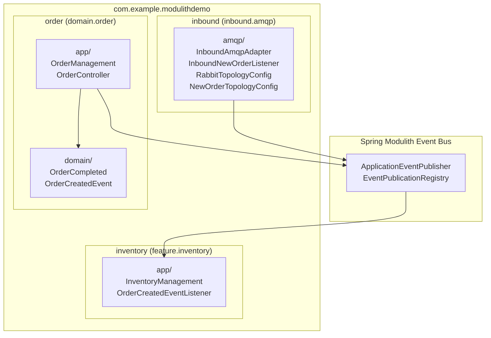
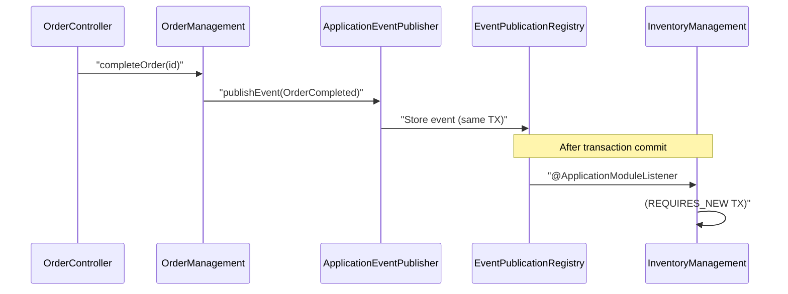
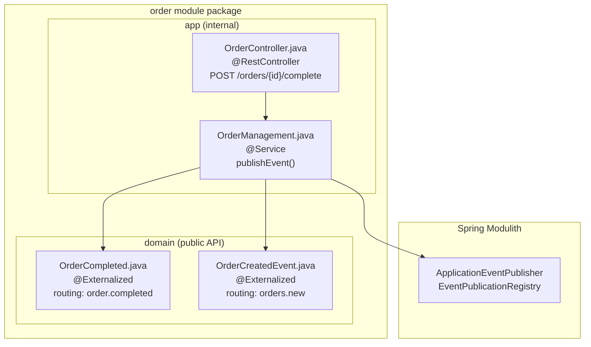
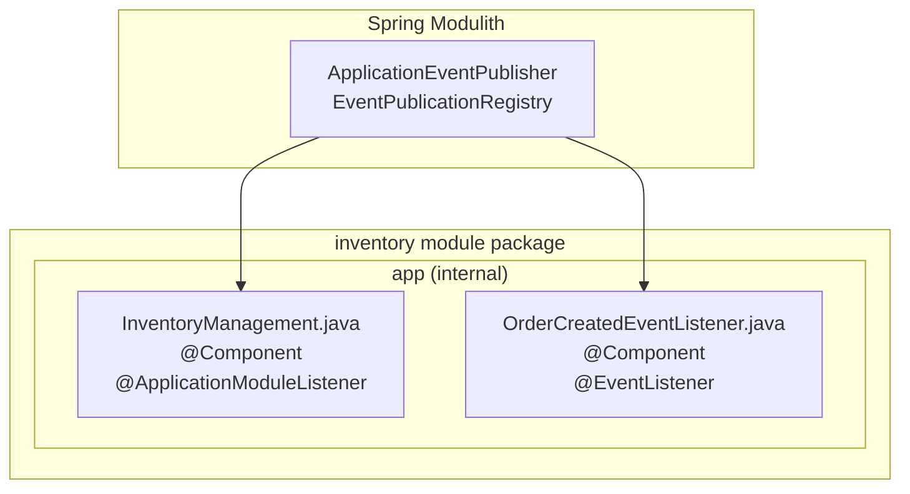
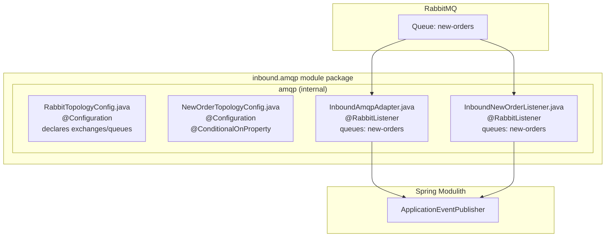

# Spring Modulith Design

> **Relevant source files**
> * [CLAUDE.md](https://github.com/philipz/spring-monolith-amqp-poc/blob/c93f55b5/CLAUDE.md)
> * [README.md](https://github.com/philipz/spring-monolith-amqp-poc/blob/c93f55b5/README.md)
> * [pom.xml](https://github.com/philipz/spring-monolith-amqp-poc/blob/c93f55b5/pom.xml)
> * [src/main/java/com/example/modulithdemo/inventory/app/InventoryManagement.java](https://github.com/philipz/spring-monolith-amqp-poc/blob/c93f55b5/src/main/java/com/example/modulithdemo/inventory/app/InventoryManagement.java)
> * [src/main/java/com/example/modulithdemo/inventory/app/OrderCreatedEventListener.java](https://github.com/philipz/spring-monolith-amqp-poc/blob/c93f55b5/src/main/java/com/example/modulithdemo/inventory/app/OrderCreatedEventListener.java)

## Purpose and Scope

This document explains how Spring Modulith is used in this application to enforce module boundaries and enable event-driven communication between modules. It covers the framework configuration, module structure conventions, boundary enforcement mechanisms, and the architectural patterns that Spring Modulith provides.

For detailed information about the event system and transactional outbox pattern, see [Event-Driven Architecture](/philipz/spring-monolith-amqp-poc/3.2-event-driven-architecture). For AMQP integration specifics, see [AMQP Integration Overview](/philipz/spring-monolith-amqp-poc/3.3-amqp-integration-overview). For implementation details of individual modules, see [Application Modules](/philipz/spring-monolith-amqp-poc/5-application-modules).

---

## What is Spring Modulith

Spring Modulith is a framework that enforces modular architecture within a Spring Boot monolith. It provides:

* **Module Boundary Enforcement**: Validates that modules only interact through defined interfaces (typically events)
* **Event Publication Registry**: Implements the transactional outbox pattern for reliable event delivery
* **Event Externalization**: Automatically publishes internal events to external messaging systems
* **Module Testing**: Testing utilities that verify module isolation and event flows

This application uses Spring Modulith **1.4.3** with Spring Boot **3.5.5**, running on Java 21.

**Sources:** [pom.xml L31](https://github.com/philipz/spring-monolith-amqp-poc/blob/c93f55b5/pom.xml#L31-L31)

 [pom.xml L36-L38](https://github.com/philipz/spring-monolith-amqp-poc/blob/c93f55b5/pom.xml#L36-L38)

---

## Spring Modulith Dependencies

The project includes four key Spring Modulith dependencies:

| Dependency | Purpose | Configuration |
| --- | --- | --- |
| `spring-modulith-starter-core` | Core framework, module scanning, boundary validation | [pom.xml L36-L38](https://github.com/philipz/spring-monolith-amqp-poc/blob/c93f55b5/pom.xml#L36-L38) |
| `spring-modulith-events-api` | Event publication interfaces (`@Externalized` annotation) | [pom.xml L54-L58](https://github.com/philipz/spring-monolith-amqp-poc/blob/c93f55b5/pom.xml#L54-L58) |
| `spring-modulith-events-amqp` | AMQP event externalization to RabbitMQ | [pom.xml L59-L63](https://github.com/philipz/spring-monolith-amqp-poc/blob/c93f55b5/pom.xml#L59-L63) |
| `spring-modulith-starter-jdbc` | JDBC-based Event Publication Registry (PostgreSQL/H2) | [pom.xml L69-L73](https://github.com/philipz/spring-monolith-amqp-poc/blob/c93f55b5/pom.xml#L69-L73) |
| `spring-modulith-events-jackson` | JSON serialization for event payloads | [pom.xml L64-L68](https://github.com/philipz/spring-monolith-amqp-poc/blob/c93f55b5/pom.xml#L64-L68) |

The `spring-modulith-bom` manages consistent versions across all dependencies:

```xml
<dependencyManagement>
    <dependencies>
        <dependency>
            <groupId>org.springframework.modulith</groupId>
            <artifactId>spring-modulith-bom</artifactId>
            <version>${spring-modulith.version}</version>
            <type>pom</type>
            <scope>import</scope>
        </dependency>
    </dependencies>
</dependencyManagement>
```

**Sources:** [pom.xml L29-L153](https://github.com/philipz/spring-monolith-amqp-poc/blob/c93f55b5/pom.xml#L29-L153)

---

## Module Structure and Boundaries

### Package-Based Module Definition

Spring Modulith defines module boundaries using Java package conventions. Modules are identified by top-level packages under the application base package `com.example.modulithdemo`:

```
com.example.modulithdemo/
├── order/           ← domain.order module
│   ├── domain/      ← Public API (domain events)
│   └── app/         ← Internal implementation
├── inventory/       ← feature.inventory module
│   └── app/         ← Internal implementation
└── inbound/         ← inbound.amqp module
    └── amqp/        ← Internal implementation
```

Each top-level package represents a distinct module with enforced boundaries.

**Sources:** [CLAUDE.md L63-L77](https://github.com/philipz/spring-monolith-amqp-poc/blob/c93f55b5/CLAUDE.md#L63-L77)

 [README.md L32-L44](https://github.com/philipz/spring-monolith-amqp-poc/blob/c93f55b5/README.md#L32-L44)

### Module Visibility Rules

Spring Modulith enforces these visibility rules:

1. **Public API**: Classes in `<module>/domain/` or explicitly marked packages are visible to other modules
2. **Internal Implementation**: Classes in `<module>/app/` or other sub-packages are module-private
3. **No Direct Dependencies**: Modules cannot directly inject beans from other modules
4. **Event-Only Communication**: Modules interact exclusively through event publication and consumption

### Module Diagram with Package Structure



**Sources:** [CLAUDE.md L63-L77](https://github.com/philipz/spring-monolith-amqp-poc/blob/c93f55b5/CLAUDE.md#L63-L77)

 [README.md L32-L44](https://github.com/philipz/spring-monolith-amqp-poc/blob/c93f55b5/README.md#L32-L44)

---

## The Three Application Modules

### 1. domain.order Module

**Purpose**: Core order management domain and REST API

**Public API**:

* `OrderCompleted` - Domain event published when order completes
* `OrderCreatedEvent` - Domain event published when new order created

**Internal Implementation**:

* `OrderManagement` - Service that publishes domain events [src/main/java/com/example/modulithdemo/order/app/OrderManagement.java](https://github.com/philipz/spring-monolith-amqp-poc/blob/c93f55b5/src/main/java/com/example/modulithdemo/order/app/OrderManagement.java)
* `OrderController` - REST endpoint for order operations [src/main/java/com/example/modulithdemo/order/app/OrderController.java](https://github.com/philipz/spring-monolith-amqp-poc/blob/c93f55b5/src/main/java/com/example/modulithdemo/order/app/OrderController.java)

**Event Flow**: HTTP request → `OrderController` → `OrderManagement` → publishes events

**Sources:** [CLAUDE.md L65-L69](https://github.com/philipz/spring-monolith-amqp-poc/blob/c93f55b5/CLAUDE.md#L65-L69)

 [README.md L34-L37](https://github.com/philipz/spring-monolith-amqp-poc/blob/c93f55b5/README.md#L34-L37)

### 2. feature.inventory Module

**Purpose**: React to order lifecycle events and manage inventory state

**Public API**: None (pure consumer module)

**Internal Implementation**:

* `InventoryManagement` - Listens to `OrderCompleted` via `@ApplicationModuleListener` [src/main/java/com/example/modulithdemo/inventory/app/InventoryManagement.java L10-L18](https://github.com/philipz/spring-monolith-amqp-poc/blob/c93f55b5/src/main/java/com/example/modulithdemo/inventory/app/InventoryManagement.java#L10-L18)
* `OrderCreatedEventListener` - Listens to `OrderCreatedEvent` via `@EventListener` [src/main/java/com/example/modulithdemo/inventory/app/OrderCreatedEventListener.java L10-L21](https://github.com/philipz/spring-monolith-amqp-poc/blob/c93f55b5/src/main/java/com/example/modulithdemo/inventory/app/OrderCreatedEventListener.java#L10-L21)

**Transaction Isolation**: Uses `@ApplicationModuleListener` to execute in a new transaction (`REQUIRES_NEW`), preventing cascading failures from affecting the order module.

**Sources:** [CLAUDE.md L71-L72](https://github.com/philipz/spring-monolith-amqp-poc/blob/c93f55b5/CLAUDE.md#L71-L72)

 [README.md L38-L39](https://github.com/philipz/spring-monolith-amqp-poc/blob/c93f55b5/README.md#L38-L39)

 [src/main/java/com/example/modulithdemo/inventory/app/InventoryManagement.java](https://github.com/philipz/spring-monolith-amqp-poc/blob/c93f55b5/src/main/java/com/example/modulithdemo/inventory/app/InventoryManagement.java)

### 3. inbound.amqp Module

**Purpose**: Bridge external AMQP messages to internal events

**Public API**: None (integration layer)

**Internal Implementation**:

* `RabbitTopologyConfig` - Configures exchanges, queues, and bindings
* `NewOrderTopologyConfig` - Conditional queue bindings (controlled by `app.amqp.new-orders.bind`)
* `InboundAmqpAdapter` - Consumes messages and publishes `OrderCompleted` events
* `InboundNewOrderListener` - Consumes JSON messages and publishes `OrderCreatedEvent`

**Design Note**: This module receives external messages via RabbitMQ `@RabbitListener` and republishes them as internal events, allowing the rest of the application to remain AMQP-agnostic.

**Sources:** [CLAUDE.md L74-L77](https://github.com/philipz/spring-monolith-amqp-poc/blob/c93f55b5/CLAUDE.md#L74-L77)

 [README.md L40-L44](https://github.com/philipz/spring-monolith-amqp-poc/blob/c93f55b5/README.md#L40-L44)

---

## Module Communication Patterns

### Principle: No Direct Bean Dependencies

Spring Modulith enforces that modules cannot directly inject beans from other modules. The following would cause a compilation or runtime error:

```python
// ❌ ILLEGAL: Direct bean dependency across modules
@Component
class InventoryManagement {
    @Autowired
    private OrderManagement orderManagement; // Violates module boundary
}
```

Instead, modules communicate through events:

```python
// ✅ LEGAL: Event-based communication
@Component
class InventoryManagement {
    @ApplicationModuleListener
    void on(OrderCompleted event) {
        // React to event from order module
    }
}
```

**Sources:** [CLAUDE.md L86-L91](https://github.com/philipz/spring-monolith-amqp-poc/blob/c93f55b5/CLAUDE.md#L86-L91)

### Event Publication Pattern

Modules publish events using Spring's `ApplicationEventPublisher`:



**Key Characteristics**:

1. Event publication happens within the publishing module's transaction
2. Event consumption happens asynchronously in a separate transaction
3. Event Publication Registry ensures at-least-once delivery
4. Failures in consumer modules don't affect the publisher

**Sources:** [CLAUDE.md L79-L91](https://github.com/philipz/spring-monolith-amqp-poc/blob/c93f55b5/CLAUDE.md#L79-L91)

---

## Module Boundary Enforcement

### Runtime Validation

Spring Modulith validates module boundaries at application startup. If violations are detected, the application fails to start with detailed error messages indicating which module dependencies are illegal.

### Testing Module Boundaries

The `spring-modulith-starter-test` dependency provides testing utilities:

```python
@ModulithTest
class ModuleStructureTests {
    @Test
    void verifyModuleStructure(ApplicationModules modules) {
        modules.verify(); // Validates all module boundaries
    }
}
```

This test ensures:

* Modules only access other modules' public APIs
* No circular dependencies exist
* Event listeners are properly configured

**Sources:** [pom.xml L118-L135](https://github.com/philipz/spring-monolith-amqp-poc/blob/c93f55b5/pom.xml#L118-L135)

 [CLAUDE.md L94-L99](https://github.com/philipz/spring-monolith-amqp-poc/blob/c93f55b5/CLAUDE.md#L94-L99)

---

## Module-to-Code Entity Mapping

### Order Module Code Structure



**Sources:** [CLAUDE.md L65-L69](https://github.com/philipz/spring-monolith-amqp-poc/blob/c93f55b5/CLAUDE.md#L65-L69)

 [README.md L34-L37](https://github.com/philipz/spring-monolith-amqp-poc/blob/c93f55b5/README.md#L34-L37)

### Inventory Module Code Structure



**Sources:** [src/main/java/com/example/modulithdemo/inventory/app/InventoryManagement.java](https://github.com/philipz/spring-monolith-amqp-poc/blob/c93f55b5/src/main/java/com/example/modulithdemo/inventory/app/InventoryManagement.java)

 [src/main/java/com/example/modulithdemo/inventory/app/OrderCreatedEventListener.java](https://github.com/philipz/spring-monolith-amqp-poc/blob/c93f55b5/src/main/java/com/example/modulithdemo/inventory/app/OrderCreatedEventListener.java)

### Inbound AMQP Module Code Structure



**Sources:** [CLAUDE.md L74-L77](https://github.com/philipz/spring-monolith-amqp-poc/blob/c93f55b5/CLAUDE.md#L74-L77)

 [README.md L40-L44](https://github.com/philipz/spring-monolith-amqp-poc/blob/c93f55b5/README.md#L40-L44)

---

## Transaction Boundaries in Modules

### @ApplicationModuleListener Transaction Behavior

The `@ApplicationModuleListener` annotation creates a new transaction (`REQUIRES_NEW`) for event processing:

```python
@Component
public class InventoryManagement {
    @ApplicationModuleListener
    void on(OrderCompleted event) {
        // Executes in new transaction
        // Failure here doesn't rollback order module transaction
    }
}
```

**Transaction Isolation Guarantees**:

| Aspect | Behavior |
| --- | --- |
| **Propagation** | `REQUIRES_NEW` - Always creates new transaction |
| **Publisher Transaction** | Commits before listener executes |
| **Listener Failure** | Does not affect publisher transaction |
| **Retry Behavior** | Failed events remain in Event Publication Registry for retry |

**Sources:** [CLAUDE.md L89](https://github.com/philipz/spring-monolith-amqp-poc/blob/c93f55b5/CLAUDE.md#L89-L89)

 [src/main/java/com/example/modulithdemo/inventory/app/InventoryManagement.java L14-L17](https://github.com/philipz/spring-monolith-amqp-poc/blob/c93f55b5/src/main/java/com/example/modulithdemo/inventory/app/InventoryManagement.java#L14-L17)

### @EventListener Transaction Behavior

Standard `@EventListener` executes within the same transaction as the publisher:

```python
@Component
public class OrderCreatedEventListener {
    @EventListener
    public void onOrderCreated(OrderCreatedEvent event) {
        // Executes in publisher's transaction
        // Failure here can rollback publisher transaction
    }
}
```

**Use Cases**:

* `@ApplicationModuleListener`: Cross-module communication, async processing, transaction isolation
* `@EventListener`: Same-module coordination, synchronous processing, transaction participation

**Sources:** [src/main/java/com/example/modulithdemo/inventory/app/OrderCreatedEventListener.java L15-L20](https://github.com/philipz/spring-monolith-amqp-poc/blob/c93f55b5/src/main/java/com/example/modulithdemo/inventory/app/OrderCreatedEventListener.java#L15-L20)

---

## Module Configuration and Properties

### Spring Modulith Event Configuration

Key configuration properties from [application.yml](https://github.com/philipz/spring-monolith-amqp-poc/blob/c93f55b5/application.yml)

:

```sql
spring:
  modulith:
    events:
      externalization:
        enabled: true  # Enable AMQP event externalization
      jdbc:
        schema-initialization:
          enabled: true  # Create event_publication table
      completion-mode: update  # Keep event history (vs. delete)
      republish-outstanding-events-on-restart: true  # Retry failed events
      delete-completion-after: 7d  # Archive events after 7 days
```

### Module-Specific Properties

The `app.amqp.new-orders.bind` property controls topology configuration in the inbound module:

```yaml
app:
  amqp:
    new-orders:
      bind: false  # Default: prevent feedback loops
```

When `bind=true`, the `new-orders` queue is bound to `BookStoreExchange`, allowing external systems to send new orders. When `false`, it prevents the application from consuming its own externalized `OrderCreatedEvent` messages.

**Sources:** [README.md L112-L116](https://github.com/philipz/spring-monolith-amqp-poc/blob/c93f55b5/README.md#L112-L116)

 [CLAUDE.md L103-L124](https://github.com/philipz/spring-monolith-amqp-poc/blob/c93f55b5/CLAUDE.md#L103-L124)

---

## Development and Testing Configuration

### Production Configuration

| Aspect | Setting | Purpose |
| --- | --- | --- |
| Server Port | 8082 | Main application endpoint |
| Database | PostgreSQL (localhost:5432) | Event Publication Registry + application data |
| Event Completion | `UPDATE` mode | Maintain event history |
| Event TTL | 7 days | Archive old events |
| Republish on Restart | `true` | Retry outstanding events |

### Test Configuration

| Aspect | Setting | Purpose |
| --- | --- | --- |
| Server Port | Random (0) | Avoid port conflicts |
| Database | H2 in-memory (MODE=PostgreSQL) | Fast test execution |
| Event Completion | `DELETE` mode | Clean up immediately |
| Externalization | Disabled by default | Test internal events only |

**Sources:** [CLAUDE.md L101-L116](https://github.com/philipz/spring-monolith-amqp-poc/blob/c93f55b5/CLAUDE.md#L101-L116)

---

## Module Boundary Validation Example

### Valid Module Interaction

```python
// domain/order module
package com.example.modulithdemo.order.app;

@Service
public class OrderManagement {
    private final ApplicationEventPublisher events;
    
    public void completeOrder(UUID orderId) {
        // Business logic
        events.publishEvent(new OrderCompleted(orderId));
    }
}

// feature/inventory module
package com.example.modulithdemo.inventory.app;

@Component
public class InventoryManagement {
    @ApplicationModuleListener
    void on(OrderCompleted event) {
        // React to event - boundary respected
    }
}
```

This pattern is valid because:

1. `OrderCompleted` is in the `domain` package (public API)
2. Communication happens through events, not direct bean injection
3. Transaction boundaries are properly isolated

**Sources:** [src/main/java/com/example/modulithdemo/inventory/app/InventoryManagement.java](https://github.com/philipz/spring-monolith-amqp-poc/blob/c93f55b5/src/main/java/com/example/modulithdemo/inventory/app/InventoryManagement.java)

---

## Key Spring Modulith Benefits

### 1. Enforced Modularity

Spring Modulith prevents accidental coupling between modules at build time and runtime, ensuring the modular architecture is maintained as the codebase grows.

### 2. Reliable Event Delivery

The Event Publication Registry implements the transactional outbox pattern, guaranteeing at-least-once delivery of events even in the face of failures.

### 3. Simplified Testing

Modules can be tested in isolation using `@ModulithTest`, verifying event flows without requiring the full application context.

### 4. Gradual Migration Path

The modular structure allows individual modules to be extracted into separate services without requiring architectural changes—only deployment topology changes.

### 5. Clear Ownership Boundaries

Each module has clear ownership and can be developed independently, reducing coordination overhead in team environments.

**Sources:** [CLAUDE.md L86-L91](https://github.com/philipz/spring-monolith-amqp-poc/blob/c93f55b5/CLAUDE.md#L86-L91)

 [CLAUDE.md L135-L140](https://github.com/philipz/spring-monolith-amqp-poc/blob/c93f55b5/CLAUDE.md#L135-L140)