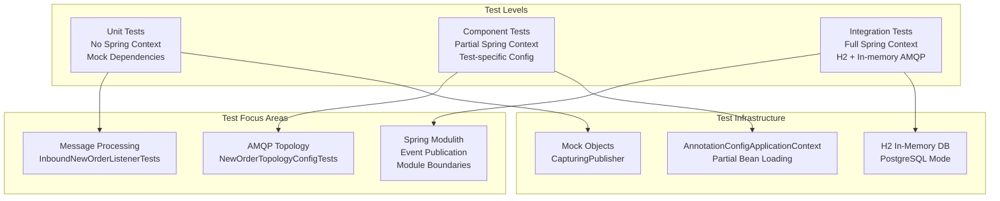
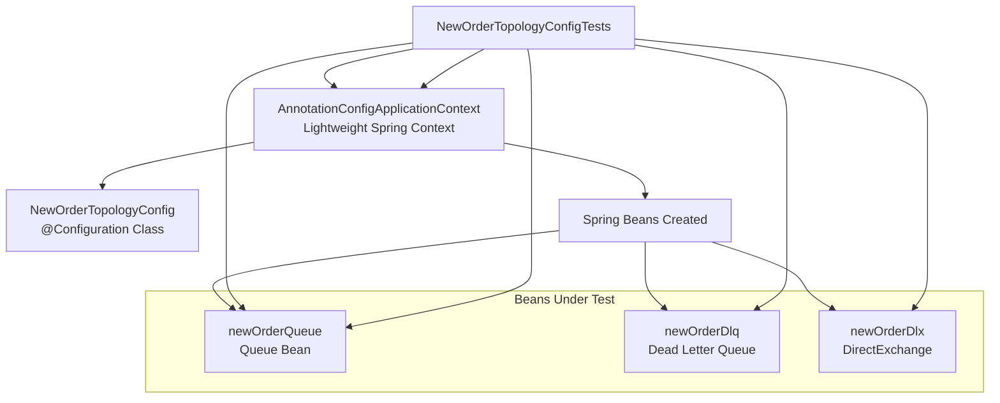
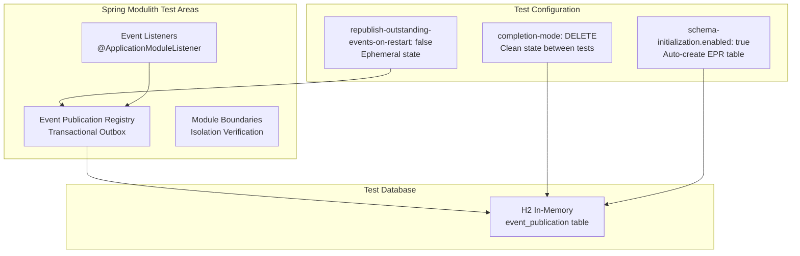
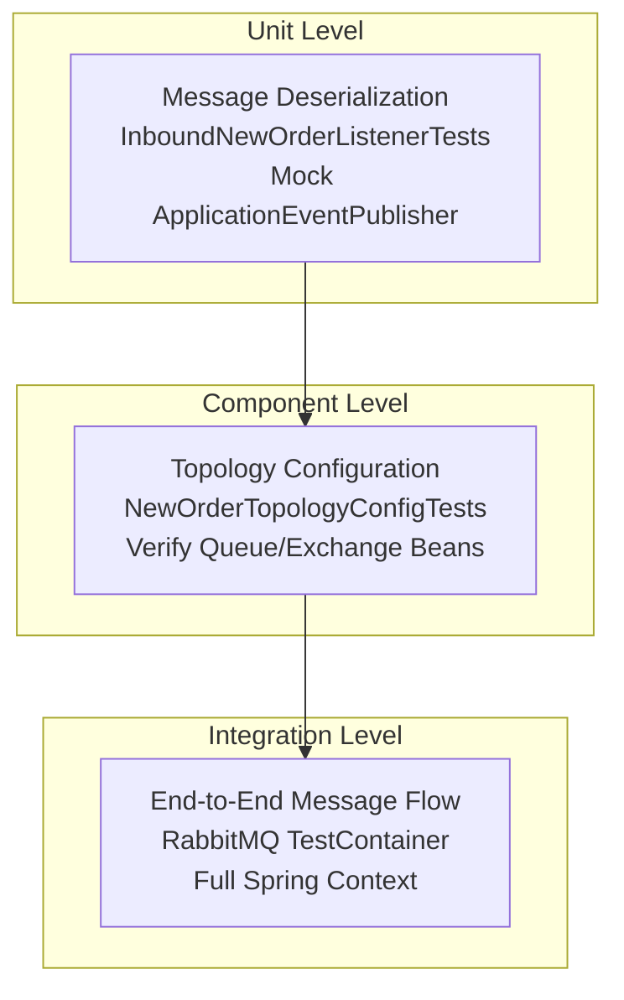

# Testing Strategy

> **Relevant source files**
> * [docker-compose.yml](https://github.com/philipz/spring-monolith-amqp-poc/blob/c93f55b5/docker-compose.yml)
> * [src/test/java/com/example/modulithdemo/messaging/inbound/amqp/InboundNewOrderListenerTests.java](https://github.com/philipz/spring-monolith-amqp-poc/blob/c93f55b5/src/test/java/com/example/modulithdemo/messaging/inbound/amqp/InboundNewOrderListenerTests.java)
> * [src/test/java/com/example/modulithdemo/messaging/inbound/amqp/NewOrderTopologyConfigTests.java](https://github.com/philipz/spring-monolith-amqp-poc/blob/c93f55b5/src/test/java/com/example/modulithdemo/messaging/inbound/amqp/NewOrderTopologyConfigTests.java)
> * [src/test/resources/application.yml](https://github.com/philipz/spring-monolith-amqp-poc/blob/c93f55b5/src/test/resources/application.yml)

## Purpose and Scope

This page documents the testing strategy for the spring-monolith-amqp-poc application. It covers test configuration, test levels, testing approaches for Spring Modulith features, AMQP integration testing, and test execution procedures.

For build configuration and dependencies, see [Build and Dependencies](/philipz/spring-monolith-amqp-poc/8.1-build-and-dependencies). For production configuration details, see [Application Configuration](/philipz/spring-monolith-amqp-poc/4.1-application-configuration).

---

## Test Configuration Overview

The application uses distinct configuration for tests versus production to enable fast, isolated test execution without external dependencies.

### Database Configuration

**Production**: PostgreSQL database with persistent storage
**Tests**: H2 in-memory database configured in PostgreSQL compatibility mode

[src/test/resources/application.yml L9-L14](https://github.com/philipz/spring-monolith-amqp-poc/blob/c93f55b5/src/test/resources/application.yml#L9-L14)

```yaml
datasource:
  url: jdbc:h2:mem:modulith;MODE=PostgreSQL;DB_CLOSE_DELAY=-1;DATABASE_TO_UPPER=false
  driver-class-name: org.h2.Driver
  username: sa
  password:
```

The `MODE=PostgreSQL` setting ensures H2 mimics PostgreSQL behavior for SQL compatibility. The `DB_CLOSE_DELAY=-1` parameter keeps the database alive for the duration of all tests in the same JVM.

### Event System Configuration Differences

| Configuration Property | Production | Tests | Rationale |
| --- | --- | --- | --- |
| `spring.modulith.events.externalization.enabled` | `true` | `false` | Tests focus on internal behavior; externalization tested separately |
| `spring.modulith.events.completion-mode` | `UPDATE` | `DELETE` | Tests use DELETE to keep H2 database clean between test runs |
| `spring.modulith.events.republish-outstanding-events-on-restart` | `true` | `false` | H2 state is ephemeral; no need to republish on restart |
| `spring.modulith.events.jdbc.schema-initialization.enabled` | `true` | `true` | Both require Event Publication Registry schema |

[src/test/resources/application.yml L26-L36](https://github.com/philipz/spring-monolith-amqp-poc/blob/c93f55b5/src/test/resources/application.yml#L26-L36)

### Server Configuration

Tests use a random port (`server.port: 0`) to avoid port conflicts when running multiple test suites concurrently.

[src/test/resources/application.yml L3](https://github.com/philipz/spring-monolith-amqp-poc/blob/c93f55b5/src/test/resources/application.yml#L3-L3)

**Sources:** [src/test/resources/application.yml L1-L58](https://github.com/philipz/spring-monolith-amqp-poc/blob/c93f55b5/src/test/resources/application.yml#L1-L58)

---

## Test Levels and Approaches

The codebase employs multiple testing strategies, each targeting different levels of the system.



**Test Level Decision Matrix**

**Sources:** Test file structure analysis

---

## Unit Tests

Unit tests verify individual components in isolation without Spring context or external dependencies.

### Example: InboundNewOrderListener Unit Test

The `InboundNewOrderListenerTests` class demonstrates pure unit testing with mock dependencies.

```

```

**Key Test Class**: `InboundNewOrderListenerTests`

[src/test/java/com/example/modulithdemo/messaging/inbound/amqp/InboundNewOrderListenerTests.java L14-L62](https://github.com/philipz/spring-monolith-amqp-poc/blob/c93f55b5/src/test/java/com/example/modulithdemo/messaging/inbound/amqp/InboundNewOrderListenerTests.java#L14-L62)

**Test Cases:**

1. **Valid JSON Processing** - `onMessage_publishesOrderCreatedEvent_onValidJson()` * Verifies JSON deserialization to `NewOrderMessage` * Confirms `OrderCreatedEvent` publication with correct data * Validates `Customer` object mapping [src/test/java/com/example/modulithdemo/messaging/inbound/amqp/InboundNewOrderListenerTests.java L21-L49](https://github.com/philipz/spring-monolith-amqp-poc/blob/c93f55b5/src/test/java/com/example/modulithdemo/messaging/inbound/amqp/InboundNewOrderListenerTests.java#L21-L49)
2. **Malformed JSON Handling** - `onMessage_throws_andDoesNotPublish_onMalformedJson()` * Ensures exception thrown for invalid JSON * Verifies no events published on failure [src/test/java/com/example/modulithdemo/messaging/inbound/amqp/InboundNewOrderListenerTests.java L51-L61](https://github.com/philipz/spring-monolith-amqp-poc/blob/c93f55b5/src/test/java/com/example/modulithdemo/messaging/inbound/amqp/InboundNewOrderListenerTests.java#L51-L61)

**Custom Test Double**: `CapturingPublisher`

The test uses a simple implementation of `ApplicationEventPublisher` that captures published events in a list for verification:

[src/test/java/com/example/modulithdemo/messaging/inbound/amqp/InboundNewOrderListenerTests.java L16-L19](https://github.com/philipz/spring-monolith-amqp-poc/blob/c93f55b5/src/test/java/com/example/modulithdemo/messaging/inbound/amqp/InboundNewOrderListenerTests.java#L16-L19)

```python
static class CapturingPublisher implements ApplicationEventPublisher {
    final List<Object> events = new ArrayList<>();
    @Override public void publishEvent(Object event) { events.add(event); }
}
```

This pattern eliminates the need for mocking frameworks and provides explicit control over test dependencies.

**Sources:** [src/test/java/com/example/modulithdemo/messaging/inbound/amqp/InboundNewOrderListenerTests.java L1-L62](https://github.com/philipz/spring-monolith-amqp-poc/blob/c93f55b5/src/test/java/com/example/modulithdemo/messaging/inbound/amqp/InboundNewOrderListenerTests.java#L1-L62)

---

## Component Tests

Component tests verify Spring configuration and bean wiring for specific components without loading the full application context.

### Example: AMQP Topology Configuration Test

The `NewOrderTopologyConfigTests` class validates RabbitMQ topology configuration using a partial Spring context.



**Test Method**: `newOrderQueue_hasDlqArguments_andDlqBeansPresent()`

[src/test/java/com/example/modulithdemo/messaging/inbound/amqp/NewOrderTopologyConfigTests.java L16-L35](https://github.com/philipz/spring-monolith-amqp-poc/blob/c93f55b5/src/test/java/com/example/modulithdemo/messaging/inbound/amqp/NewOrderTopologyConfigTests.java#L16-L35)

**Test Approach:**

1. **Context Creation**: Creates `AnnotationConfigApplicationContext` manually
2. **Property Injection**: Uses `TestPropertySourceUtils.addInlinedPropertiesToEnvironment()` to set `app.amqp.new-orders.bind=true`
3. **Configuration Registration**: Registers only `NewOrderTopologyConfig` class
4. **Context Refresh**: Triggers bean creation
5. **Assertions**: Verifies queue arguments and bean presence

**Verified Attributes:**

| Bean | Attribute | Expected Value | Purpose |
| --- | --- | --- | --- |
| `newOrderQueue` | `name` | `NEW_ORDERS_QUEUE` | Queue name constant |
| `newOrderQueue` | `x-dead-letter-exchange` | `BOOKSTORE_DLX` | DLX routing on failure |
| `newOrderQueue` | `x-dead-letter-routing-key` | `ORDERS_NEW_DLQ_ROUTING` | DLQ routing key |
| `newOrderDlq` | `name` | `NEW_ORDERS_DLQ` | Dead letter queue name |
| `newOrderDlx` | `name` | `BOOKSTORE_DLX` | Dead letter exchange name |

**Sources:** [src/test/java/com/example/modulithdemo/messaging/inbound/amqp/NewOrderTopologyConfigTests.java L1-L36](https://github.com/philipz/spring-monolith-amqp-poc/blob/c93f55b5/src/test/java/com/example/modulithdemo/messaging/inbound/amqp/NewOrderTopologyConfigTests.java#L1-L36)

---

## Testing Spring Modulith Features

Spring Modulith testing focuses on three key areas:



### Event Publication Registry Testing

The Event Publication Registry (EPR) is tested implicitly through integration tests that publish and consume events. The H2 database configuration ensures the `event_publication` table is created automatically.

**Configuration for EPR Testing:**

[src/test/resources/application.yml L31-L36](https://github.com/philipz/spring-monolith-amqp-poc/blob/c93f55b5/src/test/resources/application.yml#L31-L36)

* **`schema-initialization.enabled: true`**: Creates the `event_publication` table in H2
* **`completion-mode: DELETE`**: Events are deleted after completion, keeping the test database clean
* **`republish-outstanding-events-on-restart: false`**: No republishing in tests since H2 state is ephemeral

### Module Boundary Testing

Spring Modulith provides built-in verification of module boundaries through its testing support. Integration tests can verify:

1. **Module Structure**: Modules follow package conventions
2. **Dependency Rules**: No circular dependencies between modules
3. **Event-Driven Communication**: Modules interact only through events

### Event Listener Testing

Event listeners using `@ApplicationModuleListener` are tested in integration tests where:

* Events are published via `ApplicationEventPublisher`
* Listeners execute asynchronously in new transactions
* Test assertions verify side effects (database changes, published events)

**Sources:** [src/test/resources/application.yml L26-L36](https://github.com/philipz/spring-monolith-amqp-poc/blob/c93f55b5/src/test/resources/application.yml#L26-L36)

---

## Testing AMQP Integration

AMQP integration tests validate message handling and topology configuration.

### Test Strategy for AMQP Components



### Topology Configuration Testing

The `NewOrderTopologyConfigTests` validates that:

1. Queues are created with correct names from `AmqpConstants`
2. Dead-letter exchange arguments are properly configured
3. Conditional binding respects `app.amqp.new-orders.bind` property
4. All required beans (queue, DLQ, DLX) are present in Spring context

[src/test/java/com/example/modulithdemo/messaging/inbound/amqp/NewOrderTopologyConfigTests.java L23-L33](https://github.com/philipz/spring-monolith-amqp-poc/blob/c93f55b5/src/test/java/com/example/modulithdemo/messaging/inbound/amqp/NewOrderTopologyConfigTests.java#L23-L33)

### Message Processing Testing

The `InboundNewOrderListenerTests` validates:

1. **Valid Message Path**: JSON → `NewOrderMessage` → `OrderCreatedEvent`
2. **Error Path**: Malformed JSON throws exception, no event published
3. **Data Mapping**: All fields correctly mapped (orderNumber, productCode, quantity, customer)

[src/test/java/com/example/modulithdemo/messaging/inbound/amqp/InboundNewOrderListenerTests.java L21-L61](https://github.com/philipz/spring-monolith-amqp-poc/blob/c93f55b5/src/test/java/com/example/modulithdemo/messaging/inbound/amqp/InboundNewOrderListenerTests.java#L21-L61)

### Testing with Externalization Disabled

Test configuration disables event externalization by default to focus on internal behavior:

[src/test/resources/application.yml L28-L29](https://github.com/philipz/spring-monolith-amqp-poc/blob/c93f55b5/src/test/resources/application.yml#L28-L29)

```yaml
spring:
  modulith:
    events:
      externalization:
        enabled: false
```

This prevents tests from requiring RabbitMQ connectivity unless specifically testing externalization features. To test externalization, individual tests can:

1. Use `@TestPropertySource` to override and enable externalization
2. Use embedded RabbitMQ (via Testcontainers)
3. Mock the externalization layer

**Sources:** [src/test/resources/application.yml L28-L29](https://github.com/philipz/spring-monolith-amqp-poc/blob/c93f55b5/src/test/resources/application.yml#L28-L29)

 [src/test/java/com/example/modulithdemo/messaging/inbound/amqp/NewOrderTopologyConfigTests.java L1-L36](https://github.com/philipz/spring-monolith-amqp-poc/blob/c93f55b5/src/test/java/com/example/modulithdemo/messaging/inbound/amqp/NewOrderTopologyConfigTests.java#L1-L36)

 [src/test/java/com/example/modulithdemo/messaging/inbound/amqp/InboundNewOrderListenerTests.java L1-L62](https://github.com/philipz/spring-monolith-amqp-poc/blob/c93f55b5/src/test/java/com/example/modulithdemo/messaging/inbound/amqp/InboundNewOrderListenerTests.java#L1-L62)

---

## Test Execution

### Running All Tests

```
mvn clean test
```

This executes all unit and integration tests using the test configuration profile.

### Running Specific Test Classes

```
mvn test -Dtest=InboundNewOrderListenerTests
mvn test -Dtest=NewOrderTopologyConfigTests
```

### Test Execution with Docker

For integration tests requiring external dependencies (PostgreSQL, RabbitMQ), Docker Compose can be started:

```
docker-compose up -d
mvn test
docker-compose down
```

However, the default test suite runs against H2 and does not require Docker services.

**Sources:** Project structure, Maven conventions

---

## Test Infrastructure Dependencies

The following test infrastructure is configured in the project:

### Test Dependencies

From `pom.xml`, the project includes:

* **Spring Boot Test Starter**: `spring-boot-starter-test` (includes JUnit 5, AssertJ, Mockito)
* **Spring Modulith Test**: Testing support for Spring Modulith modules
* **H2 Database**: In-memory database for tests
* **JUnit 5**: Test framework
* **AssertJ**: Fluent assertions

### Test Database Schema

H2 automatically creates the Event Publication Registry schema when `spring.modulith.events.jdbc.schema-initialization.enabled: true` is set.

[src/test/resources/application.yml L31-L32](https://github.com/philipz/spring-monolith-amqp-poc/blob/c93f55b5/src/test/resources/application.yml#L31-L32)

The schema includes the `event_publication` table used by Spring Modulith's transactional outbox pattern.

**Sources:** [src/test/resources/application.yml L31-L32](https://github.com/philipz/spring-monolith-amqp-poc/blob/c93f55b5/src/test/resources/application.yml#L31-L32)

---

## Testing Best Practices

Based on the codebase structure, the following testing practices are recommended:

### 1. Test Isolation

* **Unit Tests**: No Spring context, use custom test doubles like `CapturingPublisher`
* **Component Tests**: Minimal Spring context, only load necessary configuration
* **Integration Tests**: Full context but isolated H2 database

### 2. Configuration Management

* Use `src/test/resources/application.yml` for test-wide defaults
* Use `@TestPropertySource` for test-specific overrides
* Keep test configuration simple and fast (H2, disabled externalization)

### 3. Test Data

* Use `DELETE` completion mode to keep database clean
* Avoid test interdependencies - each test should be runnable independently
* Use descriptive test data (e.g., `orderNumber: "A123"`, `productCode: "BOOK-001"`)

### 4. Assertions

* Use descriptive assertion messages (e.g., `"should publish exactly one event"`)
* Verify both positive and negative cases
* Check complete object graphs, not just top-level properties

### 5. Test Naming

Follow the pattern: `methodName_expectedBehavior_whenCondition()`

Examples from codebase:

* `onMessage_publishesOrderCreatedEvent_onValidJson()`
* `onMessage_throws_andDoesNotPublish_onMalformedJson()`
* `newOrderQueue_hasDlqArguments_andDlqBeansPresent()`

**Sources:** [src/test/java/com/example/modulithdemo/messaging/inbound/amqp/InboundNewOrderListenerTests.java L21-L61](https://github.com/philipz/spring-monolith-amqp-poc/blob/c93f55b5/src/test/java/com/example/modulithdemo/messaging/inbound/amqp/InboundNewOrderListenerTests.java#L21-L61)

 [src/test/java/com/example/modulithdemo/messaging/inbound/amqp/NewOrderTopologyConfigTests.java L16-L35](https://github.com/philipz/spring-monolith-amqp-poc/blob/c93f55b5/src/test/java/com/example/modulithdemo/messaging/inbound/amqp/NewOrderTopologyConfigTests.java#L16-L35)

---

## Summary

The testing strategy balances speed, isolation, and confidence:

| Aspect | Approach | Benefit |
| --- | --- | --- |
| **Database** | H2 in-memory (PostgreSQL mode) | Fast, no external dependency |
| **Event Externalization** | Disabled by default | Tests focus on core logic |
| **Completion Mode** | DELETE | Clean database between tests |
| **Test Levels** | Unit → Component → Integration | Build confidence incrementally |
| **Dependencies** | Minimal mocking, custom test doubles | Simple, maintainable tests |

For local development setup including Docker Compose for integration testing with real infrastructure, see [Local Development Setup](/philipz/spring-monolith-amqp-poc/8.3-local-development-setup).