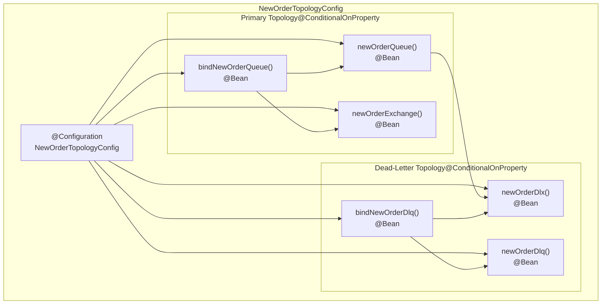
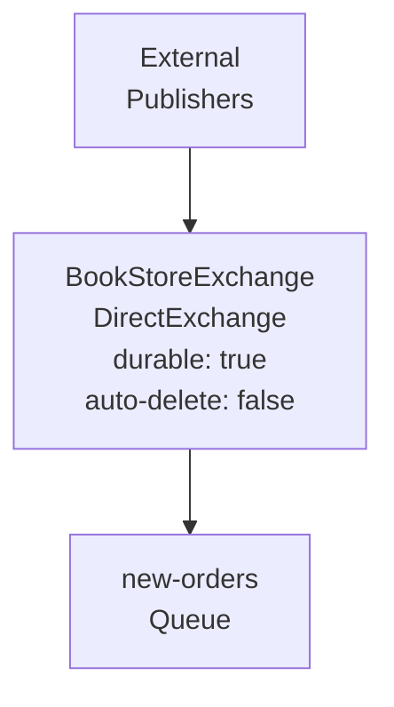
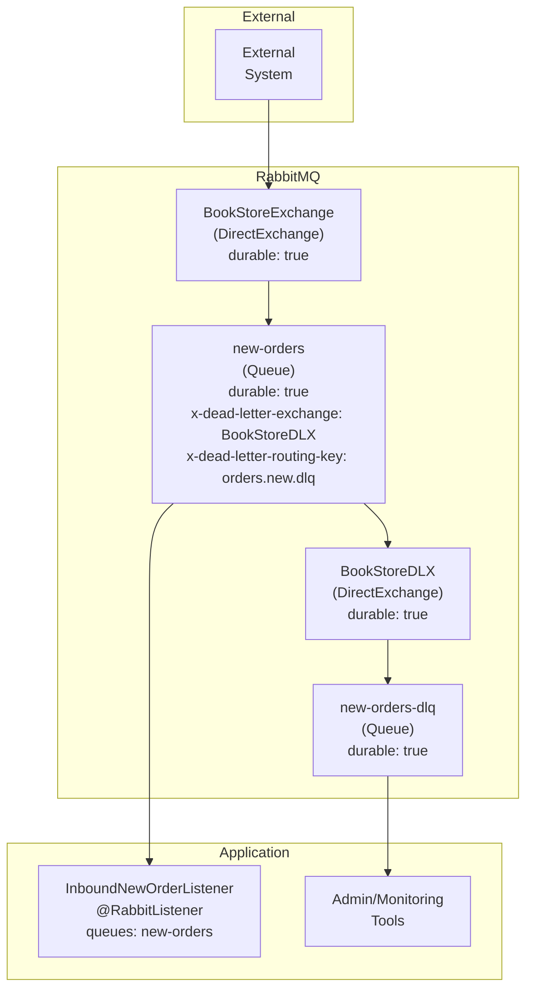
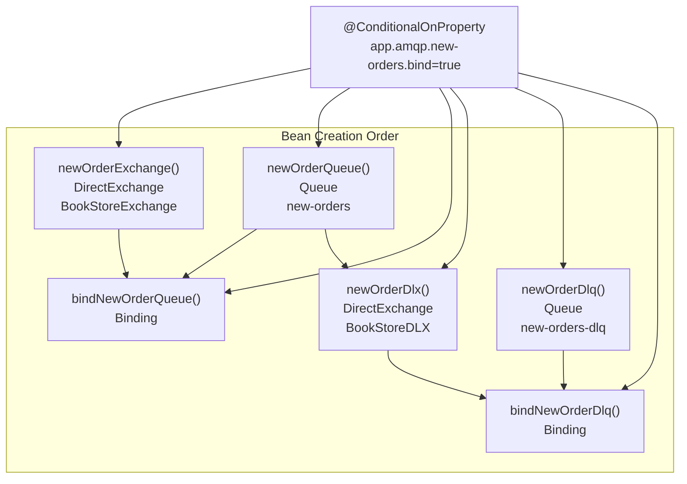

# Topology Configuration

> **Relevant source files**
> * [src/main/java/com/example/modulithdemo/messaging/inbound/amqp/AmqpConstants.java](https://github.com/philipz/spring-monolith-amqp-poc/blob/c93f55b5/src/main/java/com/example/modulithdemo/messaging/inbound/amqp/AmqpConstants.java)
> * [src/main/java/com/example/modulithdemo/messaging/inbound/amqp/NewOrderTopologyConfig.java](https://github.com/philipz/spring-monolith-amqp-poc/blob/c93f55b5/src/main/java/com/example/modulithdemo/messaging/inbound/amqp/NewOrderTopologyConfig.java)
> * [src/test/java/com/example/modulithdemo/messaging/inbound/amqp/NewOrderTopologyConfigTests.java](https://github.com/philipz/spring-monolith-amqp-poc/blob/c93f55b5/src/test/java/com/example/modulithdemo/messaging/inbound/amqp/NewOrderTopologyConfigTests.java)

## Purpose and Scope

This page documents the RabbitMQ topology configuration for the inbound AMQP integration. It covers the declarative setup of exchanges, queues, bindings, and dead-letter infrastructure defined in the `inbound/amqp` module. The topology is conditionally created based on the `app.amqp.new-orders.bind` configuration property to prevent feedback loops in development environments.

For message routing patterns and exchange types, see [Message Routing and Patterns](/philipz/spring-monolith-amqp-poc/7.2-message-routing-and-patterns). For RabbitMQ connection and channel pooling configuration, see [RabbitMQ Configuration](/philipz/spring-monolith-amqp-poc/4.3-rabbitmq-configuration). For outbound event externalization topology, see [Event Externalization](/philipz/spring-monolith-amqp-poc/6.2-event-externalization).

---

## Centralized Constants

The `AmqpConstants` class provides a single source of truth for all AMQP topology names, preventing duplication and configuration drift across the codebase.

[src/main/java/com/example/modulithdemo/messaging/inbound/amqp/AmqpConstants.java L1-L25](https://github.com/philipz/spring-monolith-amqp-poc/blob/c93f55b5/src/main/java/com/example/modulithdemo/messaging/inbound/amqp/AmqpConstants.java#L1-L25)

### Constant Definitions

| Constant | Value | Purpose |
| --- | --- | --- |
| `BOOKSTORE_EXCHANGE` | `"BookStoreExchange"` | Inbound direct exchange for new order messages from external systems |
| `BOOKSTORE_DLX` | `"BookStoreDLX"` | Dead-letter exchange for failed message routing |
| `NEW_ORDERS_QUEUE` | `"new-orders"` | Primary queue consuming new order messages |
| `NEW_ORDERS_DLQ` | `"new-orders-dlq"` | Dead-letter queue for poison messages after retry exhaustion |
| `ORDERS_NEW_ROUTING` | `"orders.new"` | Routing key binding external orders to `new-orders` queue |
| `ORDERS_NEW_DLQ_ROUTING` | `"orders.new.dlq"` | Routing key for dead-letter messages |

**Design Note**: These constants are marked `public static final` for compile-time validation and are used consistently across configuration classes, listeners, and tests.

**Sources**: [src/main/java/com/example/modulithdemo/messaging/inbound/amqp/AmqpConstants.java L1-L25](https://github.com/philipz/spring-monolith-amqp-poc/blob/c93f55b5/src/main/java/com/example/modulithdemo/messaging/inbound/amqp/AmqpConstants.java#L1-L25)

---

## Topology Configuration Class

The `NewOrderTopologyConfig` class declares the RabbitMQ topology as Spring beans. All beans are conditionally created using `@ConditionalOnProperty(name = "app.amqp.new-orders.bind", havingValue = "true")`, allowing the topology to be disabled in environments where it's pre-configured or undesired.

[src/main/java/com/example/modulithdemo/messaging/inbound/amqp/NewOrderTopologyConfig.java L1-L57](https://github.com/philipz/spring-monolith-amqp-poc/blob/c93f55b5/src/main/java/com/example/modulithdemo/messaging/inbound/amqp/NewOrderTopologyConfig.java#L1-L57)

### Topology Bean Structure



**Sources**: [src/main/java/com/example/modulithdemo/messaging/inbound/amqp/NewOrderTopologyConfig.java L14-L56](https://github.com/philipz/spring-monolith-amqp-poc/blob/c93f55b5/src/main/java/com/example/modulithdemo/messaging/inbound/amqp/NewOrderTopologyConfig.java#L14-L56)

---

## Exchange Definitions

### BookStoreExchange (Primary Exchange)

The `newOrderExchange()` bean creates the primary inbound exchange where external systems publish new order messages.

[src/main/java/com/example/modulithdemo/messaging/inbound/amqp/NewOrderTopologyConfig.java L26-L30](https://github.com/philipz/spring-monolith-amqp-poc/blob/c93f55b5/src/main/java/com/example/modulithdemo/messaging/inbound/amqp/NewOrderTopologyConfig.java#L26-L30)



**Configuration**:

* **Type**: `DirectExchange` - messages are routed based on exact routing key matches
* **Durable**: `true` - survives broker restarts
* **Auto-delete**: `false` - persists even when no queues are bound

### BookStoreDLX (Dead-Letter Exchange)

The `newOrderDlx()` bean creates the dead-letter exchange for routing failed messages.

[src/main/java/com/example/modulithdemo/messaging/inbound/amqp/NewOrderTopologyConfig.java L38-L43](https://github.com/philipz/spring-monolith-amqp-poc/blob/c93f55b5/src/main/java/com/example/modulithdemo/messaging/inbound/amqp/NewOrderTopologyConfig.java#L38-L43)

**Sources**: [src/main/java/com/example/modulithdemo/messaging/inbound/amqp/NewOrderTopologyConfig.java L26-L43](https://github.com/philipz/spring-monolith-amqp-poc/blob/c93f55b5/src/main/java/com/example/modulithdemo/messaging/inbound/amqp/NewOrderTopologyConfig.java#L26-L43)

---

## Queue Definitions

### Primary Queue: new-orders

The `newOrderQueue()` bean creates the primary consumption queue with dead-letter arguments configured.

[src/main/java/com/example/modulithdemo/messaging/inbound/amqp/NewOrderTopologyConfig.java L17-L24](https://github.com/philipz/spring-monolith-amqp-poc/blob/c93f55b5/src/main/java/com/example/modulithdemo/messaging/inbound/amqp/NewOrderTopologyConfig.java#L17-L24)

**Queue Arguments**:

* `x-dead-letter-exchange`: `"BookStoreDLX"` - failed messages route to this exchange
* `x-dead-letter-routing-key`: `"orders.new.dlq"` - routing key used when dead-lettering

**Configuration Details**:

| Property | Value | Purpose |
| --- | --- | --- |
| Name | `"new-orders"` | Queue identifier |
| Durable | `true` | Persists across broker restarts |
| Dead-letter exchange | `"BookStoreDLX"` | Target for failed messages |
| Dead-letter routing key | `"orders.new.dlq"` | Routing key for DLQ binding |

### Dead-Letter Queue: new-orders-dlq

The `newOrderDlq()` bean creates the dead-letter queue for manual inspection of poison messages.

[src/main/java/com/example/modulithdemo/messaging/inbound/amqp/NewOrderTopologyConfig.java L45-L49](https://github.com/philipz/spring-monolith-amqp-poc/blob/c93f55b5/src/main/java/com/example/modulithdemo/messaging/inbound/amqp/NewOrderTopologyConfig.java#L45-L49)

**Purpose**: This queue captures messages that:

* Exceeded maximum retry attempts (configured in listener as 3 attempts)
* Failed deserialization or validation
* Threw unhandled exceptions during processing

**Sources**: [src/main/java/com/example/modulithdemo/messaging/inbound/amqp/NewOrderTopologyConfig.java L17-L49](https://github.com/philipz/spring-monolith-amqp-poc/blob/c93f55b5/src/main/java/com/example/modulithdemo/messaging/inbound/amqp/NewOrderTopologyConfig.java#L17-L49)

---

## Binding Definitions

### Primary Queue Binding

The `bindNewOrderQueue()` binding connects the `new-orders` queue to the `BookStoreExchange` using the routing key `orders.new`.

[src/main/java/com/example/modulithdemo/messaging/inbound/amqp/NewOrderTopologyConfig.java L32-L36](https://github.com/philipz/spring-monolith-amqp-poc/blob/c93f55b5/src/main/java/com/example/modulithdemo/messaging/inbound/amqp/NewOrderTopologyConfig.java#L32-L36)

**Routing Behavior**:

```
Publisher → [routing: "orders.new"] → BookStoreExchange → new-orders queue
```

### Dead-Letter Queue Binding

The `bindNewOrderDlq()` binding connects the `new-orders-dlq` queue to the `BookStoreDLX` exchange using the routing key `orders.new.dlq`.

[src/main/java/com/example/modulithdemo/messaging/inbound/amqp/NewOrderTopologyConfig.java L51-L55](https://github.com/philipz/spring-monolith-amqp-poc/blob/c93f55b5/src/main/java/com/example/modulithdemo/messaging/inbound/amqp/NewOrderTopologyConfig.java#L51-L55)

**Routing Behavior**:

```
new-orders queue → [failure] → BookStoreDLX → [routing: "orders.new.dlq"] → new-orders-dlq
```

**Sources**: [src/main/java/com/example/modulithdemo/messaging/inbound/amqp/NewOrderTopologyConfig.java L32-L55](https://github.com/philipz/spring-monolith-amqp-poc/blob/c93f55b5/src/main/java/com/example/modulithdemo/messaging/inbound/amqp/NewOrderTopologyConfig.java#L32-L55)

---

## Complete Topology Diagram

The following diagram shows the complete RabbitMQ topology with all exchanges, queues, and bindings:



**Message Flow**:

1. External systems publish messages to `BookStoreExchange` with routing key `orders.new`
2. Exchange routes messages to `new-orders` queue based on binding
3. `InboundNewOrderListener` consumes messages from `new-orders` queue
4. On processing failure (after retries exhausted), messages are dead-lettered to `BookStoreDLX`
5. Dead-letter exchange routes failed messages to `new-orders-dlq` using routing key `orders.new.dlq`
6. Administrators manually inspect and reprocess messages from `new-orders-dlq`

**Sources**: [src/main/java/com/example/modulithdemo/messaging/inbound/amqp/NewOrderTopologyConfig.java L1-L57](https://github.com/philipz/spring-monolith-amqp-poc/blob/c93f55b5/src/main/java/com/example/modulithdemo/messaging/inbound/amqp/NewOrderTopologyConfig.java#L1-L57)

 [src/main/java/com/example/modulithdemo/messaging/inbound/amqp/AmqpConstants.java L1-L25](https://github.com/philipz/spring-monolith-amqp-poc/blob/c93f55b5/src/main/java/com/example/modulithdemo/messaging/inbound/amqp/AmqpConstants.java#L1-L25)

---

## Conditional Topology Creation

All topology beans are annotated with `@ConditionalOnProperty(name = "app.amqp.new-orders.bind", havingValue = "true")`, meaning they are only created when the configuration property is explicitly set to `true`.

[src/main/java/com/example/modulithdemo/messaging/inbound/amqp/NewOrderTopologyConfig.java L18](https://github.com/philipz/spring-monolith-amqp-poc/blob/c93f55b5/src/main/java/com/example/modulithdemo/messaging/inbound/amqp/NewOrderTopologyConfig.java#L18-L18)

### Configuration Property

| Property | Default | Purpose |
| --- | --- | --- |
| `app.amqp.new-orders.bind` | `false` | Controls whether application declares topology |

### Rationale for Conditional Configuration

The conditional topology creation prevents **feedback loops** in development environments where:

1. The application publishes `OrderCompleted` events to `domain.events` exchange
2. External configurations might bind `domain.events` to the `new-orders` queue
3. The application would consume its own externalized events, creating an infinite loop

**Deployment Scenarios**:

| Environment | Property Value | Behavior |
| --- | --- | --- |
| Development/Local | `false` (default) | No topology created; assumes external RabbitMQ configuration |
| Production | `false` | Infrastructure team manages topology via IaC tools |
| Standalone Testing | `true` | Application fully manages its own topology |

**Configuration Example**:

```sql
app:
  amqp:
    new-orders:
      bind: false  # Default: don't create topology
```

**Sources**: [src/main/java/com/example/modulithdemo/messaging/inbound/amqp/NewOrderTopologyConfig.java L18-L55](https://github.com/philipz/spring-monolith-amqp-poc/blob/c93f55b5/src/main/java/com/example/modulithdemo/messaging/inbound/amqp/NewOrderTopologyConfig.java#L18-L55)

---

## Bean Lifecycle and Dependencies

The following diagram shows the dependency relationships between topology beans:



**Bean Dependency Notes**:

* `bindNewOrderQueue()` requires both `Queue newOrderQueue` and `DirectExchange newOrderExchange` as method parameters [src/main/java/com/example/modulithdemo/messaging/inbound/amqp/NewOrderTopologyConfig.java L34-L35](https://github.com/philipz/spring-monolith-amqp-poc/blob/c93f55b5/src/main/java/com/example/modulithdemo/messaging/inbound/amqp/NewOrderTopologyConfig.java#L34-L35)
* `bindNewOrderDlq()` requires both `Queue newOrderDlq` and `DirectExchange newOrderDlx` as method parameters [src/main/java/com/example/modulithdemo/messaging/inbound/amqp/NewOrderTopologyConfig.java L53-L54](https://github.com/philipz/spring-monolith-amqp-poc/blob/c93f55b5/src/main/java/com/example/modulithdemo/messaging/inbound/amqp/NewOrderTopologyConfig.java#L53-L54)
* `newOrderQueue()` references `BOOKSTORE_DLX` constant in queue arguments, creating an implicit dependency [src/main/java/com/example/modulithdemo/messaging/inbound/amqp/NewOrderTopologyConfig.java L21-L22](https://github.com/philipz/spring-monolith-amqp-poc/blob/c93f55b5/src/main/java/com/example/modulithdemo/messaging/inbound/amqp/NewOrderTopologyConfig.java#L21-L22)

**Sources**: [src/main/java/com/example/modulithdemo/messaging/inbound/amqp/NewOrderTopologyConfig.java L14-L56](https://github.com/philipz/spring-monolith-amqp-poc/blob/c93f55b5/src/main/java/com/example/modulithdemo/messaging/inbound/amqp/NewOrderTopologyConfig.java#L14-L56)

---

## Testing and Validation

The topology configuration is validated through unit tests that verify bean creation and queue argument configuration.

[src/test/java/com/example/modulithdemo/messaging/inbound/amqp/NewOrderTopologyConfigTests.java L1-L37](https://github.com/philipz/spring-monolith-amqp-poc/blob/c93f55b5/src/test/java/com/example/modulithdemo/messaging/inbound/amqp/NewOrderTopologyConfigTests.java#L1-L37)

### Test Coverage

The test `newOrderQueue_hasDlqArguments_andDlqBeansPresent()` validates:

1. Queue creation with correct name (`NEW_ORDERS_QUEUE`)
2. Dead-letter exchange argument set to `BOOKSTORE_DLX`
3. Dead-letter routing key argument set to `ORDERS_NEW_DLQ_ROUTING`
4. Dead-letter queue bean exists with name `NEW_ORDERS_DLQ`
5. Dead-letter exchange bean exists with name `BOOKSTORE_DLX`

[src/test/java/com/example/modulithdemo/messaging/inbound/amqp/NewOrderTopologyConfigTests.java L16-L35](https://github.com/philipz/spring-monolith-amqp-poc/blob/c93f55b5/src/test/java/com/example/modulithdemo/messaging/inbound/amqp/NewOrderTopologyConfigTests.java#L16-L35)

**Test Configuration**:

* Uses `AnnotationConfigApplicationContext` for isolated bean testing
* Sets `app.amqp.new-orders.bind=true` via `TestPropertySourceUtils` [src/test/java/com/example/modulithdemo/messaging/inbound/amqp/NewOrderTopologyConfigTests.java L19](https://github.com/philipz/spring-monolith-amqp-poc/blob/c93f55b5/src/test/java/com/example/modulithdemo/messaging/inbound/amqp/NewOrderTopologyConfigTests.java#L19-L19)
* Validates queue arguments via `Queue.getArguments()` map [src/test/java/com/example/modulithdemo/messaging/inbound/amqp/NewOrderTopologyConfigTests.java L25-L27](https://github.com/philipz/spring-monolith-amqp-poc/blob/c93f55b5/src/test/java/com/example/modulithdemo/messaging/inbound/amqp/NewOrderTopologyConfigTests.java#L25-L27)

**Sources**: [src/test/java/com/example/modulithdemo/messaging/inbound/amqp/NewOrderTopologyConfigTests.java L1-L37](https://github.com/philipz/spring-monolith-amqp-poc/blob/c93f55b5/src/test/java/com/example/modulithdemo/messaging/inbound/amqp/NewOrderTopologyConfigTests.java#L1-L37)

---

## Integration with Event Externalization

While this topology handles **inbound** messages, it coexists with the **outbound** event externalization topology managed by Spring Modulith's AMQP module. The two topologies are intentionally decoupled:

### Topology Separation

| Aspect | Inbound Topology (This Page) | Outbound Topology (Event Externalization) |
| --- | --- | --- |
| Configuration | `NewOrderTopologyConfig` | Spring Modulith auto-configuration |
| Exchanges | `BookStoreExchange`, `BookStoreDLX` | `domain.events` |
| Queues | `new-orders`, `new-orders-dlq` | Managed by external consumers |
| Control Property | `app.amqp.new-orders.bind` | `spring.modulith.events.externalization.enabled` |
| Purpose | Consume external new order messages | Publish internal domain events to external systems |

**Architectural Decision**: The `new-orders` queue does **not** bind to the `domain.events` exchange by default. This prevents the application from consuming its own externalized `OrderCompleted` events, which would create a feedback loop. External systems can optionally create such bindings if they need to react to completed orders.

**Sources**: [src/main/java/com/example/modulithdemo/messaging/inbound/amqp/NewOrderTopologyConfig.java L1-L57](https://github.com/philipz/spring-monolith-amqp-poc/blob/c93f55b5/src/main/java/com/example/modulithdemo/messaging/inbound/amqp/NewOrderTopologyConfig.java#L1-L57)

 [src/main/java/com/example/modulithdemo/messaging/inbound/amqp/AmqpConstants.java L1-L25](https://github.com/philipz/spring-monolith-amqp-poc/blob/c93f55b5/src/main/java/com/example/modulithdemo/messaging/inbound/amqp/AmqpConstants.java#L1-L25)